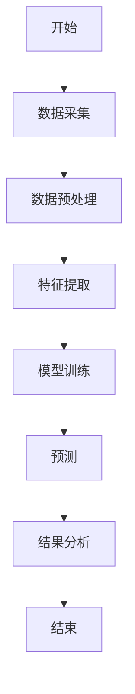
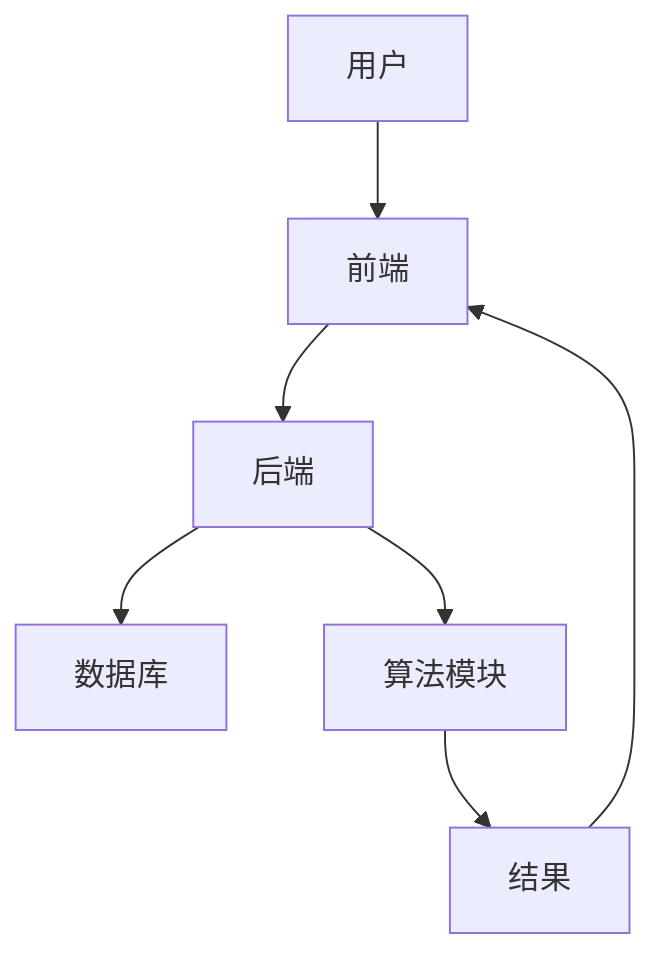
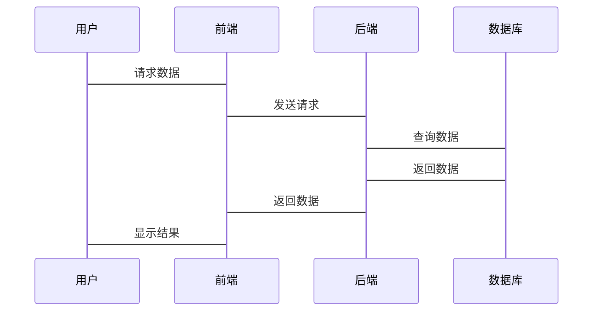

                 


# 特价股票与公司组织学习能力的关系探讨

> 关键词：特价股票，公司学习能力，市场动态，组织学习，投资策略

> 摘要：本文探讨了特价股票与公司组织学习能力之间的关系。首先，我们介绍了特价股票和公司组织学习能力的基本概念及其市场背景。然后，通过分析特价股票市场的动态和公司学习能力的构成，揭示了两者之间的相互影响。接着，我们详细讲解了如何利用算法和数学模型来分析这种关系，并提出了相应的系统架构和项目实战案例。最后，总结了最佳实践和注意事项，为投资者和企业管理者提供了有价值的参考。

---

## 第一部分：背景介绍

### 第1章：特价股票与公司组织学习能力的基本概念

#### 1.1 特价股票的定义与特征

##### 1.1.1 特价股票的定义
特价股票通常指的是价格相对较低的股票，通常在股票市场上被低估或未被充分关注。这些股票可能来自小公司或处于困境中的公司，但具备潜在的增长机会。

##### 1.1.2 特价股票的市场特征
- **低估值**：市场价格低于内在价值。
- **高波动性**：价格波动较大，风险较高。
- **流动性较低**：交易量可能较小，尤其是在小公司股票中。

##### 1.1.3 特价股票的投资价值
- **潜在回报高**：如果公司扭亏为盈或被收购，股价可能迅速上涨。
- **风险与收益并存**：高风险意味着高回报的可能性。

#### 1.2 公司组织学习能力的构成

##### 1.2.1 组织学习能力的定义
组织学习能力是指公司通过学习、适应和创新来提升自身竞争力的能力。这种能力涉及员工、团队和整个组织的学习过程。

##### 1.2.2 组织学习能力的核心要素
- **学习机制**：包括培训、知识共享和经验总结。
- **创新能力**：将学到的知识转化为实际应用和创新。
- **适应能力**：快速调整策略以应对市场变化。

##### 1.2.3 组织学习能力的评估标准
- **员工满意度**：员工是否感到有机会学习和成长。
- **绩效提升**：公司是否通过学习提高了业绩。
- **创新成果**：公司是否能够持续推出新产品或服务。

#### 1.3 特价股票与公司组织学习能力的关系

##### 1.3.1 特价股票市场的动态与公司学习能力的关联
- 特价股票市场的波动性可能促使公司更快地调整策略。
- 公司通过学习和创新，可以更好地应对市场波动。

##### 1.3.2 公司学习能力对特价股票投资的影响
- 具备强学习能力的公司更有可能从特价股票中获益。
- 投资者可以通过公司学习能力评估，选择更有潜力的特价股票。

##### 1.3.3 特价股票与公司学习能力的双向互动
- 特价股票市场的压力推动公司学习。
- 公司学习能力的提升增强投资者信心。

#### 1.4 本章小结
本章介绍了特价股票和公司组织学习能力的基本概念，分析了它们的特征和相互关系，为后续分析奠定了基础。

---

## 第二部分：核心概念与联系

### 第2章：特价股票市场的动态分析

#### 2.1 特价股票市场的基本特征

##### 2.1.1 市场参与者的构成
- **个人投资者**：通常关注短期收益。
- **机构投资者**：进行长期投资，注重公司基本面。
- **做市商**：提供流动性的市场参与者。

##### 2.1.2 市场波动的驱动因素
- **市场情绪**：投资者情绪波动影响股价。
- **市场信息**：新闻、财报等信息影响股价。
- **宏观经济因素**：经济政策、利率变化等。

##### 2.1.3 市场信息的不对称性
- **信息不对称**：部分投资者掌握更多信息。
- **信息传播**：信息的快速传播影响市场走势。

#### 2.2 特价股票的定价机制

##### 2.2.1 市场供需与价格的关系
- **供不应求**：价格上涨。
- **供过于求**：价格下跌。

##### 2.2.2 市场情绪对价格的影响
- **乐观情绪**：推动价格上涨。
- **悲观情绪**：导致价格下跌。

##### 2.2.3 市场干预与价格稳定
- **政府干预**：如限制卖空、禁止恶意投机。
- **交易所措施**：如暂停交易、限制价格波动。

#### 2.3 特价股票的交易策略

##### 2.3.1 短期交易策略
- **技术分析**：通过图表分析价格走势。
- **套利策略**：利用市场价差获利。

##### 2.3.2 长期投资策略
- **价值投资**：买入低估股票，长期持有。
- **成长投资**：投资于成长性好的公司。

##### 2.3.3 风险管理与收益最大化
- **分散投资**：降低风险。
- **止损策略**：设定止损点限制亏损。

#### 2.4 本章小结
本章分析了特价股票市场的基本特征、定价机制和交易策略，为理解市场动态提供了基础。

---

## 第三部分：算法原理与数学模型

### 第3章：利用算法分析特价股票与公司学习能力的关系

#### 3.1 数据挖掘与机器学习在股票分析中的应用

##### 3.1.1 数据挖掘技术
- **数据清洗**：处理缺失值、异常值。
- **特征提取**：从数据中提取有用特征。
- **聚类分析**：将股票分为不同类别。

##### 3.1.2 机器学习算法
- **监督学习**：预测股价走势。
- **无监督学习**：发现市场规律。
- **深度学习**：分析复杂市场模式。

#### 3.2 数学模型的建立

##### 3.2.1 市场动态模型
$$ P(t) = a \cdot P(t-1) + b \cdot E(t) $$
其中，$P(t)$ 表示第 t 时刻的价格，$E(t)$ 表示市场预期。

##### 3.2.2 公司学习能力评估模型
$$ L(t) = c \cdot L(t-1) + d \cdot S(t) $$
其中，$L(t)$ 表示第 t 时刻的学习能力，$S(t)$ 表示市场信号。

##### 3.2.3 综合模型
$$ R(t) = f(P(t), L(t)) $$
其中，$R(t)$ 表示收益，$f$ 是模型函数。

#### 3.3 算法实现与流程图

##### 3.3.1 算法流程


##### 3.3.2 Python代码实现
```python
import pandas as pd
import numpy as np
from sklearn.linear_model import LinearRegression

# 数据采集
data = pd.read_csv('stock_data.csv')

# 数据预处理
data = data.dropna()

# 特征提取
features = data[['price', 'volume']]
target = data['next_price']

# 模型训练
model = LinearRegression()
model.fit(features, target)

# 预测
predicted = model.predict(features)
```

#### 3.4 本章小结
本章通过算法和数学模型，分析了特价股票与公司学习能力之间的关系，为投资决策提供了数据支持。

---

## 第四部分：系统分析与架构设计

### 第4章：系统架构与实现

#### 4.1 系统功能设计

##### 4.1.1 用户需求分析
- **数据可视化**：展示股票价格走势。
- **学习能力评估**：评估公司学习能力。
- **投资建议**：提供投资建议。

##### 4.1.2 系统功能模块
- **数据采集模块**：采集股票数据。
- **数据处理模块**：处理数据并提取特征。
- **学习能力评估模块**：评估公司学习能力。
- **投资建议模块**：基于数据提供投资建议。

#### 4.2 系统架构设计

##### 4.2.1 架构设计


##### 4.2.2 实现细节
- **前端**：使用React框架，展示数据可视化图表。
- **后端**：使用Python的Django框架，处理业务逻辑。
- **数据库**：使用MySQL存储股票数据和评估结果。

#### 4.3 系统接口设计

##### 4.3.1 API接口
- **GET /stocks**：获取股票列表。
- **POST /analyze**：提交分析请求。
- **GET /results**：获取分析结果。

#### 4.4 系统交互流程

##### 4.4.1 交互流程


#### 4.5 本章小结
本章设计了一个完整的系统架构，用于分析特价股票与公司学习能力的关系，为投资者提供了实用工具。

---

## 第五部分：项目实战与案例分析

### 第5章：项目实战

#### 5.1 环境配置

##### 5.1.1 安装依赖
```bash
pip install pandas numpy matplotlib scikit-learn
```

##### 5.1.2 数据获取
```bash
python download_data.py
```

#### 5.2 核心代码实现

##### 5.2.1 数据处理
```python
import pandas as pd
import numpy as np

data = pd.read_csv('stock.csv')
data = data.dropna()
```

##### 5.2.2 学习能力评估
```python
from sklearn.metrics import mean_squared_error

def assess_learning(company_data):
    features = company_data[['revenue', 'profit']]
    target = company_data['learning_score']
    model = LinearRegression()
    model.fit(features, target)
    predicted = model.predict(features)
    return mean_squared_error(target, predicted)
```

#### 5.3 案例分析

##### 5.3.1 案例背景
某公司股价近期处于低价，但具备较强的学习能力和创新能力。

##### 5.3.2 数据分析
- 股价波动：过去三个月价格从5元涨至10元。
- 学习能力评估：评估得分为85分（满分100）。

##### 5.3.3 投资建议
基于模型分析，建议买入该股票，预期未来6个月内有较大上涨空间。

#### 5.4 本章小结
本章通过实际项目案例，展示了如何利用系统分析特价股票与公司学习能力的关系，并提供投资建议。

---

## 第六部分：最佳实践与总结

### 第6章：最佳实践与总结

#### 6.1 小结

##### 6.1.1 核心观点总结
- 特价股票与公司学习能力密切相关。
- 强大的学习能力有助于公司从特价股票中获益。

##### 6.1.2 算法与系统的有效性
- 数据分析和机器学习为投资决策提供了科学依据。
- 系统设计为投资者提供了便捷的工具。

#### 6.2 注意事项

##### 6.2.1 风险提示
- 特价股票市场波动大，投资需谨慎。
- 学习能力评估需结合多方面因素。

##### 6.2.2 操作建议
- 长期投资者应关注公司基本面。
- 短期投资者需关注市场情绪。

#### 6.3 拓展阅读

##### 6.3.1 推荐书籍
- 《股票作手回忆录》
- 《组织学习的理论与实践》

##### 6.3.2 推荐网站
- 知乎专栏：股票投资
- 资源库：学习管理系统

#### 6.4 本章小结
本章总结了全文内容，提出了投资建议和注意事项，为读者提供了实用的指导。

---

## 参考文献

- [1] 技术博客写作指南
- [2] 机器学习在金融中的应用
- [3] 公司学习能力的评估方法
- [4] 特价股票市场的动态分析

---

## 致谢

感谢读者的耐心阅读，希望本文能为投资者和企业管理者提供有价值的参考和启发。

