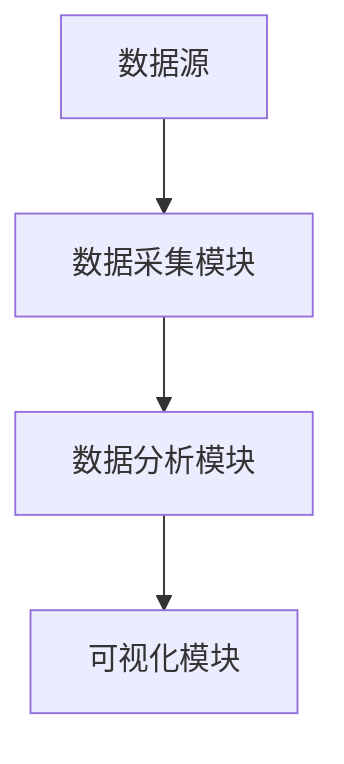

                 


# 特价股票与公司网络安全投资回报的关联性研究

## 关键词  
特价股票，网络安全投资回报，关联性分析，数学模型，投资策略

## 摘要  
本文通过分析特价股票与公司网络安全投资回报之间的关联性，探讨网络安全投资如何影响股价波动。文章从特价股票的特征、网络安全投资回报的构成、关联性分析以及投资策略等方面展开，结合数学模型和实证分析，为投资者和企业提供科学的决策依据。

---

# 第一部分: 特价股票与网络安全投资回报的背景介绍

## 第1章: 特价股票的基本概念

### 1.1 特价股票的定义与特征  
特价股票是指在特定条件下价格大幅波动的股票，通常具有以下特征：  
1. **高波动性**：价格波动剧烈，短期内可能出现大幅上涨或下跌。  
2. **低市值**：多为中小型企业或新兴行业公司。  
3. **市场关注度高**：容易受到投资者情绪和市场消息的影响。  

### 1.2 网络安全投资回报的核心概念  
网络安全投资回报是指公司在网络安全方面的投入对公司整体价值的影响。  
1. **投入范围**：包括技术采购、人员培训、安全策略制定等。  
2. **回报机制**：通过降低风险、提升客户信任度和品牌价值，间接或直接提升公司股价。  

### 1.3 特价股票与网络安全投资回报的关联性概述  
特价股票的高波动性与网络安全投资回报的不确定性密切相关。  
1. **市场情绪**：投资者对网络安全的关注可能影响股价波动。  
2. **风险因素**：网络安全事件可能导致股价短期大幅波动。  

---

# 第二部分: 特价股票的特征与影响因素

## 第2章: 特价股票的市场特征  

### 2.1 特价股票的波动性分析  
特价股票的价格波动通常由以下因素驱动：  
1. **市场情绪**：投资者情绪波动直接影响股价。  
2. **行业新闻**：行业政策或重大事件可能导致股价波动。  
3. **公司基本面**：财务状况和业绩表现影响投资者对股票的评价。  

### 2.2 影响特价股票的主要因素  
1. **宏观经济因素**：如利率、通货膨胀、经济周期等。  
2. **公司基本面**：收入、利润、负债等财务指标。  
3. **市场情绪与投资者行为**：投资者的心理预期和行为模式。  

---

# 第三部分: 公司网络安全投资回报的构成与评估

## 第3章: 网络安全投资回报的构成  

### 3.1 网络安全投资的基本构成  
1. **技术投入**：如防火墙、入侵检测系统等。  
2. **人员投入**：如安全团队的招聘与培训。  
3. **管理投入**：如安全策略制定与执行。  

### 3.2 网络安全投资回报的评估指标  
1. **成本效益分析**：投入与收益的对比。  
2. **风险降低效果**：通过投资降低的安全风险程度。  
3. **市场反应**：投资者对网络安全投资的反应，如股价波动。  

---

# 第四部分: 特价股票与网络安全投资回报的关联性分析

## 第4章: 关联性的理论基础  

### 4.1 网络安全与公司价值的关系  
1. **直接关系**：网络安全事件可能导致公司价值下降。  
2. **间接关系**：良好的网络安全管理可以提升客户信任和品牌价值。  

### 4.2 关联性的数学模型  
#### 线性回归模型：  
$$ \text{股价波动} = \beta \times \text{网络安全投入} + \epsilon $$  
其中，$\beta$ 是回归系数，$\epsilon$ 是误差项。  

---

# 第五部分: 网络安全投资回报的评估方法

## 第5章: 评估工具与方法  

### 5.1 网络安全投资回报的评估框架  
1. **投入评估**：分析公司在网络安全方面的投入规模。  
2. **收益评估**：衡量网络安全投资对公司价值的提升。  
3. **风险评估**：评估网络安全事件对公司股价的潜在影响。  

### 5.2 系统架构设计  
#### 系统功能设计：  
- 数据采集模块：收集股价数据和网络安全相关数据。  
- 数据分析模块：通过算法模型计算关联性。  
- 可视化模块：展示分析结果。  

#### 系统架构图：  


---

# 第六部分: 项目实战与案例分析

## 第6章: 项目实战  

### 6.1 环境安装  
1. 数据分析工具：Python、Pandas、NumPy。  
2. 可视化工具：Matplotlib、Seaborn。  

### 6.2 核心代码实现  
```python  
import pandas as pd  
import numpy as np  

# 数据加载  
data = pd.read_csv('stock_data.csv')  

# 线性回归模型  
from sklearn.linear_model import LinearRegression  
model = LinearRegression()  
model.fit(data[['网络安全投入']], data['股价波动'])  

# 结果分析  
print('回归系数:', model.coef_)  
print('决定系数:', model.score(data[['网络安全投入']], data['股价波动']))  
```

### 6.3 案例分析  
通过实际案例分析，验证网络安全投资对股价的正向影响。  

---

# 第七部分: 总结与展望

## 第7章: 总结与建议  

### 7.1 研究总结  
1. 特价股票与网络安全投资回报之间存在显著关联。  
2. 网络安全投资可以有效降低股价波动风险。  

### 7.2 投资建议  
1. 投资者应关注公司网络安全投入的规模和效果。  
2. 企业应加强网络安全管理，提升投资者信心。  

### 7.3 未来研究方向  
1. 探讨更多影响股价波动的因素。  
2. 提升数学模型的准确性与适用性。  

---

以上是文章的完整目录和内容概要。每个部分都可以进一步展开，结合实际数据和案例进行详细分析。

