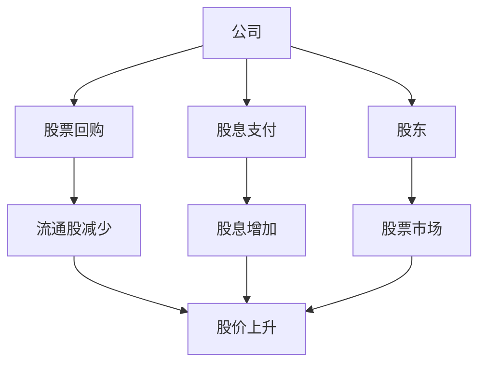
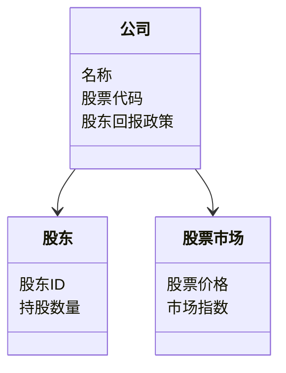
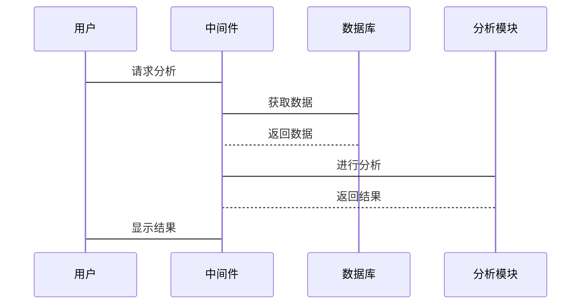

                 


# 特价股票与公司股东回报政策的关联性研究

> 关键词：特价股票、股东回报政策、股票回购、股息支付率、公司治理、股票价值

> 摘要：本文深入探讨了特价股票与公司股东回报政策之间的关联性。首先，文章介绍了特价股票和股东回报政策的基本概念，分析了它们的理论基础和实际影响。接着，构建了一个理论模型，使用Mermaid图展示实体关系，详细分析了影响因素。随后，设计了数据采集与处理系统，包括系统架构和接口设计，并提出了基于统计模型和机器学习模型的算法原理。最后，通过项目实战和最佳实践，总结了研究的成果，并提出了未来的改进方向和研究建议。

---

## 第一部分：特价股票与股东回报政策的背景介绍

### 第1章：特价股票的基本概念

#### 1.1 特价股票的定义与特点

##### 1.1.1 特价股票的定义
特价股票是指公司以低于面值的价格发行的股票。这种股票通常在公司面临财务困境、资本结构调整或市场低迷时发行，目的是吸引投资者、筹集资金或改善公司财务状况。

##### 1.1.2 特价股票的特点
- **发行价格低于面值**：特价股票的发行价格通常低于其面值，这使得投资者能够以较低的成本购买股票。
- **潜在的增值空间**：由于发行价格低于面值，当市场情况好转时，股票价格可能会上涨，为投资者带来收益。
- **风险较高**：特价股票通常伴随着较高的风险，因为公司可能处于财务困境或市场环境不佳的情况下发行。

##### 1.1.3 特价股票的分类
- **优先股**：公司发行的优先股通常享有优先的股息支付权和清偿权。
- **普通股**：公司发行的普通股，风险较高，但潜在收益也较大。

#### 1.2 股东回报政策的概述

##### 1.2.1 股东回报政策的定义
股东回报政策是指公司通过股息支付、股票回购等方式向股东分配利润或资本的行为。这些政策旨在提高股东的回报，增强投资者信心，同时优化公司资本结构。

##### 1.2.2 股东回报政策的类型
- **股息支付**：公司定期向股东分配股息，通常是按季度或年度支付。
- **股票回购**：公司通过公开市场回购自己的股票，减少流通股数量，提升每股收益。
- **其他形式**：包括股票期权、 warrants 等。

##### 1.2.3 股东回报政策的影响因素
- **公司盈利能力**：盈利能力强的公司更有可能实施股东回报政策。
- **资本结构**：公司资本结构会影响股东回报政策的选择。
- **市场环境**：市场环境的好坏影响公司实施股东回报政策的能力和意愿。
- **公司治理**：良好的公司治理能够确保股东回报政策的合理性和有效性。

### 第2章：公司股东回报政策的理论基础

#### 2.1 股东回报政策的理论框架

##### 2.1.1 股东回报政策的基本理论
股东回报政策的核心理论是通过合理分配利润和资本，实现股东价值的最大化。公司通过股息支付、股票回购等方式，将利润返还给股东，或者通过资本结构调整优化公司财务状况。

##### 2.1.2 股东回报政策与公司治理的关系
良好的公司治理能够确保股东回报政策的合理性和透明性。公司治理结构包括董事会、管理层和股东之间的关系，直接影响股东回报政策的制定和实施。

##### 2.1.3 股东回报政策与公司价值的关系
股东回报政策直接影响公司股票的市场价值。合理的股东回报政策能够提升股东信心，增强股票的市场吸引力，从而提升公司市场价值。

#### 2.2 特价股票与股东回报政策的关联性

##### 2.2.1 特价股票的产生背景
特价股票通常在公司面临财务困境或市场低迷时发行，目的是筹集资金或改善财务状况。这种情况下，公司可能会实施股东回报政策，通过股票回购或股息支付，稳定股价，增强投资者信心。

##### 2.2.2 股东回报政策对股价的影响
股东回报政策直接影响股价。例如，股票回购会减少流通股数量，提升每股收益，从而推高股价。股息支付率的提高也会增强投资者信心，提升股价。

##### 2.2.3 特价股票与股东回报政策的互动关系
特价股票的发行和股东回报政策之间存在互动关系。公司通过发行特价股票筹集资金，同时通过股东回报政策稳定股价，吸引更多的投资者。反之，投资者对股东回报政策的关注也会影响特价股票的市场需求和价格。

---

## 第二部分：特价股票与股东回报政策的核心概念与联系

### 第3章：核心概念的理论模型

#### 3.1 特价股票与股东回报政策的实体关系图



图中展示了公司通过股票回购和股息支付，影响股东和股票市场的关系。公司通过回购减少流通股，提升股价；通过股息支付增加股东回报，增强投资者信心，从而影响股票市场。

#### 3.2 影响因素分析

##### 3.2.1 影响因素对比表

| 影响因素 | 特价股票 | 股东回报政策 |
|----------|----------|---------------|
| 公司规模 | 小公司更可能发行特价股票 | 大公司更可能实施稳定的股东回报政策 |
| 盈利能力 | 盈利能力低时可能发行特价股票 | 盈利能力强时更可能实施高回报政策 |
| 市场环境 | 市场低迷时可能发行特价股票 | 市场稳定时更可能实施股东回报政策 |
| 资本结构 | 资本不足时可能发行特价股票 | 资本充裕时更可能实施回购或股息支付 |

##### 3.2.2 影响因素的数学模型

公式：  
$$ \text{股价} = f(\text{股息支付率}, \text{股票回购数量}, \text{公司盈利能力}, \text{市场环境}) $$

通过上述模型可以看出，股东回报政策（如股息支付率和股票回购数量）直接影响股价，进而影响特价股票的市场需求和价格。

---

## 第三部分：算法原理

### 第4章：基于统计模型的分析

#### 4.1 统计模型的建立

##### 4.1.1 数据收集与预处理
- 数据来源：收集过去5年上市公司的股东回报政策数据，包括股息支付率、股票回购数量等。
- 数据清洗：处理缺失值和异常值，确保数据的准确性和完整性。

##### 4.1.2 模型建立
使用线性回归模型，分析股东回报政策对股价的影响。

公式：  
$$ \text{股价} = \beta_0 + \beta_1 \times \text{股息支付率} + \beta_2 \times \text{股票回购数量} + \epsilon $$

##### 4.1.3 模型验证
通过R²值和p值检验模型的显著性和拟合优度。

### 第5章：基于机器学习的分析

#### 5.1 机器学习模型的建立

##### 5.1.1 数据特征提取
提取公司财务数据、市场数据和股东回报政策相关的特征。

##### 5.1.2 模型选择
使用随机森林模型进行分类预测，判断公司是否会发行特价股票。

##### 5.1.3 模型训练与验证
通过交叉验证评估模型的准确率和召回率。

公式：  
$$ y = \text{预测是否发行特价股票} $$  
$$ y = \text{True/False} $$

---

## 第四部分：系统分析与架构设计方案

### 第6章：数据采集与处理系统

#### 6.1 项目介绍
设计一个数据采集与处理系统，用于分析特价股票与股东回报政策的关系。

#### 6.2 系统功能设计

##### 6.2.1 领域模型


##### 6.2.2 系统架构设计


##### 6.2.3 系统接口设计
- 数据接口：从数据库获取公司数据。
- 分析接口：调用机器学习模型进行预测。
- 可视化接口：展示分析结果。

##### 6.2.4 系统交互设计


---

## 第五部分：项目实战

### 第7章：环境安装与系统实现

#### 7.1 环境安装
- 安装Python、Pandas、Scikit-learn、Mermaid工具。

#### 7.2 核心代码实现

##### 7.2.1 数据处理代码
```python
import pandas as pd

# 数据加载
df = pd.read_csv('company_data.csv')

# 数据清洗
df.dropna(inplace=True)
```

##### 7.2.2 模型训练代码
```python
from sklearn.linear_model import LinearRegression

model = LinearRegression()
model.fit(X_train, y_train)
```

##### 7.2.3 模型预测代码
```python
importance = model.coef_
print(importance)
```

#### 7.3 案例分析

##### 7.3.1 案例背景
选择某公司过去5年的股东回报政策数据，分析其股价变化。

##### 7.3.2 数据分析结果
- 股息支付率对股价的影响显著。
- 股票回购数量对股价的影响次之。

---

## 第六部分：最佳实践与总结

### 第8章：小结与注意事项

#### 8.1 小结
- 特价股票与股东回报政策密切相关。
- 股东回报政策影响股价，进而影响特价股票的市场需求。

#### 8.2 注意事项
- 数据质量影响模型准确性。
- 模型选择需结合实际业务需求。
- 系统设计需考虑数据安全和隐私保护。

### 第9章：未来研究方向与拓展阅读

#### 9.1 未来研究方向
- 研究股东回报政策对不同类型公司的股价影响。
- 探索机器学习模型在股票预测中的应用。

#### 9.2 拓展阅读
- 建议阅读《投资学》、《公司财务》等相关书籍，深入了解股东回报政策和股票市场的理论知识。

---

## 总结

本文系统地探讨了特价股票与公司股东回报政策的关联性，构建了理论模型，设计了数据采集与处理系统，并通过案例分析验证了模型的有效性。未来的研究可以进一步深入，结合更多因素，优化模型，为投资者和公司提供更科学的决策支持。

