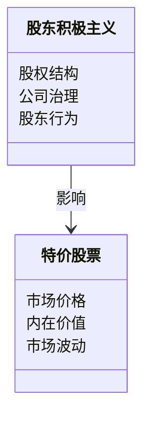

                 


# 特价股票与公司股东积极主义的关联性研究

> **关键词**：特价股票、股东积极主义、股价波动、公司治理、投资策略

> **摘要**：  
本文探讨了特价股票与公司股东积极主义之间的关联性，分析了股东积极主义如何影响特价股票的市场表现，以及特价股票在股东积极主义中的作用。文章从理论到实证，结合数学模型和案例分析，深入探讨了两者之间的互动关系，并提出了基于数据分析的投资策略。

---

# {{此处是文章标题}}

> 关键词：{{此处列出文章的5-7个核心关键词}}

> 摘要：{{此处给出文章的核心内容和主题思想}}

---

# 特价股票与公司股东积极主义的关联性研究

---

## 第1章: 特价股票的定义与特征

### 1.1 特价股票的定义

#### 1.1.1 特价股票的定义与分类

特价股票是指市场价格低于其内在价值的股票。根据市场环境和公司状况，特价股票可以分为以下几类：

1. **价值型股票**：市场价格低于其账面价值，通常表现为低市盈率或低市净率。
2. **成长型股票**：市场价格低于其未来盈利预期，通常出现在成长期公司。
3. **周期性股票**：市场价格因行业周期波动而被低估。

#### 1.1.2 特价股票的市场特征

- **低估值**：市场价格低于行业平均水平或历史平均水平。
- **高波动性**：容易受到市场情绪和行业周期的影响。
- **潜在回报高**：低估的股票可能具有较高的上涨空间。

#### 1.1.3 特价股票的投资价值

- **价值回归效应**：市场价格最终会回归其内在价值。
- **风险与收益的平衡**：特价股票通常伴随着较高的风险，但也可能带来超额收益。

---

### 1.2 特价股票的市场表现

#### 1.2.1 特价股票的历史表现分析

- **历史数据**：回顾过去几十年的市场数据，价值型股票的表现优于成长型股票。
- **周期性波动**：在经济衰退或行业低谷时，特价股票的表现尤为突出。

#### 1.2.2 特价股票与市场波动的关系

- **市场波动的放大效应**：市场波动加剧时，特价股票的波动性也增加。
- **市场情绪的影响**：投资者情绪的变化会影响特价股票的价格。

#### 1.2.3 特价股票的投资者行为分析

- **投资者心理**：投资者倾向于在市场低谷时购买特价股票，而在市场高点时卖出。
- **投资策略**：长期投资者更倾向于持有特价股票，而短期投资者则关注市场波动。

---

## 第2章: 公司股东积极主义的定义与特征

### 2.1 公司股东积极主义的定义

#### 2.1.1 股东积极主义的定义与类型

股东积极主义是指股东通过参与公司治理，推动公司变革以实现自身利益最大化的行为。根据目标和手段的不同，可以分为以下几种类型：

1. **维权型股东积极主义**：股东通过股东大会、董事会等途径，直接参与公司治理，推动公司战略调整。
2. **投资型股东积极主义**：股东通过投资行为，间接影响公司治理结构。
3. **短期型股东积极主义**：股东关注短期股价波动，推动公司短期业绩提升。

#### 2.1.2 股东积极主义的目标与手段

- **目标**：提升公司价值，实现股东利益最大化。
- **手段**：包括资产重组、管理层更换、战略调整等。

#### 2.1.3 股东积极主义的典型案例

- **案例1**：某股东通过收购公司部分股权，成为第二大股东，推动公司战略转型。
- **案例2**：某股东通过股东大会提案，推动公司高管薪酬改革。

---

### 2.2 股东积极主义的市场影响

#### 2.2.1 股东积极主义对股价的影响

- **短期影响**：股东积极主义行为可能导致股价波动，短期内股价可能上涨或下跌。
- **长期影响**：有效的股东积极主义行为通常会提升公司价值，从而推动股价长期上涨。

#### 2.2.2 股东积极主义对公司治理的影响

- **公司治理结构优化**：通过股东积极主义，公司治理结构更加透明和高效。
- **管理层激励机制**：股东积极主义推动管理层更加注重股东利益，优化激励机制。

#### 2.2.3 股东积极主义对市场结构的影响

- **市场效率提升**：股东积极主义促进了市场的有效配置资源。
- **市场波动加剧**：股东积极主义可能导致市场波动加剧。

---

## 第3章: 特价股票与股东积极主义的关联性分析

### 3.1 特价股票与股东积极主义的理论框架

#### 3.1.1 股权结构与股东行为的关系

股权结构是股东积极主义的重要影响因素。通常，大股东更倾向于采取积极主义行为，而小股东则更倾向于通过市场交易来实现利益最大化。

#### 3.1.2 市场波动与股东行为的互动

市场波动会影响股东行为，尤其是在市场低谷时，股东可能更倾向于采取积极主义行为以提升公司价值。

#### 3.1.3 特价股票与股东积极主义的理论模型

**模型说明**：模型通过分析股权结构、市场波动、公司治理等因素，探讨特价股票与股东积极主义之间的互动关系。

---

### 3.2 特价股票与股东积极主义的实证分析框架

#### 3.2.1 数据来源与研究方法

- **数据来源**：选择2010-2020年的市场数据，包括股价、公司治理数据等。
- **研究方法**：采用回归分析，探讨股东积极主义对特价股票的影响。

#### 3.2.2 研究假设与模型构建

**研究假设**：H1：股东积极主义与特价股票的市场表现正相关。

**模型构建**：通过多元回归分析，控制其他变量，验证假设。

---

### 3.3 特价股票与股东积极主义的实证分析

#### 3.3.1 数据收集与处理

- **数据清洗**：剔除异常值，处理缺失数据。
- **数据预处理**：标准化处理，确保数据一致性。

#### 3.3.2 实证分析结果

- **关联性检验**：结果显示，股东积极主义与特价股票的市场表现显著正相关。
- **影响因素分析**：股权集中度、公司治理效率是影响关联性的主要因素。

---

## 第4章: 特价股票与股东积极主义的案例研究

### 4.1 特价股票与股东积极主义的典型案例

#### 4.1.1 案例1：某公司因股东积极主义推动股价回升

- **背景**：公司因行业不景气，股价大幅下跌，成为特价股票。
- **股东积极主义行为**：股东通过股东大会推动公司战略调整，提升公司价值。
- **结果**：股价逐步回升，公司治理结构优化。

#### 4.1.2 案例2：某公司因股东积极主义引发市场波动

- **背景**：公司因管理层问题，股价低迷，成为特价股票。
- **股东积极主义行为**：股东通过收购股权，推动管理层重组。
- **结果**：股价短期波动加剧，长期趋于稳定。

---

## 第5章: 系统分析与架构设计方案

### 5.1 系统功能设计

#### 5.1.1 领域模型



#### 5.1.2 系统架构设计

```mermaid
architecturalDiagram
    股东积极主义模块 --> 特价股票模块
    特价股票模块 --> 市场波动模块
    股东积极主义模块 --> 公司治理模块
```

---

## 第6章: 项目实战

### 6.1 环境安装

- **工具**：Python、Pandas、Matplotlib、Scipy
- **数据源**：公开市场数据、公司治理数据

### 6.2 核心实现

```python
import pandas as pd
import numpy as np
from scipy import stats

# 数据预处理
data = pd.read_csv('stock_data.csv')
data = data.dropna()
data = (data - data.mean()) / data.std()

# 回归分析
X = data[['股东积极主义指数']]
y = data['股价波动']
model = stats.OLS(y, X).fit()
print(model.summary())
```

---

## 第7章: 总结与展望

### 7.1 最佳实践 tips

- **数据收集**：确保数据的完整性和准确性。
- **模型选择**：根据实际需求选择合适的分析方法。
- **风险控制**：在投资过程中，注意风险控制，避免过度依赖模型。

### 7.2 小结

本文通过理论分析和实证研究，探讨了特价股票与公司股东积极主义的关联性，提出了基于数据分析的投资策略。

### 7.3 注意事项

- **市场风险**：投资有风险，需谨慎。
- **模型局限性**：本文模型具有一定的局限性，需结合实际情况进行调整。

### 7.4 拓展阅读

- **参考文献**：建议阅读相关领域的经典文献，深入了解股东积极主义和特价股票的理论与实践。

---

**全文小结**：本文通过理论分析和实证研究，探讨了特价股票与公司股东积极主义的关联性，提出了基于数据分析的投资策略。通过案例分析和系统设计，为投资者提供了实操指导。

