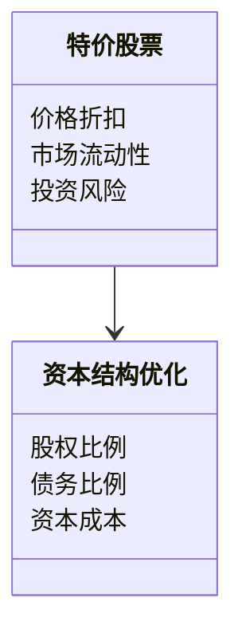
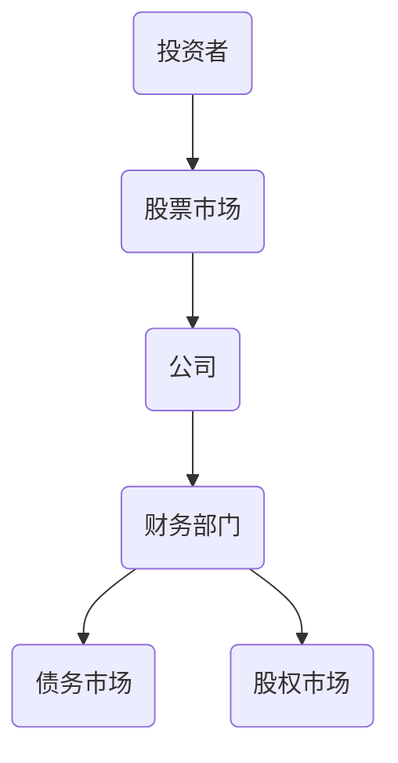

                 


# 特价股票与公司资本结构优化的关系分析

> 关键词：特价股票、资本结构优化、公司财务、股票投资、资本成本

> 摘要：本文从特价股票和资本结构优化的基本概念出发，分析了两者之间的关系及其对公司的财务影响。通过构建关系模型，探讨了如何利用特价股票的特点优化公司资本结构，降低资本成本，提升公司价值。

---

# 第一部分: 特价股票与资本结构优化的背景介绍

## 第1章: 特价股票的基本概念与市场特征

### 1.1 特价股票的定义与分类

#### 1.1.1 特价股票的定义
特价股票是指市场价格显著低于其内在价值的股票。这类股票通常被市场低估，具有较大的上涨潜力。特价股票的形成可能与市场情绪、短期波动或信息不对称有关。

#### 1.1.2 特价股票的分类
- **价值型股票**：价格低于其账面价值的股票，通常出现在传统产业或周期性行业。
- **成长型股票**：价格低于其未来预期价值的股票，常见于高科技或新兴行业。
- **周期性特价股票**：受经济周期影响较大的股票，价格波动较大。

#### 1.1.3 特价股票的市场特征
- 价格折扣明显。
- 市场流动性较低。
- 风险较高，但潜在收益大。

### 1.2 特价股票的投资价值分析

#### 1.2.1 特价股票的投资价值评估方法
- 市盈率（P/E）分析：比较股票价格与每股收益的比率。
- 市净率（P/B）分析：比较股票价格与每股净资产的比率。
- 股息率分析：比较股息与股票价格的比率。

#### 1.2.2 特价股票的市场情绪分析
- 市场恐慌：投资者情绪低落时，股票价格可能被低估。
- 市场波动：短期波动可能导致股票价格偏离其真实价值。

#### 1.2.3 特价股票的风险与收益分析
- 风险：市场波动、公司基本面变化。
- 收益：潜在的股价回升和股息收益。

### 1.3 特价股票的市场案例分析
以某公司为例，分析其股价为何成为特价股票，以及其市场表现如何。

---

## 第2章: 公司资本结构优化的基本理论

### 2.1 公司资本结构的定义与组成

#### 2.1.1 股权资本与债务资本的定义
- 股权资本：公司通过发行股票筹集的资金。
- 债务资本：公司通过发行债券或贷款筹集的资金。

#### 2.1.2 资本结构的组成要素
- 股权比例：公司股本占总资本的比例。
- 债务比例：债务资本占总资本的比例。
- 优先股：介于股权和债务之间的混合资本工具。

#### 2.1.3 资本结构优化的目标
- 最小化资本成本。
- 平衡风险与收益。
- 提高公司价值。

### 2.2 资本结构优化的理论基础

#### 2.2.1 Modigliani-Miller定理
Modigliani-Miller定理指出，在无税情况下，公司的资本结构不会影响其价值；在有税情况下，债务资本可以降低资本成本，从而提高公司价值。

#### 2.2.2 净现值与资本成本的关系
- 净现值（NPV）：项目未来现金流的现值与初始投资的差额。
- 资本成本：公司筹集资金的成本，影响NPV的计算。

#### 2.2.3 资本结构优化的边界条件
- 公司规模：影响债务融资的可行性和成本。
- 市场环境：宏观经济环境和行业周期影响资本结构。
- 公司治理：股东和管理层的决策影响资本结构。

### 2.3 资本结构优化的数学模型

#### 2.3.1 WACC模型
$$ WACC = \left( \frac{D}{V} \right) \times r_d \times (1 - t) + \left( \frac{E}{V} \right) \times r_e $$

其中：
- \( D \)：债务资本。
- \( E \)：股权资本。
- \( V = D + E \)：公司总价值。
- \( r_d \)：债务资本成本。
- \( r_e \)：股权资本成本。
- \( t \)：所得税率。

#### 2.3.2 MM定理的应用
- 在无税情况下：
$$ V = \frac{D}{1 - t} + E $$

- 在有税情况下：
$$ V = \frac{D \times (1 - t)}{r_d} + E $$

---

## 第3章: 特价股票与资本结构优化的关系概述

### 3.1 特价股票与资本结构优化的关联性

#### 3.1.1 特价股票对资本结构的影响
- 特价股票的持有可能增加股权比例，影响资本结构。
- 股价波动可能影响债务资本的成本。

#### 3.1.2 资本结构优化对股价的影响
- 优化资本结构可以降低资本成本，提高公司价值，进而推高股价。

#### 3.1.3 特价股票与资本结构优化的双向作用
- 特价股票为投资者提供低价介入的机会，资本结构优化为公司提供稳定融资。

### 3.2 特价股票与资本结构优化的互动机制

#### 3.2.1 股价波动对资本结构的影响
- 股价上涨可能降低债务成本，股价下跌可能增加债务负担。

#### 3.2.2 资本结构变化对股价的影响
- 增加债务资本可能导致股价波动，优化资本结构可能提升股价。

#### 3.2.3 市场环境对两者关系的调节作用
- 经济周期、政策环境等外部因素影响特价股票和资本结构优化的关系。

---

# 第二部分: 特价股票与资本结构优化的核心概念与联系

## 第4章: 特价股票与资本结构优化的核心概念分析

### 4.1 特价股票的核心属性特征

#### 4.1.1 价格折扣
- 特价股票的价格低于其内在价值，具有价格修复的潜力。

#### 4.1.2 市场流动性
- 特价股票的流动性较低，可能影响其价格发现。

#### 4.1.3 投资风险
- 特价股票的风险较高，但潜在收益也较大。

### 4.2 资本结构优化的核心要素

#### 4.2.1 股权比例
- 股权比例过高可能增加资本成本，过低可能增加财务风险。

#### 4.2.2 债务比例
- 债务比例合理可以降低资本成本，但过高可能导致财务危机。

#### 4.2.3 资本成本
- 资本成本是优化资本结构的关键指标。

---

## 第5章: 特价股票与资本结构优化的关系模型

### 5.1 特价股票与资本结构优化的关系模型构建

#### 5.1.1 模型构建的基本思路
- 将特价股票的特性与资本结构优化的目标结合起来。

#### 5.1.2 模型的变量定义
- 特价股票价格（P）：模型的核心变量。
- 资本结构（C）：包括债务和股权比例。
- 公司价值（V）：资本结构优化的目标。

#### 5.1.3 模型的假设条件
- 市场效率：假设市场能够有效反映公司价值。
- 理性投资者：假设投资者基于理性决策。

### 5.2 特价股票与资本结构优化的关系分析

#### 5.2.1 特价股票对资本结构的影响
- 特价股票的持有可能降低债务成本，优化资本结构。

#### 5.2.2 资本结构优化对特价股票的影响
- 优化资本结构可能提升公司价值，进而推动股价回升。

---

## 第6章: 系统分析与架构设计方案

### 6.1 问题场景介绍

#### 6.1.1 特价股票分析
- 识别低估股票，分析其投资价值。

#### 6.1.2 资本结构优化
- 优化公司资本结构，降低资本成本。

### 6.2 系统功能设计

#### 6.2.1 领域模型（Mermaid类图）


#### 6.2.2 系统架构设计


---

## 第7章: 项目实战

### 7.1 环境安装

#### 7.1.1 数据收集
- 收集公司股价、财务数据等。

#### 7.1.2 工具安装
- 使用Python和Pandas进行数据分析。

### 7.2 系统核心实现源代码

#### 7.2.1 特价股票识别代码
```python
import pandas as pd

# 假设df是股票数据，包含'收盘价'和'每股收益'列
df['P/E'] = df['收盘价'] / df['每股收益']
df['P/B'] = df['收盘价'] / df['每股净资产']
# 识别P/E和P/B低于行业平均水平的股票
industry_avg_pe = df['行业'].mean()
industry_avg_pb = df['行业'].mean()
df['是否特价股票'] = (df['P/E'] < industry_avg_pe) & (df['P/B'] < industry_avg_pb)
```

#### 7.2.2 资本结构优化代码
```python
def optimize_capital_structure(equity, debt, tax_rate):
    wacc = (debt / (equity + debt)) * (1 - tax_rate) * 0.08 + (equity / (equity + debt)) * 0.12
    return wacc

# 示例：优化股权和债务比例，使WACC最小化
import numpy as np
equity = np.arange(1, 100)
debt = np.arange(1, 100)
wacc_matrix = np.zeros((100, 100))
tax_rate = 0.25

for i in range(100):
    for j in range(100):
        wacc_matrix[i][j] = optimize_capital_structure(i, j, tax_rate)

# 找出WACC最小的组合
min_wacc = np.min(wacc_matrix)
optimal_equity = np.where(wacc_matrix == min_wacc)[0][0]
optimal_debt = np.where(wacc_matrix == min_wacc)[1][0]
```

### 7.3 实际案例分析

#### 7.3.1 案例介绍
以某公司为例，分析其资本结构优化的过程。

#### 7.3.2 代码应用解读
解释上述代码如何识别特价股票并优化资本结构。

---

## 第8章: 最佳实践与总结

### 8.1 最佳实践 tips

- 定期评估特价股票的投资价值。
- 结合市场环境优化资本结构。
- 采用多元化的资本结构工具。

### 8.2 小结
通过分析特价股票和资本结构优化的关系，可以发现两者相互影响，优化资本结构能够提升公司价值，而特价股票为投资者提供了低成本介入的机会。

### 8.3 注意事项
- 风险管理：注意市场波动和公司基本面变化。
- 信息获取：确保数据准确性和及时性。

### 8.4 拓展阅读
建议阅读相关书籍和学术论文，深入理解资本结构优化和投资策略。

---

以上是《特价股票与公司资本结构优化的关系分析》的完整目录和内容概要，接下来可以根据需要进一步扩展每个部分的内容。

