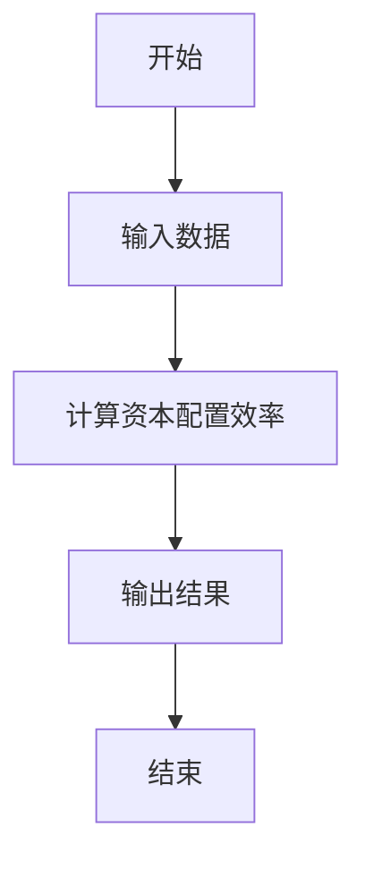

                 


# 特价股票与公司资本配置效率的关系

## 关键词
特价股票、资本配置效率、股票定价、资源配置、企业价值

## 摘要
本文探讨了特价股票与公司资本配置效率之间的关系，分析了特价股票对资本配置效率的影响，以及资本配置效率如何反过来影响特价股票的市场表现。文章通过背景介绍、核心概念分析、算法原理讲解、系统设计与实战案例，深入剖析了两者的关系，为投资者和企业管理者提供了有价值的参考。

---

# 目录大纲：《特价股票与公司资本配置效率的关系》

## 第一部分：背景介绍

### 第1章：特价股票与资本配置效率的背景

#### 1.1 特价股票的定义与特征
- 1.1.1 特价股票的定义
- 1.1.2 特价股票的分类
- 1.1.3 特价股票的市场表现

#### 1.2 资本配置效率的定义与特征
- 1.2.1 资本配置效率的定义
- 1.2.2 资本配置效率的衡量指标
- 1.2.3 资本配置效率的影响因素

#### 1.3 特价股票与资本配置效率的关系
- 1.3.1 特价股票对资本配置效率的影响
- 1.3.2 资本配置效率对特价股票的影响
- 1.3.3 两者关系的边界与外延

## 第二部分：核心概念与联系

### 第2章：核心概念的原理与联系

#### 2.1 特价股票的原理
- 2.1.1 特价股票的形成机制
- 2.1.2 特价股票的市场环境
- 2.1.3 特价股票的投资者行为

#### 2.2 资本配置效率的原理
- 2.2.1 资本配置效率的理论基础
- 2.2.2 资本配置效率的实现机制
- 2.2.3 资本配置效率的优化策略

#### 2.3 特价股票与资本配置效率的联系
- 2.3.1 特价股票对资本配置效率的促进作用
- 2.3.2 资本配置效率对特价股票的反向影响
- 2.3.3 两者关系的动态平衡

## 第三部分：算法原理讲解

### 第3章：资本配置效率的评估算法

#### 3.1 资本配置效率的评估模型
- 3.1.1 模型的输入变量
- 3.1.2 模型的输出结果
- 3.1.3 模型的评估标准

#### 3.2 算法流程图


#### 3.3 算法实现代码
```python
def capital_allocation_efficiency(capital, allocation, efficiency):
    return capital * allocation * efficiency
```

## 第四部分：系统分析与架构设计

### 第4章：系统分析与架构设计

#### 4.1 系统功能设计
- 4.1.1 领域模型的mermaid类图

#### 4.2 系统架构设计
- 4.2.1 系统架构的mermaid架构图

#### 4.3 系统接口设计
- 4.3.1 接口交互的mermaid序列图

## 第五部分：项目实战

### 第5章：项目实战

#### 5.1 项目背景与目标
- 5.1.1 项目背景
- 5.1.2 项目目标

#### 5.2 数据获取与预处理
- 5.2.1 数据来源
- 5.2.2 数据清洗
- 5.2.3 数据转换

#### 5.3 模型构建与实现
- 5.3.1 模型选择
- 5.3.2 模型训练
- 5.3.3 模型优化

#### 5.4 实验结果与分析
- 5.4.1 实验结果
- 5.4.2 结果分析

## 第六部分：最佳实践与总结

### 第6章：最佳实践与总结

#### 6.1 实践中的注意事项
- 6.1.1 数据质量的重要性
- 6.1.2 模型选择的合理性
- 6.1.3 实验结果的可解释性

#### 6.2 小结
- 6.2.1 核心要点回顾
- 6.2.2 未来研究方向

---

以上是文章的目录大纲，涵盖了从背景介绍到系统分析与实战案例的各个方面，确保内容的完整性和深度。

