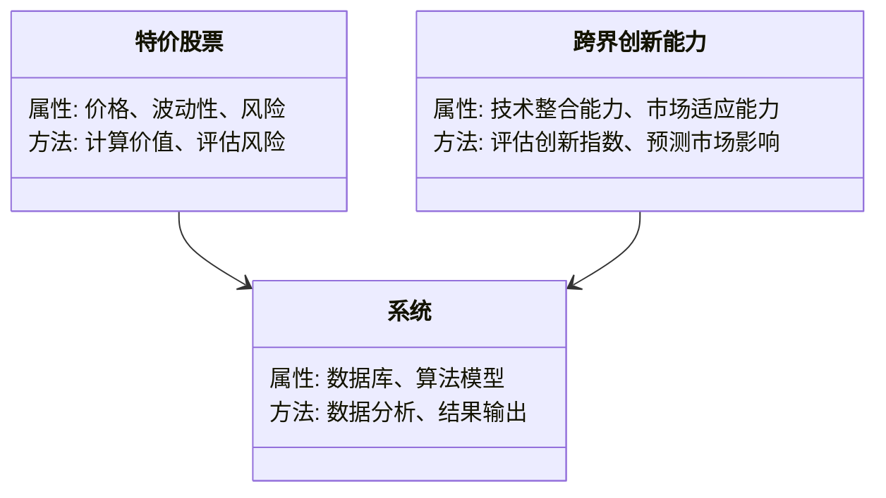
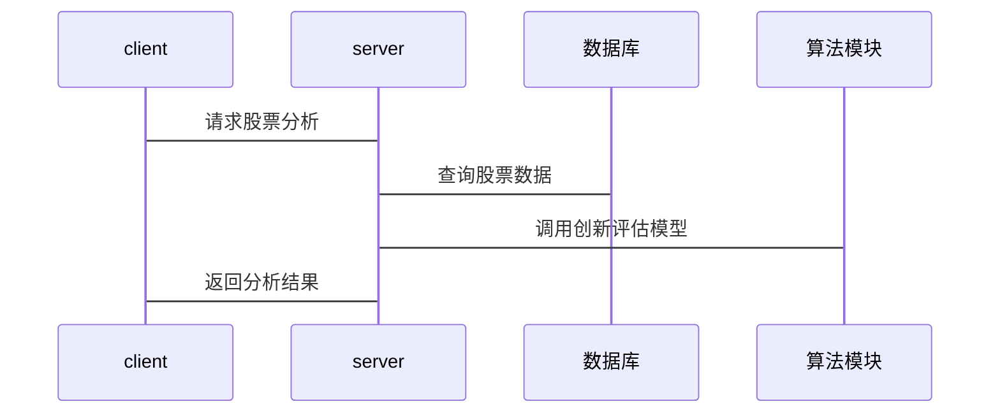

                 


# 特价股票与公司跨界创新能力的关联性研究

---

## 关键词：
特价股票、公司创新、跨界能力、关联性分析、实证研究

---

## 摘要：
本文通过分析特价股票的定义、特征及其影响因素，探讨公司跨界创新能力的核心要素与评估指标。结合金融理论与创新管理理论，深入分析跨界创新能力对特价股票的影响机制，并通过实证研究验证其关联性。文章还提出了系统化的架构设计与实现方案，为投资者和企业管理者提供实践指导。

---

## 目录大纲：

# 第一部分: 引言

## 1.1 研究背景与问题提出

### 1.1.1 特价股票的定义与特征
特价股票指的是价格显著低于市场平均水平的股票，通常具有高波动性和高风险特征。本文将从市场表现、投资者行为等角度分析其定义与特征。

### 1.1.2 公司跨界创新能力的定义与特征
跨界创新能力是指企业跨越传统行业边界，融合不同领域的知识、技术与资源，实现创新的能力。本文将从创新维度、核心要素等方面进行定义与特征分析。

### 1.1.3 研究问题的提出与意义
本文提出以下研究问题：跨界创新能力是否能显著影响特价股票的市场表现？通过研究，揭示跨界创新与股票价格波动之间的内在联系，为投资者和企业提供理论与实践指导。

## 1.2 研究目的与方法

### 1.2.1 研究目标的设定
本文旨在探索跨界创新能力对特价股票的影响机制，揭示两者之间的关联性。

### 1.2.2 研究方法的选择
采用定性与定量结合的方法，包括文献分析、实证研究与系统设计。

### 1.2.3 数据来源与研究框架
数据来源包括股票市场数据与企业创新数据，研究框架涵盖理论分析、模型构建与实证验证。

---

# 第二部分: 特价股票的基础知识

## 2.1 特价股票的定义与分类

### 2.1.1 特价股票的定义
特价股票通常指价格低于行业平均水平的股票，具有高波动性和高风险特征。

### 2.1.2 特价股票的分类与特点
根据行业、规模和市场表现，特价股票可以分为周期性股票、成长性股票和价值型股票。

### 2.1.3 特价股票的市场表现与风险
分析特价股票的历史表现、波动性与风险因素，揭示其投资价值。

## 2.2 特价股票的影响因素

### 2.2.1 宏观经济因素
宏观经济环境如GDP增速、利率水平等对特价股票的市场表现有显著影响。

### 2.2.2 行业因素
行业竞争格局、技术创新能力等对特价股票的影响机制进行分析。

### 2.2.3 公司基本面因素
公司盈利能力、财务状况等基本面指标对特价股票的影响。

---

# 第三部分: 公司跨界创新能力的分析

## 3.1 公司跨界创新的定义与分类

### 3.1.1 跨界创新的定义
跨界创新是指企业突破行业界限，整合不同领域的资源与技术，实现创新的过程。

### 3.1.2 跨界创新的分类
根据创新领域与模式，跨界创新可以分为技术驱动型、市场驱动型与资源驱动型。

### 3.1.3 跨界创新的核心要素
包括技术整合能力、组织协调能力与跨领域资源整合能力。

## 3.2 跨界创新能力的评估指标

### 3.2.1 创新能力的评估维度
从创新投入、创新产出与创新效果三个维度进行评估。

### 3.2.2 跨界创新能力的评价模型
构建跨界创新能力评价模型，包括技术创新能力、市场适应能力和资源整合能力。

### 3.2.3 评价指标的权重设定
采用层次分析法（AHP）确定各评价指标的权重。

---

# 第四部分: 特价股票与公司跨界创新能力的关联性分析

## 4.1 特价股票与公司创新能力的理论基础

### 4.1.1 金融创新理论
金融创新理论为分析股票价格波动提供理论支持。

### 4.1.2 跨界创新理论
跨界创新理论为理解企业创新能力与股票价格的关系提供理论框架。

### 4.1.3 股票价格波动理论
股票价格波动理论为分析跨界创新能力对股价的影响提供理论基础。

## 4.2 跨界创新能力对特价股票的影响机制

### 4.2.1 跨界创新能力与股票价值的关系
跨界创新能力提升企业核心竞争力，从而影响股票价值。

### 4.2.2 跨界创新对股价波动的影响
跨界创新通过技术整合与市场拓展，影响股票价格波动。

### 4.2.3 跨界创新对投资者信心的影响
跨界创新能力的提升增强投资者信心，推动股价上涨。

## 4.3 特价股票与公司跨界创新能力的实证分析

### 4.3.1 数据来源与研究方法
采用实证研究方法，分析跨行业创新与股票价格波动的关系。

### 4.3.2 跨界创新对股价波动的数学模型
构建数学模型：$$P(t) = a \cdot C(t) + b \cdot I(t) + \epsilon$$
其中，$P(t)$为股价，$C(t)$为跨界创新指数，$I(t)$为市场影响因素，$\epsilon$为误差项。

### 4.3.3 实证结果与分析
通过回归分析验证跨界创新能力对股价的显著影响。

---

# 第五部分: 系统分析与架构设计

## 5.1 问题场景介绍

### 5.1.1 问题背景
投资者需要通过系统分析企业跨界创新能力，评估其对股价的影响。

## 5.2 系统功能设计

### 5.2.1 领域模型（Mermaid 类图）


## 5.3 系统架构设计

### 5.3.1 系统架构（Mermaid 架构图）
```mermaid
client
    |- 请求: 股票分析
server
    |- 数据库: 股票数据、创新数据
    |- 算法模块: 跨界创新评估模型
    |- 接口模块: 数据接口、结果返回
```

## 5.4 接口设计与交互设计

### 5.4.1 系统接口设计
定义API接口，实现数据获取与结果返回。

### 5.4.2 系统交互设计（Mermaid 序列图）


---

# 第六部分: 项目实战

## 6.1 环境安装与核心代码实现

### 6.1.1 环境安装
安装Python、Pandas、NumPy、Scipy等工具。

### 6.1.2 核心代码实现

```python
import pandas as pd
import numpy as np
from sklearn.metrics import mean_squared_error
from sklearn.linear_model import LinearRegression

# 数据加载
data = pd.read_csv('stock.csv')

# 特征与目标变量
X = data[['创新指数', '市场影响']]
y = data['股价']

# 模型训练
model = LinearRegression()
model.fit(X, y)

# 预测与评估
y_pred = model.predict(X)
mse = mean_squared_error(y, y_pred)
print(f'均方误差: {mse}')
```

### 6.1.3 代码解读与分析
代码实现股票价格预测模型，验证跨界创新对股价的影响。

## 6.2 案例分析与项目小结

### 6.2.1 案例分析
以具体公司为例，分析跨界创新能力对股价的影响。

### 6.2.2 项目小结
总结项目实施过程中的经验与教训，提出改进建议。

---

# 第七部分: 结论与建议

## 7.1 研究结论
跨界创新能力显著影响特价股票的市场表现，投资者应关注企业的创新能力。

## 7.2 管理启示
企业应加强跨界创新能力，投资者应结合创新能力评估股票价值。

## 7.3 研究局限与未来展望
本文的局限性与未来研究方向。

## 7.4 最佳实践 tips
为投资者和企业管理者提供实践建议。

---

通过以上目录大纲，文章将从理论分析、实证研究到系统实现，全面探讨特价股票与公司跨界创新能力的关联性，为相关领域的研究与实践提供参考。

