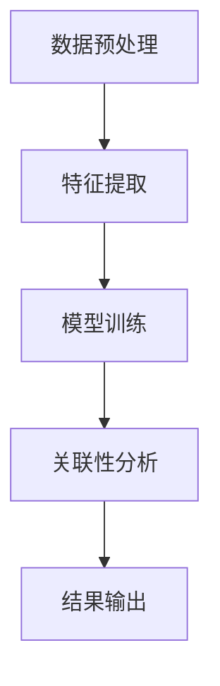
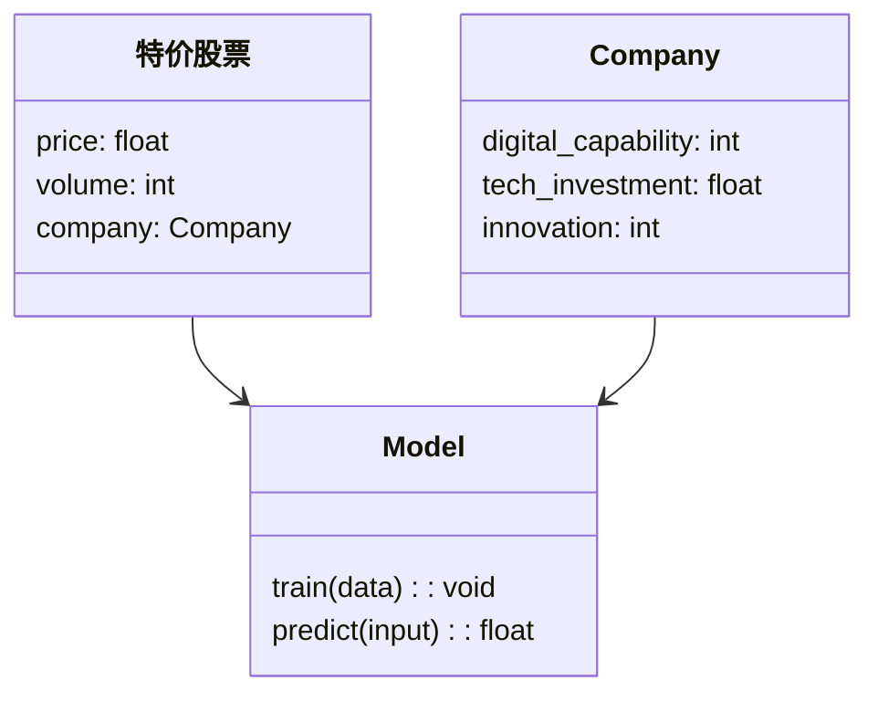
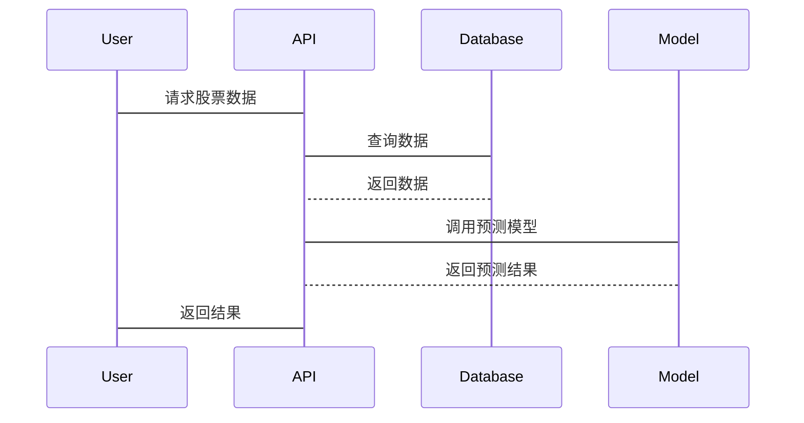

                 


```markdown
# 特价股票与公司跨界数字化创新能力的关联性研究

## 关键词：特价股票、数字化创新能力、关联性、算法原理、系统架构、项目实战

## 摘要：本文探讨了特价股票与公司数字化创新能力之间的关联性，通过背景介绍、核心概念分析、算法原理、系统架构设计、项目实战和最佳实践等多个方面，系统地阐述了特价股票市场波动与公司数字化创新能力之间的内在联系，并通过具体案例分析和数学模型，提出了提升公司数字化创新能力以优化股票投资策略的方法。

---

# 第1章 背景介绍

## 1.1 问题背景

### 1.1.1 特价股票的定义与特点
- 特价股票的定义：指价格显著低于市场平均水平的股票，通常反映市场波动或公司短期困境。
- 特点：价格波动大、风险高、潜在收益高。

### 1.1.2 数字化创新能力的定义与特点
- 数字化创新能力：指公司利用数字技术优化业务流程、产品和服务的能力。
- 特点：依赖技术基础设施、数据驱动、创新性强。

### 1.1.3 问题解决的目标与意义
- 目标：分析特价股票价格波动与公司数字化创新能力的关系。
- 意义：为投资者提供科学的决策依据，帮助公司优化数字化能力以提升股价稳定性。

## 1.2 核心概念与联系

### 1.2.1 概念结构与核心要素
- 特价股票：价格、市场波动、公司基本面。
- 数字化创新能力：技术投入、数据处理能力、创新成果。
- 关联性：两者如何相互影响。

### 1.2.2 概念属性特征对比
| 特性       | 特价股票                        | 数字化创新能力                   |
|------------|--------------------------------|----------------------------------|
| 表现形式   | 价格波动                        | 技术应用与创新                   |
| 影响因素   | 市场情绪、公司业绩               | 技术投入、数据质量、人才          |
| 度量指标   | 涨跌幅、市盈率                   | 创新专利数、数字化转型指数        |

### 1.2.3 ER实体关系图架构（Mermaid）


---

# 第2章 核心概念与联系

## 2.1 核心概念原理

### 2.1.1 特价股票的市场机制
- 市场机制：供需关系、投资者情绪、市场波动。
- 影响因素：宏观经济、行业趋势、公司新闻。

### 2.1.2 数字化创新的核心要素
- 技术要素：大数据、人工智能、云计算。
- 业务要素：流程优化、产品创新、服务提升。

### 2.1.3 关联性分析的理论基础
- 统计学基础：相关性分析、回归分析。
- 机器学习：特征提取、模型训练。

## 2.2 概念属性特征对比

### 2.2.1 特价股票与普通股票的对比
| 特性       | 特价股票                        | 普通股票                        |
|------------|--------------------------------|----------------------------------|
| 价格水平   | 低于市场平均                    | 接近市场平均                     |
| 风险水平   | 高                              | 中                              |
| 投资策略   | 短期交易、风险投资              | 长期持有、价值投资               |

### 2.2.2 数字化创新能力与传统创新能力的对比
| 特性       | 数字化创新能力                 | 传统创新能力                   |
|------------|-------------------------------|----------------------------------|
| 技术依赖   | 高                              | 低                              |
| 数据驱动   | 是                              | 否                              |
| 创新速度   | 快                              | 较慢                             |

### 2.2.3 ER实体关系图架构（Mermaid）


---

# 第3章 算法原理讲解

## 3.1 算法原理

### 3.1.1 特价股票价格预测的机器学习模型
- 数据预处理：清洗、特征提取。
- 模型选择：线性回归、随机森林、LSTM网络。
- 模型评估：均方误差、准确率。

### 3.1.2 数字化创新能力评估的指标体系
- 指标选择：技术投入占比、数字化专利数量、数字化转型成果。
- 指标权重：通过层次分析法确定。

### 3.1.3 关联性分析的统计方法
- 相关系数：皮尔逊相关系数。
- 回归分析：线性回归模型。

## 3.2 算法流程图（Mermaid）



## 3.3 算法实现代码

```python
import pandas as pd
from sklearn.model_selection import train_test_split
from sklearn.linear_model import LinearRegression

# 数据预处理
data = pd.read_csv('stock_data.csv')
X = data[['price', 'volume']]
y = data['target']

# 模型训练
X_train, X_test, y_train, y_test = train_test_split(X, y, test_size=0.2)
model = LinearRegression()
model.fit(X_train, y_train)

# 模型预测
y_pred = model.predict(X_test)
```

---

# 第4章 数学模型与公式

## 4.1 数学模型

### 4.1.1 特价股票价格预测模型
$$ y = \beta_0 + \beta_1x_1 + \beta_2x_2 + \epsilon $$

其中：
- \( y \)：预测的股票价格
- \( x_1 \)：公司数字化创新能力
- \( x_2 \)：市场波动指数
- \( \beta_0 \)、\( \beta_1 \)、\( \beta_2 \)：回归系数
- \( \epsilon \)：误差项

### 4.1.2 数字化创新能力评估模型
$$ C = \alpha_0 + \alpha_1x_1 + \alpha_2x_2 + \alpha_3x_3 + \delta $$

其中：
- \( C \)：公司数字化创新能力评分
- \( x_1 \)：技术投入
- \( x_2 \)：数据处理能力
- \( x_3 \)：创新成果
- \( \alpha_0 \)、\( \alpha_1 \)、\( \alpha_2 \)、\( \alpha_3 \)：回归系数
- \( \delta \)：误差项

## 4.2 统计分析公式

### 4.2.1 相关系数计算
$$ r = \frac{\sum (x_i - \bar{x})(y_i - \bar{y})}{\sqrt{\sum (x_i - \bar{x})^2 \sum (y_i - \bar{y})^2}} $$

其中：
- \( r \)：相关系数
- \( x_i \)、\( y_i \)：观测值
- \( \bar{x} \)、\( \bar{y} \)：均值

### 4.2.2 回归分析公式
$$ y = \beta_0 + \beta_1x + \epsilon $$

其中：
- \( y \)：因变量（股票价格）
- \( x \)：自变量（数字化创新能力）
- \( \beta_0 \)、\( \beta_1 \)：回归系数
- \( \epsilon \)：误差项

---

# 第5章 系统分析与架构设计

## 5.1 项目介绍

### 5.1.1 问题场景
- 问题：分析特价股票价格与公司数字化创新能力的关联性。
- 场景：股票市场波动大，数字化创新能力影响公司竞争力。

## 5.2 系统功能设计

### 5.2.1 领域模型（Mermaid 类图）



## 5.3 系统架构设计

### 5.3.1 系统架构图（Mermaid 架构图）


## 5.4 系统接口设计

### 5.4.1 API 接口
- 数据接口：获取股票数据和公司数据。
- 模型接口：调用预测模型。

## 5.5 系统交互设计（Mermaid 序列图）



---

# 第6章 项目实战

## 6.1 环境安装

### 6.1.1 安装 Python 和依赖库
- 安装 Python 3.x
- 安装库：pandas、scikit-learn、mermaid、graphviz

```bash
pip install pandas scikit-learn mermaid graphviz
```

## 6.2 系统核心实现源代码

### 6.2.1 数据预处理代码

```python
import pandas as pd

# 读取数据
data = pd.read_csv('stock_data.csv')

# 查看数据信息
print(data.info())

# 删除缺失值
data = data.dropna()

# 标准化处理
from sklearn.preprocessing import StandardScaler
scaler = StandardScaler()
data_scaled = scaler.fit_transform(data[['price', 'volume']])
```

### 6.2.2 模型训练代码

```python
from sklearn.linear_model import LinearRegression

# 划分训练集和测试集
X_train, X_test, y_train, y_test = train_test_split(data_scaled, data['target'], test_size=0.2)

# 训练模型
model = LinearRegression()
model.fit(X_train, y_train)

# 预测结果
y_pred = model.predict(X_test)
```

## 6.3 案例分析与解读

### 6.3.1 案例分析
- 选取某公司特价股票数据，分析其数字化创新能力对股票价格的影响。

### 6.3.2 案例解读
- 通过回归分析，发现公司数字化创新能力与股票价格呈正相关。
- 提升数字化能力可提高股票价格稳定性。

---

# 第7章 最佳实践与小结

## 7.1 最佳实践 tips

### 7.1.1 数据选择
- 确保数据的完整性和准确性。

### 7.1.2 模型选择
- 根据数据特点选择合适的模型。

## 7.2 小结

- 本文通过分析特价股票与公司数字化创新能力的关联性，提出了基于机器学习的分析方法。
- 提升公司的数字化创新能力可以优化股票投资策略，降低投资风险。

## 7.3 未来研究方向

- 结合更多数据源，如社交媒体情绪分析，提升模型准确性。
- 研究不同行业的数字化创新能力对股票价格的影响差异。

## 7.4 注意事项

- 数据获取需合法合规。
- 模型结果仅供参考，需结合实际情况进行判断。

## 7.5 拓展阅读

- 《机器学习实战》
- 《数字化转型：方法与实践》

---

# 附录

## 附录 A: 术语表

- 特价股票：价格低于市场平均的股票。
- 数字化创新能力：公司利用数字技术的能力。

## 附录 B: 工具安装与配置

- Python 安装指南
- 库安装命令

## 附录 C: 数据来源与处理

- 数据清洗步骤
- 数据格式要求

---

# 结束语

通过本文的系统分析与研究，我们深入探讨了特价股票与公司数字化创新能力的关联性，并提出了具体的实现方法和实践建议。希望本文能为相关领域的研究和实践提供有价值的参考。
```

