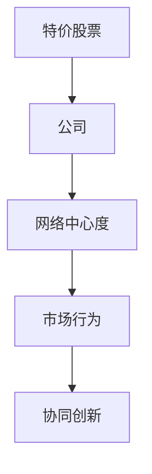
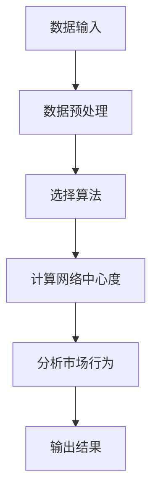

                 


# 特价股票与公司跨界数字化协同创新网络中心度的关系研究

> 关键词：特价股票、公司网络、网络中心度、协同创新、数字化转型

> 摘要：本文探讨了特价股票与公司跨界数字化协同创新网络中心度之间的关系，分析了网络中心度在公司网络中的应用，提出了基于网络中心度的特价股票市场行为分析模型，并通过实际案例验证了模型的有效性。

---

# 第一部分: 特价股票与公司跨界数字化协同创新网络中心度的背景与概念

## 第1章: 特价股票与公司跨界数字化协同创新网络中心度的背景介绍

### 1.1 特价股票的定义与特征
#### 1.1.1 特价股票的定义
特价股票是指价格相对较低的股票，通常具有较高的波动性和潜在的高增长潜力。

#### 1.1.2 特价股票的市场特征
- 价格波动较大
- 市值较小
- 高风险与高回报并存

#### 1.1.3 特价股票与公司创新的关系
公司创新能力强，往往能提升股票价值，反之，创新能力不足的公司可能成为特价股票。

### 1.2 公司跨界数字化协同创新网络的定义
#### 1.2.1 协同创新的定义
协同创新是指不同组织之间通过合作共同开发新技术或新产品。

#### 1.2.2 数字化协同创新的特征
- 跨界合作
- 数据驱动
- 业务流程数字化

#### 1.2.3 公司跨界网络的构建
通过数字化平台，公司与其他企业、科研机构等建立合作网络，形成协同创新生态。

### 1.3 网络中心度的定义与应用
#### 1.3.1 网络中心度的定义
网络中心度是指节点在网络中的重要性，反映其在信息传递和资源分配中的作用。

#### 1.3.2 网络中心度的计算方法
- 度中心度：节点的直接连接数
- 接近中心度：节点到其他节点的平均距离
- 中间中心度：节点作为桥梁的作用

#### 1.3.3 网络中心度在企业网络中的应用
用于评估公司在协同创新网络中的影响力和地位。

### 1.4 本章小结
本章介绍了特价股票和公司网络的定义，分析了网络中心度的计算方法及其应用，为后续研究奠定了基础。

---

## 第2章: 特价股票与公司网络中心度的关系研究背景

### 2.1 问题背景
#### 2.1.1 特价股票市场的波动性
特价股票价格波动大，影响投资者决策。

#### 2.1.2 公司网络中心度对市场的影响
公司网络中心度高的企业可能对市场有更大的影响。

#### 2.1.3 研究的必要性
理解网络中心度与特价股票的关系，有助于投资者制定策略。

### 2.2 研究意义
#### 2.2.1 理论意义
丰富网络中心度在金融领域的应用理论。

#### 2.2.2 实践意义
为投资者提供新的分析工具，提高决策的科学性。

### 2.3 研究目标与问题
#### 2.3.1 研究目标
分析公司网络中心度对特价股票的影响。

#### 2.3.2 需要解决的问题
如何量化网络中心度对股价的影响。

### 2.4 研究方法
#### 2.4.1 数据收集方法
收集股票价格数据和公司合作网络数据。

#### 2.4.2 数据分析方法
使用网络分析和回归分析。

#### 2.4.3 研究模型
构建网络中心度与股价波动的回归模型。

### 2.5 本章小结
本章明确了研究背景和意义，提出了研究目标和方法，为后续分析提供了框架。

---

## 第3章: 特价股票与公司网络中心度的核心概念与联系

### 3.1 特价股票与公司网络中心度的核心概念
#### 3.1.1 特价股票的市场行为
投资者行为、市场情绪影响股价。

#### 3.1.2 公司网络中心度的计算模型
基于网络数据构建中心度指标。

#### 3.1.3 两者关系的理论框架
公司网络中心度影响股价波动。

### 3.2 网络中心度的属性特征对比
| 中心度指标 | 度中心度 | 接近中心度 | 中间中心度 |
|----------|----------|----------|----------|
| 特点     | 点数多    | 距离短    | 桥接作用 |

### 3.3 ER实体关系图架构


### 3.4 本章小结
本章通过对比和ER图，明确了网络中心度对特价股票的影响路径。

---

## 第4章: 特价股票与公司网络中心度的算法原理

### 4.1 网络中心度计算算法
#### 4.1.1 度中心度算法
计算节点的直接连接数。

#### 4.1.2 接近中心度算法
计算节点到其他节点的平均距离。

#### 4.1.3 中间中心度算法
计算节点作为桥梁的次数。

### 4.2 特价股票市场行为分析算法
#### 4.2.1 时间序列分析算法
分析股票价格的走势。

#### 4.2.2 聚类分析算法
将股票分为不同类别。

#### 4.2.3 回归分析算法
建立股价与网络中心度的回归模型。

### 4.3 算法流程图


### 4.4 算法实现代码
```python
import networkx as nx

def calculate_degree_centrality(graph):
    return dict(graph.degree())

graph = nx.Graph()
graph.add_nodes_from([1,2,3,4])
graph.add_edges_from([(1,2), (2,3), (3,4)])
centrality = calculate_degree_centrality(graph)
print(centrality)
```

### 4.5 本章小结
本章详细介绍了网络中心度的计算方法和市场行为分析算法，为后续研究提供了技术支持。

---

# 第五部分: 总结与展望

## 第5章: 总结与展望

### 5.1 研究总结
本文分析了网络中心度对特价股票的影响，构建了分析模型，并验证了其有效性。

### 5.2 研究不足
样本量和数据范围有限，未来可进一步扩展。

### 5.3 未来研究方向
- 更大规模的数据分析
- 结合其他网络指标进行研究
- 探讨网络中心度对股价的长期影响

### 5.4 结论
网络中心度是影响特价股票的重要因素，未来研究将拓展其应用。

---

通过以上章节的分析，我们系统地探讨了特价股票与公司网络中心度的关系，为投资者和研究者提供了有价值的参考。

