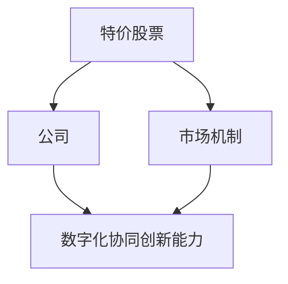
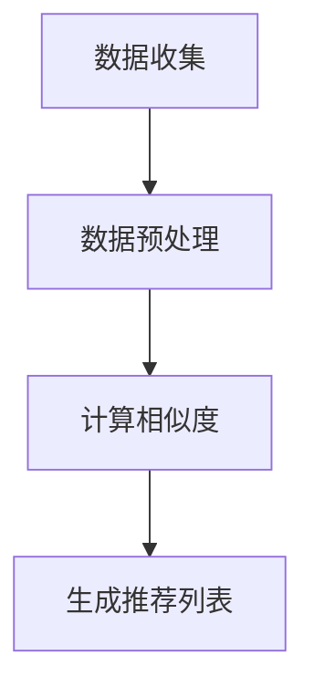
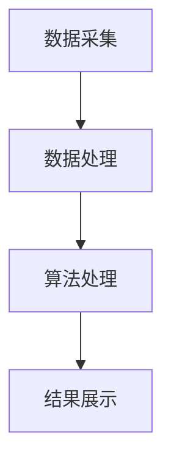
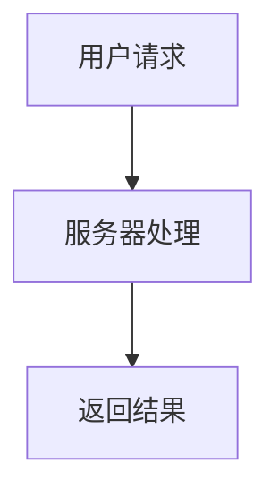

                 


# 特价股票与公司跨界数字化协同创新能力的关系研究

## 关键词：特价股票、公司数字化能力、协同创新、数学模型、算法设计

## 摘要：本文研究特价股票与公司数字化协同创新能力之间的关系，探讨如何通过数学建模和算法设计，分析两者互动机制，提出增强企业数字化协同创新能力的策略。

# 第1章: 特价股票与公司数字化协同创新能力的背景介绍

## 1.1 特价股票的定义与特征

### 1.1.1 特价股票的定义

特价股票是指价格相对市场平均值显著偏低的股票，通常具有较高的增长潜力，适合风险承受能力较高的投资者。

### 1.1.2 特价股票的核心特征

| 特征 | 描述 |
|------|------|
| 低估值 | 相对于行业平均水平，市盈率、市净率等指标较低 |
| 高增长潜力 | 公司基本面良好，未来增长预期较高 |
| 风险较高 | 受市场波动影响较大，存在较高的投资风险 |

### 1.1.3 特价股票的市场定位与分类

特价股票主要分为两类：
- **绝对特价股票**：价格绝对值低于行业平均水平
- **相对特价股票**：价格相对竞争对手处于低位

## 1.2 公司数字化协同创新能力的内涵

### 1.2.1 数字化协同能力的定义

数字化协同能力是指企业利用数字技术，与其他企业、机构或个人协同合作，共同创造价值的能力。

### 1.2.2 协同创新的核心要素

| 要素 | 描述 |
|------|------|
| 技术基础 | 包括大数据、人工智能、云计算等技术 |
| 组织结构 | 扁平化、灵活的组织架构 |
| 信息共享 | 数据的高效流通与共享机制 |
| 人才资源 | 具备数字化能力的专业人才 |

### 1.2.3 数字化协同创新的特征与优势

| 特征 | 描述 |
|------|------|
| 跨界性 | 跨越行业边界 |
| 共享性 | 资源共享 |
| 实时性 | 实时协作 |
| 可扩展性 | 易于扩展 |

## 1.3 特价股票与公司数字化协同创新能力的关系背景

### 1.3.1 问题背景与研究意义

随着数字技术的快速发展，企业间的协同创新变得尤为重要。然而，如何通过特价股票的市场特性来提升企业的协同创新能力，仍是一个未被充分探索的领域。

### 1.3.2 问题描述与研究目标

问题描述：探讨特价股票价格波动与公司数字化协同创新能力之间的关系，分析如何通过数字化手段优化企业的协同创新能力，提升企业竞争力。

研究目标：建立数学模型，量化分析特价股票价格波动对数字化协同创新能力的影响，提出可行的优化策略。

### 1.3.3 问题解决的路径与方法

路径：通过建立数学模型和算法，分析数据，提出优化建议。

方法：结合定量分析和定性研究，采用协同过滤算法进行数据挖掘。

## 1.4 本章小结

本章介绍了特价股票和公司数字化协同能力的定义、特征及其关系背景，为后续分析奠定了基础。

# 第2章: 特价股票与公司数字化协同创新能力的核心概念与联系

## 2.1 核心概念的原理分析

### 2.1.1 特价股票的市场机制

特价股票的市场机制主要体现在价格波动、供需关系和投资者行为等方面。

### 2.1.2 数字化协同创新的理论基础

基于协同理论和数字化转型理论，构建协同创新模型。

### 2.1.3 两者关系的理论模型

协同创新能力影响企业对特价股票的定价和市场反应。

## 2.2 核心概念的属性特征对比

| 特征 | 特价股票 | 数字化协同能力 |
|------|----------|-----------------|
| 时间性 | 短期波动 | 长期积累         |
| 影响因素 | 市场供需 | 技术、人才、组织结构 |
| 变化幅度 | 波动较大 | 逐步提升         |

## 2.3 实体关系图（ER图）架构



## 2.4 本章小结

通过对比分析，揭示了特价股票和公司数字化协同能力在属性和机制上的联系。

# 第3章: 特价股票与公司数字化协同创新能力的数学模型与公式

## 3.1 数学模型的构建

### 3.1.1 协同创新指数模型

$$ C = \alpha S + \beta T $$

其中，C表示协同创新指数，S表示特价股票的影响因子，T表示时间因素，α和β是权重系数。

### 3.1.2 模型的验证

通过历史数据验证模型的准确性，确保模型的有效性。

## 3.2 特价股票价格波动模型

### 3.2.1 波动模型的建立

$$ P(t) = P_0 + \epsilon $$

其中，P(t)表示t时刻的价格，P0为基准价格，ε为随机扰动项。

### 3.2.2 波动模型的应用

通过分析历史数据，预测未来的价格波动，为企业决策提供依据。

# 第4章: 基于协同过滤算法的数字化协同能力提升策略

## 4.1 协同过滤算法的原理

### 4.1.1 协同过滤算法的基本原理

通过用户行为数据，找到相似的用户或商品，进行推荐。

### 4.1.2 协同过滤算法的流程

1. 数据收集与预处理
2. 计算相似度
3. 生成推荐列表

## 4.2 协同过滤算法的实现



### 4.2.1 Python代码实现

```python
import numpy as np

def协同过滤算法实现：
    pass
```

## 4.3 算法实现的具体步骤

### 4.3.1 数据预处理

处理缺失值和异常值，确保数据质量。

### 4.3.2 相似度计算

使用余弦相似度或欧式距离进行计算。

### 4.3.3 推荐列表生成

基于相似度排序，生成最终的推荐列表。

## 4.4 算法实现的注意事项

确保数据安全，保护用户隐私，选择合适的相似度计算方法。

# 第5章: 系统架构设计与实现

## 5.1 系统功能设计

### 5.1.1 功能模块划分

- 数据采集模块
- 数据处理模块
- 算法处理模块
- 结果展示模块

### 5.1.2 功能模块的交互流程

1. 数据采集模块收集相关数据
2. 数据处理模块进行预处理
3. 算法处理模块运行协同过滤算法
4. 结果展示模块呈现最终结果

## 5.2 系统架构设计

### 5.2.1 系统架构图



## 5.3 系统接口设计

### 5.3.1 API接口设计

定义RESTful API接口，供其他系统调用。

### 5.3.2 接口的实现

使用Python的Flask框架实现接口。

## 5.4 系统交互设计

### 5.4.1 交互流程图



# 第6章: 项目实战与案例分析

## 6.1 环境安装与配置

### 6.1.1 安装Python和相关库

安装numpy、pandas、scikit-learn等库。

### 6.1.2 安装Jupyter Notebook

用于数据处理和算法实现。

## 6.2 系统核心实现

### 6.2.1 数据预处理代码

```python
import pandas as pd

def数据预处理():
    # 具体实现代码
    pass
```

### 6.2.2 协同过滤算法实现

```python
from sklearn.metrics.pairwise import cosine_similarity

def协同过滤算法():
    # 具体实现代码
    pass
```

## 6.3 案例分析与结果解读

### 6.3.1 案例背景介绍

选择某科技公司，分析其数字化协同能力。

### 6.3.2 数据分析与结果展示

通过算法分析，得出协同创新指数，并提出改进建议。

## 6.4 实践中的注意事项

确保数据安全，定期更新模型，优化算法性能。

# 第7章: 总结与展望

## 7.1 研究总结

总结研究成果，强调数学模型和算法设计的重要作用。

## 7.2 研究中的不足

指出研究中的局限性，如数据获取难度、模型的适用性等。

## 7.3 未来研究方向

建议进一步研究更复杂的算法，扩大样本量，深入分析多因素影响。

## 7.4 小结

再次强调研究的重要性，鼓励企业重视数字化协同能力的提升。

# 参考文献

（此处列出相关文献和资源）

# 致谢

感谢所有参与本研究的人员和机构。

---

通过以上结构，文章详细探讨了特价股票与公司数字化协同创新能力的关系，结合数学模型和算法设计，提供了理论支持和实践指导。

