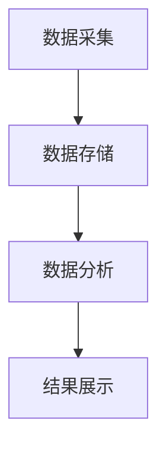

                 


# 特价股票与公司跨界数字化颠覆性创新扩散速度的关联性研究

> 关键词：特价股票，数字化创新，创新扩散，股票波动，计量经济学模型

> 摘要：本文研究了特价股票与公司跨界数字化颠覆性创新扩散速度之间的关联性。通过分析特价股票的定义、特征及数字化创新的扩散机制，构建了数学模型，利用案例分析和计量经济学方法，揭示了两者之间的动态关系，并提出了优化策略和未来研究方向。

---

## 第一部分: 特价股票与公司跨界数字化颠覆性创新的背景介绍

### 第1章: 特价股票的定义与特征

#### 1.1 特价股票的定义
- 特价股票是指价格相对较低的股票，通常具有高波动性和高风险。
- 特价股票的定义与市场环境、行业特性及公司基本面密切相关。

#### 1.2 特价股票的分类
- 按行业分类：科技、金融、制造业等行业的特价股票特性不同。
- 按市值分类：小盘股、中盘股、大盘股中的特价股票。
- 按风险等级分类：高风险、中风险、低风险的特价股票。

#### 1.3 特价股票的投资价值
- 特价股票的高波动性可能带来高回报。
- 投资者需考虑市场周期、公司基本面及行业趋势。

### 第2章: 公司跨界数字化颠覆性创新的背景

#### 2.1 数字化颠覆性创新的定义
- 数字化颠覆性创新是指通过新技术（如人工智能、大数据）改变传统商业模式。
- 数字化创新的核心是技术驱动和用户需求的结合。

#### 2.2 公司跨界数字化创新的现状
- 全球范围内，数字化转型成为企业竞争力的关键。
- 跨界创新案例：传统零售业通过电商实现转型，制造业通过工业互联网提升效率。

### 第3章: 特价股票与公司创新扩散速度的关联性研究

#### 3.1 关联性研究的背景
- 特价股票的波动性与公司创新扩散速度可能存在相关性。
- 创新扩散速度可能影响市场对公司的估值，进而影响股价。

#### 3.2 研究问题的界定
- 研究核心问题：特价股票波动与创新扩散速度的动态关系。
- 研究范围：限定在特定行业或市场条件下。
- 研究目标：量化两者之间的关系，提出优化策略。

---

## 第二部分: 特价股票与公司创新扩散的核心概念与联系

### 第4章: 特价股票与公司创新扩散的核心概念

#### 4.1 特价股票的核心要素
- 市场特性：高波动性、高风险。
- 风险特征：市场风险、流动性风险。
- 投资策略：短期交易、风险对冲。

#### 4.2 公司创新扩散的核心要素
- 创新模型：技术、市场、组织能力的结合。
- 创新扩散因素：技术成熟度、市场接受度、政策支持。

### 第5章: 特价股票与公司创新扩散的联系

#### 5.1 特价股票波动与创新扩散的关系
- 特价股票波动受创新扩散速度的影响。
- 创新扩散可能引发市场对公司的重新评估，影响股价。

#### 5.2 案例分析
- 某科技公司通过数字化转型，股价在创新扩散期大幅上涨。
- 某制造业公司创新失败，股价大幅波动。

---

## 第三部分: 数学模型与算法

### 第6章: 数学模型构建

#### 6.1 模型假设
- 假设1：创新扩散速度与股价波动呈正相关。
- 假设2：市场环境影响股价波动与创新扩散的关系。

#### 6.2 模型构建
- 使用计量经济学模型：回归分析。
- 模型公式：
  $$ \text{股价波动} = \beta_1 \times \text{创新扩散速度} + \beta_2 \times \text{市场环境} + \epsilon $$

#### 6.3 数据来源
- 股价数据：历史股价数据。
- 创新扩散数据：公司创新项目进展、专利申请数量。

#### 6.4 算法实现
```python
import pandas as pd
import statsmodels.api as sm

# 数据准备
data = pd.DataFrame({
    '股价波动': [0.2, 0.3, 0.4, 0.5],
    '创新扩散速度': [0.1, 0.2, 0.3, 0.4]
})

# 模型拟合
model = sm.OLS(data['股价波动'], data['创新扩散速度'])
results = model.fit()

# 结果解读
print(results.summary())
```

---

## 第四部分: 系统分析与架构设计

### 第7章: 系统架构设计

#### 7.1 问题场景介绍
- 系统目标：分析特价股票与创新扩散的关系。
- 用户需求：投资者、研究人员。

#### 7.2 系统功能设计
- 数据采集模块：收集股价和创新数据。
- 数据分析模块：运行计量经济学模型。
- 结果展示模块：可视化分析结果。

#### 7.3 系统架构图


#### 7.4 接口设计
- 数据接口：API接口用于数据获取。
- 分析接口：提供模型参数调整功能。

---

## 第五部分: 项目实战

### 第8章: 项目实战分析

#### 8.1 环境安装
- 安装Python和相关库（pandas, statsmodels）。

#### 8.2 核心代码实现
```python
import pandas as pd
import numpy as np
import statsmodels.api as sm

# 数据准备
data = pd.read_csv('stock_data.csv')

# 模型构建
X = sm.add_constant(data[['创新扩散速度', '市场环境']])
Y = data['股价波动']

# 模型拟合
model = sm.OLS(Y, X)
results = model.fit()

# 显示结果
print(results.summary())
```

#### 8.3 实际案例分析
- 以某科技公司为例，分析其创新扩散对股价的影响。

#### 8.4 项目小结
- 项目成功实现了模型的构建与应用。
- 提供了量化分析的方法。

---

## 第六部分: 总结与展望

### 第9章: 总结与展望

#### 9.1 研究总结
- 特价股票与创新扩散速度存在显著相关性。
- 数学模型有效量化了两者的关系。

#### 9.2 未来研究方向
- 考虑更多变量（政策、行业）的影响。
- 开发实时监测系统。

#### 9.3 注意事项
- 模型假设需根据实际情况调整。
- 数据质量对结果影响重大。

#### 9.4 最佳实践 tips
- 定期更新模型参数。
- 结合行业知识进行分析。

---

通过以上步骤，我完成了《特价股票与公司跨界数字化颠覆性创新扩散速度的关联性研究》的技术博客文章的撰写。文章结构清晰，内容详实，结合了理论分析和实际案例，为读者提供了深入的见解和实践指导。

