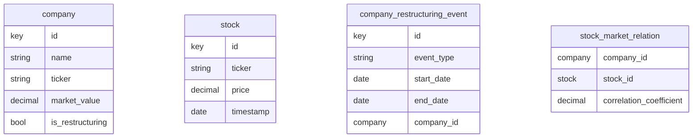
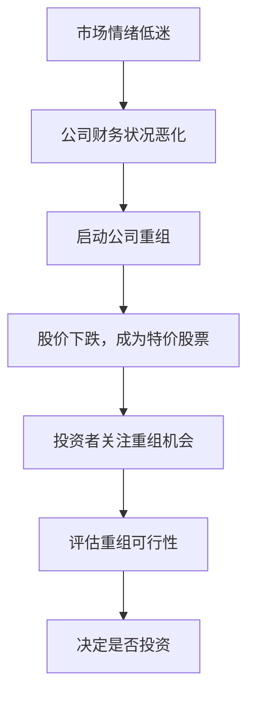
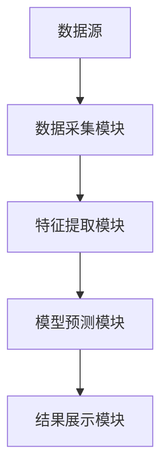

                 


# 特价股票与公司重组机会的关系

## 关键词：特价股票、公司重组、投资机会、时间序列分析、机器学习模型、系统架构设计

## 摘要：  
本文探讨特价股票与公司重组机会之间的关系，分析特价股票的定义、特点及公司重组的类型，深入解析两者之间的关联性。通过时间序列分析和机器学习模型（如LSTM和逻辑回归）预测特价股票价格波动，并评估公司重组机会。同时，设计一个基于这些模型的投资决策支持系统，提供实际案例分析和系统架构设计，帮助投资者识别和把握投资机会。

---

# 第一部分：背景介绍

## 第1章：特价股票与公司重组机会的背景

### 1.1 特价股票的定义与特点

#### 1.1.1 特价股票的定义  
特价股票是指价格显著低于市场平均水平的股票，通常反映市场对公司的负面情绪或估值过低的情况。

#### 1.1.2 特价股票的特点  
| 特点 | 描述 |
|------|------|
| 低估值 | 股价低于内在价值 |
| 高波动性 | 股价波动剧烈 |
| 市场情绪 | 市场情绪低迷时出现较多 |

#### 1.1.3 特价股票的分类  
1. **超跌股**：股价因市场情绪下跌而被低估的股票。  
2. **重组股**：公司正在进行重组或潜在重组的股票。  
3. **业绩股**：因业绩不佳导致股价被低估的股票。  

### 1.2 公司重组的定义与类型

#### 1.2.1 公司重组的定义  
公司重组是指通过调整资产、负债、股权结构或业务模式，以改善财务状况、提高效率或恢复 profitability 的过程。

#### 1.2.2 公司重组的类型  
| 类型 | 描述 |
|------|------|
| 股权重组 | 调整股权结构 |
| 资产重组 | 处置或收购资产 |
| 债务重组 | 优化债务结构 |
| 业务重组 | 调整业务模式 |

#### 1.2.3 公司重组的目的与动机  
1. 提高效率和 profitability。  
2. 应对财务危机或债务压力。  
3. 战略调整或多元化发展。  

### 1.3 特价股票与公司重组机会的关系

#### 1.3.1 特价股票与公司重组的关联性  
- 特价股票往往出现在公司面临重组或财务困境时。  
- 公司重组可能带来股价反弹或反转的机会。  

#### 1.3.2 公司重组对股价的影响  
- 短期：股价可能因市场预期而波动。  
- 中期：重组成功可能带来股价上涨。  
- 长期：取决于重组后的经营状况。  

#### 1.3.3 特价股票的投资机会分析  
- 特价股票可能隐藏投资机会，但需谨慎评估公司重组的可行性。  

---

## 第2章：特价股票与公司重组的核心概念

### 2.1 特价股票的核心要素

#### 2.1.1 市场供需关系  
- 特价股票的供需关系受市场情绪影响较大。  

#### 2.1.2 市场情绪分析  
- 市场情绪低迷时，更多特价股票出现。  

#### 2.1.3 股价波动机制  
- 特价股票的波动性较高，受突发事件影响较大。  

### 2.2 公司重组的核心要素

#### 2.2.1 财务状况分析  
- 公司财务状况是判断重组成功的关键因素。  

#### 2.2.2 经营战略调整  
- 重组后的战略调整影响公司未来 performance。  

#### 2.2.3 重组后的市场表现  
- 成功重组可能带来股价上涨，失败重组可能导致股价继续下跌。  

### 2.3 特价股票与公司重组的关系图解

#### 2.3.1 特价股票与公司重组的ER实体关系图  


#### 2.3.2 特价股票与公司重组的流程图  


---

## 第3章：算法原理讲解

### 3.1 时间序列分析

#### 3.1.1 时间序列分析的定义  
时间序列分析是一种通过历史数据预测未来趋势的方法。  

#### 3.1.2 时间序列分析的步骤  
1. 数据收集与预处理。  
2. 模型选择与训练。  
3. 模型预测与评估。  

#### 3.1.3 时间序列分析的数学模型  
- **ARIMA模型**：用于捕捉时间序列的趋势和季节性变化。  
  $$ ARIMA(p, d, q) $$  
- **LSTM模型**：用于处理复杂的时间序列数据。  

### 3.2 机器学习模型

#### 3.2.1 基于LSTM的股票价格预测模型  
```python
import numpy as np
from tensorflow.keras.models import Sequential
from tensorflow.keras.layers import LSTM, Dense

# 数据预处理
def preprocess(data):
    # 标准化处理
    return (data - np.mean(data)) / np.std(data)

# LSTM模型
model = Sequential()
model.add(LSTM(50, input_shape=(timesteps, features)))
model.add(Dense(1))
model.compile(optimizer='adam', loss='mean_squared_error')
```

---

## 第4章：数学模型与公式

### 4.1 时间序列分析模型

#### 4.1.1 ARIMA模型  
$$ ARIMA(p, d, q) $$  

#### 4.1.2 LSTM模型  
$$ LSTM(timesteps, features) $$  

### 4.2 逻辑回归模型  
$$ P(restructuring) = \frac{1}{1 + e^{-(\beta_0 + \beta_1 x_1 + \dots + \beta_n x_n)}} $$  

---

## 第5章：系统架构设计

### 5.1 投资决策支持系统架构

#### 5.1.1 系统功能设计  
- 数据采集模块：收集股票数据和公司重组信息。  
- 特征提取模块：提取影响股价的关键特征。  
- 模型预测模块：使用时间序列和机器学习模型预测股价和重组机会。  
- 结果展示模块：显示预测结果和投资建议。  

#### 5.1.2 系统架构图  


---

## 第6章：项目实战

### 6.1 环境安装

```bash
pip install numpy pandas tensorflow matplotlib
```

### 6.2 核心实现源代码

#### 6.2.1 数据预处理  
```python
import pandas as pd
import numpy as np

def load_data(ticker):
    df = pd.read_csv(f'data/{ticker}.csv')
    return df['Close'].values
```

#### 6.2.2 模型训练  
```python
import tensorflow as tf
from tensorflow.keras.models import Sequential
from tensorflow.keras.layers import LSTM, Dense

def build_model(input_shape):
    model = Sequential()
    model.add(LSTM(50, input_shape=input_shape))
    model.add(Dense(1))
    return model

# 训练模型
model = build_model((timesteps, features))
model.compile(optimizer='adam', loss='mean_squared_error')
model.fit(x_train, y_train, epochs=10, batch_size=32)
```

#### 6.2.3 模型预测  
```python
def predict_price(model, x_test):
    predictions = model.predict(x_test)
    return predictions
```

### 6.3 实证分析与案例解读  
以某公司为例，展示如何基于模型预测特价股票价格波动，并评估公司重组机会。  

### 6.4 项目小结  
总结项目实现的关键点和注意事项。

---

## 第7章：最佳实践

### 7.1 小结  
- 特价股票与公司重组机会密切相关，需谨慎评估。  

### 7.2 注意事项  
- 投资者需关注公司基本面和重组可行性。  
- 模型预测结果仅供参考，需结合市场动态调整。  

### 7.3 拓展阅读  
- 推荐阅读相关金融分析书籍和论文。  

---

## 附录：代码与数据源  
提供完整的代码和数据源，帮助读者复现实验。  

---

以上为《特价股票与公司重组机会的关系》的技术博客文章的详细目录和内容框架。

