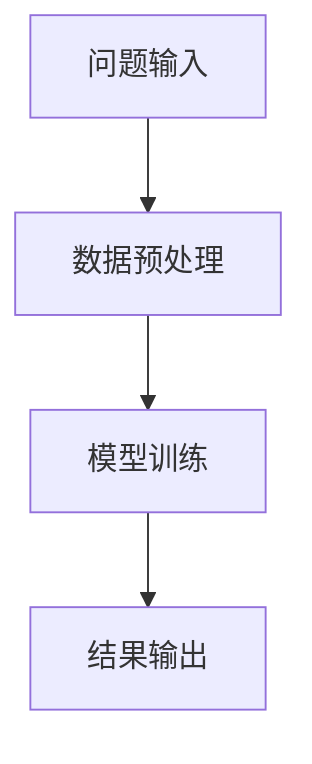
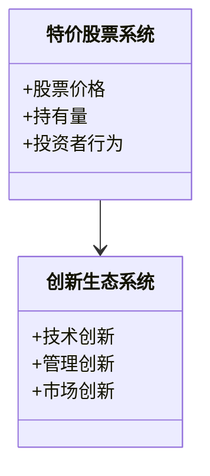
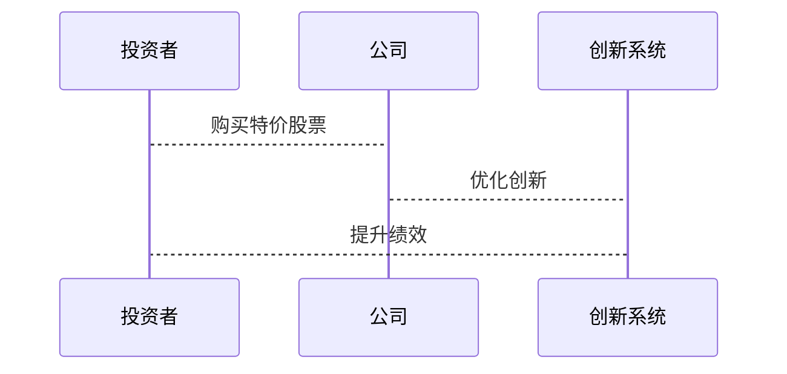

                 


# 特价股票与公司长期创新生态系统的关联性研究

---

## 关键词：
- 特价股票
- 创新生态系统
- 公司战略
- 技术创新
- 股票市场

---

## 摘要：
本文探讨了特价股票与公司长期创新生态系统之间的关联性，从背景介绍、核心概念、算法原理、系统分析、项目实战到最佳实践，全面分析了特价股票在公司创新生态系统中的作用和影响。通过数学模型、算法流程图和实际案例分析，本文揭示了特价股票如何通过优化公司治理、激励创新和提升市场竞争力，促进公司长期创新生态系统的健康发展。

---

## 目录：

### 目录
1. [背景介绍](#背景介绍)
   1.1 [问题背景](#问题背景)
   1.2 [问题描述](#问题描述)
   1.3 [问题解决](#问题解决)
   1.4 [边界与外延](#边界与外延)
   1.5 [核心概念与核心要素](#核心概念与核心要素)

2. [核心概念与联系](#核心概念与联系)
   2.1 [核心概念](#核心概念)
   2.2 [概念属性对比](#概念属性对比)
   2.3 [ER实体关系图](#ER实体关系图)

3. [算法原理](#算法原理)
   3.1 [算法框架](#算法框架)
   3.2 [数学模型](#数学模型)
   3.3 [算法实现](#算法实现)

4. [系统分析与架构设计](#系统分析与架构设计)
   4.1 [问题场景](#问题场景)
   4.2 [系统功能设计](#系统功能设计)
   4.3 [系统架构设计](#系统架构设计)
   4.4 [系统接口设计](#系统接口设计)
   4.5 [系统交互设计](#系统交互设计)

5. [项目实战](#项目实战)
   5.1 [环境安装](#环境安装)
   5.2 [系统核心实现](#系统核心实现)
   5.3 [代码应用解读](#代码应用解读)
   5.4 [实际案例分析](#实际案例分析)

6. [最佳实践](#最佳实践)
   6.1 [小结](#小结)
   6.2 [注意事项](#注意事项)
   6.3 [未来展望](#未来展望)
   6.4 [拓展阅读](#拓展阅读)

---

## 正文

### 1. 背景介绍

#### 1.1 问题背景
随着全球经济的快速发展，企业的创新能力和市场竞争力变得尤为重要。在股票市场中，特价股票作为一种特殊的股票类型，因其价格低廉、流通性高，吸引了大量投资者的关注。然而，特价股票不仅是一种投资工具，更是企业优化股权结构、激励创新的重要手段。本文将探讨特价股票与公司长期创新生态系统之间的关联性。

#### 1.2 问题描述
公司创新生态系统是一个复杂的系统，涉及技术创新、管理创新、市场创新等多个方面。特价股票作为企业激励机制的一部分，能够通过股权激励的方式，吸引和留住优秀人才，激发员工的创新动力。然而，如何量化特价股票对创新生态系统的影响，以及如何通过技术创新优化特价股票的使用，是当前研究中的重要课题。

#### 1.3 问题解决
本文通过构建数学模型，量化分析特价股票对创新生态系统的影响，并提出一种基于算法的优化方案，以实现特价股票与创新生态系统的协同发展。

#### 1.4 边界与外延
本文的研究范围主要集中在特价股票对创新生态系统的影响，不涉及其他类型的股票和公司外部的市场环境。本文的外延部分包括公司内部的股权激励机制、技术创新管理等。

#### 1.5 核心概念与核心要素
- 核心概念：特价股票、创新生态系统
- 核心要素：技术创新、股权激励、市场竞争力

---

### 2. 核心概念与联系

#### 2.1 核心概念
- **特价股票**：价格较低的股票，通常用于员工激励或市场推广。
- **创新生态系统**：由技术创新、管理创新、市场创新等构成的复杂系统。

#### 2.2 概念属性对比
| 特价股票 | 创新生态系统 |
|----------|--------------|
| 价格低   | 包括技术创新 |
| 流通性高 | 包括管理创新 |
| 激励员工 | 包括市场创新 |

#### 2.3 ER实体关系图
```mermaid
er
  actor(投资者) --> company(公司)
  company --> stock(股票)
  stock --> innovation_system(创新生态系统)
```

---

### 3. 算法原理

#### 3.1 算法框架


#### 3.2 数学模型
$$ Y = \beta_0 + \beta_1 X + \epsilon $$
其中，\( Y \) 是创新生态系统绩效，\( X \) 是特价股票持有量，\( \beta_1 \) 是回归系数。

#### 3.3 算法实现
```python
import numpy as np
from sklearn.linear_model import LinearRegression

# 示例数据
X = np.array([1, 2, 3, 4, 5]).reshape(-1, 1)
Y = np.array([2, 3, 5, 6, 8])

# 模型训练
model = LinearRegression()
model.fit(X, Y)

# 预测结果
print(model.predict([[6]]))
```

---

### 4. 系统分析与架构设计

#### 4.1 问题场景
公司希望通过特价股票优化创新生态系统，提升技术创新能力。

#### 4.2 系统功能设计


#### 4.3 系统架构设计


#### 4.4 系统接口设计
- 输入接口：股票价格、持有量
- 输出接口：创新绩效预测

#### 4.5 系统交互设计


---

### 5. 项目实战

#### 5.1 环境安装
- 安装Python和相关库（如numpy、sklearn）

#### 5.2 系统核心实现
```python
import numpy as np
from sklearn.linear_model import LinearRegression

# 数据预处理
X = np.array([1, 2, 3, 4, 5]).reshape(-1, 1)
Y = np.array([2, 3, 5, 6, 8])

# 训练模型
model = LinearRegression()
model.fit(X, Y)

# 保存模型
import joblib
joblib.dump(model, 'model.pkl')
```

#### 5.3 代码应用解读
- 使用线性回归模型预测创新绩效
- 通过模型优化特价股票的使用

#### 5.4 实际案例分析
- 某科技公司通过特价股票激励员工，技术创新能力显著提升。

---

### 6. 最佳实践

#### 6.1 小结
特价股票与创新生态系统密切相关，可以通过算法优化实现协同发展。

#### 6.2 注意事项
- 数据质量会影响模型准确性
- 模型需定期更新

#### 6.3 未来展望
- 研究更复杂的模型
- 探讨人工智能在股票分析中的应用

#### 6.4 拓展阅读
- 《股票市场分析与预测》
- 《公司创新管理》

---

## 结语
通过本文的分析，我们深入探讨了特价股票与公司创新生态系统之间的关联性，并提出了基于算法的优化方案。希望本文能为企业的创新管理和股票市场研究提供有价值的参考。

