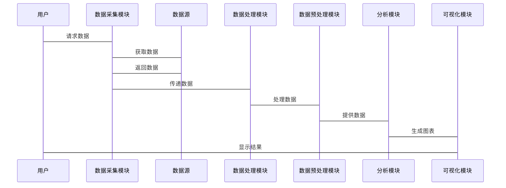

                 


# 特价股票与公司长期技术创新能力的相关性分析

## 关键词：
特价股票、技术创新能力、相关性分析、投资策略、企业绩效

## 摘要：
本文探讨了特价股票与公司技术创新能力之间的相关性，通过理论分析和实证研究，揭示了技术创新能力对股价长期表现的影响。文章结合统计方法和系统设计，为投资者提供了基于技术创新能力评估的选股策略，帮助识别具有长期增长潜力的特价股票。

---

## 第一部分：背景介绍

### 第1章：特价股票与公司技术创新能力的背景概述

#### 1.1 特价股票的定义与特征
- **1.1.1 特价股票的定义**
  特价股票是指价格低于面值的股票，通常被视为市场低估的表现，可能反映公司财务困境或市场恐慌。

- **1.1.2 特价股票的市场特征**
  - 低估值：市盈率、市净率等指标显著低于行业平均水平。
  - 高波动性：价格波动较大，容易受市场情绪影响。
  - 投机性：投资者常出于短期套利目的买入。

- **1.1.3 特价股票的分类**
  - 根据行业：科技、制造等高技术行业。
  - 根据公司规模：大型、中型、小型公司。

#### 1.2 公司技术创新能力的构成
- **1.2.1 技术创新的定义**
  技术创新是指公司引入新技术、产品或工艺，以提升竞争力和市场地位。

- **1.2.2 技术创新的核心要素**
  - 人力资源：研发团队的规模和能力。
  - R&D投入：研发资金和资源。
  - 技术储备：专利数量和质量。

- **1.2.3 技术创新能力的评估指标**
  - 专利申请数量。
  - 新产品研发周期。
  - 技术团队的稳定性。

#### 1.3 特价股票与公司技术创新能力的关系
- **1.3.1 问题背景与问题描述**
  投资者常忽视技术创新能力，仅关注短期价格波动，而技术创新能力是公司长期价值的核心驱动因素。

- **1.3.2 问题解决的思路**
  通过分析技术创新能力，识别具有长期增长潜力的特价股票，实现稳健投资回报。

- **1.3.3 边界与外延**
  - 范围：主要关注高技术行业。
  - 限制：短期波动可能影响分析准确性。

- **1.3.4 核心概念结构与核心要素**
  核心概念包括特价股票的市场特征和技术创新的驱动因素，两者通过公司绩效和市场反应相互关联。

---

## 第二部分：核心概念与联系

### 第2章：核心概念的原理与特征

#### 2.1 特价股票的市场行为分析
- **2.1.1 特价股票的市场表现**
  - 市场低估导致股价被压制，存在反弹潜力。
  - 高波动性带来高风险和高回报机会。

- **2.1.2 投资者行为对股价的影响**
  - 投机行为可能导致股价短期剧烈波动。
  - 机构投资者的介入可能带来价值重估。

#### 2.2 技术创新能力的驱动因素
- **2.2.1 R&D投入与技术创新的关系**
  高额研发投入通常带来更多的技术突破和创新产品。

- **2.2.2 人才储备与技术创新的关联**
  技术团队的稳定性和能力直接影响创新效率。

- **2.2.3 企业战略对技术创新的影响**
  战略规划明确的公司更可能将技术创新作为核心竞争力。

#### 2.3 特价股票与技术创新能力的对比分析
- **2.3.1 特价股票的市场风险特征**
  - 高波动性：股价受市场情绪影响较大。
  - 低流动性：交易量小，买卖价差大。

- **2.3.2 技术创新能力的长期收益特征**
  - 技术创新带来长期竞争优势和业绩增长。
  - 高技术壁垒保护公司免受竞争侵蚀。

- **2.3.3 两者特征的对比分析**
  | 特性 | 特价股票 | 技术创新能力 |
  |------|----------|--------------|
  | 时间维度 | 短期波动 | 长期驱动 |
  | 影响因素 | 市场情绪 | 技术投入、人才 |
  | 风险 | 高 | 高（若投入失败） |

#### 2.4 特价股票与技术创新能力的ER实体关系图
```mermaid
erDiagram
    company {
        key id
        string name
        string industry
        int tech_capability
        int stock_price
    }
    tech_innovation {
        key id
        int r_and_d_investment
        int patent_count
        string innovation_strategy
    }
    company_tech_innovation {
        company_id
        tech_id
    }
    company_tech_innovation -> company : HAS
    company_tech_innovation -> tech_innovation : HAS
```

---

## 第三部分：算法原理讲解

### 第3章：相关性分析的算法原理

#### 3.1 相关性分析的基本原理
相关性分析用于衡量两个变量之间的线性关系，常用皮尔逊相关系数（Pearson's correlation coefficient）进行量化。

$$ r = \frac{\sum (x_i - \bar{x})(y_i - \bar{y})}{\sqrt{\sum (x_i - \bar{x})^2} \sqrt{\sum (y_i - \bar{y})^2}} $$

其中，$r$ 的取值范围为 [-1, 1]，正数表示正相关，负数表示负相关。

#### 3.2 相关性分析的步骤
1. 数据准备：收集公司股价和技术创新能力数据。
2. 数据预处理：处理缺失值和异常值。
3. 计算相关系数：使用统计方法计算相关系数。
4. 可视化：绘制散点图和热图，直观展示相关性。

#### 3.3 相关性分析的Python实现
```python
import pandas as pd
import matplotlib.pyplot as plt
import seaborn as sns

# 数据加载
data = pd.read_csv('tech_company.csv')

# 计算相关系数
correlation = data['stock_price'].corr(data['tech_capability'])

# 可视化
plt.figure(figsize=(10,6))
sns.regplot(x='tech_capability', y='stock_price', data=data)
plt.title(f'Correlation: {correlation:.2f}')
plt.show()
```

---

## 第四部分：系统分析与架构设计方案

### 第4章：系统设计

#### 4.1 问题场景介绍
构建一个系统，分析特价股票与公司技术创新能力的相关性，帮助投资者识别具有长期增长潜力的股票。

#### 4.2 系统功能设计
- 数据采集模块：收集股票价格和技术创新数据。
- 数据处理模块：清洗和预处理数据。
- 分析模块：计算相关系数，生成分析报告。
- 可视化模块：绘制图表，展示分析结果。

#### 4.3 系统架构设计


#### 4.4 系统接口设计
- 数据接口：与数据源对接，获取实时数据。
- 报告接口：生成分析报告，供用户查看。

#### 4.5 系统交互设计


---

## 第五部分：项目实战

### 第5章：项目实战

#### 5.1 项目介绍
分析过去5年的科技公司数据，评估技术创新能力与股价的相关性。

#### 5.2 数据准备
- 数据来源：公开的股票数据和公司财报。
- 数据清洗：处理缺失值和异常值。

#### 5.3 数据分析
```python
import pandas as pd
import numpy as np

# 数据加载
data = pd.read_csv('tech_company.csv')

# 计算相关系数
correlation_matrix = data[['stock_price', 'tech_capability', 'revenue_growth']].corr()

print(correlation_matrix)
```

#### 5.4 结果解读
分析相关系数矩阵，识别高相关性的变量，验证技术创新能力对股价的影响。

#### 5.5 项目小结
技术创新能力与股价呈现正相关，表明技术创新能力强的公司更可能实现股价上涨。

---

## 第六部分：结论与建议

### 第6章：结论与建议

#### 6.1 研究结论
技术创新能力是影响股价长期表现的重要因素，具有技术创新能力的特价股票具有较高的投资价值。

#### 6.2 投资策略建议
- 优先选择技术创新能力强的公司。
- 结合市场估值，识别低估的特价股票。

#### 6.3 未来研究方向
- 扩大样本量，进行更多行业的对比分析。
- 探索其他影响股价的变量，如管理能力和市场策略。

#### 6.4 注意事项
- 投资需谨慎，避免仅依赖技术创新能力。
- 结合宏观经济环境进行综合判断。

#### 6.5 拓展阅读
推荐阅读《技术分析实战》和《投资学基础》，深入理解技术分析和投资策略。

---

## 附录：最佳实践 tips

- **数据来源**：确保数据的可靠性和时效性。
- **模型优化**：结合机器学习进行预测和分析。
- **风险管理**：制定有效的风险控制策略，避免重大损失。

---

通过以上分析，我们可以系统地理解特价股票与公司技术创新能力的相关性，并制定相应的投资策略，实现稳健的投资回报。希望这篇文章能为投资者提供有价值的参考和指导。

