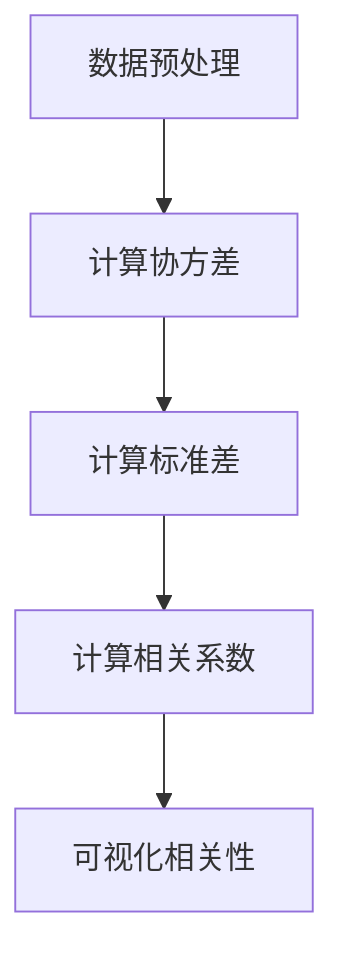
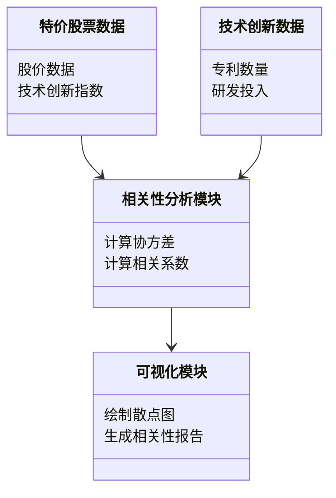
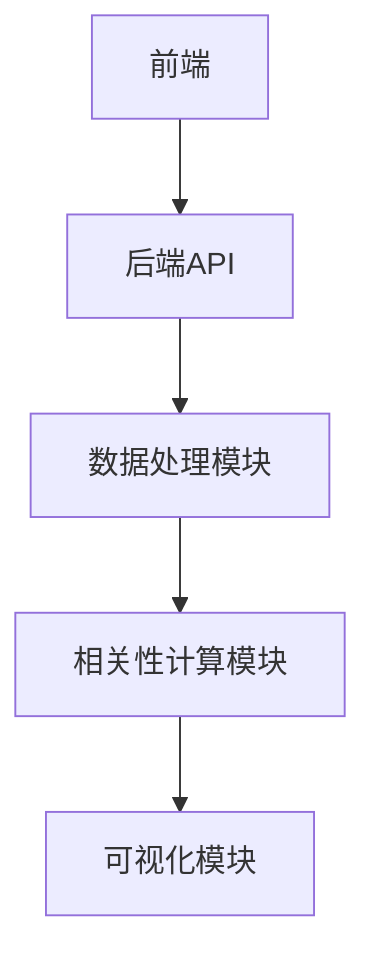

                 


# 特价股票与公司长期技术融合创新生态系统的相关性分析

## 关键词：特价股票，技术创新生态系统，相关性分析，算法原理，系统架构

## 摘要：本文系统性地分析了特价股票与公司长期技术融合创新生态系统之间的相关性。通过背景介绍、核心概念分析、算法原理、系统架构设计、项目实战和最佳实践等多维度的深入探讨，揭示了技术创新对公司股价的潜在影响，并提出了基于数学建模和系统工程的方法，为投资者和企业管理者提供了科学的决策参考。

---

## 第一部分：背景介绍

### 第1章：特价股票与公司长期技术融合创新生态系统概述

#### 1.1 特价股票的定义与特点

- **1.1.1 特价股票的定义**  
  特价股票是指价格相对较低的股票，通常属于小盘股或处于成长期的企业。这类股票具有较高的波动性和潜在的高回报率，但也伴随着较高的风险。

- **1.1.2 特价股票的特点**  
  - 价格低：通常在10元以下，适合中小投资者。  
  - 波动性高：容易受到市场情绪和技术面因素的影响。  
  - 成长潜力大：许多技术创新型公司早期可能以低价股形式上市。

- **1.1.3 特价股票的投资价值**  
  特价股票可能隐藏着高成长性的公司，尤其是那些在技术创新领域具备潜力的企业。通过长期持有，这类股票可能带来超额收益。

#### 1.2 公司长期技术融合创新生态系统的定义与构成

- **1.2.1 技术融合创新的定义**  
  技术融合创新是指将不同领域的技术进行整合，形成新的商业模式、产品或服务。例如，人工智能与传统产业的结合。

- **1.2.2 创新生态系统的构成要素**  
  - 核心技术：企业的核心专利和技术储备。  
  - 创新文化：企业的研发投入、人才储备和创新能力。  
  - 产业链协同：与上下游企业的合作和资源整合。  
  - 市场反馈：用户需求和技术应用的市场验证。

- **1.2.3 技术融合创新与公司长期发展的关系**  
  技术融合创新是公司长期发展的核心驱动力。通过技术创新，企业能够提升竞争力、降低成本，并开拓新的市场。

#### 1.3 特价股票与公司技术创新生态系统的关系

- **1.3.1 问题背景**  
  特价股票的波动性和不确定性较高，但技术创新能力强的公司可能在长期实现股价增长。

- **1.3.2 问题描述**  
  如何量化技术创新对公司股价的影响？技术创新能力强的公司是否能成为长期投资的优质标的？

- **1.3.3 问题解决**  
  通过相关性分析，量化技术创新与股价之间的关系，为投资者提供决策依据。

- **1.3.4 边界与外延**  
  - 时间范围：中长期（3-5年）的技术创新与股价变化关系。  
  - 数据范围：技术创新能力强的公司样本。

- **1.3.5 核心要素组成**  
  - 技术创新能力：研发投入、专利数量、技术创新速度。  
  - 股价表现：股价波动、市盈率、市值变化。

---

## 第二部分：核心概念与联系

### 第2章：特价股票与技术创新生态系统的核心概念分析

#### 2.1 核心概念原理

- **技术创新生态系统的核心属性**  
  技术创新生态系统是一个动态的网络结构，包含企业、研发机构、供应商、用户等多方参与者，通过技术协作实现创新。

- **特价股票的核心属性**  
  特价股票的价格波动反映了市场对技术创新能力的预期。

#### 2.2 核心概念属性特征对比

| 属性       | 特价股票             | 技术创新生态系统         |
|------------|----------------------|--------------------------|
| 定义       | 价格低的股票         | 技术融合的创新网络       |
| 核心驱动   | 市场情绪和估值修复   | 技术研发和资源整合       |
| 风险特征   | 高波动性             | 高不确定性               |
| 长期价值   | 技术驱动的潜在收益   | 创新驱动的持续增长       |

#### 2.3 ER实体关系图架构

```mermaid
er
  actor(投资者)
  company(公司)
 技术创新(技术创新)
 专利(Patent)
  research(研发投入)
  market(市场反馈)
 
 公司 -->抽样技术创新
 技术创新 -->关联专利
 投资者 <--->公司
 公司 -->关联研发投入
 公司 <--->市场反馈
```

---

## 第三部分：算法原理讲解

### 第3章：相关性分析算法原理

#### 3.1 算法原理概述

- **相关性分析**  
  通过协方差和相关系数量化技术创新与股价之间的关系。

- **数学模型**  
  相关系数公式：  
  $$ r_{xy} = \frac{\text{cov}(x,y)}{\sigma_x \sigma_y} $$  
  其中，$\text{cov}(x,y)$ 是协方差，$\sigma_x$ 和 $\sigma_y$ 是标准差。

#### 3.2 算法流程



#### 3.3 Python代码实现

```python
import numpy as np
import pandas as pd
import matplotlib.pyplot as plt

# 示例数据：技术创新指数与股价数据
tech_innovation = np.array([2.5, 3.0, 2.8, 3.5, 4.0])
stock_prices = np.array([10, 12, 11, 14, 15])

# 计算协方差
covariance = np.cov(tech_innovation, stock_prices)[0, 1]
print("协方差:", covariance)

# 计算标准差
std_tech = np.std(tech_innovation)
std_stock = np.std(stock_prices)
print("技术创新标准差:", std_tech)
print("股价标准差:", std_stock)

# 计算相关系数
correlation = covariance / (std_tech * std_stock)
print("相关系数:", correlation)

# 可视化
plt.scatter(tech_innovation, stock_prices)
plt.xlabel('技术创新指数')
plt.ylabel('股价')
plt.title('技术创新与股价相关性')
plt.show()
```

#### 3.4 算法应用与案例分析

- **案例分析**  
  假设某技术创新型公司的技术创新指数与股价呈正相关，相关系数为0.8，说明技术创新对股价有显著影响。

---

## 第四部分：系统分析与架构设计

### 第4章：系统分析与架构设计方案

#### 4.1 问题场景介绍

- **场景描述**  
  分析技术创新型公司的技术创新能力与股价之间的相关性。

- **项目介绍**  
  构建一个基于技术创新能力评估的股价预测系统。

#### 4.2 系统功能设计



#### 4.3 系统架构设计



#### 4.4 接口设计

- **API接口**  
  - 输入：技术创新数据、股价数据  
  - 输出：相关性分析结果

#### 4.5 交互设计

```mermaid
sequenceDiagram
    用户 --> 提交数据
    操作系统 --> 调用API
    相关性分析模块 --> 返回相关系数
    可视化模块 --> 显示结果
```

---

## 第五部分：项目实战

### 第5章：项目实战与分析

#### 5.1 环境安装

- **Python环境**  
  安装必要的库：numpy、pandas、matplotlib。

#### 5.2 核心代码实现

```python
import numpy as np
import pandas as pd
import matplotlib.pyplot as plt

# 数据加载
tech_data = pd.read_csv('tech.csv')
stock_data = pd.read_csv('stock.csv')

# 数据预处理
tech_innovation = tech_data['创新指数'].values
stock_prices = stock_data['股价'].values

# 相关性计算
covariance = np.cov(tech_innovation, stock_prices)[0, 1]
std_tech = np.std(tech_innovation)
std_stock = np.std(stock_prices)
correlation = covariance / (std_tech * std_stock)

# 可视化
plt.scatter(tech_innovation, stock_prices)
plt.xlabel('技术创新指数')
plt.ylabel('股价')
plt.title(f'相关系数: {correlation:.2f}')
plt.show()
```

#### 5.3 案例分析与解读

- **案例分析**  
  假设某公司技术创新指数与股价的相关系数为0.85，说明技术创新能力对其股价有显著的正向影响。

---

## 第六部分：最佳实践与总结

### 第6章：最佳实践与总结

#### 6.1 最佳实践

- **投资建议**  
  - 选择技术创新能力强的公司。  
  - 结合市场环境和公司基本面进行综合判断。  
  - 长期投资，避免短期波动干扰。

- **技术创新建议**  
  - 加大研发投入，提升核心竞争力。  
  - 优化创新生态系统，实现资源整合和协同发展。

#### 6.2 小结

本文通过相关性分析，揭示了技术创新能力对股价的潜在影响，为投资者和企业管理者提供了科学的决策依据。

#### 6.3 注意事项

- 数据质量：确保技术创新数据和股价数据的准确性和完整性。  
- 模型局限：相关性分析仅反映变量之间的关联，不等于因果关系。  
- 风险提示：投资需谨慎，市场波动不可预测。

#### 6.4 拓展阅读

- 《技术融合与企业创新》  
- 《相关性分析在金融中的应用》  
- 《系统架构设计方法论》

---

以上是《特价股票与公司长期技术融合创新生态系统的相关性分析》的目录大纲和具体内容框架，希望对您有所帮助！

