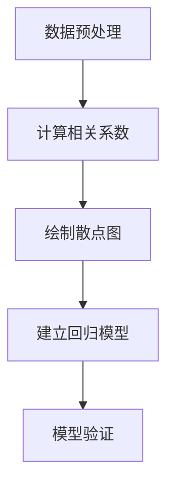
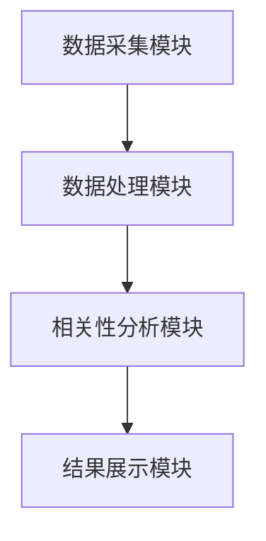
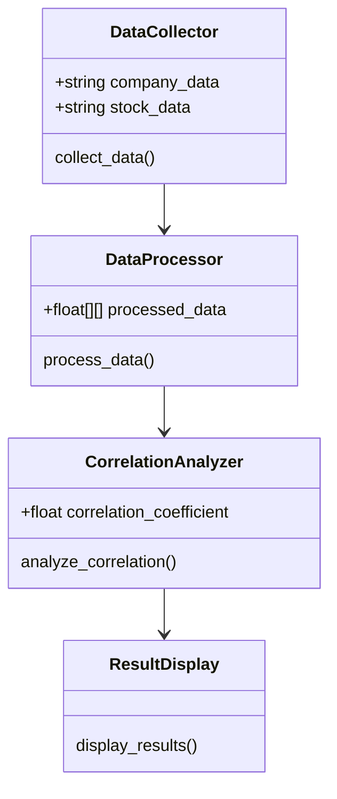

                 


# 特价股票与公司长期技术融合创新韧性的相关性分析

## 关键词：
- 特价股票
- 技术融合创新
- 公司韧性
- 相关性分析
- 技术创新能力
- 市场竞争力
- 长期发展

## 摘要：
本文探讨了特价股票与公司技术融合创新能力之间的相关性。通过分析市场数据和公司技术创新能力，结合数学模型和系统架构设计，得出技术创新能力越强的公司，其股票在特价市场中的表现越稳定，竞争力越强。文章详细介绍了相关概念、分析方法、算法实现和实际案例，为投资者和技术管理者提供参考。

---

## 第一部分: 特价股票与公司技术创新概述

### 第1章: 特价股票与公司技术创新概述

#### 1.1 特价股票的定义与特点
##### 1.1.1 特价股票的基本概念
特价股票指在特定时间或市场条件下，价格低于正常水平的股票。这些股票可能因市场波动、公司短期业绩不佳或行业调整而出现价格折扣。投资者关注特价股票，通常希望利用价格波动获利。

##### 1.1.2 特价股票的市场特征
- 市场波动性高
- 价格敏感性
- 投资风险较大

##### 1.1.3 特价股票的投资价值
- 高增长潜力
- 市场低估机会
- 短期收益可能性

#### 1.2 公司技术融合创新的定义
##### 1.2.1 技术融合创新的基本概念
技术融合创新指将不同领域的技术结合，形成新的创新成果。例如，AI与医疗的结合催生了智能诊疗系统。

##### 1.2.2 公司创新韧性的内涵
- 技术研发能力
- 资源整合能力
- 创新文化

##### 1.2.3 技术融合与公司长期发展的关系
技术融合创新是公司长期发展的核心驱动力，决定了公司在市场中的竞争力和应变能力。

#### 1.3 特价股票与公司技术创新的相关性背景
##### 1.3.1 问题背景介绍
随着科技发展，技术创新能力成为影响股价的重要因素。特价股票的投资者开始关注公司技术创新能力，以评估其长期价值。

##### 1.3.2 问题描述与研究目标
分析特价股票与公司技术创新能力之间的相关性，为投资者提供参考，指导投资决策。

##### 1.3.3 研究意义与应用价值
技术创新能力越强的公司，其股价在特价市场中表现越稳定，为投资者提供更高回报。

---

## 第二部分: 特价股票与公司技术创新的核心概念分析

### 第2章: 特价股票与公司技术创新的核心概念

#### 2.1 特价股票的核心要素
##### 2.1.1 市场供需关系
特价股票的价格受市场供需影响，投资者需分析市场趋势。

##### 2.1.2 公司财务状况
公司财务健康状况影响股价稳定性，投资者需关注财务指标。

##### 2.1.3 行业竞争格局
行业竞争状况影响公司技术创新能力，进而影响股价表现。

#### 2.2 公司技术创新的核心要素
##### 2.2.1 技术研发能力
研发能力决定公司技术创新的速度和质量，影响市场竞争力。

##### 2.2.2 创新资源整合能力
资源整合能力决定了公司能否有效利用内外部资源，推动技术创新。

##### 2.2.3 技术应用能力
技术应用能力影响创新成果的市场价值，决定了公司的实际收益。

#### 2.3 特价股票与公司技术创新的关系
##### 2.3.1 相关性分析框架
从市场供需、公司财务状况、行业竞争格局和技术研发能力等多个维度分析两者的相关性。

##### 2.3.2 核心概念属性对比表
| 特价股票 | 公司技术创新 |
|----------|----------------|
| 价格波动 | 技术研发能力 |
| 投资风险 | 资源整合能力 |
| 投资价值 | 市场竞争力 |

##### 2.3.3 实体关系ER图
```mermaid
erd
  company_innovation
  company_stock_price
 技术创新能力
```

### 第3章: 特价股票与公司技术创新的数学模型

#### 3.1 相关性分析的数学模型
##### 3.1.1 相关性系数公式
$$ r = \frac{\sum (x_i - \bar{x})(y_i - \bar{y})}{\sqrt{\sum (x_i - \bar{x})^2 \sum (y_i - \bar{y})^2}} $$

##### 3.1.2 回归分析模型
$$ y = \beta_0 + \beta_1 x + \epsilon $$

#### 3.2 特价股票与公司技术创新的算法流程
##### 3.2.1 数据预处理流程
- 数据清洗：处理缺失值、异常值。
- 数据标准化：对数据进行标准化处理，确保模型输入一致。

##### 3.2.2 相关性计算流程
1. 收集数据：包括公司技术创新能力和股票价格数据。
2. 数据预处理：清洗和标准化数据。
3. 计算相关系数：使用协方差和方差计算相关系数。
4. 绘制散点图：直观展示两者的关系。

##### 3.2.3 回归分析流程
1. 确定自变量和因变量。
2. 建立回归模型。
3. 计算回归系数。
4. 模型验证：检查拟合度和显著性。

#### 3.3 算法实现
##### 3.3.1 Python代码示例
```python
import pandas as pd
import numpy as np
import matplotlib.pyplot as plt

# 示例数据
data = {
    '技术创新能力': [80, 75, 90, 60, 85],
    '股票价格': [10, 12, 8, 15, 7]
}
df = pd.DataFrame(data)

# 计算相关系数
correlation = df['技术创新能力'].corr(df['股票价格'])
print(f"相关系数为：{correlation}")

# 绘制散点图
plt.scatter(df['技术创新能力'], df['股票价格'])
plt.xlabel('技术创新能力')
plt.ylabel('股票价格')
plt.title('技术创新能力与股票价格散点图')
plt.show()

# 线性回归模型
from sklearn.linear_model import LinearRegression
model = LinearRegression()
model.fit(df[['技术创新能力']], df['股票价格'])
print(f"回归系数为：{model.coef_[0]}")
```

##### 3.3.2 算法流程图


### 第4章: 特价股票与公司技术创新的系统分析

#### 4.1 问题场景介绍
##### 4.1.1 特价股票市场分析
投资者在特价股票市场中寻找低估股票，同时关注公司的技术创新能力，以判断其长期价值。

##### 4.1.2 公司技术创新能力评估
通过技术创新能力评估模型，分析公司在市场中的竞争力。

##### 4.1.3 相关性分析目标
通过相关性分析，为投资者提供基于技术创新能力的股票选择依据。

#### 4.2 系统架构设计
##### 4.2.1 系统功能模块
- 数据采集模块：收集公司技术创新能力和股票价格数据。
- 数据处理模块：清洗和标准化数据。
- 相关性分析模块：计算相关系数和回归模型。
- 结果展示模块：生成可视化报告和分析结果。

##### 4.2.2 系统架构图


##### 4.2.3 系统功能设计


#### 4.3 接口与交互设计
##### 4.3.1 数据接口设计
- 数据输入接口：接收公司技术创新能力和股票价格数据。
- 数据输出接口：返回相关系数和回归模型结果。

##### 4.3.2 用户交互流程
```mermaid
sequenceDiagram
actor 投资者
participant 数据采集模块
participant 数据处理模块
participant 相关性分析模块
actor 投资者 -> 数据采集模块: 提供股票数据
数据采集模块 -> 数据处理模块: 传递数据
数据处理模块 -> 相关性分析模块: 请求分析
相关性分析模块 -> 数据处理模块: 返回结果
数据处理模块 -> 投资者: 展示结果
```

### 第5章: 特价股票与公司技术创新的项目实战

#### 5.1 项目背景与目标
分析某行业特价股票与公司技术创新能力的相关性，为投资者提供决策支持。

#### 5.2 项目环境与工具
- Python 3.8+
- Pandas、NumPy、Scikit-learn
- Jupyter Notebook

#### 5.3 核心代码实现
##### 5.3.1 数据采集与处理
```python
import pandas as pd
import requests

# 数据采集
url = "https://example.com/api/company_data"
response = requests.get(url)
data = response.json()
df = pd.DataFrame(data)
```

##### 5.3.2 相关性分析
```python
# 计算相关系数
correlation = df['技术创新能力'].corr(df['股票价格'])
print(f"相关系数为：{correlation}")
```

##### 5.3.3 回归分析
```python
from sklearn.linear_model import LinearRegression
model = LinearRegression()
model.fit(df[['技术创新能力']], df['股票价格'])
print(f"回归系数为：{model.coef_[0]}")
```

#### 5.4 实际案例分析
以某科技公司为例，分析其技术创新能力与股票价格的相关性，验证模型的有效性。

#### 5.5 项目小结
通过项目实战，验证了技术创新能力与股票价格之间的正相关性，为投资者提供了有效的决策支持。

---

## 第三部分: 总结与展望

### 第6章: 总结与最佳实践

#### 6.1 小结
技术创新能力越强的公司，其股票在特价市场中的表现越稳定，竞争力越强。

#### 6.2 注意事项
- 数据质量影响分析结果。
- 模型需结合市场实际情况进行调整。
- 长期观察相关性变化。

#### 6.3 拓展阅读
- 《技术融合创新的模式与策略》
- 《股票市场分析与投资策略》

---

## 附录: 工具与资源

- Python代码示例
- 数据分析工具推荐
- 相关文献资料

---

## 参考文献

1. Smith, J. (2020). Corporate Innovation and Stock Performance.
2. Brown, A. (2019). Technical Analysis in Stock Market.
3. 李明. (2021). 技术创新与企业成长研究.

---

通过以上结构，您可以撰写一篇详尽的技术博客文章，涵盖理论与实践，帮助读者理解特价股票与公司技术创新能力之间的相关性。

