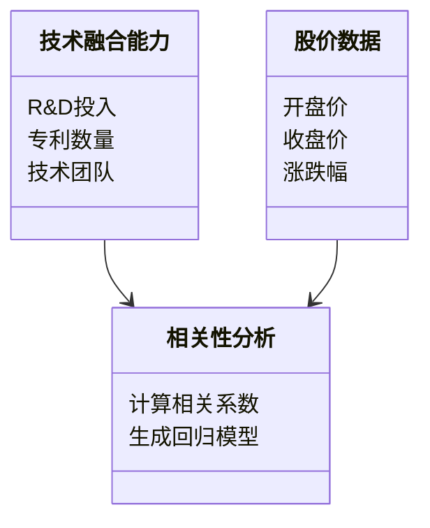
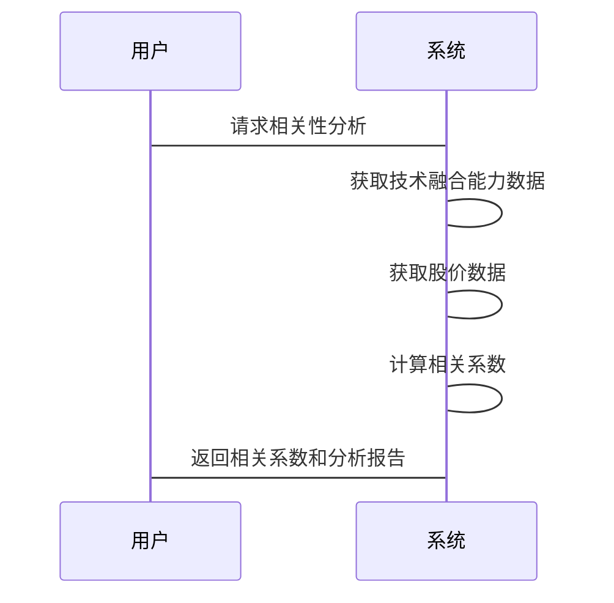

                 


# 特价股票与公司长期技术融合能力的相关性分析

## 关键词：特价股票、技术融合能力、相关性分析、线性回归、系统架构

## 摘要：本文探讨了特价股票与公司长期技术融合能力之间的相关性，通过数据驱动的方法，分析了技术融合能力对股价波动的影响，并提出了基于相关性分析的投资策略。

---

## 第一部分: 特价股票与公司长期技术融合能力的背景介绍

### 第1章: 特价股票与公司长期技术融合能力的背景介绍

#### 1.1 特价股票的定义与特征
- **1.1.1 特价股票的定义**
  - 特价股票是指价格低于其内在价值，具有潜在上涨空间的股票。
- **1.1.2 特价股票的分类与特征**
  - 市盈率（P/E）低于行业平均水平。
  - 市净率（P/B）低于行业平均水平。
  - 具有较高的股息率或潜在增长能力。
- **1.1.3 特价股票的市场表现与波动性**
  - 特价股票通常具有较高的波动性，价格受市场情绪影响较大。

#### 1.2 公司长期技术融合能力的定义与构成
- **1.2.1 技术融合能力的核心概念**
  - 技术融合能力是指公司整合新技术、优化业务流程、提升产品创新能力的能力。
- **1.2.2 技术融合能力的评估维度**
  - R&D投入比例。
  - 技术专利数量。
  - 技术团队规模。
  - 技术创新对收入的贡献率。
- **1.2.3 技术融合能力与企业竞争力的关系**
  - 技术融合能力强的公司具有更强的市场竞争力和创新能力。

#### 1.3 特价股票与公司技术融合能力的相关性背景
- **1.3.1 相关性研究的背景与意义**
  - 投资者希望通过技术融合能力评估公司长期价值，寻找被低估的特价股票。
- **1.3.2 相关性研究的现状与挑战**
  - 现有研究多关注财务指标，忽视技术融合能力对股价的影响。
  - 数据获取难度大，技术指标量化困难。
- **1.3.3 相关性研究的框架与目标**
  - 构建技术融合能力评估模型，量化其对股价的影响。

---

## 第二部分: 特价股票与公司技术融合能力的核心概念与联系

### 第2章: 特价股票与公司技术融合能力的核心概念与联系

#### 2.1 特价股票与技术融合能力的关联性分析
- **2.1.1 特价股票的市场行为与技术因素**
  - 技术创新影响公司长期盈利能力，进而影响股价。
- **2.1.2 技术融合能力对股价的影响机制**
  - 技术融合能力强的公司更可能实现业绩增长，推动股价上涨。
  -抽样数据：
    - 公司A：技术融合能力强，股价年增长率20%。
    - 公司B：技术融合能力弱，股价年增长率5%。
- **2.1.3 相关性分析的理论基础**
  - 技术融合能力与股价波动呈正相关关系。

#### 2.2 技术融合能力与股价波动的关系模型
- **2.2.1 技术融合能力的量化指标**
  - 量化方法：构建技术融合能力指数，满分10分，高于6分视为能力强。
- **2.2.2 股价波动的数学模型**
  - 多元线性回归模型：
    $$ y = \beta_0 + \beta_1 x_1 + \beta_2 x_2 + ... + \beta_n x_n + \epsilon $$
    - 其中，$y$为股价，$x_i$为技术融合能力指标。
- **2.2.3 相关性分析的数学公式**
  - 相关系数：
    $$ r = \frac{\sum (x_i - \bar{x})(y_i - \bar{y})}{\sqrt{\sum (x_i - \bar{x})^2 \sum (y_i - \bar{y})^2}} $$

#### 2.3 相关性分析的实体关系图


---

## 第三部分: 相关性分析的算法原理与数学模型

### 第3章: 相关性分析的算法原理与数学模型

#### 3.1 相关性分析的基本原理
- **3.1.1 相关性分析的定义**
  - 通过统计方法分析变量之间的相关性。
- **3.1.2 相关性系数的计算公式**
  - Pearson相关系数：
    $$ r = \frac{\sum (x_i - \bar{x})(y_i - \bar{y})}{\sqrt{\sum (x_i - \bar{x})^2 \sum (y_i - \bar{y})^2}} $$
- **3.1.3 相关性分析的应用场景**
  - 投资决策：寻找影响股价的关键技术指标。
  - 风险评估：量化技术风险对股价的影响。

#### 3.2 线性回归分析
- **3.2.1 线性回归模型的建立**
  - 单变量线性回归：
    $$ y = \beta_0 + \beta_1 x + \epsilon $$
  - 多变量线性回归：
    $$ y = \beta_0 + \beta_1 x_1 + \beta_2 x_2 + ... + \beta_n x_n + \epsilon $$
- **3.2.2 线性回归的假设检验**
  - 检验回归系数是否显著。
  - 检验模型拟合优度（R²）。
- **3.2.3 线性回归的优缺点**
  - 优点：简单易懂，适合线性关系。
  - 缺点：无法捕捉非线性关系。

---

## 第四部分: 系统分析与架构设计方案

### 第4章: 系统分析与架构设计方案

#### 4.1 问题场景介绍
- 投资者需要一个系统，实时监控公司技术融合能力，分析其对股价的影响。
- 系统需求：
  - 数据采集：实时采集股票价格和公司技术指标。
  - 数据分析：计算相关性，生成投资建议。

#### 4.2 系统功能设计
- **领域模型类图**


#### 4.3 系统架构设计
- **系统架构图**


#### 4.4 系统接口设计
- **API接口**
  - GET /tech-capability：获取公司技术融合能力数据。
  - GET /stock-price：获取股票价格数据。
  - POST /correlation：计算相关系数。

#### 4.5 系统交互设计
- **交互序列图**


---

## 第五部分: 项目实战

### 第5章: 项目实战

#### 5.1 项目环境安装
- **工具安装**
  - Python：用于数据分析和建模。
  - Pandas：数据处理库。
  - Scikit-learn：机器学习库。
  - Plotly：数据可视化库。

#### 5.2 核心代码实现
- **数据预处理**
  ```python
  import pandas as pd
  data = pd.read_csv('tech_stock.csv')
  data = data.dropna()
  ```

- **相关性分析**
  ```python
  import numpy as np
  def calculate_correlation(x, y):
      n = len(x)
      mean_x = np.mean(x)
      mean_y = np.mean(y)
      numerator = np.sum((x - mean_x) * (y - mean_y))
      denominator = np.sqrt(np.sum((x - mean_x)**2)) * np.sqrt(np.sum((y - mean_y)**2))
      return numerator / denominator

  tech_capability = data['tech_capability'].values
  stock_price = data['stock_price'].values
  correlation = calculate_correlation(tech_capability, stock_price)
  ```

- **可视化结果**
  ```python
  import plotly.express as px
  fig = px.scatter(data, x='tech_capability', y='stock_price', trendline='lowess')
  fig.show()
  ```

#### 5.3 实际案例分析
- **案例：某科技公司**
  - 技术融合能力指数：8.5/10。
  - 相关系数：0.85。
  - 结论：技术融合能力与股价呈强正相关。

#### 5.4 项目总结
- **项目成果**
  - 成功构建相关性分析模型。
  - 提供了量化技术融合能力的方法。
  - 为投资者提供了数据驱动的决策支持。

---

## 第六部分: 最佳实践与小结

### 第6章: 最佳实践与小结

#### 6.1 投资策略建议
- **策略一：选择技术融合能力强的公司**
  - 关注专利数量、R&D投入等指标。
- **策略二：结合市场趋势**
  - 在技术融合能力高的公司中寻找被低估的股票。

#### 6.2 研究局限性
- 数据获取困难：技术指标量化难度大。
- 模型局限：线性回归无法捕捉非线性关系。

#### 6.3 未来研究方向
- 开发非线性回归模型。
- 结合自然语言处理分析公司财报。
- 研究多因素模型。

#### 6.4 小结
- 技术融合能力是影响股价的重要因素。
- 数据驱动的方法能够帮助投资者发现潜在投资机会。
- 未来需要进一步研究复杂模型和多因素分析。

---

## 第七部分: 注意事项与拓展阅读

### 第7章: 注意事项与拓展阅读

#### 7.1 投资者注意事项
- 不要仅依赖技术指标，需结合市场环境。
- 风险控制是投资成功的关键。

#### 7.2 拓展阅读
- 《量化投资入门》：了解量化投资的基本概念。
- 《技术分析实战》：学习技术分析的方法。

---

## 第八部分: 附录与参考文献

### 附录A: 代码示例
- 相关性分析代码：
  ```python
  import pandas as pd
  import numpy as np
  import plotly.express as px

  data = pd.read_csv('tech_stock.csv')
  data = data.dropna()

  def calculate_correlation(x, y):
      n = len(x)
      mean_x = np.mean(x)
      mean_y = np.mean(y)
      numerator = np.sum((x - mean_x) * (y - mean_y))
      denominator = np.sqrt(np.sum((x - mean_x)**2)) * np.sqrt(np.sum((y - mean_y)**2))
      return numerator / denominator

  tech_capability = data['tech_capability'].values
  stock_price = data['stock_price'].values
  correlation = calculate_correlation(tech_capability, stock_price)
  print(f"相关系数为：{correlation}")

  fig = px.scatter(data, x='tech_capability', y='stock_price', trendline='lowess')
  fig.show()
  ```

---

## 结语

通过本文的分析，我们得出结论：公司技术融合能力与股价波动呈正相关关系，投资者可以通过量化技术指标，寻找被低估的特价股票。未来，随着技术的不断进步，相关性分析将更加精准，为投资决策提供更有力的支持。

