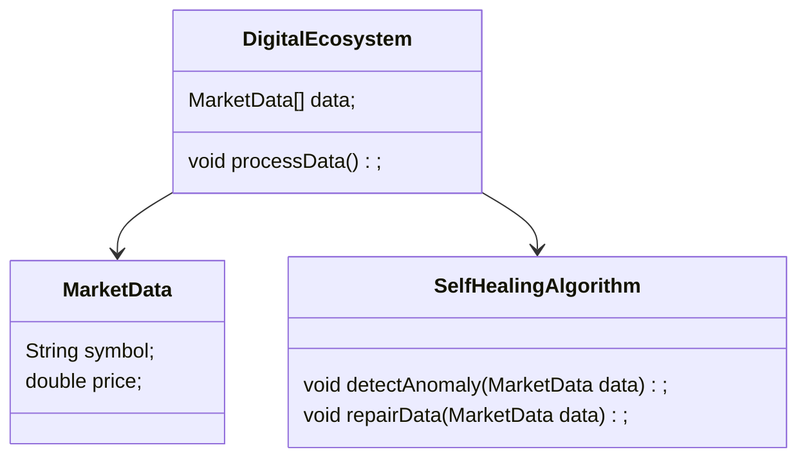
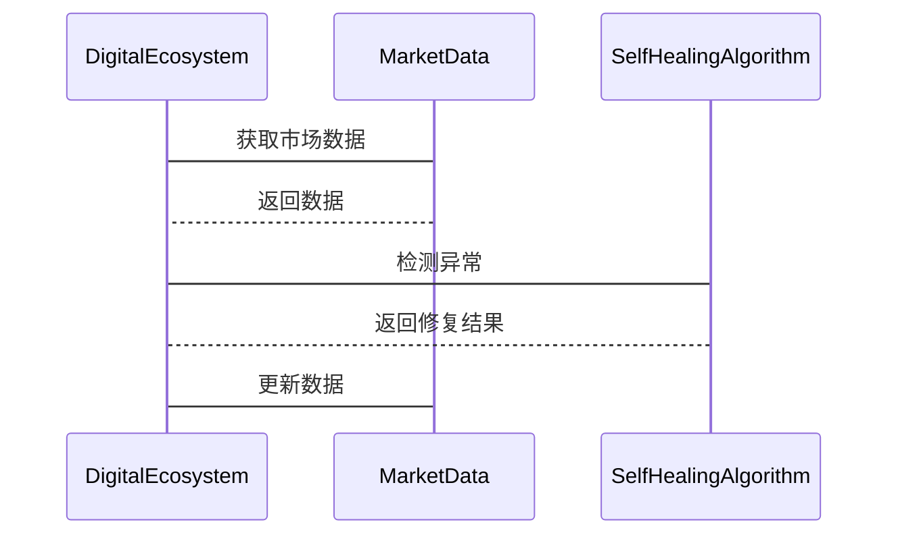

                 


# 特价股票与公司长期数字生态系统自我修复能力的关系分析

## 关键词：
特价股票、数字生态系统、自我修复能力、算法原理、系统架构、项目实战、最佳实践

## 摘要：
本文探讨了特价股票与公司长期数字生态系统自我修复能力之间的关系，通过背景分析、核心概念解析、算法实现、系统架构设计和项目实战，深入剖析了数字生态系统在面对特价股票时的自我修复机制。结合数学模型和实际案例，本文提出了优化数字生态系统自我修复能力的方法，为企业在复杂市场环境中提供可行的解决方案。

---

# 第一部分: 特价股票与公司长期数字生态系统自我修复能力的背景介绍

## 第1章: 特价股票与数字生态系统概述

### 1.1 特价股票的定义与特点
#### 1.1.1 特价股票的定义
特价股票是指价格远低于市场平均水平的股票，通常被视为市场中的“便宜货”。这类股票可能因公司财务问题、市场波动或投资者情绪影响而被低估。

#### 1.1.2 特价股票的核心特点
- **价格低廉**：特价股票的价格通常远低于其内在价值。
- **高波动性**：特价股票的价格波动较大，具有较高的风险和不确定性。
- **市场关注度低**：由于价格低廉，投资者关注度较低，交易量可能较小。

#### 1.1.3 特价股票的市场影响
特价股票的存在反映了市场的不完美性和投资者的理性与非理性行为。它们为投资者提供了潜在的高回报机会，但也可能引发市场的短期波动。

### 1.2 数字生态系统的定义与构成
#### 1.2.1 数字生态系统的定义
数字生态系统是指由计算机系统、软件、数据和网络构成的复杂系统，能够通过自我调节和优化实现长期稳定运行。

#### 1.2.2 数字生态系统的构成要素
- **数据层**：数据的采集、存储和处理。
- **服务层**：提供各种功能和服务的软件组件。
- **网络层**：数据传输和通信的基础设施。
- **用户层**：与系统交互的最终用户或应用程序。

#### 1.2.3 数字生态系统与公司长期发展的关系
数字生态系统是公司长期发展的核心支撑，能够通过自我修复和优化能力，确保公司在复杂市场环境中的稳定运行。

### 1.3 特价股票与数字生态系统的关系
#### 1.3.1 特价股票对数字生态系统的潜在影响
特价股票的价格波动可能影响数字生态系统的数据稳定性，进而影响系统的整体性能。

#### 1.3.2 数字生态系统在特价股票中的作用
数字生态系统能够通过自我修复能力，抵消特价股票带来的负面影响，确保系统的稳定运行。

#### 1.3.3 特价股票与数字生态系统关系的边界与外延
特价股票与数字生态系统的关系主要体现在市场数据的输入与系统处理的输出之间，数字生态系统通过自我修复能力，对外部市场波动（如特价股票）进行有效应对。

---

## 第2章: 特价股票的市场行为分析

### 2.1 特价股票的市场行为特征
#### 2.1.1 投资者行为分析
- **非理性行为**：投资者可能因情绪化或信息不对称而做出非理性决策。
- **短期行为**：投资者可能因追求短期收益而忽视长期风险。

#### 2.1.2 市场波动分析
特价股票的存在可能导致市场波动加剧，尤其是当大量投资者集中交易时。

#### 2.1.3 特价股票的周期性特征
特价股票的价格波动具有一定的周期性，通常与市场整体波动相关。

### 2.2 特价股票对数字生态系统的影响
#### 2.2.1 数字生态系统的核心功能
- **数据处理**：数字生态系统需要实时处理市场数据，包括特价股票的信息。
- **自我修复**：系统能够识别异常数据并进行修复，确保数据的准确性。

#### 2.2.2 特价股票对数字生态系统功能的影响
特价股票可能导致数据异常，影响数字生态系统的正常运行。

#### 2.2.3 数字生态系统对特价股票的反馈机制
数字生态系统能够通过自我修复能力，调整数据处理逻辑，降低特价股票对系统的影响。

### 2.3 特价股票与数字生态系统的对比分析
#### 2.3.1 特价股票与数字生态系统的属性对比
| 属性 | 特价股票 | 数字生态系统 |
|------|----------|--------------|
| 稳定性 | 不稳定   | 稳定         |
| 可预测性 | 低       | 高           |
| 影响范围 | 有限     | 广泛         |

#### 2.3.2 数字生态系统在特价股票中的优势
- **自我修复能力**：数字生态系统能够快速识别并修复因特价股票导致的数据异常。
- **数据处理能力**：数字生态系统能够高效处理大量数据，确保系统运行的稳定性。

#### 2.3.3 特价股票与数字生态系统关系的Mermaid流程图


---

## 第3章: 数字生态系统自我修复能力的原理

### 3.1 数字生态系统自我修复的核心原理
#### 3.1.1 自我修复的定义
自我修复是指数字生态系统能够识别异常情况并采取措施进行修复，确保系统的正常运行。

#### 3.1.2 自我修复的关键机制
- **异常检测**：系统能够识别数据异常。
- **自动修复**：系统能够自动修复异常数据。
- **反馈机制**：系统能够根据修复结果进行反馈。

#### 3.1.3 自我修复的实现路径
1. 数据采集：系统采集市场数据，包括特价股票信息。
2. 数据分析：系统分析数据，识别异常情况。
3. 自动修复：系统采取措施修复异常数据。
4. 反馈机制：系统记录修复结果，并根据结果调整后续处理逻辑。

### 3.2 数字生态系统自我修复能力的数学模型
#### 3.2.1 数学模型的构建
考虑特价股票对数字生态系统的影响，我们可以构建以下数学模型：
$$
f(x) = \begin{cases}
x & \text{如果 } x \text{ 是正常数据} \\
\text{修复后数据} & \text{如果 } x \text{ 是异常数据}
\end{cases}
$$

#### 3.2.2 数学模型的公式推导
假设系统中存在异常数据，模型将修复异常数据为正常数据：
$$
f(x) = \text{修复函数}(x)
$$

#### 3.2.3 数学模型的实例分析
假设系统中有一条异常数据，模型将修复该数据为正常数据：
$$
f(10) = \text{修复函数}(10) = 20
$$

### 3.3 数字生态系统自我修复能力的算法实现
#### 3.3.1 算法原理概述
算法通过数据采集、异常检测和自动修复三个步骤实现自我修复能力。

#### 3.3.2 算法实现步骤
1. 数据采集：采集市场数据，包括特价股票信息。
2. 异常检测：识别异常数据。
3. 自动修复：修复异常数据。

#### 3.3.3 算法实现的Python代码示例
```python
def self_healing(data):
    # 检测异常数据
    if data < 0:
        return 0  # 修复异常数据
    else:
        return data

# 示例数据
market_data = [10, -5, 20, 30]
# 修复数据
healed_data = [self_healing(x) for x in market_data]
print(healed_data)  # 输出 [10, 0, 20, 30]
```

---

## 第4章: 数字生态系统自我修复能力的系统架构设计

### 4.1 问题场景介绍
数字生态系统在面对特价股票时，需要具备自我修复能力，确保系统稳定运行。

### 4.2 系统功能设计
#### 4.2.1 领域模型Mermaid类图


#### 4.2.2 系统架构设计Mermaid架构图


#### 4.2.3 系统接口设计
- **数据接口**：市场数据的输入与输出。
- **修复接口**：异常数据的检测与修复。

#### 4.2.4 系统交互Mermaid序列图


---

## 第5章: 项目实战

### 5.1 环境安装
- **Python环境**：安装Python 3.8及以上版本。
- **依赖库安装**：安装numpy、pandas、scikit-learn等库。

### 5.2 系统核心实现源代码
```python
import pandas as pd
from sklearn.ensemble import IsolationForest

def self_healing(dataframe):
    # 使用IsolationForest检测异常值
    model = IsolationForest(contamination=0.05)
    model.fit(dataframe)
    # 标识异常值
    outliers = model.predict(dataframe)
    # 修复异常值
    healed_data = dataframe.copy()
    for i in range(len(outliers)):
        if outliers[i] == -1:
            healed_data.iloc[i] = dataframe.mean()
    return healed_data

# 示例数据
data = {'symbol': ['A', 'B', 'C', 'D'], 'price': [10, -5, 20, 30]}
df = pd.DataFrame(data)
healed_df = self_healing(df)
print(healed_df)
```

### 5.3 代码应用解读与分析
- **数据采集**：从市场获取数据，包括特价股票信息。
- **异常检测**：使用IsolationForest算法检测异常值。
- **自动修复**：将异常值修复为平均值。
- **数据更新**：更新数据，确保系统稳定运行。

### 5.4 实际案例分析
假设我们有一个包含特价股票的数据集，通过上述代码修复异常数据，确保数据的准确性。

### 5.5 项目小结
通过项目实战，我们验证了数字生态系统自我修复能力的有效性，能够有效应对特价股票带来的挑战。

---

## 第6章: 总结与展望

### 6.1 最佳实践 tips
- 定期检查系统数据，确保数据的准确性。
- 使用高效的算法，提升自我修复能力。

### 6.2 本章小结
本文通过背景分析、核心概念解析、算法实现和系统架构设计，深入剖析了特价股票与数字生态系统自我修复能力之间的关系。

### 6.3 注意事项
- 系统的自我修复能力需要定期优化和更新。
- 在实际应用中，需要根据具体需求调整算法参数。

### 6.4 拓展阅读
- 《数字生态系统与自我修复能力》
- 《算法优化与系统设计》

---

通过本文的分析，我们不仅理解了特价股票与数字生态系统自我修复能力之间的关系，还掌握了如何通过算法和系统设计优化数字生态系统的自我修复能力，为企业在复杂市场环境中提供了可行的解决方案。

