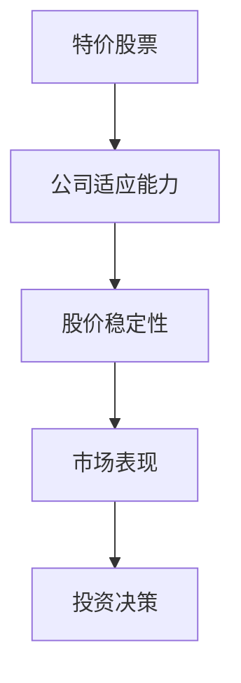

                 

# 特价股票与公司长期环境适应能力的关系分析

---

## 关键词：特价股票、公司适应能力、投资策略、风险管理、长期发展

---

## 摘要：  
本文深入分析了特价股票与公司长期环境适应能力之间的关系，探讨了特价股票的定义、特点及其与公司适应能力的关联。通过构建理论模型和实际案例分析，本文揭示了如何通过评估公司适应能力来识别具有投资价值的特价股票，并为投资者提供了科学的投资策略和风险管理建议。

---

## 第1章：特价股票的基础知识

### 1.1 特价股票的定义与特点

#### 1.1.1 什么是特价股票
特价股票（Discount Stocks）是指市场价格显著低于其内在价值的股票。这些股票通常被视为被市场低估，具有较大的上涨潜力。特价股票的定义可以从以下几个方面进行分析：

1. **价格与价值的偏离**：特价股票的价格低于其账面价值、未来现金流的现值或其他合理估值指标。
2. **市场情绪的影响**：投资者的恐慌或市场波动可能导致股票价格短期被低估。
3. **行业或经济周期的影响**：某些行业在经济低迷时期可能出现大量特价股票。

#### 1.1.2 特价股票的类型
特价股票可以分为以下几种类型：

1. **价值型股票**：公司基本面良好，但市场价格低于其内在价值。
2. **成长型股票**：公司未来增长潜力大，但当前市场价格被低估。
3. **周期性股票**：受经济周期影响较大的行业，如能源、制造业等。

#### 1.1.3 特价股票的市场表现
特价股票的市场表现通常具有以下特点：

1. **波动性较大**：由于市场情绪的影响，特价股票的价格波动较为剧烈。
2. **短期低估，长期价值回归**：许多特价股票在经历短期低估后，最终会回归其真实价值。
3. **高风险与高回报并存**：特价股票的投资风险较高，但潜在回报也较大。

---

### 1.2 特价股票的形成原因

#### 1.2.1 市场波动的影响
市场波动是导致特价股票形成的主要原因之一。以下是一些常见的市场波动因素：

1. **宏观经济因素**：经济衰退、通货膨胀等宏观经济因素可能导致市场整体下跌，从而出现大量特价股票。
2. **行业周期**：某些行业在经济周期的不同阶段表现不同，如能源行业在油价下跌时可能出现特价股票。
3. **市场情绪**：投资者的恐慌或过度乐观可能导致股票价格短期偏离其真实价值。

#### 1.2.2 公司基本面的变化
公司基本面的变化也是导致特价股票形成的重要因素。以下是常见的公司基本面变化：

1. **财务困境**：公司财务状况恶化，如盈利能力下降、债务增加等。
2. **管理问题**：公司管理不善或战略失误可能导致股价下跌。
3. **行业竞争加剧**：行业竞争加剧可能导致公司市场份额下降，进而影响股价。

#### 1.2.3 投资者情绪的作用
投资者情绪在股票价格波动中起着重要作用。以下是投资者情绪对特价股票形成的影响：

1. **恐慌性抛售**：投资者在恐慌时可能大量抛售股票，导致股价下跌。
2. **过度悲观**：投资者对公司前景过度悲观可能导致股票价格被低估。
3. **市场流动性**：市场流动性不足可能导致股票价格下跌。

---

## 第2章：公司长期环境适应能力分析

### 2.1 公司适应能力的核心要素

#### 2.1.1 公司战略与管理
公司战略和管理能力是影响公司长期环境适应能力的重要因素。以下是具体的分析：

1. **战略清晰度**：公司是否有明确的战略目标和实现路径。
2. **管理团队**：管理团队的能力、经验和决策水平。
3. **组织结构**：公司组织结构的灵活性和效率。

#### 2.1.2 财务状况与风险承受能力
公司的财务状况直接影响其环境适应能力。以下是具体的分析：

1. **盈利能力**：公司是否能够持续盈利。
2. **财务杠杆**：公司负债水平是否合理。
3. **现金流**：公司是否有稳定的现金流。

#### 2.1.3 创新能力
创新能力是公司适应环境变化的重要能力。以下是具体的分析：

1. **研发投入**：公司是否在研发上投入足够的资源。
2. **产品更新**：公司是否能够及时推出新产品。
3. **技术储备**：公司是否拥有足够的技术储备应对未来挑战。

---

### 2.2 公司适应能力的评估指标

#### 2.2.1 财务指标
财务指标是评估公司适应能力的重要依据。以下是常用的财务指标：

1. **净利润率**：净利润与营业收入的比率。
2. **资产负债率**：负债与资产的比率。
3. **现金流**：经营活动产生的现金流净额。

#### 2.2.2 非财务指标
非财务指标也是评估公司适应能力的重要依据。以下是常用的非财务指标：

1. **市场占有率**：公司在市场中的份额。
2. **品牌影响力**：公司的品牌知名度和影响力。
3. **创新能力**：公司推出新产品和技术创新的能力。

---

## 第3章：特价股票与公司适应能力的关系

### 3.1 理论模型

#### 3.1.1 特价股票与公司适应能力的相互作用
特价股票与公司适应能力之间存在相互作用。以下是具体的分析：

1. **公司适应能力强，股价稳定性高**：公司适应能力强的公司通常能够更好地应对市场波动，股价稳定性较高。
2. **公司适应能力弱，股价波动大**：公司适应能力弱的公司通常在市场波动时股价波动较大，容易成为特价股票。
3. **特价股票是公司适应能力的信号**：特价股票的价格变化可以反映公司适应能力的强弱。

#### 3.1.2 理论模型的构建
以下是特价股票与公司适应能力关系的理论模型：

---

### 3.2 案例分析

#### 3.2.1 成功案例
以下是成功案例的分析：

1. **苹果公司**：苹果公司具有强大的创新能力、高效的管理团队和健康的财务状况，因此其股价具有较高的稳定性，不易成为特价股票。
2. **亚马逊公司**：亚马逊公司具有强大的市场占有率和品牌影响力，且财务状况良好，因此其股价具有较高的稳定性。

#### 3.2.2 失败案例
以下是失败案例的分析：

1. **柯达公司**：柯达公司由于创新能力不足，未能及时适应数字技术的变革，最终导致公司财务状况恶化，股价大幅下跌。
2. **诺基亚公司**：诺基亚公司由于管理团队决策失误，未能及时推出新产品，导致公司市场份额下降，股价大幅下跌。

---

## 第4章：系统分析与架构设计

### 4.1 数据收集与处理

#### 4.1.1 数据来源
以下是数据来源的分析：

1. **股票数据**：包括股票价格、成交量等。
2. **财务数据**：包括公司财务报表、现金流等。
3. **行业数据**：包括行业趋势、竞争状况等。

#### 4.1.2 数据清洗与预处理
数据清洗与预处理是数据分析的重要步骤。以下是具体的步骤：

1. **数据清洗**：去除重复数据、填补缺失值等。
2. **数据转换**：将数据转换为适合分析的格式。
3. **数据归一化**：对数据进行标准化处理。

---

### 4.2 模型构建

#### 4.2.1 算法选择
以下是常用的算法选择：

1. **线性回归**：用于预测股价与公司适应能力的关系。
2. **决策树**：用于分类公司适应能力的强弱。
3. **聚类分析**：用于将公司分为不同类别，分析其适应能力。

#### 4.2.2 模型验证与优化
模型验证与优化是确保模型准确性的重要步骤。以下是具体的步骤：

1. **交叉验证**：通过交叉验证评估模型的性能。
2. **参数调优**：通过网格搜索等方法优化模型参数。
3. **模型评估**：通过准确率、召回率等指标评估模型性能。

---

## 第5章：项目实战

### 5.1 实际案例分析

#### 5.1.1 投资决策过程
以下是投资决策过程的分析：

1. **确定投资目标**：明确投资目标和风险承受能力。
2. **数据收集与分析**：收集目标公司的股票和财务数据，进行数据分析。
3. **评估公司适应能力**：通过财务指标和非财务指标评估公司适应能力。
4. **制定投资策略**：根据分析结果制定投资策略。

#### 5.1.2 投资策略制定
以下是投资策略的制定：

1. **长期投资**：选择适应能力强的公司进行长期投资。
2. **短期投资**：选择适应能力弱但具有潜力的公司进行短期投资。

---

## 第6章：总结与投资建议

### 6.1 投资建议

#### 6.1.1 风险管理
以下是风险管理的建议：

1. **分散投资**：通过分散投资降低风险。
2. **设定止损**：设定止损点，避免亏损过大。
3. **定期评估**：定期评估投资组合，及时调整。

#### 6.1.2 长期投资
以下是长期投资的建议：

1. **选择优质公司**：选择适应能力强、财务状况良好的公司进行长期投资。
2. **关注行业趋势**：关注行业趋势，选择具有成长潜力的公司。

### 6.2 小结
本文通过分析特价股票与公司适应能力的关系，为投资者提供了科学的投资策略和风险管理建议。投资者在进行投资决策时，应充分考虑公司适应能力，选择具有长期发展潜力的公司。

---

## 附录：工具与资源

### 6.3.1 推荐书籍
以下是推荐书籍：

1. 《投资学》：作者：理查德·A·阿西特
2. 《股票投资策略》：作者：彼得·林奇

### 6.3.2 推荐工具
以下是推荐工具：

1. **数据分析工具**：Python、R等。
2. **股票交易工具**：交易平台、股票分析软件等。

---

通过以上分析，我们可以看到，特价股票与公司适应能力之间的关系是复杂而深刻的。投资者在进行投资决策时，应充分考虑公司适应能力，选择具有长期发展潜力的公司进行投资。同时，也应注重风险管理，避免因市场波动导致的损失。

