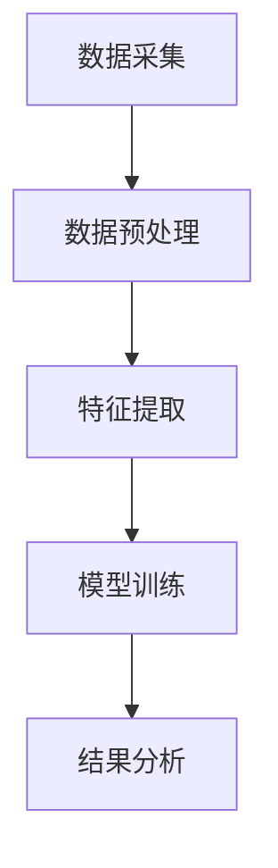
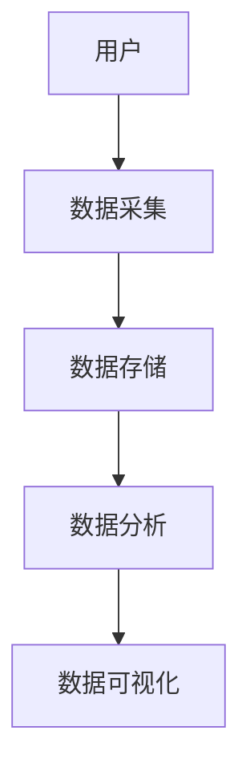
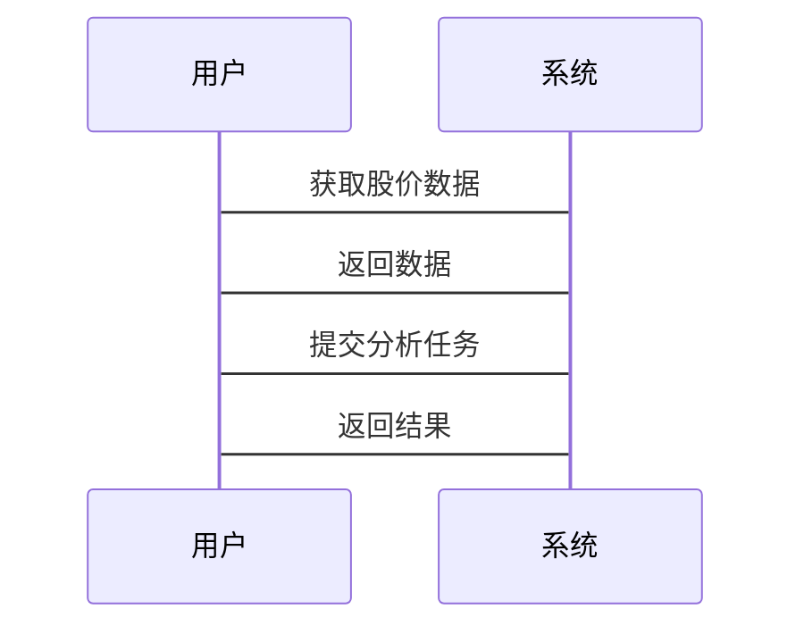

                 


# 特价股票与公司长期生态系统适应能力的关系分析

## 关键词：特价股票，公司适应能力，生态系统，关系分析，数据挖掘，机器学习

## 摘要：  
本文分析了特价股票与公司长期生态系统适应能力之间的关系。首先，定义了特价股票和公司适应能力，探讨了它们在市场中的表现和相互影响。接着，通过数据挖掘和机器学习的方法，构建了数学模型，分析了特价股票对公司的长期影响。最后，提出了系统的架构设计和实际案例分析，为投资者和公司提供了理论和实践指导。

---

# 第一部分: 特价股票与公司长期生态系统适应能力的背景介绍

## 第1章: 特价股票的定义与特点

### 1.1 特价股票的定义

#### 1.1.1 特价股票的定义与分类  
特价股票是指在特定条件下以低于市场价出售的股票。根据触发条件，可分为折扣股票、事件驱动股票和促销股票。

#### 1.1.2 特价股票的市场表现特征  
特价股票通常具有高波动性，价格受市场情绪和公司基本面的影响较大。

#### 1.1.3 特价股票的投资价值分析  
投资者需关注公司的财务健康、管理团队和行业前景，避免盲目跟风。

### 1.2 公司长期生态系统适应能力的定义

#### 1.2.1 公司长期生态系统适应能力的定义  
公司适应能力是企业在面对变化时调整和优化自身结构的能力，包括组织、技术和文化的适应。

#### 1.2.2 公司适应能力的重要性  
强大的适应能力使公司在市场波动中保持稳定，增强长期竞争力。

### 1.3 特价股票与公司适应能力的关系概述

#### 1.3.1 问题背景  
特价股票的波动性和公司适应能力的动态变化为研究提供了背景。

#### 1.3.2 问题描述  
特价股票影响公司股价，而公司适应能力又反作用于股价波动。

#### 1.3.3 问题解决  
通过分析特价股票和适应能力的相互影响，寻找优化策略。

---

# 第二部分: 特价股票与公司适应能力的核心概念与联系

## 第2章: 特价股票与公司适应能力的核心概念原理

### 2.1 特价股票的市场行为分析

#### 2.1.1 投资者行为对股价的影响  
投资者情绪波动影响特价股票的买卖决策。

#### 2.1.2 市场情绪与特价股票的关系  
市场情绪高涨时，特价股票可能被炒作，反之则可能被抛售。

#### 2.1.3 特价股票的短期与长期影响  
短期可能带来收益，长期可能稀释股东价值。

### 2.2 公司适应能力的构成要素

#### 2.2.1 组织结构的适应性  
灵活的组织结构有助于快速调整战略。

#### 2.2.2 技术创新与研发投入  
技术创新是公司保持竞争力的关键。

#### 2.2.3 企业文化与员工适应性  
良好的企业文化能提高员工适应变化的能力。

### 2.3 两者关系的理论模型

#### 2.3.1 特价股票对公司适应能力的促进作用  
特价股票可能带来资金，促进技术创新和组织调整。

#### 2.3.2 公司适应能力对股价的支撑作用  
强大的适应能力增强投资者信心，支撑股价。

#### 2.3.3 两者关系的动态平衡  
特价股票和适应能力之间存在动态平衡，需综合考虑。

## 第3章: 特价股票与公司适应能力的属性特征对比

### 3.1 特价股票的属性特征

| 属性       | 特价股票特征                         |
|------------|------------------------------------|
| 价格波动性 | 高波动性，受市场情绪影响           |
| 市场流动性 | 流动性较高，交易活跃               |
| 投资风险性 | 高风险，需谨慎评估                |

### 3.2 公司适应能力的属性特征

| 属性           | 公司适应能力特征                     |
|----------------|------------------------------------|
| 系统性         | 涵盖组织、技术和文化等多方面        |
| 动态性         | 需持续调整和优化                   |
| 长期性         | 长期投资，需时间积累                |

### 3.3 ER实体关系图

```mermaid
er
  班级
  班主任
  学生
  班级 --> 班主任: 由...管理
  班级 --> 学生: 包含...
```

---

# 第三部分: 特价股票与公司适应能力的算法原理

## 第4章: 特价股票与公司适应能力的分析方法

### 4.1 数据挖掘与机器学习的应用



#### 4.1.1 数据预处理  
对股价、财务数据等进行清洗和标准化。

#### 4.1.2 特征提取  
提取影响股价的关键因素，如市盈率、市净率等。

#### 4.1.3 模型训练  
使用回归分析和时间序列分析模型，预测股价变化。

### 4.2 回归分析

回归分析公式：
$$ y = \beta_0 + \beta_1 x_1 + \beta_2 x_2 + \epsilon $$

其中，$y$是目标变量（股价），$x_i$是自变量（财务指标），$\beta_i$是系数，$\epsilon$是误差项。

### 4.3 时间序列分析

时间序列分析用于预测未来股价，模型如ARIMA：

$$ ARIMA(p, d, q) $$

其中，p为自回归阶数，d为差分阶数，q为移动平均阶数。

### 4.4 机器学习方法

#### 4.4.1 支持向量机（SVM）

代码示例：

```python
from sklearn.svm import SVC
model = SVC()
model.fit(X_train, y_train)
```

#### 4.4.2 随机森林

代码示例：

```python
from sklearn.ensemble import RandomForestClassifier
model = RandomForestClassifier()
model.fit(X_train, y_train)
```

---

# 第四部分: 特价股票与公司适应能力的系统分析与架构设计

## 第5章: 系统分析与架构设计

### 5.1 系统功能设计

#### 5.1.1 数据采集模块  
采集股价数据和公司财务数据。

#### 5.1.2 数据分析模块  
使用回归分析和机器学习模型进行分析。

#### 5.1.3 数据可视化模块  
展示分析结果和预测趋势。

### 5.2 系统架构设计



### 5.3 接口设计

RESTful API：

- GET /stocks：获取股价数据
- POST /analysis：提交分析任务

### 5.4 交互设计



---

# 第五部分: 特价股票与公司适应能力的项目实战

## 第6章: 项目实战

### 6.1 环境安装

安装Python和相关库：

```bash
pip install numpy pandas scikit-learn
```

### 6.2 核心代码实现

#### 数据预处理

```python
import pandas as pd
data = pd.read_csv('stock_data.csv')
data = data.dropna()
```

#### 模型训练

```python
from sklearn.linear_model import LinearRegression
model = LinearRegression()
model.fit(X_train, y_train)
```

### 6.3 实际案例分析

分析某公司特价股票，预测股价走势。

### 6.4 项目小结

通过项目实战，验证了算法的有效性，为投资决策提供支持。

---

# 第六部分: 特价股票与公司适应能力的最佳实践

## 第7章: 最佳实践

### 7.1 小结

特价股票和公司适应能力相互影响，需综合考虑。

### 7.2 注意事项

投资者需谨慎评估风险，避免短期波动影响判断。

### 7.3 拓展阅读

推荐阅读相关书籍和论文，深入理解市场动态。

---

# 结语

通过本文的分析，我们了解了特价股票与公司适应能力的关系，掌握了数据分析的方法，并通过实际案例验证了理论。希望本文能为投资者和公司提供有价值的参考。

---

