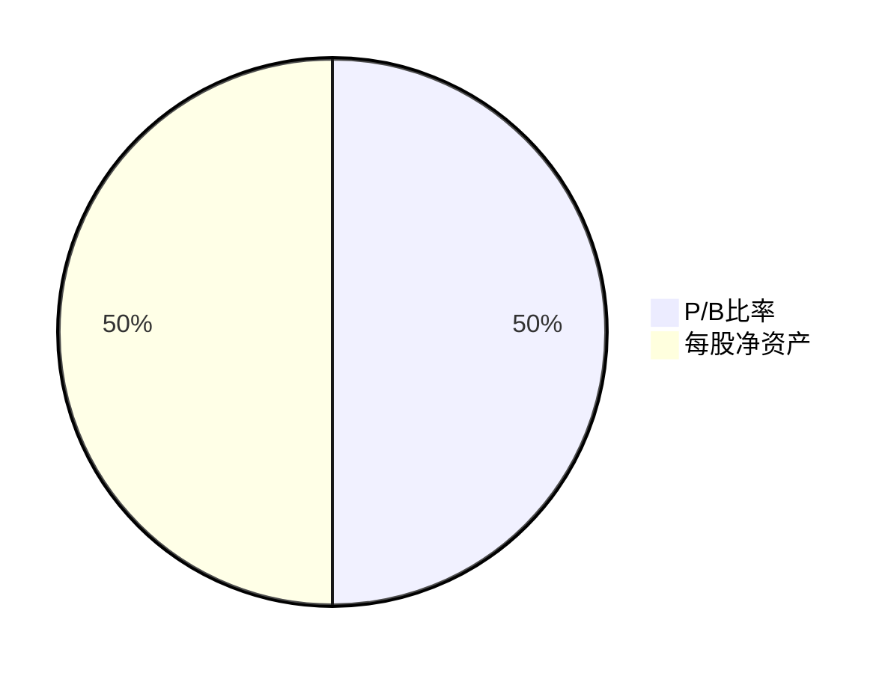
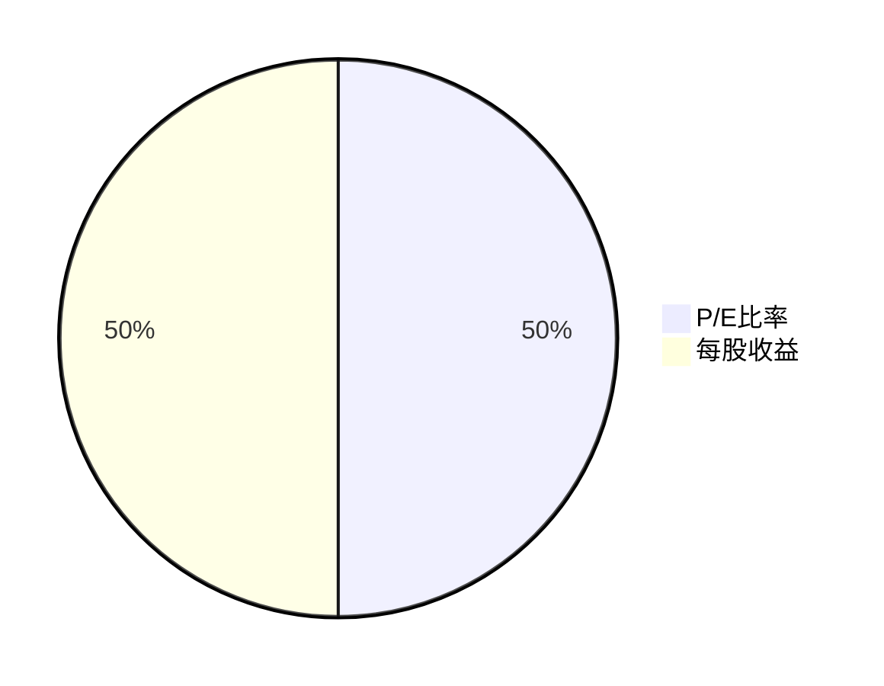
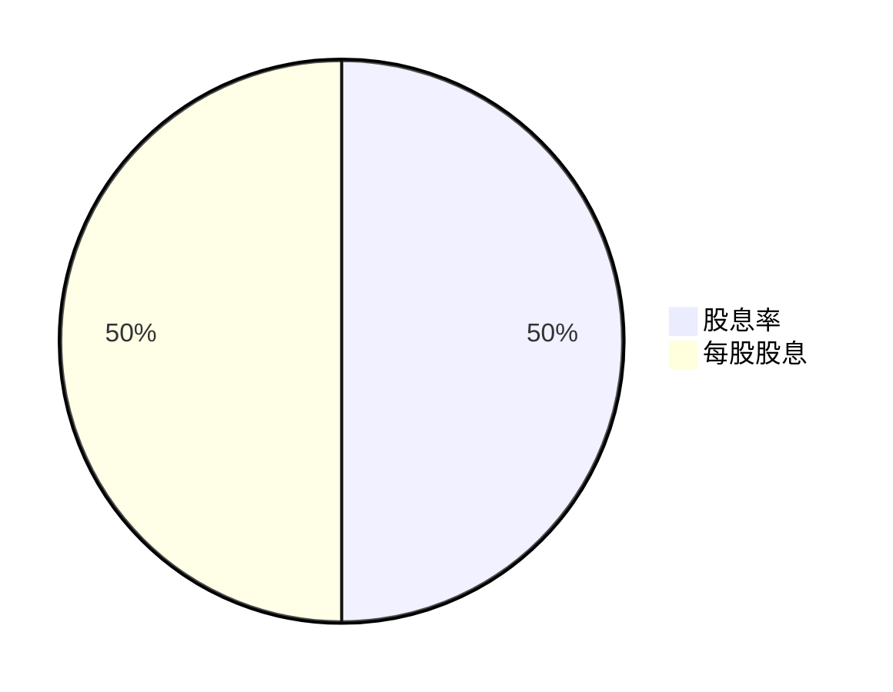
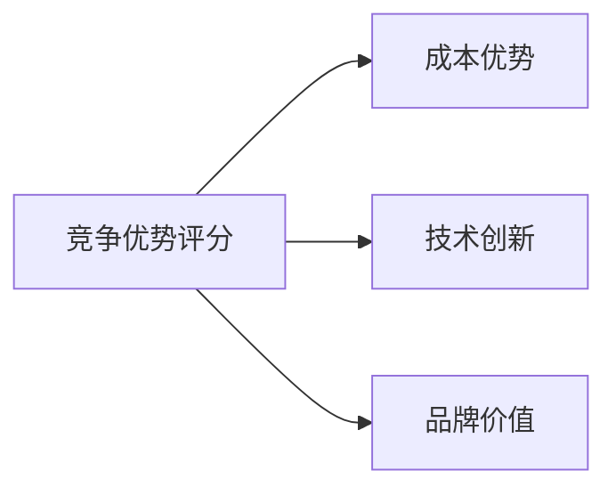
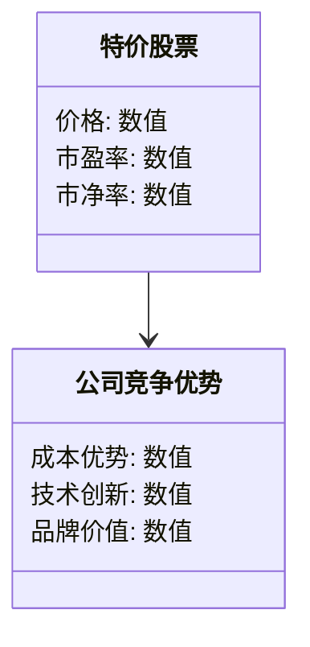

                 


```markdown
# 特价股票与公司长期竞争优势的关联性

> 关键词：特价股票、公司竞争优势、投资策略、数学模型、算法实现

> 摘要：本文深入探讨了特价股票与公司长期竞争优势之间的关联性。通过分析特价股票的特征和公司竞争优势的核心要素，结合数学模型和算法原理，提出了一个系统化的解决方案。文章首先介绍了特价股票和公司竞争优势的基本概念，然后从理论到实践，逐步展开分析，包括模型实现、系统架构设计和项目实战等内容。最后，通过实际案例分析和最佳实践，总结了如何在投资策略中有效利用特价股票与公司竞争优势的关系。

---

# 第一部分：特价股票与公司长期竞争优势的背景介绍

## 第1章：特价股票的基本概念

### 1.1 什么是特价股票
特价股票通常指那些价格低于市场平均水平的股票，通常具有较高的股息率或较低的估值指标，如市盈率（P/E）和市净率（P/B）。这些股票可能被市场低估，具有潜在的投资价值。

### 1.2 特价股票的分类
- **低估值股票**：市盈率和市净率低于行业平均水平的股票。
- **高股息率股票**：股息收益率较高的股票，通常来自现金流稳定的公司。
- **小盘股**：市值较小的公司股票，可能具有较高的增长潜力。

### 1.3 特价股票的市场特征
- **低流动性**：部分特价股票交易量较小，可能导致买卖价差较大。
- **高波动性**：市场情绪变化可能对股价产生较大影响。
- **周期性**：通常在市场低迷时期出现较多特价股票。

## 第2章：公司长期竞争优势的核心要素

### 2.1 长期竞争优势的定义
公司长期竞争优势是指公司在行业中持续保持竞争优势的能力，通常体现在成本控制、技术创新、品牌影响力和市场占有率等方面。

### 2.2 核心竞争力的构成
- **成本优势**：通过规模效应或技术进步降低生产成本。
- **技术创新**：拥有独特的技术或专利，能够持续推出新产品。
- **品牌价值**：强大的品牌形象和客户忠诚度。
- **市场地位**：在目标市场中占据领先地位。

### 2.3 市场地位与竞争优势的关系
市场地位是公司竞争优势的重要体现，通常市场地位越高的公司，其竞争优势越显著，从而能够更好地应对市场波动。

---

# 第二部分：特价股票与公司竞争优势的关联性分析

## 第3章：特价股票与公司竞争优势的对比分析

### 3.1 特价股票的特征分析
- **低估值股票**：通常反映公司当前的市场表现不佳，但可能存在潜在价值。
- **高股息率股票**：表明公司现金流充足，愿意回馈股东，但可能面临增长受限的问题。
- **小盘股**：增长潜力较大，但风险也较高。

### 3.2 公司竞争优势的属性特征
- **成本优势**：公司能够以更低的价格提供产品或服务。
- **技术创新**：公司具备持续创新能力，能够引领市场趋势。
- **品牌价值**：强大的品牌能够吸引更多的客户和合作伙伴。

### 3.3 两者之间的相互作用
- **特价股票的市场表现**：公司竞争优势强的公司，即使股价被低估，长期来看表现更优。
- **公司竞争优势的动态变化**：市场环境变化可能导致竞争优势的转移，从而影响股价。

---

# 第三部分：数学模型与算法原理

## 第4章：特价股票评估的数学模型

### 4.1 市净率（P/B）模型
市净率 = 股价 / 每股净资产



### 4.2 市盈率（P/E）模型
市盈率 = 股价 / 每股收益



### 4.3 股息率分析模型
股息率 = 每股股息 / 股价



## 第5章：公司竞争优势的评估算法

### 5.1 投资组合优化算法
通过优化算法选择具有竞争优势的公司，构建投资组合。

```python
import numpy as np

def calculate_portfolio_return(weights, returns):
    return np.dot(weights, returns)

weights = np.array([0.4, 0.6])
returns = np.array([0.1, 0.2])
print(calculate_portfolio_return(weights, returns))
```

### 5.2 竞争优势评分系统
通过多维度指标对公司的竞争优势进行评分。



---

# 第四部分：系统分析与架构设计方案

## 第6章：系统功能设计

### 6.1 领域模型


### 6.2 系统架构设计


### 6.3 接口设计
- 数据输入接口：接收股票数据和公司信息。
- 数据处理接口：计算各项指标并评估竞争优势。
- 结果输出接口：显示评估结果和投资建议。

---

# 第五部分：项目实战

## 第7章：环境安装与核心代码实现

### 7.1 环境安装
安装必要的库：
```bash
pip install numpy pandas matplotlib
```

### 7.2 核心代码实现
```python
import pandas as pd

# 数据加载
df = pd.read_csv('stocks.csv')

# 计算市盈率
df['P/E'] = df['Price'] / df['Earnings']

# 筛选特价股票
cheap_stocks = df[df['P/E'] < df['P/E'].mean()]

print(cheap_stocks.head())
```

### 7.3 案例分析
以某公司为例，分析其竞争优势和股价表现。

---

# 第六部分：最佳实践与小结

## 第8章：最佳实践

### 8.1 小结
特价股票与公司竞争优势密切相关，通过科学的评估模型和算法，可以有效识别具有长期投资价值的股票。

### 8.2 注意事项
- 风险提示：特价股票可能存在较高的市场风险。
- 数据质量：确保数据的准确性和完整性。
- 持续监控：定期评估公司竞争优势的变化。

### 8.3 拓展阅读
建议阅读相关投资策略书籍，深入理解股票评估的其他方法。

---

# 附录

## 附录A：术语表
- 特价股票：价格低于市场平均水平的股票。
- 公司竞争优势：公司在行业中保持竞争优势的能力。

## 附录B：参考文献
- [1] 投资学基础，作者：某某人。
- [2] 特价股票分析，来源：某某网站。

---

通过以上内容，读者可以系统地理解特价股票与公司长期竞争优势的关联性，并能够通过实际案例和代码实现，掌握相关分析方法。
```

