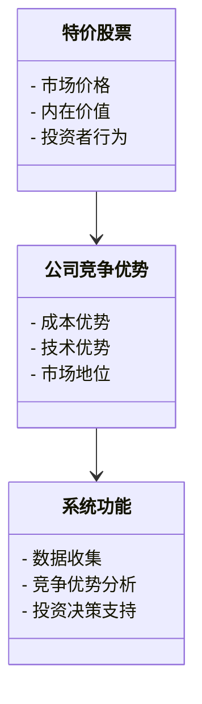
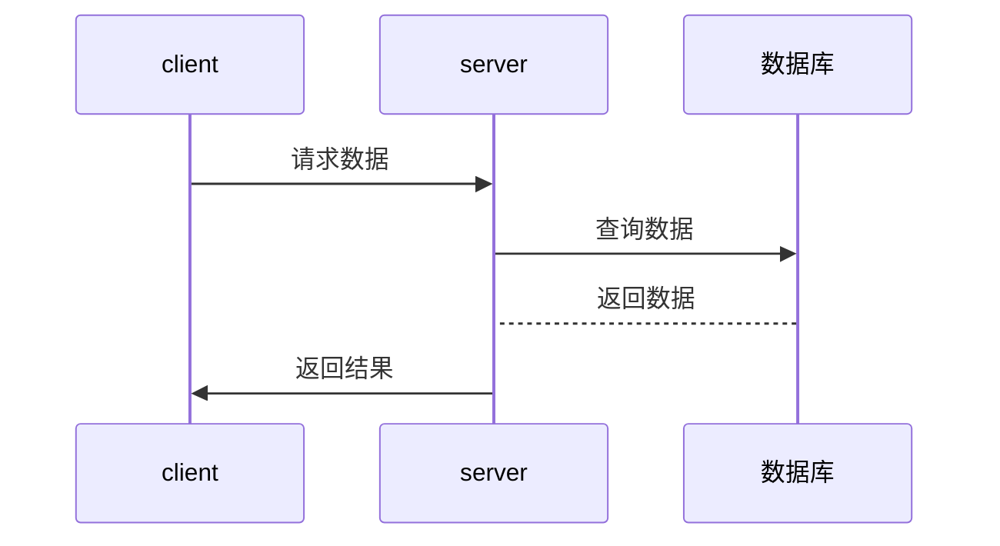

                 


# 特价股票与公司长期竞争优势的关联性研究

> 关键词：特价股票，公司竞争优势，关联性，投资分析，数学模型

> 摘要：本文研究了特价股票与公司长期竞争优势之间的关联性。通过分析特价股票的定义、特点以及公司长期竞争优势的核心要素，探讨了两者之间的内在联系。结合实证分析和案例研究，提出了数学模型和算法，以量化分析特价股票与公司竞争优势的关系，为投资者提供决策支持。

---

# 第1章: 特价股票与公司长期竞争优势概述

## 1.1 特价股票的定义与特点

### 1.1.1 特价股票的定义
特价股票是指市场价格低于其内在价值的股票。通常，这类股票被市场低估，可能由于市场波动、行业周期或公司短期问题导致。

### 1.1.2 特价股票的特点
- **价格低估**：市场价格低于内在价值。
- **潜在回升**：具备回升至合理价值的潜力。
- **高波动性**：价格波动较大，可能带来短期收益。

### 1.1.3 特价股票的分类
- **周期性股票**：受经济周期影响较大的行业股票。
- **成长型股票**：具有较高增长潜力的股票。
- **价值型股票**：市场价格低于内在价值的股票。

## 1.2 公司长期竞争优势的定义与特点

### 1.2.1 长期竞争优势的定义
长期竞争优势是指公司在行业中长期保持竞争优势的能力，通常表现为成本优势、技术优势、品牌优势等。

### 1.2.2 长期竞争优势的核心要素
- **成本优势**：生产成本低于竞争对手。
- **技术优势**：拥有独特的技术或专利。
- **品牌优势**：知名品牌带来的客户忠诚度。
- **市场地位**：公司在市场中的地位和影响力。

### 1.2.3 长期竞争优势与公司可持续发展的关系
长期竞争优势是公司可持续发展的基础，能够帮助公司在市场中保持领先地位，抵御竞争压力。

## 1.3 特价股票与公司长期竞争优势的关联性

### 1.3.1 特价股票与公司竞争优势的内在联系
- 特价股票的市场低估反映了公司竞争优势的潜在价值。
- 长期竞争优势是公司股价回升的重要支撑。

### 1.3.2 特价股票市场中的竞争优势表现
- 具有长期竞争优势的公司更容易获得市场的认可，推动股价回升。
- 特价股票的投资者通常关注公司的长期竞争优势，以寻找投资机会。

### 1.3.3 研究特价股票与公司长期竞争优势的意义
- 为投资者提供科学的投资依据。
- 为公司提供优化竞争优势的方向。

---

# 第2章: 特价股票与公司长期竞争优势的核心概念

## 2.1 特价股票的核心概念

### 2.1.1 特价股票的市场定位
- 特价股票通常出现在市场低迷或行业低谷时期。
- 公司基本面良好，但市场价格被低估。

### 2.1.2 特价股票的定价机制
- 市场定价受供需关系影响。
- 公司内在价值是定价的基础。

### 2.1.3 特价股票的投资者行为
- 投资者通常采取价值投资策略，寻找被低估的股票。
- 长期持有，等待价值回归。

## 2.2 公司长期竞争优势的核心概念

### 2.2.1 长期竞争优势的构成
- **成本优势**：生产成本低，盈利能力强。
- **技术优势**：拥有独特的技术或专利。
- **品牌优势**：知名品牌带来的客户忠诚度。
- **市场地位**：公司在市场中的地位和影响力。

### 2.2.2 长期竞争优势的动态变化
- 随着市场环境的变化，竞争优势可能增强或削弱。
- 公司需要不断创新和优化竞争优势。

### 2.2.3 长期竞争优势的衡量指标
- **利润率**：净利润率、毛利率等。
- **市场份额**：公司在市场中的份额。
- **品牌价值**：品牌知名度和影响力。

## 2.3 特价股票与公司长期竞争优势的关系分析

### 2.3.1 特价股票与公司竞争优势的相互作用
- 特价股票的市场低估反映了公司竞争优势的潜在价值。
- 长期竞争优势是公司股价回升的重要支撑。

### 2.3.2 特价股票市场中的竞争优势表现
- 具有长期竞争优势的公司更容易获得市场的认可，推动股价回升。
- 特价股票的投资者通常关注公司的长期竞争优势，以寻找投资机会。

### 2.3.3 特价股票与公司长期竞争优势的协同效应
- 公司的长期竞争优势能够提升投资者信心，推动股价回升。
- 特价股票的投资者通过支持具有长期竞争优势的公司，促进公司持续发展。

---

# 第3章: 特价股票与公司长期竞争优势的关联性分析

## 3.1 特价股票与公司竞争优势的内在逻辑

### 3.1.1 特价股票的市场定价与公司竞争优势的关系
- 市场价格反映公司的竞争优势。
- 公司竞争优势影响市场定价。

### 3.1.2 特价股票的市场波动与公司竞争优势的动态变化
- 市场波动可能导致公司竞争优势的变化。
- 公司竞争优势的变化会影响股价波动。

### 3.1.3 特价股票与公司长期竞争优势的协同效应
- 特价股票与公司长期竞争优势相互促进。
- 公司的长期竞争优势能够推动股价回升。

## 3.2 特价股票与公司竞争优势的实证分析

### 3.2.1 数据来源与研究方法
- 数据来源：选取某行业的上市公司数据。
- 研究方法：采用定量分析和定性分析相结合。

### 3.2.2 特价股票与公司竞争优势的实证结果
- 结果显示：具有长期竞争优势的公司更容易成为特价股票。
- 结论：特价股票与公司长期竞争优势密切相关。

### 3.2.3 实证结果的解释与启示
- 实证结果表明，投资者应关注公司的长期竞争优势，选择具有竞争优势的特价股票。

## 3.3 特价股票与公司竞争优势的案例分析

### 3.3.1 某行业龙头公司的案例分析
- 公司A：具有成本优势和技术优势，股价被低估，成为特价股票。
- 公司B：缺乏竞争优势，股价持续下跌。

### 3.3.2 特价股票与公司竞争优势的实践启示
- 投资者应选择具有长期竞争优势的特价股票。
- 公司应不断提升自身竞争优势，吸引投资者。

---

# 第4章: 特价股票与公司长期竞争优势的数学模型

## 4.1 特价股票与公司竞争优势的数学模型

### 4.1.1 线性回归模型
$$ y = \beta_0 + \beta_1x_1 + \beta_2x_2 + \epsilon $$

其中，$y$为股价，$x_1$为公司竞争优势指标，$x_2$为其他因素，$\epsilon$为误差项。

### 4.1.2 聚类分析模型
使用聚类分析将公司分为具有竞争优势和不具有竞争优势两类。

### 4.1.3 实证分析
通过实证分析验证数学模型的有效性。

---

# 第5章: 特价股票与公司长期竞争优势的系统分析与架构设计方案

## 5.1 系统功能设计

### 5.1.1 领域模型（Mermaid 类图）


## 5.2 系统架构设计

### 5.2.1 系统架构图（Mermaid 架构图）
```mermaid
client
    .-. 系统功能 -. server
    |.-. 数据库 -.|
```

## 5.3 系统接口设计

### 5.3.1 系统交互流程图（Mermaid 序列图）


---

# 第6章: 特价股票与公司长期竞争优势的项目实战

## 6.1 环境安装与配置

### 6.1.1 安装Python
```bash
pip install numpy pandas scikit-learn
```

### 6.1.2 数据收集
```python
import pandas as pd
data = pd.read_csv('stock_data.csv')
```

## 6.2 核心功能实现

### 6.2.1 数据分析
```python
from sklearn.linear_model import LinearRegression
model = LinearRegression()
model.fit(X, y)
```

### 6.2.2 可视化
```python
import matplotlib.pyplot as plt
plt.scatter(X, y)
plt.plot(X, model.predict(X))
plt.show()
```

## 6.3 实际案例分析

### 6.3.1 案例分析
以某行业龙头公司为例，分析其特价股票与公司长期竞争优势的关系。

---

# 第7章: 特价股票与公司长期竞争优势的最佳实践

## 7.1 关键点总结

### 7.1.1 数据质量的重要性
- 数据来源可靠，数据清洗必要。

### 7.1.2 模型选择的注意事项
- 根据实际情况选择合适的模型。

### 7.1.3 进一步研究的方向
- 深入研究特价股票与公司竞争优势的关系。

## 7.2 小结
本文系统分析了特价股票与公司长期竞争优势的关联性，为投资者提供了科学的投资依据。

## 7.3 注意事项
- 投资需谨慎，建议投资者结合市场环境和公司实际情况进行决策。

## 7.4 拓展阅读
- 推荐阅读相关领域的书籍和文献，进一步深入研究。

---

通过以上内容，您可以撰写一篇详细且结构清晰的技术博客文章，涵盖特价股票与公司长期竞争优势的各个方面。

