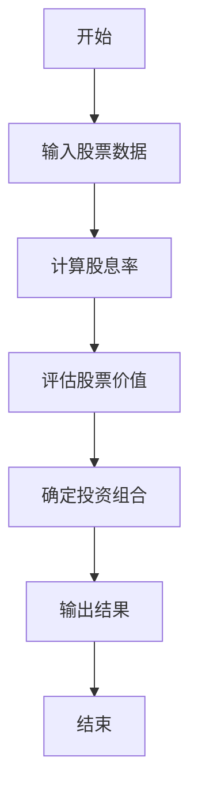
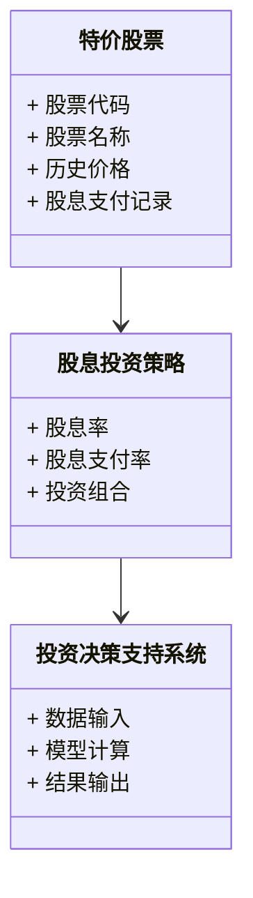
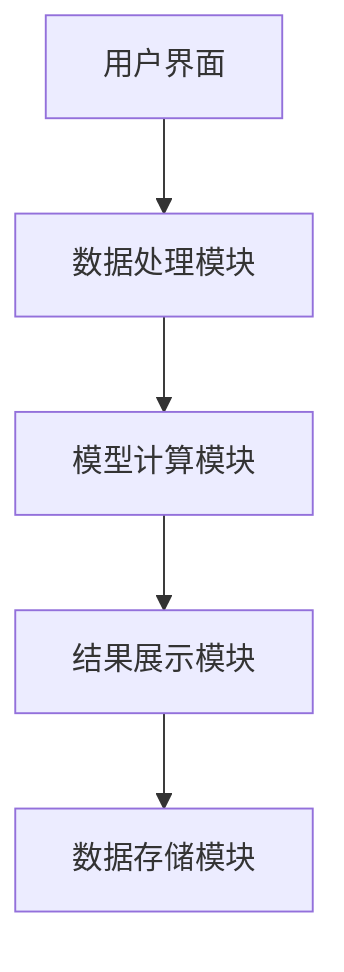
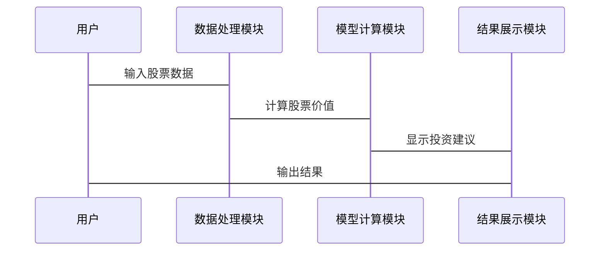

                 


# 特价股票与股息投资策略的结合

> 关键词：特价股票、股息投资、策略结合、数学模型、投资收益、风险控制

> 摘要：本文探讨了如何将特价股票与股息投资策略相结合，以实现更优的投资收益。通过数学模型和算法分析，结合系统架构设计和项目实战，提出了一个完整的投资策略，并详细介绍了其实现过程和优化方法。

---

# 第一部分: 特价股票与股息投资策略的背景介绍

## 第1章: 特价股票与股息投资策略的背景介绍

### 1.1 特价股票的基本概念
#### 1.1.1 什么是特价股票
特价股票是指在特定市场环境下，价格低于其内在价值的股票。这类股票通常具有较高的潜在回报率，但同时也伴随着较高的风险。

#### 1.1.2 特价股票的分类与特点
- **分类**：
  - 周期性股票：受经济周期影响较大的股票，如能源、材料等行业。
  - 价值型股票：市盈率、市净率等估值指标低于行业平均水平的股票。
- **特点**：
  - 价格低估：通常由于市场情绪或短期因素导致股价被低估。
  - 高股息潜力：部分特价股票可能提供较高的股息收益。

#### 1.1.3 特价股票的投资价值分析
- 投资价值分析方法：
  - 市盈率（P/E）分析：比较股票价格与每股收益的比率。
  - 市净率（P/B）分析：比较股票价格与每股净资产的比率。
  - 股息率分析：比较每股股息与股票价格的比率。

### 1.2 股息投资策略的基本概念
#### 1.2.1 股息投资的定义
股息投资是一种通过投资高股息率股票以获取稳定股息收入的投资策略。这种策略通常适用于长期投资者，尤其是追求稳定现金流的投资者。

#### 1.2.2 股息率与股息支付率的计算方法
- 股息率公式：
  $$ \text{股息率} = \frac{\text{每股股息}}{\text{股票价格}} $$
- 股息支付率公式：
  $$ \text{股息支付率} = \frac{\text{股息支付总额}}{\text{净利润}} $$

#### 1.2.3 股息投资的优势与风险
- 优势：
  - 稳定的现金流：股息收入为投资者提供稳定的现金流。
  - 抗跌性：高股息率股票在市场下跌时通常表现较为稳定。
- 风险：
  - 利率风险：债券收益率上升时，股息率相对较低的股票可能面临价格下跌风险。
  - 企业盈利风险：如果企业盈利下降，股息支付能力可能减弱。

### 1.3 特价股票与股息投资策略的结合意义
#### 1.3.1 结合投资的优势
- 利用特价股票的低估值优势，同时获取高股息收入。
- 在市场低估时期买入，利用股价回升和股息收入双重收益。

#### 1.3.2 结合投资的风险控制
- 通过多因素模型（如CAPM、APT）评估股票的内在价值。
- 设置止损点，避免因市场波动导致的重大损失。

#### 1.3.3 结合投资的长期收益分析
- 长期来看，特价股票的价格回归其内在价值，同时稳定的股息收入可以增强投资的复利效应。

### 1.4 本章小结
本章通过分析特价股票和股息投资的基本概念，揭示了两者结合的投资优势和潜在风险，为后续章节的深入分析奠定了基础。

---

# 第二部分: 特价股票与股息投资策略的核心概念

## 第2章: 特价股票与股息投资策略的核心概念

### 2.1 特价股票的属性特征
#### 2.1.1 特价股票的市场定位
- 特价股票通常出现在市场低迷时期，或行业周期性低谷阶段。
- 这类股票往往被市场忽视或低估，具有较高的投资潜力。

#### 2.1.2 特价股票的价格波动特征
- 高波动性：由于市场情绪的影响，特价股票价格波动较大。
- 低估值：市场价格低于行业平均水平或历史平均水平。

#### 2.1.3 特价股票的投资者行为分析
- 投资者通常具有较高的风险承受能力和价值发现能力。
- 投资者可能采取长期持有策略，等待股价回升。

### 2.2 股息投资策略的属性特征
#### 2.2.1 股息率的计算与评估
- 高股息率股票通常具有较高的股息支付能力和稳定的盈利水平。
- 需要注意区分“伪高股息率”股票，即通过高额股息支付但企业盈利不足以持续支付股息的情况。

#### 2.2.2 股息支付率的影响因素
- 企业盈利能力：净利润是股息支付的主要来源。
- 财务状况：良好的财务状况是稳定股息支付的基础。
- 行业特性：某些行业（如公用事业、房地产）通常具有较高的股息支付率。

#### 2.2.3 股息投资的风险评估
- 利率风险：债券收益率上升会降低股票的相对吸引力。
- 企业盈利风险：企业盈利下降可能导致股息支付减少。

### 2.3 特价股票与股息投资策略的联系与区别
#### 2.3.1 联系分析
- 两者都关注股票的内在价值和市场估值。
- 两者都追求长期稳定的收益。

#### 2.3.2 区别分析
- **目标**：特价股票投资更关注价格回归价值，而股息投资更关注股息收入。
- **风险**：特价股票投资风险较高，而股息投资风险相对较低。
- **收益**：特价股票投资收益可能更高，但波动性更大；股息投资收益更稳定。

### 2.4 本章小结
通过对比分析，揭示了特价股票和股息投资策略在目标、风险和收益上的异同，为后续章节的策略结合提供了理论基础。

---

# 第三部分: 特价股票与股息投资策略的数学模型与算法原理

## 第3章: 特价股票与股息投资策略的数学模型与算法原理

### 3.1 特价股票价值评估模型
#### 3.1.1 模型定义与公式
- **模型定义**：通过DCF模型（ discounted cash flow model）评估股票的内在价值。
- **公式**：
  $$ V = \frac{C_1}{(1 + r)^1} + \frac{C_2}{(1 + r)^2} + \cdots + \frac{C_n}{(1 + r)^n} $$
  其中，\( C_i \) 为第 \( i \) 年的现金流，\( r \) 为折现率。

#### 3.1.2 模型的适用条件与限制
- 适用于具有稳定现金流的企业。
- 需要准确估计未来现金流和折现率。

### 3.2 股息投资收益模型
#### 3.2.1 模型定义与公式
- **模型定义**：通过股息折现模型（DDM）评估股票的内在价值。
- **公式**：
  $$ P = \frac{D}{k - g} $$
  其中，\( D \) 为当前股息，\( k \) 为折现率，\( g \) 为股息增长率。

#### 3.2.2 模型的优化与调整
- 考虑股息增长率的变化，采用两阶段DDM模型：
  - 初始阶段：股息增长率较高。
  - 稳定阶段：股息增长率回归正常水平。

### 3.3 综合策略的优化算法
#### 3.3.1 算法流程图


#### 3.3.2 算法实现步骤
1. 数据收集：收集目标股票的历史价格、股息支付记录、财务报表等数据。
2. 股票筛选：根据特定期货标准筛选出符合条件的股票。
3. 价值评估：使用数学模型评估股票的内在价值。
4. 策略优化：根据风险偏好调整投资组合。
5. 结果输出：生成投资建议报告。

### 3.4 算法实现与优化
#### 3.4.1 算法实现步骤
- 数据预处理：清洗和整理数据。
- 模型训练：使用历史数据训练模型参数。
- 模型验证：通过回测验证模型的有效性。

#### 3.4.2 算法优化方法
- 参数优化：调整折现率、股息增长率等参数。
- 模型融合：结合多种模型（如DCF和DDM）进行预测。

#### 3.4.3 算法的数学推导与验证
- 推导过程：通过数学推导验证模型的有效性。
- 验证方法：使用历史数据进行回测，评估模型的预测精度。

### 3.5 本章小结
通过数学模型和算法分析，提出了一个综合策略优化算法，为后续章节的系统设计奠定了基础。

---

# 第四部分: 特价股票与股息投资策略的系统分析与架构设计

## 第4章: 特价股票与股息投资策略的系统分析与架构设计

### 4.1 项目介绍
- 项目目标：开发一个基于特价股票和股息投资策略的投资决策支持系统。
- 项目范围：涵盖数据收集、模型计算、策略优化、结果输出等功能。

### 4.2 系统功能设计
#### 4.2.1 领域模型


#### 4.2.2 系统架构设计


#### 4.2.3 系统接口设计
- 数据接口：与数据源（如股票数据库）对接。
- 用户接口：提供输入和输出的交互界面。
- 计算接口：调用数学模型进行计算。

#### 4.2.4 系统交互设计


### 4.3 系统实现
#### 4.3.1 环境搭建
- 开发环境：Python、Jupyter Notebook
- 依赖库：pandas、numpy、matplotlib

#### 4.3.2 核心代码实现
```python
import pandas as pd
import numpy as np

# 示例代码：计算股息率
def calculate_dividend_yield(dividends, price):
    return sum(dividends) / price

# 示例代码：评估股票价值
def assess_stock_value(revenue, profit_margin, discount_rate):
    return revenue * (1 + profit_margin) / (1 + discount_rate)
```

#### 4.3.3 代码应用解读与分析
- 数据处理：清洗和整理数据，确保模型计算的准确性。
- 模型实现：基于数学模型编写代码，实现股票价值评估和股息率计算。
- 结果展示：将计算结果以可视化形式呈现，便于用户理解和决策。

### 4.4 本章小结
通过系统架构设计和代码实现，构建了一个完整的投资决策支持系统，为投资者提供了有力的工具支持。

---

# 第五部分: 特价股票与股息投资策略的项目实战

## 第5章: 特价股票与股息投资策略的项目实战

### 5.1 项目介绍
- 项目目标：利用特价股票和股息投资策略，实现稳定的投资收益。
- 数据来源：某上市公司历史股价、股息支付记录等数据。

### 5.2 项目实施步骤
1. 数据收集：收集目标股票的历史数据。
2. 数据分析：计算股息率、市盈率等关键指标。
3. 模型应用：使用数学模型评估股票价值。
4. 策略优化：根据模型结果调整投资组合。
5. 结果分析：评估投资策略的有效性。

### 5.3 项目小结
通过实际案例分析，验证了特价股票与股息投资策略结合的有效性，为投资者提供了可操作的指导。

---

# 第六部分: 特价股票与股息投资策略的最佳实践

## 第6章: 特价股票与股息投资策略的最佳实践

### 6.1 小结
- 综合策略的优势：结合特价股票的低估值和股息投资的稳定性，实现风险可控、收益稳定的投资目标。

### 6.2 注意事项
- 风险控制：设置止损点，避免重大损失。
- 数据质量：确保数据的准确性和完整性。
- 模型优化：根据市场变化不断优化模型参数。

### 6.3 拓展阅读
- 推荐阅读《股息投资实战策略》、《价值投资经典案例分析》等书籍。

### 6.4 本章小结
通过总结最佳实践，为投资者提供了实用的投资策略和操作建议。

---

# 附录: 参考文献与工具

## 附录A: 参考文献
1. Fama, E. F. (1970). Efficient Capital Markets: A Review of Theory and Practice. Journal of Finance, 25(2), 369-417.
2. Graham, B. (1949). The Intelligent Investor. New York: McGraw-Hill.

## 附录B: 工具推荐
- 数据分析工具：Python、R
- 可视化工具：Matplotlib、Tableau
- 投资组合管理工具：Morningstar、FactSet

---

# 结语

通过本文的详细分析，读者可以全面了解特价股票与股息投资策略的结合方式，并掌握其实现方法和优化技巧。希望本文能够为投资者提供有价值的参考，帮助他们在复杂多变的金融市场中实现稳健的投资收益。

