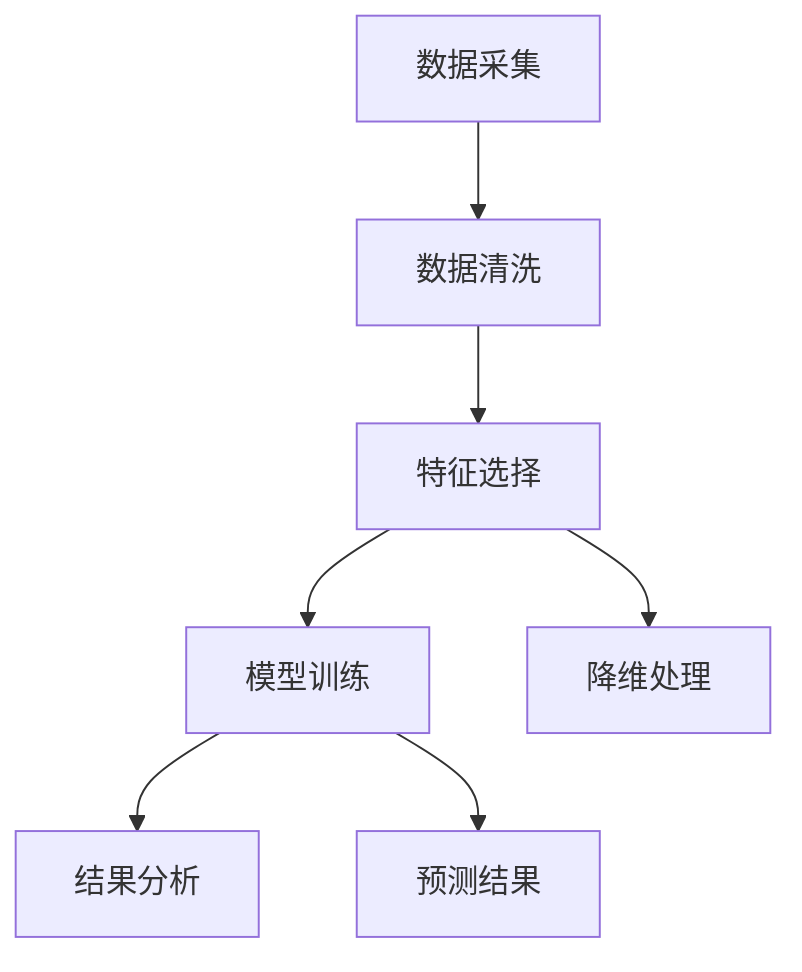
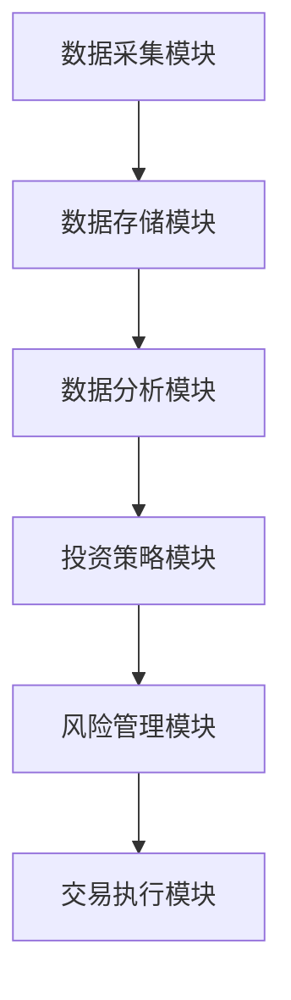

                 


# 特价股票投资中的Beta世代消费行为分析与风险管理

> 关键词：特价股票，Beta世代，消费行为，风险管理，数据分析，量化投资，系统架构

> 摘要：本文深入探讨了特价股票投资中的Beta世代消费行为分析与风险管理，结合数据分析和量化投资策略，构建了基于机器学习的消费行为预测模型，并设计了系统化的风险管理框架，提供了实践案例与优化建议。

---

## 第一部分：特价股票投资的背景与特点

### 第1章：特价股票投资的背景与特点

#### 1.1 特价股票的定义与特点

##### 1.1.1 特价股票的定义
特价股票（Cheap Stocks）通常指市盈率、市净率等估值指标低于市场平均水平的股票。这类股票往往被视为被市场低估的投资标的，适合长期投资者。

##### 1.1.2 特价股票的核心特点
- **低估值**：市盈率（P/E）和市净率（P/B）低于行业平均水平。
- **高股息率**：部分特价股票提供较高的股息收益率。
- **风险较高**：通常属于周期性行业或中小型企业，市场波动较大。

##### 1.1.3 特价股票投资的潜在机会
- **价值回归**：低估股票可能因市场重新评估而上涨。
- **高分红收益**：适合追求稳定收益的投资者。

#### 1.2 Beta世代的定义与特征

##### 1.2.1 Beta世代的基本定义
Beta世代通常指出生于1945年至1964年之间的婴儿潮一代，他们目前多处于50岁以上的年龄段。这一代人具有较强的储蓄意识和风险厌恶特征。

##### 1.2.2 Beta世代的消费行为特征
- **保守投资**：倾向于低风险投资，如债券、银行理财和特价股票。
- **注重价值**：偏好高分红、低估值的股票。
- **长期持有**：Beta世代更倾向于长期投资，避免频繁交易。

##### 1.2.3 Beta世代与股票投资的关系
Beta世代的消费行为对股票市场有显著影响，尤其是对特价股票的需求推动了市场的流动性。

---

### 第2章：Beta世代消费行为对特价股票投资的影响

#### 2.1 消费行为分析的背景与意义

##### 2.1.1 消费行为分析的背景
Beta世代的消费行为受经济周期、市场环境和个人风险偏好影响。

##### 2.1.2 消费行为分析的意义
- **指导投资决策**：通过分析Beta世代的消费行为，可以预测市场趋势。
- **优化投资组合**：帮助投资者选择适合的股票标的。

#### 2.2 数据采集与分析方法

##### 2.2.1 数据采集的渠道与方法
- **数据来源**：股票价格数据（Yahoo Finance）、宏观经济指标、消费者调研数据。
- **数据清洗**：处理缺失值、异常值。
- **数据预处理**：标准化、特征选择。

#### 2.3 消费行为分析的数学模型

##### 2.3.1 消费行为分析的数学模型
- **线性回归模型**：用于分析Beta世代消费行为的影响因素。
- **聚类分析**：将Beta世代投资者分为不同的消费群体。

##### 2.3.2 算法流程图


---

### 第3章：特价股票投资中的风险管理

#### 3.1 风险管理的基本概念

##### 3.1.1 风险管理的定义与目标
风险管理是指通过识别、评估和控制风险，以降低投资损失的过程。

##### 3.1.2 风险管理在股票投资中的重要性
- **保护投资本金**：避免重大损失。
- **提高投资收益**：通过分散投资降低风险。

#### 3.2 风险分析与量化

##### 3.2.1 风险分析的方法与工具
- **VaR模型**：衡量投资组合的最大可能损失。
- **现代投资组合理论**：通过资产配置分散风险。

##### 3.2.2 风险量化公式
- **VaR公式**：
  $$
  VaR = \mu + z \cdot \sigma
  $$
  其中，$\mu$是均值，$z$是标准正态分布的分位数，$\sigma$是标准差。

##### 3.2.3 风险控制策略
- **止损策略**：设定止损点，避免进一步亏损。
- **分散投资**：通过投资不同资产降低风险。

---

## 第二部分：数据分析与量化投资策略

### 第4章：数据分析与消费行为建模

#### 4.1 数据分析的工具与技术

##### 4.1.1 数据分析工具
- **Python**：使用Pandas、NumPy进行数据处理。
- **机器学习模型**：如XGBoost、Random Forest用于预测。

#### 4.2 消费行为建模的实现

##### 4.2.1 特征工程
- **特征选择**：筛选影响Beta世代消费行为的关键因素。
- **特征变换**：如标准化、归一化处理。

##### 4.2.2 模型训练与评估
- **训练过程**：使用训练数据训练模型。
- **评估指标**：如准确率、F1分数。

#### 4.3 数据可视化

##### 4.3.1 数据可视化工具
- **Matplotlib**：用于绘制折线图、散点图。
- **Seaborn**：用于绘制分布图、箱线图。

---

### 第5章：量化投资策略与风险管理

#### 5.1 量化投资策略的实现

##### 5.1.1 动量策略
- **动量策略**：基于过去的价格趋势进行投资。
- **实现代码**：
  ```python
  import pandas as pd
  import numpy as np

  # 示例代码：计算动量策略的收益
  def momentum_strategy(prices, window=20):
      returns = prices.pct_change().rolling(window).mean()
      return returns
  ```

##### 5.1.2 价值策略
- **价值策略**：基于低市盈率、低市净率选股。
- **实现代码**：
  ```python
  def value_strategy(stocks, window=12):
      pe_ratio = stocks['PE'].rolling(window).mean()
      pb_ratio = stocks['PB'].rolling(window).mean()
      return pe_ratio * pb_ratio
  ```

#### 5.2 风险管理框架的优化

##### 5.2.1 风险控制策略
- **动态调整**：根据市场变化实时调整投资组合。
- **风险分散**：通过多资产配置降低风险。

---

## 第三部分：系统架构与风险管理框架

### 第6章：系统架构设计

#### 6.1 系统功能设计

##### 6.1.1 功能模块
- **数据采集模块**：收集股票数据和消费者行为数据。
- **数据分析模块**：进行特征提取和建模。
- **投资策略模块**：生成投资建议和交易信号。

#### 6.2 系统架构图


#### 6.3 接口设计与交互流程

##### 6.3.1 系统接口设计
- **数据接口**：API接口用于数据交换。
- **用户界面**：供投资者查看分析结果和交易信号。

##### 6.3.2 交互流程图
```mermaid
graph TD
    User --> A[数据采集模块]: 请求数据
    A --> B[数据处理模块]: 处理数据
    B --> C[数据分析模块]: 分析数据
    C --> D[投资策略模块]: 生成策略
    D --> E[风险管理模块]: 控制风险
    E --> User: 提供投资建议
```

---

### 第7章：风险管理框架与案例分析

#### 7.1 风险管理框架的构建

##### 7.1.1 风险管理框架设计
- **风险识别**：识别潜在风险因素。
- **风险评估**：量化风险影响。
- **风险控制**：制定应对措施。

#### 7.2 案例分析与优化建议

##### 7.2.1 案例分析
- **案例背景**：Beta世代投资者在2020年经济危机期间的投资行为。
- **案例分析**：特价股票的表现与风险管理措施的有效性。

##### 7.2.2 优化建议
- **动态调整策略**：根据市场变化及时调整投资组合。
- **加强风险监控**：实时跟踪市场波动和投资者行为。

---

## 第四部分：总结与展望

### 第8章：总结与展望

#### 8.1 核心结论
- **消费行为分析**：Beta世代的消费行为对特价股票投资有显著影响。
- **风险管理**：有效的风险管理框架能够显著降低投资风险。

#### 8.2 未来展望
- **技术进步**：人工智能和大数据技术将进一步提升消费行为分析的准确性。
- **市场变化**：全球经济和政策变化将推动风险管理策略的创新。

---

## 第五部分：附录

### 附录A：常用数据分析工具

#### 1. Python库
- **Pandas**：数据处理。
- **NumPy**：数值计算。
- **Scikit-learn**：机器学习模型。

#### 2. 数据可视化工具
- **Matplotlib**：绘制图表。
- **Seaborn**：统计图表。

---

### 附录B：风险管理数学公式

#### 1. VaR公式
$$
VaR = \mu + z \cdot \sigma
$$

#### 2. 标准差公式
$$
\sigma = \sqrt{\frac{1}{N}\sum_{i=1}^{N}(x_i - \mu)^2}
$$

---

## 结语

通过本文的分析，我们深入探讨了Beta世代消费行为对特价股票投资的影响，并构建了系统化的风险管理框架。希望本文能够为投资者提供有价值的参考，帮助他们在复杂多变的市场中做出更明智的投资决策。

