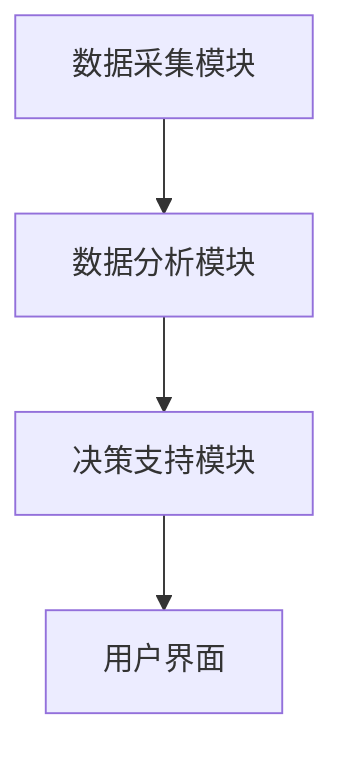

                 


# 特价股票投资中的产业互联网价值链分析方法

> 关键词：特价股票，产业互联网，价值链分析，数据挖掘，机器学习，投资策略

> 摘要：本文通过分析产业互联网的价值链，探讨如何利用这些价值链信息指导特价股票的投资决策。文章从产业互联网的核心概念出发，结合数据挖掘和机器学习算法，提出了一套完整的价值链分析方法，并通过实际案例展示了如何在特价股票投资中应用这些方法。

---

## 第一章：背景介绍

### 1.1 特价股票的定义与特点

#### 1.1.1 特价股票的定义
特价股票是指以低于市场价或内在价值的价格买入的股票。这种投资策略的核心在于发现市场中的价格波动，利用短期或长期的价格差异获利。

#### 1.1.2 特价股票的特点
- **价格低估**：特价股票通常被认为市场价格低于其真实价值。
- **市场流动性**：部分特价股票可能由于市场流动性不足导致价格被低估。
- **短期波动**：市场情绪和突发事件可能导致特价股票的价格波动。

#### 1.1.3 特价股票的投资价值
- **高回报潜力**：通过低价买入高价卖出，投资者可以获得超额回报。
- **风险与机会并存**：特价股票的价格波动较大，需要投资者具备较高的市场敏感性和风险控制能力。

---

### 1.2 产业互联网的核心概念

#### 1.2.1 产业互联网的定义
产业互联网是指将互联网技术与传统产业深度融合，通过数据化、智能化的方式优化传统产业的生产、管理和服务流程。

#### 1.2.2 产业互联网的核心特征
- **数据驱动**：通过数据采集和分析，优化产业链中的各个环节。
- **智能化**：利用人工智能和大数据技术，实现产业链的智能化管理。
- **协同效应**：产业互联网通过打通产业链上下游，实现资源的高效协同。

#### 1.2.3 产业互联网与传统互联网的区别
| 特性         | 传统互联网           | 产业互联网           |
|--------------|--------------------|--------------------|
| 应用场景     | 信息传递、服务提供   | 产业协同、数据驱动   |
| 技术特点     | 网络化、信息化       | 数据化、智能化       |
| 价值创造     | 提高效率、便利性     | 优化流程、降低成本   |

---

### 1.3 特价股票与产业互联网的结合

#### 1.3.1 特价股票在产业互联网中的应用
- **产业链分析**：通过分析产业互联网中的价值链，发现潜在的投资机会。
- **数据驱动决策**：利用产业互联网中的数据，判断股票的合理价格区间。

#### 1.3.2 产业互联网对特价股票投资的影响
- **数据支持**：产业互联网提供了丰富的数据来源，帮助投资者更准确地判断股票价值。
- **风险控制**：通过分析产业链的波动，投资者可以更好地控制投资风险。

#### 1.3.3 特价股票投资中的价值链分析意义
通过分析产业互联网中的价值链，投资者可以识别出那些由于市场低估或产业调整而被忽视的投资机会。

---

## 第二章：产业互联网价值链的核心要素

### 2.1 价值链的核心要素

#### 2.1.1 价值传递路径
产业互联网中的价值传递路径包括生产、流通、消费等环节，每个环节都可能影响股票的价值。

#### 2.1.2 关键节点分析
- **上游节点**：原材料供应商、技术提供方等。
- **中游节点**：生产制造企业、物流平台等。
- **下游节点**：销售终端、消费者等。

#### 2.1.3 价值创造与分配
通过分析产业链中的价值创造和分配，投资者可以识别出哪些环节对股票价值的影响最大。

---

### 2.2 价值链分析的数学模型

#### 2.2.1 价值链分析的基本模型
$$ \text{股票价值} = \sum_{i=1}^{n} w_i \cdot v_i $$
其中，\( w_i \) 是第 \( i \) 个环节的权重，\( v_i \) 是该环节的价值贡献。

#### 2.2.2 价值传递的数学表达
$$ \text{总价值} = \sum_{j=1}^{m} p_j \cdot q_j $$
其中，\( p_j \) 是第 \( j \) 个产品的价格，\( q_j \) 是销量。

---

## 第三章：基于数据挖掘的产业互联网价值链分析

### 3.1 数据采集与预处理

#### 3.1.1 数据来源
- **公开数据**：上市公司财报、行业报告等。
- **互联网数据**：电商平台、社交媒体等。

#### 3.1.2 数据清洗
- **去重**：去除重复数据。
- **填补缺失值**：使用均值、中位数等方法填补缺失值。

---

### 3.2 数据挖掘与分析

#### 3.2.1 算法选择
- **关联规则挖掘**：用于发现产业链中的相关性。
- **聚类分析**：用于识别相似的产业链环节。

#### 3.2.2 代码实现
```python
from sklearn.cluster import KMeans
import pandas as pd

# 假设df是已经预处理好的数据
# 使用K-means进行聚类分析
kmeans = KMeans(n_clusters=3)
clusters = kmeans.fit_predict(df)
print(clusters)
```

---

### 3.3 机器学习模型

#### 3.3.1 回归模型
$$ y = \beta_0 + \beta_1 x_1 + \beta_2 x_2 + \epsilon $$
其中，\( y \) 是股票价格，\( x_1 \) 和 \( x_2 \) 是影响价格的因素。

#### 3.3.2 分类模型
$$ P(y=1|x) = \sigma(\beta_0 + \beta_1 x_1) $$
其中，\( \sigma \) 是sigmoid函数，用于预测股票上涨的概率。

---

## 第四章：系统架构设计

### 4.1 系统功能设计

#### 4.1.1 数据采集模块
- 负责从互联网和数据库中采集相关数据。

#### 4.1.2 数据分析模块
- 使用机器学习算法对数据进行分析，生成价值链报告。

#### 4.1.3 决策支持模块
- 提供基于分析结果的投资建议。

---

### 4.2 系统架构图


---

## 第五章：项目实战

### 5.1 实战背景

#### 5.1.1 项目介绍
以某制造业的互联网化改造为例，分析其价值链。

---

### 5.2 核心代码实现

#### 5.2.1 数据清洗
```python
import pandas as pd

# 读取数据
df = pd.read_csv('data.csv')

# 去重
df = df.drop_duplicates()

# 填补缺失值
df['price'].fillna(df['price'].mean(), inplace=True)
```

---

## 第六章：总结与展望

### 6.1 总结
本文通过分析产业互联网中的价值链，提出了基于数据挖掘和机器学习的特价股票投资方法。

### 6.2 展望
未来的研究可以进一步结合实时数据和更复杂的模型，提升投资决策的准确性。

---

### 注意事项
- **数据质量**：确保数据来源可靠，避免虚假信息。
- **模型选择**：根据实际情况选择合适的算法，避免过度拟合。

---

### 最佳实践 Tips
- **持续学习**：关注行业动态和技术进步，及时调整投资策略。
- **风险控制**：设置止损点，避免重大损失。

---

通过以上分析，投资者可以更好地利用产业互联网中的价值链信息，做出更明智的特价股票投资决策。

