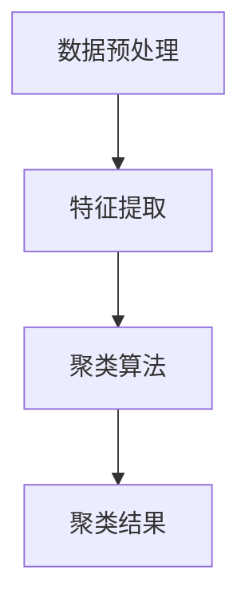
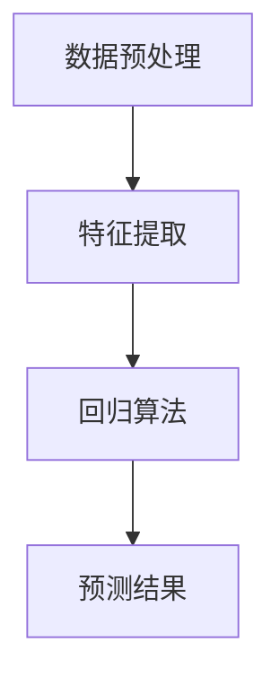
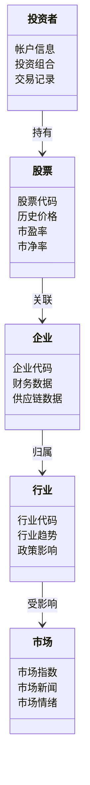
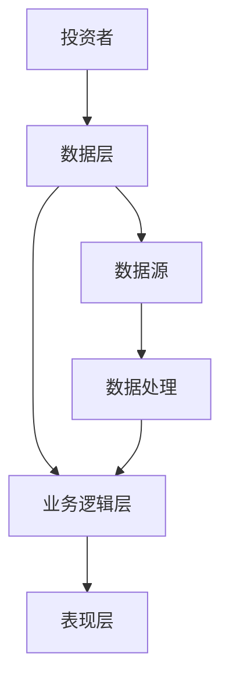
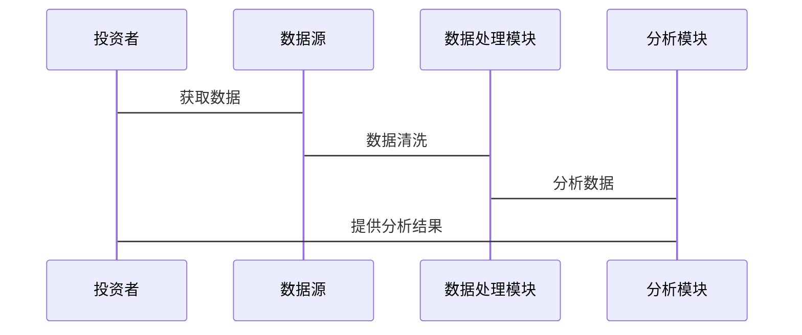

                 


# 特价股票投资中的产业互联网生态系统分析方法

> 关键词：特价股票，产业互联网，生态系统，数据分析，机器学习，系统架构

> 摘要：本文系统地介绍了特价股票投资中的产业互联网生态系统分析方法，从背景、概念、算法、系统架构到项目实战，全面阐述了如何利用产业互联网技术进行股票投资分析，提出了基于数据挖掘和机器学习的股票价格预测模型，结合系统架构设计和实际案例分析，为投资者提供了科学的投资决策支持。

---

# 第一部分: 特价股票投资中的产业互联网生态系统分析方法概述

## 第1章: 特价股票投资的背景与概念

### 1.1 特价股票投资的背景

#### 1.1.1 特价股票投资的定义与特点
特价股票投资是指投资者通过分析市场信息，寻找价格被市场低估的股票进行投资，以期获得超额收益的一种投资策略。其核心在于发现市场中的价格偏离价值的股票，通过长期持有或短期操作获利。

#### 1.1.2 互联网技术对股票投资的影响
随着互联网技术的快速发展，股票投资方式发生了根本性的变化。投资者可以通过互联网获取实时市场数据、公司财务信息、行业分析报告等，极大地提高了投资决策的效率和准确性。

#### 1.1.3 产业互联网的兴起与发展趋势
产业互联网是指通过互联网技术将产业链上下游的企业、资源和服务整合起来，形成协同发展的生态系统。产业互联网的兴起为股票投资提供了更广阔的数据来源和分析维度，使投资者能够更全面地评估企业的价值。

### 1.2 产业互联网生态系统的定义与特点

#### 1.2.1 产业互联网的定义
产业互联网是通过互联网技术将产业链中的企业、资源、服务等元素连接起来，形成一个协同发展的生态系统。它不仅包括企业的生产、销售、供应链等环节，还包括与之相关的市场、消费者等外部因素。

#### 1.2.2 产业互联网生态系统的核心要素
- **企业数据**：包括企业的财务数据、经营数据、供应链数据等。
- **市场数据**：包括股票价格、市场指数、行业趋势等。
- **消费者行为**：包括消费者的购买行为、偏好等。
- **技术平台**：包括数据分析平台、人工智能平台等。

#### 1.2.3 产业互联网与股票投资的结合
产业互联网为股票投资提供了更丰富的数据来源和分析工具。投资者可以通过产业互联网生态系统获取企业的全产业链数据，从而更准确地评估企业的价值和风险。

---

## 第2章: 特价股票投资中的产业互联网生态系统分析方法

### 2.1 产业互联网生态系统分析的核心概念

#### 2.1.1 产业互联网生态系统的核心原理
产业互联网生态系统通过整合产业链中的数据，利用大数据分析和人工智能技术，为投资者提供全面的市场洞察和投资建议。其核心原理在于通过数据的整合和分析，发现市场中的投资机会和风险。

#### 2.1.2 核心概念的属性特征对比表格
| 核心概念 | 属性特征 |
|----------|----------|
| 数据来源 | 多样化、实时性、准确性 |
| 分析方法 | 数据挖掘、机器学习、统计分析 |
| 投资策略 | 个性化、精准化、风险可控 |

#### 2.1.3 ER实体关系图架构的 Mermaid 流程图

```mermaid
erDiagram
    customer[投资者] --> invests[投资行为]
    invests --> stock[股票]
    stock --> company[企业]
    company --> industry[行业]
    industry --> market[市场]
    market --> data_source[数据源]
    data_source --> analysis[数据分析]
    analysis --> prediction[预测模型]
    prediction --> decision[投资决策]
```

---

## 第3章: 特价股票投资中的算法原理

### 3.1 数据挖掘与机器学习在股票投资中的应用

#### 3.1.1 数据挖掘技术在股票分析中的作用
数据挖掘技术可以帮助投资者从海量数据中提取有用的信息，发现数据中的模式和趋势。例如，通过关联规则挖掘，可以发现某些股票价格与市场指数之间的关联性。

#### 3.1.2 机器学习算法在股票预测中的应用
机器学习算法可以用于股票价格预测。例如，利用回归分析预测股票价格的趋势，利用聚类分析发现具有相似价格走势的股票。

#### 3.1.3 聚类分析与回归分析的原理与 Mermaid 流程图

##### 聚类分析


##### 回归分析


### 3.2 特价股票投资中的数学模型与公式

#### 3.2.1 市盈率与市净率的计算公式
- 市盈率（P/E）= 股票价格 / 每股净利润
- 市净率（P/B）= 股票价格 / 每股净资产

#### 3.2.2 股票价格预测的数学模型
股票价格预测可以基于历史数据和市场信息，构建回归模型：
$$
y = \beta_0 + \beta_1x_1 + \beta_2x_2 + \cdots + \beta_nx_n + \epsilon
$$
其中，$y$ 是预测的股票价格，$x_i$ 是影响股票价格的特征，$\beta_i$ 是回归系数，$\epsilon$ 是误差项。

#### 3.2.3 数据分析与预测的数学公式
利用机器学习算法进行股票价格预测：
$$
f(x) = \text{预测的股票价格}
$$

---

## 第4章: 产业互联网生态系统分析的系统架构设计

### 4.1 问题场景介绍

#### 4.1.1 特价股票投资中的数据采集与处理
投资者需要从多个数据源获取股票相关信息，包括历史价格、财务数据、市场新闻等。

#### 4.1.2 产业互联网生态系统的数据源分析
产业互联网生态系统提供了丰富的数据源，包括企业数据、市场数据、消费者行为数据等。

#### 4.1.3 系统功能设计的领域模型 Mermaid 类图



### 4.2 系统架构设计

#### 4.2.1 系统架构的分层设计
- **数据层**：存储股票、企业、行业等数据。
- **业务逻辑层**：处理数据分析、预测等业务逻辑。
- **表现层**：提供用户界面，展示分析结果。

#### 4.2.2 系统架构 Mermaid 图



#### 4.2.3 系统接口设计和交互 Mermaid 序列图



---

## 第5章: 项目实战

### 5.1 环境安装与配置

#### 5.1.1 安装 Python 和相关库
```bash
pip install numpy pandas scikit-learn matplotlib
```

#### 5.1.2 安装数据分析工具
- **Jupyter Notebook**：用于数据可视化和分析。
- **PyCharm**：用于编写和调试代码。

### 5.2 系统核心实现源代码

#### 5.2.1 数据采集与处理
```python
import pandas as pd
import requests

# 获取股票数据
url = "https://api.example.com/stock_data"
response = requests.get(url)
data = response.json()
df = pd.DataFrame(data)
```

#### 5.2.2 数据分析与预测
```python
from sklearn.linear_model import LinearRegression

# 数据预处理
X = df[['市盈率', '市净率']]
y = df['股价']

# 训练模型
model = LinearRegression()
model.fit(X, y)

# 预测股价
new_data = [[15, 5]]
prediction = model.predict(new_data)
print(prediction)
```

### 5.3 代码应用解读与分析
通过上述代码，投资者可以利用历史数据和机器学习模型预测股票价格。数据预处理包括特征选择和数据清洗，模型训练使用线性回归算法，预测结果可以为投资者提供参考。

### 5.4 实际案例分析
以某科技公司为例，通过数据分析发现其市盈率和市净率均低于行业平均水平，但市场预期较高，预测其股价有上涨空间。

### 5.5 项目小结
通过项目实战，投资者可以掌握如何利用产业互联网技术进行股票数据分析和预测，提高投资决策的科学性。

---

## 第6章: 最佳实践

### 6.1 小结
本文系统地介绍了特价股票投资中的产业互联网生态系统分析方法，从理论到实践，全面阐述了如何利用互联网技术提高投资效率和准确性。

### 6.2 注意事项
- 数据来源的可靠性至关重要，建议使用权威数据源。
- 模型的预测结果仅供参考，投资需谨慎。

### 6.3 拓展阅读
- 推荐阅读《算法交易：执行与解读》和《大数据投资：从量化分析到财富自由》。

---

通过本文的分析与实践，投资者可以更好地利用产业互联网生态系统进行股票投资，提高投资收益和风险控制能力。

