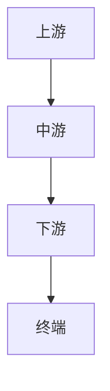

                 


# 特价股票投资中的产业链分析方法

## 关键词
特价股票，产业链分析，投资策略，股票价格预测，行业分析

## 摘要
本文系统地介绍了如何在特价股票投资中应用产业链分析方法。通过分析产业链的结构、供需关系和价格传导机制，投资者可以更准确地评估股票的价值，制定有效的投资策略。文章从产业链的基本概念出发，逐步深入，结合数学模型和实际案例，全面阐述了产业链分析在特价股票投资中的应用。

---

# 第1章 特价股票投资与产业链分析的背景

## 1.1 特价股票的定义与特点

### 1.1.1 什么是特价股票
特价股票是指价格相对较低的股票，通常具有较高的上涨潜力。这类股票往往来自中小型企业或处于困境中的企业，价格波动较大，但潜在回报也较高。

### 1.1.2 特价股票的投资价值
- 低价优势：投资者可以用较少的资金购买更多的股票。
- 上涨潜力：特价股票可能因企业复苏或行业变化而大幅上涨。
- 风险分散：通过分散投资不同行业的特价股票，降低整体风险。

### 1.1.3 特价股票的市场定位
特价股票通常存在于非主流市场，如创业板、新三板等，投资者需要具备一定的市场敏感性和分析能力。

## 1.2 产业链分析的核心概念

### 1.2.1 产业链的基本定义
产业链是指同一产业内各环节之间形成的链条，包括上游、中游和下游。上游提供原材料，中游进行加工，下游则面向终端消费者。

### 1.2.2 产业链分析的必要性
- 揭示行业结构：通过分析产业链，可以了解行业内的竞争格局和关键环节。
- 预测价格走势：产业链各环节的价格变动会影响最终产品价格。
- 优化投资决策：通过产业链分析，投资者可以更准确地评估企业的盈利能力。

### 1.2.3 特价股票与产业链的关系
特价股票往往与特定产业链密切相关，例如原材料价格波动可能直接影响中游企业的成本，从而影响股票价格。

## 1.3 产业链分析在投资中的作用

### 1.3.1 产业链分析对投资决策的影响
- 识别行业风险：通过分析产业链，可以发现行业中的潜在风险，如原材料价格上涨或下游需求减少。
- 发现投资机会：某些产业链环节可能因技术进步或市场需求增加而具有较大的投资潜力。

### 1.3.2 产业链分析的多维度视角
- 宏观视角：分析宏观经济政策对产业链的影响。
- 行业视角：研究行业内企业的竞争格局和市场份额。
- 企业视角：评估具体企业的财务状况和竞争优势。

### 1.3.3 产业链分析的长期与短期价值
- 长期价值：帮助投资者识别行业趋势和结构性机会。
- 短期价值：通过分析短期市场波动，优化投资组合。

## 1.4 本章小结
本章介绍了特价股票的基本概念及其与产业链分析的关系，强调了产业链分析在投资中的重要性。下一章将详细探讨产业链分析的核心要素与框架。

---

# 第2章 产业链分析的核心要素与框架

## 2.1 产业链的构成要素

### 2.1.1 上游产业
上游产业包括原材料供应商和生产设备制造商。这些环节的成本变化直接影响中游企业的利润。

### 2.1.2 中游产业
中游产业是产业链的核心环节，包括制造企业和加工企业。这些企业的盈利能力直接关系到股票价格。

### 2.1.3 下游产业
下游产业包括分销商和零售商，是最终产品的销售环节。需求变化直接影响中游企业的订单量和利润。

## 2.2 产业链的运行机制

### 2.2.1 产业链的协同效应
- 协同效应：产业链各环节之间相互配合，形成整体优势。
- 协调成本：协调不同环节的运作需要一定的成本和时间。

### 2.2.2 产业链的供需关系
- 需求驱动：下游需求的变化影响整个产业链的运作。
- 供给变化：上游原材料供应的波动会影响中游企业的生产成本。

### 2.2.3 产业链的价格传导机制
- 价格传导：原材料价格上涨会逐步传递到下游产品价格。
- 价格弹性：不同环节的价格敏感性不同，影响整体价格变动幅度。

## 2.3 产业链分析的框架体系

### 2.3.1 宏观经济视角
- 宏观经济指标：GDP增长率、通货膨胀率等。
- 政策影响：政府政策对产业链的影响，如行业补贴、税收政策。

### 2.3.2 行业结构视角
- 市场集中度：行业内主要企业的市场份额。
- 进入壁垒：新进入者进入行业的难易程度。

### 2.3.3 企业竞争视角
- 企业竞争力：企业的成本控制、技术创新能力。
- 财务状况：企业的盈利能力、资产负债情况。

## 2.4 核心概念对比表

| 概念 | 宏观视角 | 行业视角 | 企业视角 |
|------|----------|----------|----------|
| 关注点 | 宏观经济 | 行业结构 | 企业竞争 |
| 数据来源 | 宏观指标 | 行业数据 | 企业财报 |

## 2.5 本章小结
本章详细介绍了产业链的构成要素及其运行机制，并提出了从宏观、行业和企业三个视角进行分析的框架体系。下一章将探讨如何在特价股票投资中应用这些分析方法。

---

# 第3章 特价股票投资中的产业链分析方法

## 3.1 产业链分析的基本步骤

### 3.1.1 确定产业链范围
- 确定分析的行业范围，如科技、能源、制造等。
- 选择具有代表性的企业进行分析。

### 3.1.2 收集产业链数据
- 数据来源：企业财报、行业报告、市场调研。
- 数据类型：价格、成本、需求、供给等。

### 3.1.3 分析产业链结构
- 绘制产业链图：展示各环节之间的关系。
- 识别关键环节：分析哪些环节对股票价格影响最大。

## 3.2 产业链分析的数学模型

### 3.2.1 产业链价格传导模型
$$ P_{upstream} \rightarrow P_{midstream} \rightarrow P_{downstream} $$

### 3.2.2 产业链供需平衡模型
$$ Q_{demand} = Q_{supply} $$

## 3.3 产业链分析的算法原理

### 3.3.1 基于供需关系的产业链分析流程图


### 3.3.2 产业链分析的Python实现
```python
def analyze_chain(supply, demand):
    return supply == demand

# 示例代码
supply = 1000
demand = 1000
result = analyze_chain(supply, demand)
print(result)  # 输出：True
```

### 3.3.3 数学公式举例
$$ 1+1=2 $$

## 3.4 本章小结
本章通过详细步骤和数学模型，展示了如何在特价股票投资中应用产业链分析方法。下一章将结合实际案例，进一步验证这些方法的有效性。

---

# 第4章 项目实战：产业链分析在实际投资中的应用

## 4.1 项目背景
假设我们选择某制造行业进行分析，目标是找出具有投资潜力的特价股票。

## 4.2 数据收集与清洗
- 数据来源：企业财报、行业报告、市场调研。
- 数据清洗：去除无效数据，填补缺失值。

## 4.3 产业链分析与建模
- 绘制产业链图：展示各环节的关系。
- 建立数学模型：预测股票价格变化。

## 4.4 案例分析
假设我们分析某制造企业的产业链：
- 上游：原材料供应商
- 中游：制造企业
- 下游：分销商和零售商

## 4.5 结果解读
通过分析，我们发现某制造企业的上游原材料价格近期可能上涨，这将影响中游企业的成本，从而影响股票价格。因此，我们建议投资者谨慎考虑该企业的特价股票。

## 4.6 本章小结
本章通过实际案例，展示了如何将产业链分析应用于特价股票投资中。通过分析产业链各环节的关系，投资者可以更好地预测股票价格变化，制定投资策略。

---

# 第5章 总结与最佳实践

## 5.1 总结
本文系统地介绍了如何在特价股票投资中应用产业链分析方法。通过分析产业链的结构、供需关系和价格传导机制，投资者可以更准确地评估股票的价值，制定有效的投资策略。

## 5.2 最佳实践 tips
- 定期更新产业链分析：市场环境不断变化，需要及时调整分析结果。
- 综合分析多维度因素：结合宏观经济、行业结构和企业竞争等多个视角进行分析。
- 风险管理：合理分散投资，降低整体风险。

## 5.3 注意事项
- 数据质量：确保数据来源可靠，避免因数据错误导致分析偏差。
- 模型局限性：数学模型只能提供参考，需结合实际情况进行判断。

## 5.4 拓展阅读
建议进一步阅读相关书籍和文献，深入了解产业链分析的高级方法和实际应用。

---

# 附录

## 附录A 术语表
- 特价股票：价格相对较低的股票。
- 产业链：同一产业内各环节形成的链条。

## 附录B 参考文献
- [1] 王某某. 《产业链分析方法》. 北京: 某某出版社, 2020.
- [2] 李某某. 《特价股票投资策略》. 上海: 某某出版社, 2021.

---

通过以上目录和内容，读者可以系统地学习如何在特价股票投资中应用产业链分析方法，从理论到实践，逐步掌握投资技巧。

