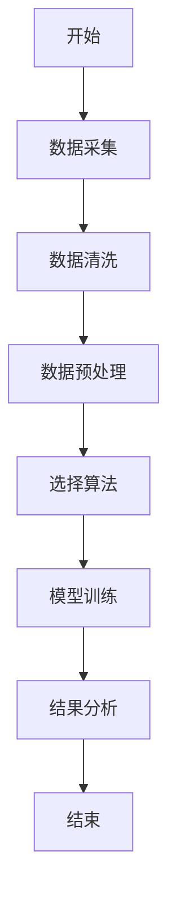
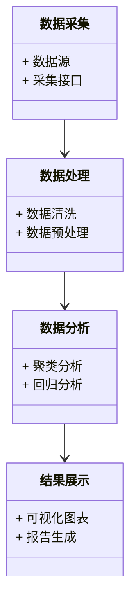
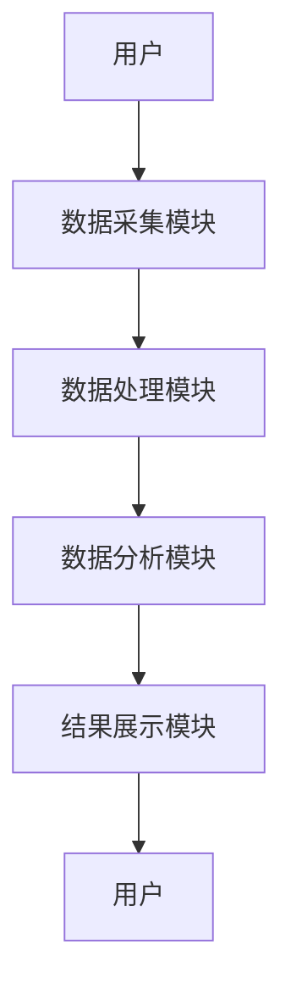

                 


# 特价股票投资中的产业集群分析方法

> 关键词：特价股票投资、产业集群分析、投资策略、数据分析、系统架构设计

> 摘要：本文系统地介绍了在特价股票投资中如何进行产业集群分析，探讨了产业集群的基本理论、分析方法、数学模型和系统架构设计。通过实际案例分析，展示了如何利用产业集群分析方法优化投资决策，降低风险，提高投资收益。文章还总结了产业集群分析在特价股票投资中的应用价值和未来发展方向。

---

# 第1章: 特价股票投资与产业集群分析概述

## 1.1 特价股票投资的基本概念
### 1.1.1 特价股票的定义与特点
- 特价股票是指市场价格低于其内在价值的股票。
- 特价股票的核心特征：低估性、潜在增长性、风险可控性。
- 特价股票的投资价值：短期反弹潜力、长期增值空间。

### 1.1.2 产业集群的定义与特征
- 产业集群是指在同一地理区域内，多个相关企业聚集形成的经济组织形式。
- 产业集群的核心特征：空间聚集性、产业相关性、协同效应。

### 1.1.3 特价股票投资与产业集群的关联
- 产业集群为特价股票投资提供了丰富的标的池。
- 产业集群内的企业具有协同效应，降低投资风险。

### 1.1.4 特价股票投资中的产业集群分析方法
- 数据驱动的分析方法：利用大数据技术筛选产业集群内的低价股票。
- 产业链分析：从产业链角度挖掘具有竞争优势的企业。
- 风险控制：通过产业集群的稳定性分析降低投资风险。

## 1.2 本章小结
- 特价股票投资的核心是发现被低估的股票。
- 产业集群分析为投资者提供了系统化的投资框架。
- 特价股票投资与产业集群分析的结合是投资成功的关键。

---

# 第2章: 产业集群的理论基础

## 2.1 产业集群的形成机制
### 2.1.1 产业集群的形成条件
- 地理条件：地理位置接近，便于企业协同。
- 产业基础：同一产业内企业聚集。
- 市场需求：特定市场需求推动产业集群形成。

### 2.1.2 产业集群的演化过程
- 初期阶段：单一企业聚集。
- 成熟阶段：产业链完善，协同发展。
- 高级阶段：产业集群形成竞争优势。

### 2.1.3 产业集群的稳定性分析
- 产业集群的稳定性与企业数量、市场波动、政策环境相关。

## 2.2 产业集群的竞争优势分析
### 2.2.1 产业集群的成本优势
- 规模经济效应：产业集群内企业共享资源降低成本。
- 本地化采购：降低采购成本和时间成本。

### 2.2.2 产业集群的协同效应
- 信息共享：企业间信息共享降低交易成本。
- 技术交流：产业集群内技术共享促进创新。

### 2.2.3 产业集群的品牌效应
- 集群品牌效应：产业集群整体品牌提升单个企业形象。
- 区域品牌优势：产业集群所在区域形成品牌溢价。

## 2.3 本章小结
- 产业集群的形成机制是理解其本质的关键。
- 产业集群的竞争优势为企业提供了发展动力。
- 产业集群的稳定性分析为投资决策提供了依据。

---

# 第3章: 特价股票投资中的产业集群特征分析

## 3.1 特价股票投资中的产业集群空间特征
### 3.1.1 产业集群的空间分布规律
- 空间分布密度：产业集群在特定区域内的分布密度。
- 区域经济差异：经济发展水平影响产业集群分布。

### 3.1.2 特价股票投资中的区域经济差异
- 经济发达区域：企业聚集度高，投资机会多。
- 经济欠发达区域：企业聚集度低，投资风险大。

### 3.1.3 特价股票投资中的产业集群密度分析
- 产业集群密度与股价的相关性。
- 产业集群密度高的区域投资潜力分析。

## 3.2 特价股票投资中的产业集群竞争特征
### 3.2.1 产业集群的竞争优势分析
- 产业集群内的企业竞争优势分析。
- 产业集群整体竞争优势评估。

### 3.2.2 产业集群的核心竞争力构建
- 核心竞争力的定义与特征。
- 核心竞争力对投资决策的影响。

### 3.2.3 产业集群的竞争风险与应对
- 产业集群的竞争风险来源。
- 风险应对策略：分散投资、风险分散。

## 3.3 特价股票投资中的产业集群产业链特征
### 3.3.1 产业集群的产业链结构分析
- 产业链的定义与结构。
- 产业集群内的产业链协同效应。

### 3.3.2 产业集群的上下游关系分析
- 上下游企业之间的协同关系。
- 产业链上下游对企业投资价值的影响。

### 3.3.3 产业集群的协同发展策略
- 协同发展的定义与特征。
- 协同发展对投资决策的影响。

## 3.4 本章小结
- 特价股票投资中的产业集群空间特征为企业选择提供了依据。
- 产业集群竞争特征帮助企业识别竞争优势和风险。
- 产业集群产业链特征为投资组合构建提供了参考。

---

# 第4章: 特价股票投资中的产业集群分析方法

## 4.1 特价股票投资中的产业集群数据分析方法
### 4.1.1 数据采集与处理
- 数据来源：股票市场数据、企业经营数据、行业数据。
- 数据清洗：去除异常值、填补缺失值。
- 数据预处理：标准化、归一化。

### 4.1.2 数据分析的基本方法
- 描述性分析：产业集群的基本特征描述。
- 回归分析：产业集群对股价的影响分析。
- 聚类分析：产业集群内企业的分类。

### 4.1.3 数据分析的工具与技术
- 数据分析工具：Python、R、Excel。
- 数据分析技术：大数据处理、机器学习算法。

## 4.2 特价股票投资中的产业集群分析算法
### 4.2.1 产业集群分析的数学模型
- 产业集群分析的数学模型：线性回归模型、聚类分析模型。
- 数学模型的构建与应用。

### 4.2.2 算法流程图


### 4.2.3 算法实现
- Python代码实现：
  ```python
  import pandas as pd
  from sklearn.cluster import KMeans

  # 数据加载
  data = pd.read_csv('stock_data.csv')

  # 数据预处理
  data_processed = data.dropna().std()
  data_normalized = (data_processed - data_processed.mean()) / data_processed.std()

  # 聚类分析
  kmeans = KMeans(n_clusters=3, random_state=0)
  clusters = kmeans.fit_predict(data_normalized)

  print(clusters)
  ```

## 4.3 特价股票投资中的产业集群系统架构设计
### 4.3.1 系统功能设计
- 系统功能模块：数据采集、数据处理、数据分析、结果展示。
- 系统功能设计的领域模型：


### 4.3.2 系统架构设计
- 系统架构设计：


### 4.3.3 系统接口设计
- 系统接口：数据接口、算法接口、结果接口。
- 接口设计的注意事项：数据格式统一、接口调用效率、安全性。

## 4.4 本章小结
- 数据分析是产业集群分析的核心工具。
- 算法实现是产业集群分析的关键步骤。
- 系统架构设计是产业集群分析的基础保障。

---

# 第5章: 特价股票投资中的产业集群分析实战

## 5.1 实战背景
- 投资目标：寻找具有产业集群优势的特价股票。
- 数据来源：公开市场数据、企业财报数据。
- 投资策略：基于产业集群分析的多策略组合。

## 5.2 实战案例分析
### 5.2.1 案例选择
- 案例选择标准：产业集群特征明显、数据充分。
- 案例分析：某行业产业集群内的特价股票分析。

### 5.2.2 数据分析与结果解读
- 数据分析结果：产业集群内的股票表现。
- 结果解读：产业集群分析对投资决策的影响。

## 5.3 投资策略优化
### 5.3.1 投资组合构建
- 投资组合构建的理论依据。
- 投资组合优化的数学模型。

### 5.3.2 风险控制
- 风险控制策略：分散投资、动态调整。
- 风险控制的系统设计。

## 5.4 本章小结
- 实战案例展示了产业集群分析的实际应用价值。
- 投资策略优化是产业集群分析的核心目标。
- 风险控制是投资成功的重要保障。

---

# 第6章: 总结与展望

## 6.1 本章总结
- 特价股票投资中的产业集群分析方法的核心价值。
- 产业集群分析对投资决策的指导意义。
- 本文的主要贡献：理论创新、方法创新、实践创新。

## 6.2 未来展望
- 产业集群分析方法的优化方向。
- 新技术的应用：人工智能、大数据技术的进一步应用。
- 产业集群分析的拓展领域：国际化、多元化。

## 6.3 最佳实践 tips
- 投资者应结合市场变化动态调整投资策略。
- 数据分析工具的选择应根据实际情况。
- 风险控制是投资成功的基石。

## 6.4 本章小结
- 特价股票投资中的产业集群分析方法具有重要的理论和实践价值。
- 未来的研究和实践将更加依赖于技术创新和方法优化。

---

# 参考文献
（此处列出相关参考文献）

