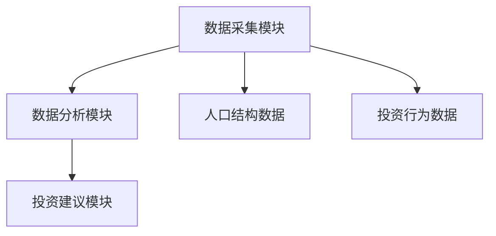
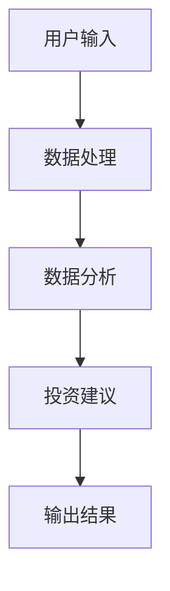

                 


```markdown
# 特价股票投资中的人口结构数字代际价值观转移趋势考量

## 关键词：
- 特价股票投资
- 人口结构
- 数字代际
- 价值观转移
- 股票市场趋势

## 摘要：
本文深入探讨了人口结构和数字代际价值观转移趋势对特价股票投资的影响。通过分析不同年龄段人群的投资行为差异，结合数学模型和系统设计，提出了基于人口结构和代际价值观的股票投资策略。文章从理论分析到系统实现，全面展示了如何利用人口统计数据和数字代际行为特征，优化投资决策。

---

## 第一部分：人口结构与股票市场的关系

### 第1章：人口结构对股票市场的影响

#### 1.1 人口结构的基本概念
- **定义**：人口结构指一个国家或地区内不同年龄段人口的分布情况。
- **指标**：包括年龄中位数、劳动年龄人口比例、老年人口比例等。
- **影响因素**：经济发展水平、生育率、寿命 expectancy、移民政策等。

#### 1.2 不同年龄段对股票市场的投资行为
- **年轻人群**：倾向于高风险高回报的投资，如科技股和成长股。
- **中年群体**：注重稳健投资，偏好蓝筹股和红利股。
- **老年群体**：更倾向于低风险投资，如债券和稳定收益的股票。

#### 1.3 人口结构变化对股票市场的影响
- **人口红利期**：劳动年龄人口比例高，推动经济增长，股市上涨。
- **人口老龄化**：老年比例增加，投资趋于保守，股市可能面临压力。
- **人口结构优化**：年轻人口比例增加，推动创新和高增长行业的发展。

---

### 第2章：数字代际与投资行为

#### 2.1 数字代际的定义与特征
- **数字原住民**：出生于数字时代，熟悉互联网和新技术。
- **数字移民**：较晚接触数字技术，适应能力较慢。
- **投资行为差异**：数字原住民更倾向于利用数字化工具和平台进行投资，而数字移民则更依赖传统金融机构。

#### 2.2 数字代际对股票投资的影响
- **投资渠道**：年轻一代更倾向于通过互联网和移动应用进行投资，而年长一代更依赖传统银行和经纪人。
- **信息获取**：数字代际能够快速获取实时信息，利用大数据和人工智能进行分析，而传统代际则依赖于历史经验和市场研究。
- **投资偏好**：年轻一代更关注科技、人工智能和绿色能源等新兴行业，而年长一代更关注传统行业和红利股。

#### 2.3 价值观转移对股票市场的影响
- **价值观变化**：年轻一代注重社会责任和可持续发展，倾向于投资环保和科技公司。
- **投资决策**：年长一代更注重财务安全和稳定收益，倾向于低风险投资。

---

## 第二部分：数学模型与系统设计

### 第3章：数学模型建立

#### 3.1 模型假设
- 不同年龄段的人口比例与股票市场的波动相关。
- 数字代际的投资行为影响股票市场的短期和长期趋势。
- 价值观转移对投资偏好有显著影响。

#### 3.2 模型构建
- **人口结构指数**：计算不同年龄段人口比例的加权指数。
- **数字代际影响指数**：基于互联网使用率和投资行为数据，构建影响指数。
- **综合影响模型**：结合人口结构指数和数字代际影响指数，预测股票市场的趋势。

#### 3.3 模型验证
- 使用历史数据验证模型的有效性。
- 比较模型预测结果与实际市场数据的差异。

### 第4章：系统架构设计

#### 4.1 系统功能模块
- 数据采集模块：收集人口结构数据和投资行为数据。
- 数据分析模块：利用数学模型分析数据，预测股票市场趋势。
- 投资建议模块：基于分析结果，提供投资建议。

#### 4.2 系统架构图


#### 4.3 数据流图


---

### 第5章：系统实现与实战

#### 5.1 环境配置
- **工具安装**：安装Python、Pandas、Matplotlib、Scikit-learn等库。
- **数据源**：获取人口结构数据和股票市场数据。

#### 5.2 核心代码实现
```python
import pandas as pd
import numpy as np
from sklearn.linear_model import LinearRegression

# 数据加载
population_data = pd.read_csv('population.csv')
stock_data = pd.read_csv('stock.csv')

# 数据预处理
population_data = population_data.dropna()
stock_data = stock_data.dropna()

# 模型训练
model = LinearRegression()
model.fit(population_data[['age_ratio']], stock_data['price'])

# 模型预测
predicted_price = model.predict(population_data[['age_ratio']])
```

#### 5.3 实战案例分析
- **案例背景**：分析某地区的人口结构变化对股票市场的影响。
- **数据分析**：利用模型预测股票价格变化。
- **结果解读**：根据预测结果制定投资策略。

---

### 第6章：总结与展望

#### 6.1 小结
- 本文通过分析人口结构和数字代际价值观的变化，提出了基于数学模型的投资策略。
- 结合系统设计和实战案例，验证了模型的有效性。

#### 6.2 展望
- 进一步研究其他因素对股票市场的影响。
- 开发更复杂的模型，结合更多数据源进行分析。
- 探讨人工智能在股票投资中的应用。

---

## 结语：
本文从理论分析到系统实现，全面探讨了人口结构和数字代际价值观转移趋势对特价股票投资的影响。通过数学模型和系统设计，为投资者提供了科学的决策依据。
```

