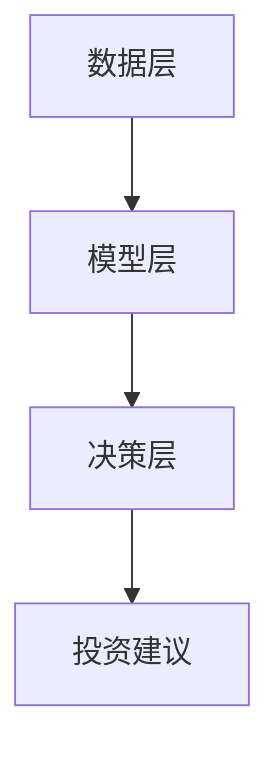
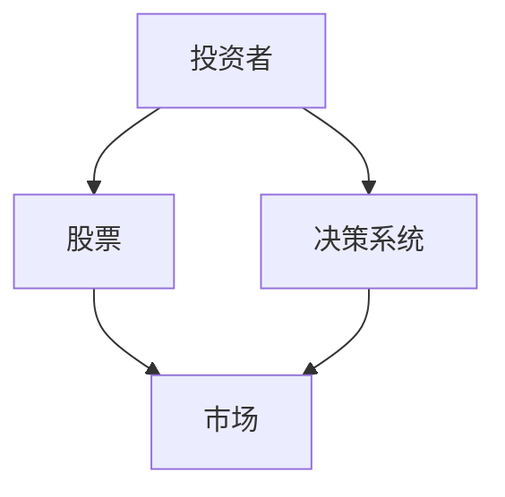

                 

# 特价股票投资中的人工智能辅助决策系统

> 关键词：人工智能，股票投资，决策系统，随机森林，数据挖掘，金融分析

> 摘要：本文探讨了如何利用人工智能技术构建辅助决策系统，以优化特价股票投资的决策过程。通过分析特价股票的特点和人工智能在金融领域的应用，结合具体的技术实现和案例分析，展示了如何利用机器学习模型实现股票市场预测和投资决策优化。

---

## 第1章: 特价股票投资的定义与特点

### 1.1 特价股票的定义
特价股票是指在特定条件下价格低于正常市场价的股票。这类股票通常出现在市场波动、公司重组、行业调整等情况下，具有价格波动大、风险高、收益潜力大的特点。

#### 1.1.1 特价股票的定义与分类
特价股票可以根据市场环境、公司基本面、行业特性等因素进行分类。常见的分类包括：
- 市场波动型特价股票：由于市场波动导致的价格下跌。
- 公司基本面型特价股票：公司财务状况不佳导致的股价下跌。
- 行业调整型特价股票：行业政策变化或竞争加剧导致的股价下跌。

#### 1.1.2 特价股票的投资特点
特价股票投资具有高风险、高回报、短期性等特点。投资者需要具备较高的市场敏感性和风险承受能力，同时需要依赖专业的分析工具和决策支持系统来提高投资成功率。

#### 1.1.3 特价股票与普通股票的区别
与普通股票相比，特价股票具有以下区别：
- 价格波动更大。
- 风险更高。
- 投资周期更短。

### 1.2 特价股票投资的基本原理
特价股票投资的基本原理是通过分析市场信息和公司基本面，寻找价格被低估的股票进行投资。

#### 1.2.1 特价股票投资的基本流程
1. 数据收集：收集市场数据、公司财务数据、行业信息等。
2. 数据分析：通过技术分析和基本面分析，识别潜在的投资机会。
3. 投资决策：根据分析结果，制定投资策略并执行交易。
4. 风险管理：监控投资组合，及时调整策略，降低风险。

#### 1.2.2 特价股票市场的波动特性
特价股票市场具有高度波动性，价格受市场情绪、突发事件等因素影响较大。投资者需要具备快速反应能力，同时依赖技术手段提高决策效率。

#### 1.2.3 特价股票投资的风险与收益分析
特价股票投资的风险主要来自市场波动和公司基本面变化。高风险伴随着高收益，但投资者需要具备专业的知识和工具来应对市场变化。

---

## 第2章: 人工智能在金融领域的应用

### 2.1 人工智能在金融领域的应用现状
人工智能在金融领域的应用日益广泛，特别是在股票投资、风险管理、交易执行等方面。

#### 2.1.1 人工智能在金融领域的核心应用
- 股票预测：通过机器学习模型预测股票价格走势。
- 风险管理：利用AI技术识别市场风险，优化投资组合。
- 交易执行：自动化交易系统提高交易效率和准确性。

#### 2.1.2 人工智能在股票投资中的优势
- 数据处理能力：AI可以处理海量数据，发现数据中的规律。
- 模型优化：通过不断优化模型参数，提高预测准确性。
- 自动化决策：AI可以实现自动化交易和投资决策。

#### 2.1.3 人工智能在金融领域的未来发展趋势
随着技术的进步，AI在金融领域的应用将更加智能化和个性化。未来的趋势包括：
- 更加精准的预测模型。
- 更加智能化的投资顾问。
- 更加个性化的投资策略。

### 2.2 人工智能辅助股票投资的必要性
特价股票投资的复杂性和不确定性使得AI辅助决策成为必要。

#### 2.2.1 特价股票投资中的信息不对称问题
市场信息不对称导致投资者难以获取全面的数据，影响投资决策。AI可以通过大数据分析解决信息不对称问题。

#### 2.2.2 人工智能在数据处理与分析中的作用
AI可以快速处理大量数据，提取有用信息，帮助投资者做出更明智的决策。

#### 2.2.3 人工智能在投资决策中的价值
AI可以通过历史数据分析，预测未来市场走势，优化投资策略，降低投资风险。

---

## 第3章: 特价股票投资中的人工智能辅助决策系统研究背景

### 3.1 研究背景与意义
#### 3.1.1 特价股票投资的市场现状
随着市场的波动加剧，特价股票投资的市场需求日益增加。投资者需要更加高效和精准的决策支持工具。

#### 3.1.2 人工智能技术的快速发展
人工智能技术的成熟为股票投资提供了新的工具和方法，特别是在数据处理和模型优化方面。

#### 3.1.3 研究特价股票投资中人工智能辅助决策系统的必要性
通过AI辅助决策系统，投资者可以提高决策效率，降低投资风险，实现更高效的资产配置。

### 3.2 研究目标与内容
#### 3.2.1 研究目标的设定
构建一个基于人工智能的辅助决策系统，用于特价股票投资的市场分析和投资决策。

#### 3.2.2 研究内容的框架
- 数据收集与处理。
- 模型构建与优化。
- 系统设计与实现。
- 实验分析与效果评估。

#### 3.2.3 研究方法的选择
采用机器学习算法，结合大数据分析技术，构建AI辅助决策系统。

### 3.3 研究的创新点与挑战
#### 3.3.1 创新点的总结
- 提出了一种基于AI的特价股票投资决策方法。
- 构建了一个高效的人工智能辅助决策系统。

#### 3.3.2 研究中的主要挑战
- 数据质量与完整性。
- 模型的泛化能力。
- 系统的实时性和稳定性。

#### 3.3.3 解决方案的初步设想
- 采用多种数据源，确保数据的全面性。
- 使用集成学习方法，提高模型的泛化能力。
- 优化系统架构，确保系统的实时性和稳定性。

---

## 第4章: 人工智能辅助决策系统的概念与核心要素

### 4.1 人工智能辅助决策系统的定义
人工智能辅助决策系统是一种利用AI技术，帮助投资者进行股票投资决策的系统。

#### 4.1.1 系统的定义与范围
系统通过分析市场数据、公司基本面、行业趋势等信息，提供投资建议和决策支持。

#### 4.1.2 系统的核心功能
- 数据采集与处理。
- 市场分析与预测。
- 投资决策支持。
- 风险管理与优化。

#### 4.1.3 系统的输入与输出
- 输入：市场数据、公司财务数据、行业信息。
- 输出：投资建议、风险评估、市场预测。

### 4.2 系统的核心要素分析
#### 4.2.1 数据源的多样性与重要性
系统需要收集多种类型的数据，包括历史价格、成交量、财务指标、行业新闻等。

#### 4.2.2 模型算法的选择与优化
采用随机森林、支持向量机等算法，通过优化模型参数，提高预测精度。

#### 4.2.3 决策机制的设计与实现
根据模型预测结果，结合投资者的风险偏好，制定投资策略。

### 4.3 系统的边界与外延
#### 4.3.1 系统的边界定义
系统仅提供决策支持，不直接进行交易操作。
#### 4.3.2 系统的外延应用
- 个性化投资策略。
- 自动化交易系统。
- 风险预警机制。

---

## 第5章: 特价股票投资中的人工智能辅助决策系统的概念结构

### 5.1 系统的概念结构框架
#### 5.1.1 概念结构的层次划分
- 数据层：原始数据的采集与处理。
- 模型层：预测模型的构建与优化。
- 决策层：投资策略的制定与执行。

#### 5.1.2 各层次之间的关系
数据层为模型层提供输入，模型层为决策层提供依据，决策层根据结果输出投资建议。

#### 5.1.3 概念结构的可视化表示

### 5.2 核心要素的对比分析
#### 5.2.1 数据特征对比表
| 数据特征 | 特价股票 | 普通股票 |
|----------|----------|----------|
| 波动性   | 高       | 中       |
| 风险     | 高       | 中       |
| 收益     | 高       | 中       |

#### 5.2.2 模型算法对比表
| 算法     | 优点             | 缺点             |
|----------|------------------|------------------|
| 随机森林 | 高准确性，鲁棒性强 | 对参数敏感       |
| 支持向量机| 分类能力强        | 计算复杂性高      |

#### 5.2.3 决策机制对比表
| 决策机制 | 优点             | 缺点             |
|----------|------------------|------------------|
| 基于模型 | 高准确性          | 计算复杂性高      |
| 基于规则 | 实时性高          | 精度较低         |

### 5.3 ER实体关系图

---

## 总结

通过以上章节的详细分析，我们构建了一个基于人工智能的特价股票投资辅助决策系统。该系统利用大数据分析和机器学习算法，帮助投资者提高投资效率和准确性。未来，随着技术的进一步发展，AI在金融领域的应用将更加广泛和深入，为投资者提供更加智能化和个性化的服务。

