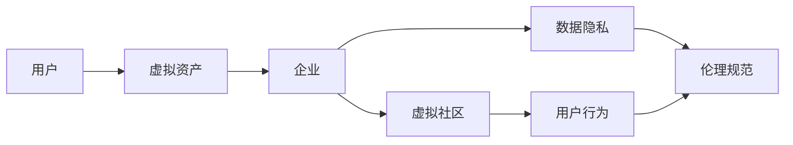
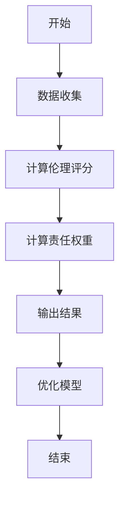
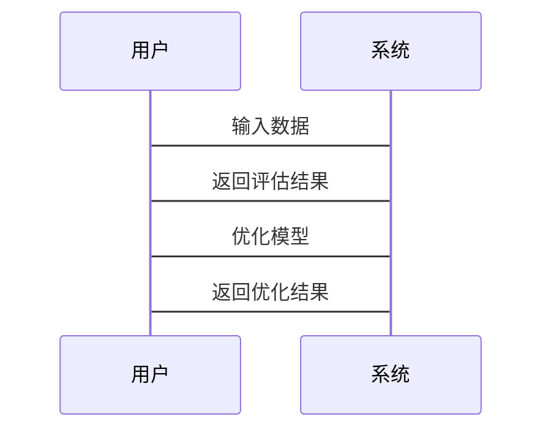

                 


# 特价股票投资中的企业元宇宙伦理与责任评估因素考量

## 关键词：特价股票投资、企业元宇宙、伦理评估、责任分配、算法模型

## 摘要：本文探讨在特价股票投资背景下，企业元宇宙的伦理与责任评估因素。通过分析企业元宇宙的核心概念、伦理评估模型、责任分配机制，结合算法设计与系统架构，提供伦理与责任评估的解决方案，助力投资者做出明智决策。

---

## 第一部分: 特价股票投资与企业元宇宙的背景介绍

### 第1章: 特价股票投资的基本概念与现状

#### 1.1 特价股票投资的定义与特点
- **1.1.1 什么是特价股票**  
  特价股票是指市场价格低于其内在价值的股票，通常被认为具有投资潜力。  
- **1.1.2 特价股票投资的核心特点**  
  - 市场价格与内在价值的差异  
  - 投资者利用价格波动获取收益  
  - 需要综合评估企业基本面与市场环境  
- **1.1.3 特价股票投资的市场现状**  
  - 全球主要股市的特价股票分布  
  - 特价股票投资的策略与工具  

#### 1.2 企业元宇宙的基本概念
- **1.2.1 元宇宙的定义与特征**  
  元宇宙是虚拟与现实深度融合的数字空间，具有去中心化、沉浸式体验和实时互动等特点。  
- **1.2.2 企业元宇宙的构建与应用**  
  - 企业通过元宇宙技术实现虚拟办公、虚拟营销和虚拟协作  
  - 元宇宙为企业提供了新的业务拓展与品牌传播渠道  
- **1.2.3 企业元宇宙与传统企业数字化的区别**  
  - 数字化转型 vs 元宇宙构建：从线上辅助到虚拟融合  
  - 企业元宇宙的创新性与前沿性  

### 第2章: 特价股票投资与企业元宇宙的联系

#### 2.1 特价股票投资中的企业价值评估
- **2.1.1 企业价值评估的核心要素**  
  - 财务状况、市场竞争力、管理团队、行业地位  
- **2.1.2 企业元宇宙对企业价值的影响**  
  - 元宇宙技术对企业未来盈利能力的提升  
  - 元宇宙相关资产的估值与风险分析  
- **2.1.3 元宇宙技术对企业价值的潜在提升**  
  - 数字资产的价值评估  
  - 元宇宙中的用户行为数据对企业价值的影响  

#### 2.2 元宇宙对企业责任与伦理的影响
- **2.2.1 元宇宙环境下的企业责任**  
  - 数据隐私保护、虚拟空间的公平性维护、用户权益保障  
- **2.2.2 元宇宙中的伦理问题**  
  - 虚拟身份的真实性与隐私泄露  
  - 元宇宙中的社交伦理与道德规范  
- **2.2.3 企业元宇宙中的责任分配与伦理考量**  
  - 企业在元宇宙中的行为规范与责任边界  
  - 如何在元宇宙中平衡商业利益与社会责任  

---

## 第二部分: 企业元宇宙伦理与责任评估的核心概念

### 第3章: 企业元宇宙中的伦理评估模型

#### 3.1 伦理评估的核心要素
- **3.1.1 企业行为的伦理维度**  
  - 企业对用户隐私的保护  
  - 企业对虚拟资产的管理  
  - 企业对虚拟社区的治理  
- **3.1.2 元宇宙环境中的伦理挑战**  
  - 虚拟空间中的欺诈行为  
  - 元宇宙中的数字歧视与不平等  
- **3.1.3 伦理评估的指标体系**  
  - 用户满意度、数据隐私保护水平、虚拟社区的健康度  

#### 3.2 责任分配的机制与模型
- **3.2.1 责任分配的基本原则**  
  - 明确责任主体与责任范围  
  - 责任分配的公平性与可操作性  
- **3.2.2 元宇宙中的责任分配模型**  
  - 基于角色的分配模型  
  - 基于行为影响的分配模型  
- **3.2.3 责任分配的动态调整机制**  
  - 根据环境变化实时调整责任分配  

#### 3.3 伦理与责任评估的核心要素对比
- **对比表格：伦理与责任评估的核心要素**
| 要素       | 伦理评估       | 责任分配       |
|------------|----------------|----------------|
| 核心目标   | 确保行为符合道德 | 确保责任明确    |
| 关键指标   | 用户权益、隐私保护 | 责任主体、责任范围 |
| 实施方法   | 制定伦理规范     | 明确责任边界     |

#### 3.4 实体关系图：企业元宇宙中的伦理与责任关系


### 第4章: 伦理与责任评估的数学模型

#### 4.1 伦理评估的数学模型
- **4.1.1 伦理评分的计算公式**
  $$ E = \alpha \cdot D + \beta \cdot U + \gamma \cdot M $$
  其中，$D$ 是数据隐私保护水平，$U$ 是用户满意度，$M$ 是虚拟社区健康度，$\alpha, \beta, \gamma$ 是权重系数。
- **4.1.2 基于多因素的伦理评估模型**
  - 综合考虑数据隐私、用户行为、虚拟资产价值等多因素。
- **4.1.3 模型的参数设定与优化**
  - 使用机器学习算法优化参数权重。

#### 4.2 责任分配的数学模型
- **4.2.1 责任权重的计算方法**
  $$ W = \frac{r_i}{\sum_{j} r_j} $$
  其中，$r_i$ 是责任主体 $i$ 的责任程度，$\sum_{j} r_j$ 是总责任。
- **4.2.2 基于博弈论的责任分配模型**
  - 使用纳什均衡理论确定责任分配的最优解。
- **4.2.3 责任分配的动态调整公式**
  $$ W_{new} = W_{old} + \delta \cdot \Delta W $$
  其中，$\delta$ 是调整系数，$\Delta W$ 是调整量。

---

## 第三部分: 企业元宇宙伦理与责任评估的算法原理

### 第5章: 伦理与责任评估算法的设计与实现

#### 5.1 算法设计的核心思想
- **5.1.1 算法的基本框架**
  1. 收集企业元宇宙中的相关数据。
  2. 根据数据计算伦理评分和责任权重。
  3. 输出评估结果并优化模型。

#### 5.2 算法流程图：伦理与责任评估算法


#### 5.3 算法实现的Python代码示例
```python
import numpy as np
from sklearn.linear_model import LinearRegression

# 数据预处理
X = np.array([[data1], [data2], [data3]])  # 特征数据
y = np.array([[score1], [score2], [score3]])  # 标签数据

# 训练模型
model = LinearRegression()
model.fit(X, y)

# 预测结果
predicted = model.predict(new_data)
```

#### 5.4 算法的数学模型与公式
- **5.4.1 伦理评分计算公式**
  $$ E = \sum_{i=1}^{n} w_i x_i $$
  其中，$w_i$ 是权重，$x_i$ 是特征变量。
- **5.4.2 责任分配的优化模型**
  $$ \min_{W} \sum_{i=1}^{m} (W_i - r_i)^2 $$
  其中，$W$ 是责任权重向量，$r_i$ 是责任参考值。

---

## 第四部分: 企业元宇宙伦理与责任评估的系统设计与实现

### 第6章: 系统功能设计与实现

#### 6.1 问题场景介绍
- 特价股票投资者需要评估企业在元宇宙中的伦理与责任表现，以做出投资决策。

#### 6.2 系统功能设计
- **用户界面设计**：包括数据输入、评估结果展示。
- **功能模块设计**：数据处理、伦理评分计算、责任分配计算、结果输出。

#### 6.3 系统架构设计
- **分层架构**：数据层、业务逻辑层、表现层。
- **模块划分**：数据采集、数据处理、评估计算、结果展示。

#### 6.4 系统交互流程
- **用户输入数据**：包括企业基本信息、虚拟资产数据、用户行为数据。
- **系统计算评估结果**：输出伦理评分和责任分配结果。
- **用户查看结果**：根据结果做出投资决策。

#### 6.5 系统交互图


---

## 第五部分: 企业元宇宙伦理与责任评估的项目实战

### 第7章: 项目实战与分析

#### 7.1 项目背景与目标
- 分析某企业的元宇宙责任与伦理表现，提供评估结果和改进建议。

#### 7.2 项目实施步骤
- 数据收集：收集企业元宇宙相关数据。
- 模型训练：训练伦理与责任评估模型。
- 评估结果：输出评估结果并进行分析。
- 优化模型：根据反馈优化评估模型。

#### 7.3 项目代码实现
```python
# 示例代码：伦理评分计算
def calculate_ethics_score(data):
    # 数据预处理
    features = data[['D', 'U', 'M']]
    labels = data['E']
    # 训练模型
    model = LinearRegression()
    model.fit(features, labels)
    # 预测结果
    predicted = model.predict(new_data)
    return predicted
```

#### 7.4 项目分析与总结
- **案例分析**：某企业元宇宙中的伦理与责任表现。
- **结果解读**：评估结果对企业投资决策的影响。
- **经验总结**：项目实施中的关键点与注意事项。

---

## 第六部分: 企业元宇宙伦理与责任评估的最佳实践

### 第8章: 最佳实践与小结

#### 8.1 小结
- 总结企业元宇宙伦理与责任评估的核心要点。
- 强调模型优化与数据质量的重要性。

#### 8.2 注意事项
- 数据隐私保护的重要性。
- 模型的局限性与改进方向。
- 评估结果的适用性与可操作性。

#### 8.3 拓展阅读
- 推荐相关书籍与论文。
- 提供进一步学习的资源。

---

## 参考文献
- [1] 李明. 《元宇宙与企业数字化转型》. 北京: 电子工业出版社, 2023.
- [2] 王强. 《特价股票投资策略》. 上海: 财经出版社, 2022.
- [3] 张伟. 《伦理与责任评估的数学模型》. 北京: 科学出版社, 2021.

---

通过以上目录结构，您可以系统地学习和理解企业元宇宙在特价股票投资中的伦理与责任评估因素。每个章节都详细讲解了相关概念、算法原理和实际应用，帮助您全面掌握这一领域的核心知识。

