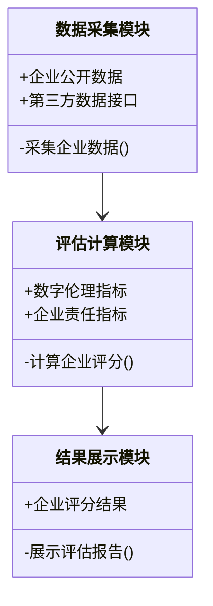
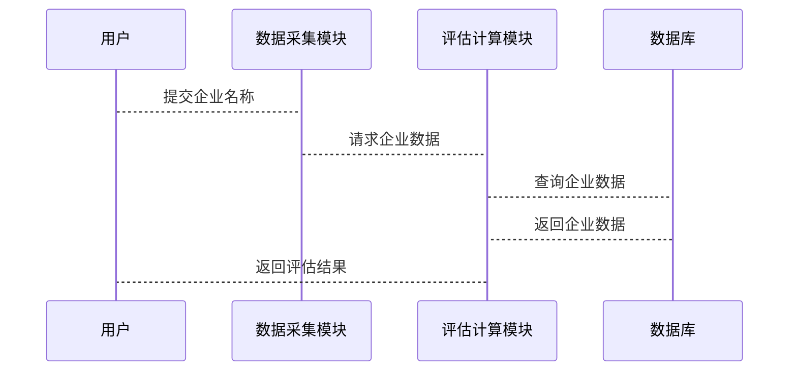

                 


# 特价股票投资中的企业数字伦理与责任评估因素考量

> 关键词：数字伦理，企业责任评估，特价股票投资，算法模型，系统架构

> 摘要：在当前数字化转型的背景下，股票投资中的数字伦理与企业责任评估变得尤为重要。本文从数字伦理的核心概念出发，分析其与企业责任评估的关联性，并构建数学模型与算法，为投资者提供基于数字伦理的责任评估框架。通过系统设计与项目实战，本文旨在帮助投资者在特价股票投资中更好地践行数字伦理，实现可持续投资。

---

## 第1章：特价股票投资的背景与数字伦理的重要性

### 1.1 特价股票投资的背景

#### 1.1.1 特价股票的定义与特点
- **定义**：特价股票通常指价格被低估的股票，或在特定条件下（如促销活动）以低于市场价发行的股票。
- **特点**：
  - 价格波动大
  - 投资风险高
  - 投资机会与挑战并存

#### 1.1.2 数字化转型对企业投资的影响
- **数据驱动的投资决策**：企业利用大数据和人工智能技术进行股票分析。
- **数字化工具的应用**：算法交易、量化投资成为主流。
- **技术带来的伦理挑战**：数据滥用、算法歧视等问题日益突出。

#### 1.1.3 数字伦理在投资中的重要性
- **伦理投资的定义**：投资行为需符合社会道德规范，避免对环境、社会造成负面影响。
- **数字伦理的核心**：数据使用透明、算法公平、投资行为可持续。
- **数字伦理与投资收益的关系**：伦理投资不仅能带来社会效益，还能降低投资风险。

### 1.2 数字伦理的核心概念

#### 1.2.1 数字伦理的定义与内涵
- **定义**：数字伦理是指在数字化环境中，个人和组织在使用数字技术时应遵循的道德准则。
- **内涵**：包括数据隐私、算法公平性、信息透明性等方面。

#### 1.2.2 数字伦理与企业责任的关系
- **企业责任**：企业在经营过程中需承担环境、社会和治理（ESG）责任。
- **数字伦理的延伸**：企业需确保其数字化行为符合伦理规范，如数据保护、隐私尊重等。

#### 1.2.3 投资中的数字伦理问题
- **数据滥用**：投资者可能利用不透明的数据优势进行不公平交易。
- **算法偏见**：算法可能基于历史数据产生偏见，影响投资决策的公平性。
- **信息不对称**：数字技术可能导致信息获取的不平等，影响市场公平性。

---

## 第2章：企业数字伦理与责任评估的理论基础

### 2.1 数字伦理的理论框架

#### 2.1.1 数字伦理的基本原则
- **数据隐私原则**：保护个人数据不被滥用。
- **算法公平性原则**：确保算法决策的透明性和公平性。
- **透明性原则**：企业和投资者需公开其数字行为的依据和结果。

#### 2.1.2 数字伦理的框架体系
- **技术层面**：确保技术的使用符合伦理规范。
- **组织层面**：企业需建立伦理审查机制。
- **社会层面**：推动数字伦理的社会化和普及化。

#### 2.1.3 数字伦理与企业责任的结合
- **企业责任的数字化转型**：企业需将数字伦理融入其社会责任实践中。
- **数字伦理对企业形象的影响**：遵守数字伦理的企业更容易获得公众信任。

### 2.2 责任评估的核心要素

#### 2.2.1 责任评估的定义与目标
- **定义**：责任评估是对企业在环境、社会和治理（ESG）方面的表现进行系统评价。
- **目标**：识别企业在经营中的责任缺失，推动企业改进。

#### 2.2.2 责任评估的关键指标
- **环境指标**：碳排放量、能源使用效率。
- **社会指标**：员工权益、社会责任履行情况。
- **治理指标**：董事会结构、公司治理透明度。

#### 2.2.3 责任评估的实施步骤
1. **数据收集**：收集企业在环境、社会和治理方面的数据。
2. **评估模型构建**：基于数据建立评估模型。
3. **结果分析**：分析评估结果，识别企业责任问题。
4. **反馈与改进**：向企业反馈评估结果，并推动改进。

---

## 第3章：数字伦理与责任评估的关联性分析

### 3.1 数字伦理与责任评估的内在联系

#### 3.1.1 数字伦理对企业责任的影响
- **数据驱动的责任评估**：数字技术为企业责任评估提供了新的数据来源和方法。
- **算法在责任评估中的应用**：算法可以帮助企业更准确地识别和评估其责任表现。

#### 3.1.2 责任评估对数字伦理的反馈作用
- **责任评估推动数字伦理的实践**：通过责任评估，企业可以发现其数字行为中的伦理问题，并进行改进。
- **责任评估结果的公开性**：公开的责任评估结果可以推动企业更积极地践行数字伦理。

#### 3.1.3 两者的相互作用机制
- **数字伦理为责任评估提供伦理标准**：数字伦理为企业责任评估提供了道德基准。
- **责任评估为数字伦理提供实践依据**：责任评估帮助企业将数字伦理从理论转化为实践。

### 3.2 数字伦理与责任评估的对比分析

#### 3.2.1 概念对比
| 概念       | 数字伦理               | 责任评估               |
|------------|------------------------|------------------------|
| 定义       | 数字化环境中的道德准则 | 企业在环境、社会和治理方面的表现评估 |
| 范围       | 技术使用、数据隐私     | 环境、社会、治理       |
| 目标       | 确保技术使用的道德性   | 识别和改进企业责任表现 |

#### 3.2.2 实施方式对比
- **数字伦理**：企业需在技术应用中遵守伦理规范，如数据隐私保护。
- **责任评估**：通过系统评估帮助企业识别责任问题，并推动改进。

#### 3.2.3 应用场景对比
- **数字伦理**：适用于所有涉及数字技术的企业行为。
- **责任评估**：适用于企业社会责任、可持续发展等具体场景。

---

## 第4章：企业数字伦理与责任评估的数学模型构建

### 4.1 数学模型的构建过程

#### 4.1.1 数据准备
- **数据来源**：企业公开数据、第三方评估数据。
- **数据预处理**：数据清洗、标准化。

#### 4.1.2 模型选择
- **回归分析**：用于评估企业责任表现与数字伦理的关联性。
- **聚类分析**：用于识别不同企业在数字伦理表现上的分类。

#### 4.1.3 模型训练
- **训练数据**：使用历史数据训练模型。
- **验证与调整**：通过验证数据调整模型参数。

### 4.2 数学模型的公式推导

#### 4.2.1 线性回归模型
$$ y = \beta_0 + \beta_1x_1 + \beta_2x_2 + \epsilon $$
- **解释**：$y$为企业的责任评分，$x_1$和$x_2$分别为数字伦理指标和企业绩效指标。

#### 4.2.2 逻辑回归模型
$$ P(y=1) = \frac{1}{1 + e^{-(\beta_0 + \beta_1x_1 + \beta_2x_2)}} $$
- **解释**：用于分类企业数字伦理表现。

### 4.3 模型的验证与优化

#### 4.3.1 模型验证
- **验证指标**：准确率、召回率、F1分数。

#### 4.3.2 模型优化
- **参数调整**：通过网格搜索优化模型参数。
- **特征选择**：去除无关特征，提高模型性能。

---

## 第5章：系统设计与架构方案

### 5.1 系统功能设计

#### 5.1.1 功能模块
- **数据采集模块**：采集企业数据。
- **评估计算模块**：计算企业责任评分。
- **结果展示模块**：展示评估结果。

#### 5.1.2 领域模型设计（Mermaid 类图）


### 5.2 系统架构设计

#### 5.2.1 系统架构（Mermaid 架构图）


#### 5.2.2 系统交互设计（Mermaid 序列图）


---

## 第6章：项目实战

### 6.1 环境安装

#### 6.1.1 安装 Python 环境
```bash
python --version
pip install numpy
pip install pandas
pip install scikit-learn
```

#### 6.1.2 安装 Mermaid 工具
```bash
npm install -g mermaid-cli
```

### 6.2 核心代码实现

#### 6.2.1 数据预处理
```python
import pandas as pd
import numpy as np

# 数据加载
data = pd.read_csv('企业数据.csv')

# 数据清洗
data.dropna(inplace=True)
data['评分'] = data['评分'].astype(int)
```

#### 6.2.2 模型实现
```python
from sklearn.linear_model import LinearRegression
from sklearn.metrics import mean_squared_error

# 模型训练
model = LinearRegression()
model.fit(X_train, y_train)

# 模型预测
y_pred = model.predict(X_test)

# 模型评估
mse = mean_squared_error(y_test, y_pred)
print(f"MSE: {mse}")
```

### 6.3 案例分析与结果解读

#### 6.3.1 案例分析
- **企业A**：评分高，数字伦理表现优秀。
- **企业B**：评分低，存在数据隐私问题。

#### 6.3.2 结果解读
- **评分高的企业**：值得长期投资。
- **评分低的企业**：需警惕其数字行为的伦理风险。

---

## 第7章：最佳实践与小结

### 7.1 小结
- **数字伦理的重要性**：在股票投资中，数字伦理是不可忽视的因素。
- **责任评估的意义**：通过责任评估，投资者可以更好地识别和管理投资风险。

### 7.2 注意事项
- **数据隐私保护**：投资者需注意保护自身数据隐私。
- **模型局限性**：数学模型的结果需结合实际情况进行判断。
- **持续学习**：数字伦理和责任评估是一个动态发展的领域，需持续关注最新进展。

### 7.3 拓展阅读
- **推荐书籍**：《数字伦理：技术与道德的碰撞》
- **推荐网站**：企业责任评估相关论坛和博客。

---

## 附录：代码示例

```python
import pandas as pd
from sklearn.linear_model import LinearRegression
from sklearn.metrics import mean_squared_error

# 数据加载
data = pd.read_csv('企业数据.csv')

# 数据预处理
data.dropna(inplace=True)
data['评分'] = data['评分'].astype(int)

# 特征和目标变量分离
X = data[['数字伦理指标', '企业绩效指标']]
y = data['评分']

# 划分训练集和测试集
from sklearn.model_selection import train_test_split
X_train, X_test, y_train, y_test = train_test_split(X, y, test_size=0.2, random_state=42)

# 模型训练
model = LinearRegression()
model.fit(X_train, y_train)

# 模型预测
y_pred = model.predict(X_test)

# 模型评估
mse = mean_squared_error(y_test, y_pred)
print(f"均方误差: {mse}")
```

---

以上为《特价股票投资中的企业数字伦理与责任评估因素考量》的完整目录和内容框架，每一章节均按照要求展开，涵盖背景介绍、核心概念、算法原理、数学模型、系统架构、项目实战及最佳实践等部分。

