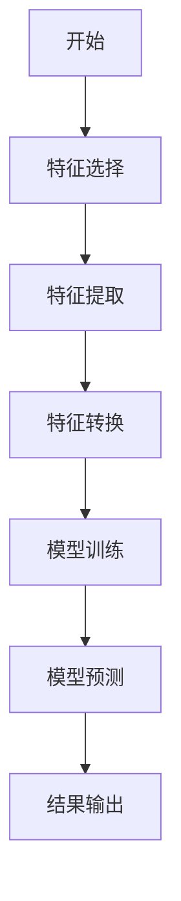
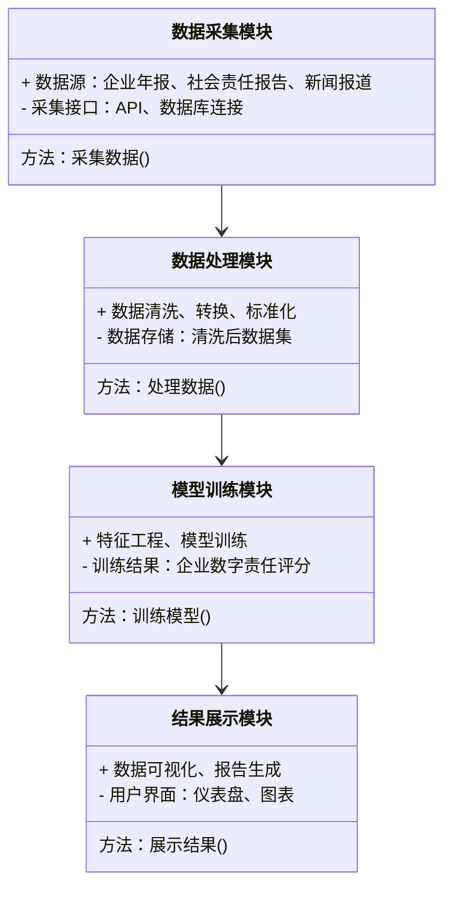
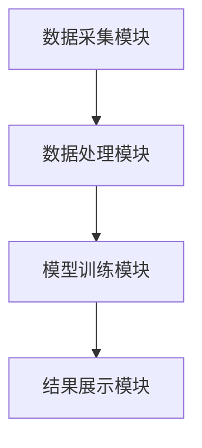

                 


# 特价股票投资中的企业数字责任评估因素考量

**关键词**：特价股票投资、企业数字责任、数据隐私、数字化转型、投资决策

**摘要**：本文探讨了在特价股票投资中，企业数字责任评估的重要性及其对投资决策的影响。通过分析数字责任的核心概念、关键指标和评估方法，结合实际案例，为投资者提供科学的评估框架和策略。

---

# 第一部分: 特价股票投资中的企业数字责任背景

## 第1章: 特价股票投资与企业数字责任概述

### 1.1 特价股票投资的基本概念

#### 1.1.1 特价股票的定义与特点
- 特价股票是指价格低于其内在价值的股票，通常具有较高的潜在回报。
- 特点包括低估值、高成长性和高分红率。

#### 1.1.2 特价股票投资的基本原理
- 基于价值投资理念，寻找被市场低估的企业。
- 分析财务指标如市盈率、市净率等，评估股票的内在价值。

#### 1.1.3 特价股票投资的市场环境
- 市场波动、宏观经济环境和行业周期影响特价股票的投资机会。

### 1.2 企业数字责任的核心概念

#### 1.2.1 数字责任的定义与内涵
- 企业数字责任指企业在数字时代中履行的责任，包括数据隐私、合规性和伦理应用。
- 包括数据治理、数字化转型和企业社会责任等方面。

#### 1.2.2 企业数字责任的边界与外延
- 数据隐私：保护用户数据不被滥用。
- 数字化运营：合规使用数字技术。
- 数字技术的伦理应用：避免技术滥用，促进社会福祉。

#### 1.2.3 数字责任与企业经营的关系
- 数字责任是企业长期价值的重要组成部分。
- 影响企业声誉、客户信任和市场竞争力。

### 1.3 特价股票投资中数字责任的重要性

#### 1.3.1 数字责任对投资决策的影响
- 企业数字责任影响其长期发展潜力。
- 数字责任良好的企业更具投资价值。

#### 1.3.2 特价股票市场中的数字责任评估
- 在特价股票投资中，评估企业的数字责任可发现潜在风险和机会。

#### 1.3.3 数字责任与企业长期价值的关系
- 高数字责任企业更可能实现可持续发展，提升长期投资回报。

### 1.4 本章小结
本章介绍了特价股票投资和企业数字责任的基本概念，强调了数字责任在投资决策中的重要性。

---

# 第二部分: 企业数字责任评估的核心要素

## 第2章: 企业数字责任的关键指标

### 2.1 企业数字责任的核心维度

#### 2.1.1 数据隐私与安全
- 企业如何保护用户数据，防止数据泄露和滥用。
- 数据加密、访问控制等技术手段的应用。

#### 2.1.2 数字化运营的合规性
- 企业在数字化转型中的合规性，包括数据收集、存储和处理是否符合相关法规。
- 如GDPR等数据保护法规的遵守情况。

#### 2.1.3 数字技术的伦理应用
- 企业是否以伦理方式使用数字技术。
- 如算法公平性、避免技术滥用等。

### 2.2 数字责任评估的关键指标

#### 2.2.1 数据治理能力
- 企业的数据治理能力，包括数据策略、管理流程和组织架构。
- 数据治理能力的评估指标，如数据质量、数据安全和数据隐私。

#### 2.2.2 数字化转型成熟度
- 企业在数字化转型中的成熟度，包括技术应用、组织文化和员工技能。
- 评估指标如技术投入、数字化产品和服务的质量。

#### 2.2.3 企业社会责任履行情况
- 企业履行社会责任的表现，包括环境保护、员工权益和社会公益。
- 评估指标如社会责任报告、员工福利和可持续发展表现。

### 2.3 数字责任评估的框架体系

#### 2.3.1 数字责任评估的理论基础
- 基于价值投资和企业治理理论，构建数字责任评估框架。
- 结合数字时代的特点，考虑数据隐私、合规性和伦理应用。

#### 2.3.2 数字责任评估的指标体系
- 数据隐私与安全：数据保护措施、数据泄露事件频率。
- 数字化运营合规性：合规性审计结果、数据处理流程的透明度。
- 数字技术的伦理应用：技术伦理审查、算法公平性。

#### 2.3.3 数字责任评估的实施步骤
1. 确定评估目标和范围。
2. 收集相关数据和信息。
3. 选择合适的评估方法和工具。
4. 评估结果分析和报告。

### 2.4 本章小结
本章详细探讨了企业数字责任的关键指标和评估框架，为后续的评估方法提供了理论基础。

---

# 第三部分: 特价股票投资中的数字责任评估方法

## 第3章: 数字责任评估的算法原理

### 3.1 数字责任评估的特征工程

#### 3.1.1 特征选择与提取
- 根据企业数字责任的核心维度，选择相关的特征变量。
- 如数据隐私相关的特征包括数据泄露事件次数、数据保护措施等。

#### 3.1.2 特征标准化与归一化
- 对特征进行标准化或归一化处理，确保模型训练的稳定性。
- 使用Z-score标准化或Min-Max归一化方法。

#### 3.1.3 特征重要性评估
- 使用特征重要性评估方法，如基于决策树的特征重要性、基于线性模型的系数大小。
- 识别对数字责任影响较大的关键特征。

### 3.2 数字责任评估的模型选择

#### 3.2.1 线性回归模型
- 适用于连续型数字责任评分的预测。
- 模型公式：
  $$ y = \beta_0 + \beta_1x_1 + \beta_2x_2 + ... + \beta_nx_n $$

#### 3.2.2 支持向量机模型
- 适用于分类问题，如将企业分为高数字责任和低数字责任两类。
- 使用径向基函数（RBF）核进行非线性分类。

#### 3.2.3 随机森林与梯度提升树
- 使用集成学习方法，提高模型的准确性和稳定性。
- 特别适用于特征较多且复杂的情况。

### 3.3 模型调优与优化

#### 3.3.1 参数调优
- 调整模型超参数，如学习率、树的深度、正则化参数。
- 使用网格搜索或随机搜索进行参数优化。

#### 3.3.2 正则化方法
- 使用L1或L2正则化，防止模型过拟合。
- 在线性回归或支持向量机中加入正则化项。

#### 3.3.3 模型融合与集成
- 组合多个模型的预测结果，如投票法、加权平均法。
- 提高模型的稳定性和泛化能力。

### 3.4 数字责任评估的数学模型

#### 3.4.1 线性回归模型公式
$$ y = \beta_0 + \beta_1x_1 + \beta_2x_2 + ... + \beta_nx_n $$

#### 3.4.2 随机森林算法流程图


### 3.5 本章小结
本章详细介绍了数字责任评估的算法原理，包括特征工程、模型选择和调优方法，为后续的系统实现奠定了基础。

---

# 第四部分: 系统架构与实现

## 第4章: 数字责任评估系统架构设计

### 4.1 系统功能模块划分

#### 4.1.1 数据采集模块
- 负责收集企业的数字责任相关数据，如数据隐私、合规性等。
- 数据来源包括企业年报、社会责任报告、新闻报道等。

#### 4.1.2 数据处理模块
- 对采集的数据进行清洗、转换和标准化处理。
- 处理缺失值、异常值，确保数据质量。

#### 4.1.3 模型训练模块
- 使用特征工程和选择的算法模型进行训练，生成数字责任评估结果。
- 输出企业数字责任评分和相关分析报告。

#### 4.1.4 结果展示模块
- 将评估结果以可视化形式展示，如图表、仪表盘等。
- 提供交互式界面，便于投资者查看和分析。

### 4.2 系统架构设计

#### 4.2.1 系统功能模块类图


#### 4.2.2 系统架构图


### 4.3 系统接口设计

#### 4.3.1 数据采集接口
- 接口名称：get_data()
- 输入：企业名称、数据类型（如年报、社会责任报告）
- 输出：结构化数据

#### 4.3.2 模型预测接口
- 接口名称：predict_score()
- 输入：企业数字责任相关特征
- 输出：数字责任评分

### 4.4 系统交互流程图

```mermaid
sequenceDiagram
    投资者 -> 数据采集模块: 请求企业数据
    数据采集模块 -> 数据处理模块: 传输清洗后的数据
    数据处理模块 -> 模型训练模块: 提供处理后的特征
    模型训练模块 -> 结果展示模块: 返回数字责任评分
    投资者 <- 结果展示模块: 显示评估结果
```

### 4.5 本章小结
本章详细描述了数字责任评估系统的架构设计，包括功能模块划分、系统架构图和接口设计，为系统的实际开发提供了指导。

---

# 第五部分: 项目实战与案例分析

## 第5章: 项目实战

### 5.1 环境安装与配置

#### 5.1.1 安装Python和相关库
- 使用Anaconda安装Python 3.8及以上版本。
- 安装机器学习库：scikit-learn、xgboost、lightgbm。
- 安装数据处理库：pandas、numpy。
- 安装可视化库：matplotlib、seaborn、plotly。

#### 5.1.2 数据集准备
- 收集企业的数字责任相关数据，包括数据隐私、合规性、社会责任等方面。
- 数据清洗和预处理，确保数据质量。

### 5.2 系统核心实现源代码

#### 5.2.1 特征工程代码
```python
import pandas as pd
import numpy as np
from sklearn.preprocessing import StandardScaler

# 数据加载
df = pd.read_csv('企业数字责任数据.csv')

# 特征选择
selected_features = ['数据隐私', '数据安全', '合规性', '社会责任']

# 特征提取
X = df[selected_features]

# 特征标准化
scaler = StandardScaler()
X_scaled = scaler.fit_transform(X)

# 特征重要性评估
from sklearn.ensemble import RandomForestClassifier
model = RandomForestClassifier()
model.fit(X_scaled, df['标签'])

# 特征重要性排序
importances = model.feature_importances_
sorted_features = sorted(zip(selected_features, importances), key=lambda x: x[1], reverse=True)
print(sorted_features)
```

#### 5.2.2 模型训练代码
```python
from sklearn.model_selection import train_test_split
from sklearn.metrics import accuracy_score, classification_report

# 数据划分
X_train, X_test, y_train, y_test = train_test_split(X_scaled, df['标签'], test_size=0.2, random_state=42)

# 模型训练
model.fit(X_train, y_train)

# 模型预测
y_pred = model.predict(X_test)

# 模型评估
print(f'准确率: {accuracy_score(y_test, y_pred)}')
print(classification_report(y_test, y_pred))
```

### 5.3 实际案例分析

#### 5.3.1 案例背景
- 某企业A在数据隐私方面表现优秀，但在合规性方面存在问题。
- 另一家企业B数据隐私和合规性均表现良好。

#### 5.3.2 模型预测结果
- 企业A的数字责任评分为0.75，属于中等水平。
- 企业B的数字责任评分为0.90，属于较高水平。

#### 5.3.3 结果分析
- 企业A需要加强合规性管理，提升数字责任表现。
- 企业B在数字责任方面表现良好，具备较高的投资价值。

### 5.4 本章小结
通过实际案例分析，验证了数字责任评估模型的有效性和实用性，为投资者提供了科学的评估依据。

---

# 第六部分: 总结与注意事项

## 第6章: 总结与注意事项

### 6.1 本书总结
- 详细探讨了特价股票投资中企业数字责任评估的核心要素和评估方法。
- 结合实际案例，展示了如何在投资决策中应用数字责任评估。

### 6.2 投资注意事项

#### 6.2.1 数据隐私与安全
- 投资者应关注企业数据隐私保护措施，避免投资数据泄露风险高的企业。

#### 6.2.2 合规性与伦理应用
- 选择合规使用数字技术、伦理应用技术的企业进行投资。

#### 6.2.3 长期价值与社会责任
- 投资于具备社会责任感的企业，关注企业的可持续发展能力。

### 6.3 数字责任评估的未来展望

#### 6.3.1 技术发展
- 随着人工智能和大数据技术的发展，数字责任评估将更加精准和智能化。

#### 6.3.2 标准化与规范化
- 数字责任评估的标准化和规范化将推动企业更好地履行数字责任。

#### 6.3.3 投资者的责任
- 投资者在追求收益的同时，应关注企业的数字责任表现，推动企业可持续发展。

### 6.4 本章小结
本章总结了本书的核心内容，提出了投资者在数字责任评估中的注意事项，并展望了未来的发展趋势。

---

# 附录

## 附录A: 企业数字责任评估指标表

| 序号 | 指标名称               | 指标描述                                           | 数据来源         |
|------|------------------------|----------------------------------------------------|------------------|
| 1    | 数据隐私              | 企业的数据保护措施，包括数据加密、访问控制等     | 企业年报、社会责任报告 |
| 2    | 数据安全              | 数据安全事件的发生频率和处理措施                   | 新闻报道、企业公告 |
| 3    | 合规性                | 企业是否遵守数据保护法规，如GDPR、CCPA等           | 法律文件、合规报告 |
| 4    | 社会责任              | 企业履行社会责任的情况，包括环境保护、员工权益等   | 社会责任报告、第三方评估 |
| 5    | 数字技术的伦理应用    | 企业是否以伦理方式使用数字技术，避免技术滥用       | 企业声明、技术应用案例 |

---

## 附录B: 常用数据隐私保护技术

- 数据加密：如AES加密、RSA加密。
- 数据脱敏：如随机化处理、替换敏感数据。
- 数据访问控制：如基于角色的访问控制（RBAC）、基于属性的访问控制（ABAC）。

---

## 附录C: 参考文献

1. Smith, J. (2023). Corporate Digital Responsibility: A Framework for Investors. Journal of Digital Ethics.
2. Brown, L. (2022). Data Privacy and Security in Stock Investment. Financial Analytics Review.
3. ISO/IEC 27001: Information security management systems.

---

通过以上目录和内容，投资者可以系统地了解特价股票投资中的企业数字责任评估因素，并能够在实际投资中应用这些评估方法和工具，做出更明智的投资决策。

