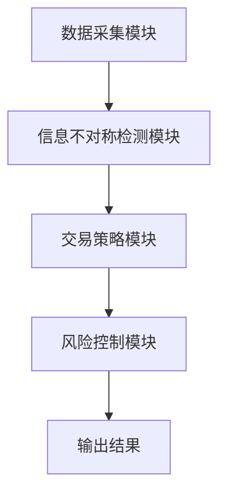
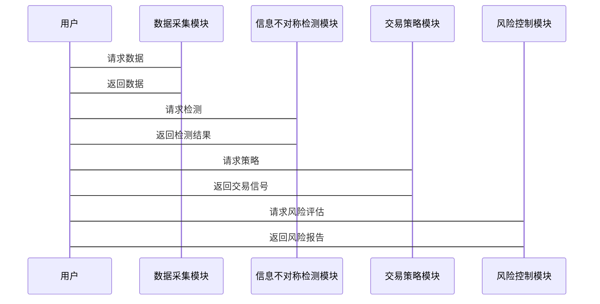

                 


# 特价股票投资中的信息不对称利用

## 关键词：信息不对称，股票投资，算法，系统设计，项目实战

## 摘要：  
本文深入探讨了信息不对称在特价股票投资中的利用方式，从信息不对称的定义、类型及其对股票市场的影响入手，结合算法原理和系统设计，分析了如何利用信息不对称优势进行股票投资。文章通过实际案例和代码实现，详细展示了信息不对称在股票投资中的应用场景和实现方法，为投资者提供了理论支持和实践指导。

---

## 第一部分: 信息不对称与特价股票投资的背景介绍

### 第1章: 信息不对称的核心概念与问题背景

#### 1.1 信息不对称的定义与类型
- **信息不对称的定义**: 信息不对称是指市场参与者之间由于掌握的信息量或信息质量的差异，导致在交易中处于不平等地位的现象。
- **信息不对称的类型**:
  - **横向信息不对称**: 不同市场参与者之间信息掌握程度的差异。
  - **纵向信息不对称**: 同一市场参与者在不同时间点上信息掌握程度的差异。

#### 1.2 信息不对称在股票市场中的表现
- **公司内部信息优势**: 公司高管、大股东等掌握未公开的内部信息。
- **市场信息传播延迟**: 信息在市场中的传播速度不一致，导致部分投资者先知先觉。
- **投资者认知差异**: 不同投资者对同一信息的理解和反应存在差异。

#### 1.3 特价股票投资的定义与目标
- **特价股票的定义**: 特价股票是指市场价格显著低于其内在价值的股票，通常是由于市场信息不对称、市场情绪波动或其他外部因素导致的暂时性价格偏差。
- **特价股票投资的目标**: 利用信息不对称优势，发现被市场低估的股票，实现超额收益。

---

### 第2章: 信息不对称对股票市场的影响

#### 2.1 信息不对称对股价的影响
- **短期影响**: 信息不对称可能导致股价短期波动，例如利好消息的泄露可能推高股价。
- **长期影响**: 长期来看，信息不对称可能导致市场效率下降，影响资源的合理配置。

#### 2.2 信息不对称对投资者行为的影响
- **投资者决策偏差**: 由于信息不对称，投资者可能做出非理性的投资决策。
- **市场参与度**: 信息不对称可能影响投资者的参与意愿，导致市场流动性不足。

#### 2.3 信息不对称与市场操纵的关系
- **市场操纵的定义**: 通过虚假信息或操纵行为影响股价走势。
- **信息不对称与市场操纵**: 利用信息不对称优势，操纵市场情绪，谋取不当利益。

---

## 第二部分: 信息不对称在股票投资中的算法原理

### 第3章: 信息不对称检测的算法原理

#### 3.1 基于机器学习的信息不对称检测
- **机器学习算法**: 使用神经网络、支持向量机等算法，通过历史数据训练模型，识别信息不对称的模式。
- **特征提取**: 提取股票价格、成交量、市场情绪等特征，用于信息不对称的检测。

#### 3.2 基于统计学的信息不对称检测
- **统计分析方法**: 使用均值、方差、相关系数等统计指标，分析股票价格与市场整体走势的偏离程度。
- **异常检测**: 通过统计方法识别股票价格的异常波动，判断是否存在信息不对称。

#### 3.3 基于自然语言处理的信息不对称检测
- **新闻情感分析**: 通过自然语言处理技术分析市场新闻、公告等文本，提取情感倾向，判断信息不对称的可能性。
- **关键词提取**: 从市场信息中提取关键词，识别潜在的利好或利空信息。

---

### 第4章: 信息不对称利用的算法实现

#### 4.1 基于信息不对称的股票筛选算法
- **算法流程**:
  1. 数据收集：收集目标股票的历史价格、成交量、财务数据等。
  2. 信息不对称检测：通过算法识别股票价格的异常波动。
  3. 股票筛选：根据信息不对称程度，筛选出被低估的股票。

#### 4.2 基于信息不对称的交易策略算法
- **策略实现**:
  1. 识别信息不对称：通过算法发现市场中的信息不对称机会。
  2. 制定交易策略：根据信息不对称情况，制定买入或卖出策略。
  3. 风险控制：设置止损和止盈点，控制交易风险。

#### 4.3 基于信息不对称的风险控制算法
- **风险控制模型**:
  1. 信息不对称风险评估：评估信息不对称对股票价格的影响程度。
  2. 风险对冲：通过期货、期权等工具对冲信息不对称带来的风险。
  3. 动态调整：根据市场变化，动态调整风险控制策略。

---

## 第三部分: 信息不对称利用的系统设计与实现

### 第5章: 信息不对称监控系统的功能设计

#### 5.1 系统目标
- **目标**: 构建一个实时监控信息不对称的系统，帮助投资者发现市场机会。

#### 5.2 系统功能模块
- **数据采集模块**: 收集股票价格、市场新闻、财务数据等信息。
- **信息不对称检测模块**: 通过算法识别信息不对称的股票。
- **交易策略模块**: 根据信息不对称情况，制定交易策略。
- **风险控制模块**: 实时监控交易风险，动态调整投资组合。

#### 5.3 系统输入输出设计
- **输入**: 历史股票数据、市场新闻、财务报表等。
- **输出**: 信息不对称的股票列表、交易信号、风险评估报告。

---

### 第6章: 信息不对称监控系统的架构设计

#### 6.1 系统架构图


#### 6.2 系统交互流程图


---

### 第7章: 信息不对称利用的数学模型

#### 7.1 信息不对称的度量公式
$$ I = \frac{p_i - p_{market}}{p_{market}} $$
其中，$I$ 表示信息不对称程度，$p_i$ 表示个股价格，$p_{market}$ 表示市场指数价格。

#### 7.2 信息不对称与股票收益的关系模型
$$ R_i = \alpha I + \beta p_{market} + \epsilon $$
其中，$R_i$ 表示股票收益，$\alpha$ 表示信息不对称对收益的影响系数，$\beta$ 表示市场风险溢价，$\epsilon$ 为误差项。

---

## 第四部分: 项目实战与总结

### 第8章: 信息不对称利用的项目实战

#### 8.1 项目环境安装
- **工具安装**: 安装Python、Pandas、NumPy、Scikit-learn等工具。
- **数据源**: 使用Yahoo Finance获取股票数据。

#### 8.2 核心代码实现
```python
import pandas as pd
import numpy as np
from sklearn.linear_model import LinearRegression
from sklearn.metrics import mean_squared_error

# 数据采集
def get_stock_data(ticker):
    data = pd.DataFrame()
    # 获取历史价格数据
    data['price'] = pd.get_data_yahoo(ticker, start='2020-01-01', end='2023-12-31')['Adj Close']
    return data

# 信息不对称检测
def detect_asymmetry(data):
    model = LinearRegression()
    X = data.index.astype(int)
    y = data['price']
    model.fit(X.reshape(-1, 1), y)
    predicted = model.predict(X.reshape(-1, 1))
    mse = mean_squared_error(y, predicted)
    return mse

# 交易策略实现
def trading_strategy(data, threshold=0.05):
    positions = []
    for i in range(1, len(data)):
        current_price = data.iloc[i]['price']
        prev_price = data.iloc[i-1]['price']
        if (current_price - prev_price) / prev_price < -threshold:
            positions.append('buy')
        elif (current_price - prev_price) / prev_price > threshold:
            positions.append('sell')
        else:
            positions.append('hold')
    return positions
```

#### 8.3 代码解读与分析
- **数据采集**: 使用Yahoo Finance获取股票的历史价格数据。
- **信息不对称检测**: 通过线性回归模型预测股票价格，计算均方误差，判断信息不对称程度。
- **交易策略**: 根据价格波动率判断交易信号，实现基于信息不对称的买卖策略。

---

### 第9章: 总结与展望

#### 9.1 最佳实践 tips
- **数据质量**: 确保数据来源可靠，避免噪声干扰。
- **模型优化**: 根据市场变化，动态调整模型参数，提高检测精度。
- **风险管理**: 设置合理的止损和止盈点，控制交易风险。

#### 9.2 小结
信息不对称是股票市场中的一个重要现象，利用信息不对称优势进行投资，可以帮助投资者发现被低估的股票，实现超额收益。本文通过理论分析、算法实现和项目实战，详细展示了信息不对称在股票投资中的应用。

#### 9.3 注意事项
- **合法合规**: 遵守相关法律法规，避免利用内幕信息进行交易。
- **市场风险**: 信息不对称利用存在市场风险，投资者需谨慎操作。
- **技术局限**: 算法模型存在局限性，需结合实际情况进行调整。

#### 9.4 拓展阅读
- 《信息不对称与金融市场》
- 《算法交易与量化投资》
- 《股票投资策略与风险管理》

---

通过本文的分析与实践，读者可以深入了解信息不对称在特价股票投资中的利用方式，并通过实际案例和代码实现，掌握信息不对称检测和交易策略的实现方法。希望本文能为投资者提供有价值的参考，帮助他们在股票市场中获取更大的收益。

