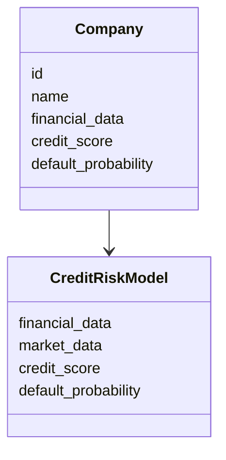
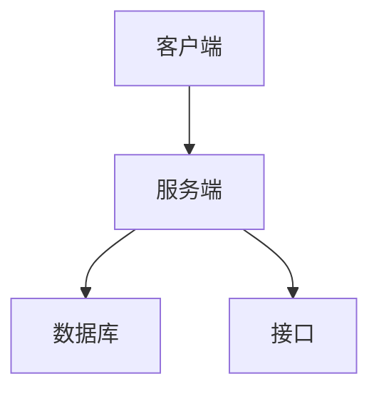
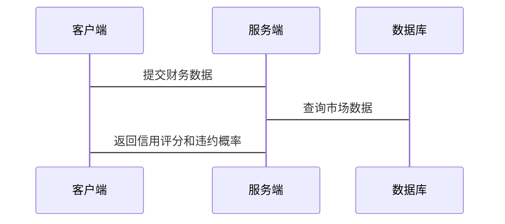

                 


# 特价股票投资中的信用风险评估方法

> 关键词：信用风险评估，特价股票投资，数学模型，算法原理，系统架构，金融风险管理

> 摘要：本文深入探讨了信用风险评估在特价股票投资中的应用方法，从背景、核心概念、数学模型、算法原理、系统架构到项目实战，结合理论与实践，全面分析信用风险评估的关键要素及其在股票投资中的重要作用。通过本文的学习，读者将能够掌握信用风险评估的核心方法，从而在特价股票投资中做出更加科学和理性的决策。

---

## 第1章: 信用风险评估的背景与概念

### 1.1 信用风险的基本概念

#### 1.1.1 信用风险的定义
信用风险是指在信用交易中，由于交易对手无法履行其债务义务而给债权人带来的损失风险。在股票投资中，信用风险主要体现在公司债券、股票质押等信用类投资工具上。

#### 1.1.2 信用风险的分类
信用风险可以分为以下几类：
- **系统性信用风险**：由于整体经济环境恶化导致的信用风险，例如经济衰退、金融危机等。
- **非系统性信用风险**：由于个别公司或行业-specific因素导致的信用风险，例如公司财务状况恶化、管理不善等。

#### 1.1.3 信用风险在股票投资中的重要性
在股票投资中，信用风险的评估尤为重要。投资者需要通过信用风险评估，识别出那些可能因公司财务状况恶化而面临违约风险的股票，从而避免投资风险。

### 1.2 特价股票投资的背景

#### 1.2.1 特价股票的定义
特价股票是指价格远低于其内在价值的股票。这类股票通常具有较高的潜在回报，但也伴随着较高的风险。

#### 1.2.2 特价股票投资的策略
- **价值投资策略**：寻找被市场低估的股票，长期持有，等待其价值回归。
- **事件驱动策略**：利用公司并购、重组等事件，短期内获得超额收益。

#### 1.2.3 特价股票投资中的信用风险
在特价股票投资中，信用风险主要体现在以下方面：
- **公司基本面恶化**：公司财务状况恶化，可能导致债券违约或股票价值大幅下跌。
- **市场波动风险**：市场波动可能导致特价股票价格大幅波动，进而引发信用风险。

### 1.3 信用风险评估的核心要素

#### 1.3.1 信用风险评估的主体
信用风险评估的主体包括：
- **投资者**：个人或机构投资者，通过评估信用风险，做出投资决策。
- **金融机构**：银行、证券公司等金融机构，通过评估信用风险，控制投资风险。

#### 1.3.2 信用风险评估的关键指标
- **信用评分**：通过量化指标对公司的信用状况进行评分。
- **违约概率（PD）**：公司在一定期限内违约的可能性。
- **违约损失率（LGD）**：在违约发生时，投资者可能遭受的损失比例。

#### 1.3.3 信用风险评估的边界与外延
信用风险评估的边界包括：
- **评估范围**：仅限于信用风险，不包括市场风险、流动性风险等其他风险。
- **评估对象**：主要是公司债券、股票质押等信用类投资工具。

### 1.4 信用风险评估的流程与方法

#### 1.4.1 信用风险评估的基本流程
1. **数据收集**：收集公司的财务数据、市场数据等。
2. **信用评分**：通过模型对公司的信用状况进行评分。
3. **违约概率计算**：根据信用评分，计算公司的违约概率。
4. **风险敞口分析**：分析投资组合中各资产的信用风险敞口。

#### 1.4.2 信用风险评估的主要方法
- **定性分析**：通过分析公司的财务状况、行业地位等因素，评估信用风险。
- **定量分析**：通过数学模型，量化信用风险。

#### 1.4.3 信用风险评估的模型选择
常用的信用风险评估模型包括：
- **Z-score模型**：通过财务指标计算公司的破产概率。
- **KMV模型**：通过市场数据计算公司的信用风险。

---

## 第2章: 信用风险评估的核心概念与联系

### 2.1 信用评分模型

#### 2.1.1 信用评分模型的定义
信用评分模型是通过一系列财务指标，对公司的信用状况进行评分的模型。

#### 2.1.2 信用评分模型的原理
信用评分模型通常基于以下指标：
- **流动比率**：流动资产与流动负债的比值。
- **速动比率**：速动资产与流动负债的比值。
- **负债率**：总负债与总资产的比值。

#### 2.1.3 信用评分模型的优缺点
| 优点 | 缺点 |
|------|------|
| 计算简单 | 依赖于假设条件 |
| 易于理解 | 无法捕捉非财务因素 |
| 可用于比较不同公司 | 可能忽略公司特有风险 |

### 2.2 违约概率模型

#### 2.2.1 违约概率模型的定义
违约概率模型是通过统计方法，计算公司在一定期限内违约的概率。

#### 2.2.2 违约概率模型的计算方法
违约概率模型通常基于以下步骤：
1. 收集历史违约数据。
2. 建立概率模型，例如逻辑回归模型。
3. 计算公司违约概率。

#### 2.2.3 违约概率模型的应用场景
- **信用评级**：对公司在一定期限内的违约概率进行评级。
- **风险定价**：根据违约概率，对信用工具进行风险定价。

### 2.3 信用风险评估的核心要素对比

#### 2.3.1 信用评分与违约概率的对比
| 对比维度 | 信用评分 | 违约概率 |
|----------|----------|----------|
| 定义 | 对公司信用状况的评分 | 公司在一定期限内违约的可能性 |
| 用途 | 信用评级、风险分类 | 风险定价、信用工具定价 |
| 优缺点 | 计算简单，易于理解 | 计算复杂，依赖于历史数据 |

#### 2.3.2 不同信用风险模型的对比
| 模型 | 输入 | 输出 |
|------|------|------|
| Z-score模型 | 财务指标 | 破产概率 |
| KMV模型 | 市场数据 | 信用风险 |

#### 2.3.3 信用风险模型的ER实体关系图
```mermaid
erd
    Company [公司]
    CreditRiskModel [信用风险模型]
    FinancialData [财务数据]
    MarketData [市场数据]
    relation Company --> CreditRiskModel [输入]
    relation FinancialData --> CreditRiskModel [输入]
    relation MarketData --> CreditRiskModel [输入]
    relation CreditRiskModel --> Company [输出]
```

---

## 第3章: 信用风险评估的数学模型与算法原理

### 3.1 信用风险评估的数学模型

#### 3.1.1 线性回归模型
线性回归模型用于预测公司违约概率。模型公式如下：
$$ y = \beta_0 + \beta_1x_1 + \beta_2x_2 + ... + \beta_nx_n + \epsilon $$
其中：
- $y$ 是违约概率。
- $x_i$ 是财务指标。
- $\beta_i$ 是回归系数。
- $\epsilon$ 是误差项。

#### 3.1.2 逻辑回归模型
逻辑回归模型用于分类，将公司分为违约和非违约两类。模型公式如下：
$$ P(y=1|x) = \frac{e^{\beta_0 + \beta_1x_1 + ... + \beta_nx_n}}{1 + e^{\beta_0 + \beta_1x_1 + ... + \beta_nx_n}} $$

#### 3.1.3 随机森林模型
随机森林模型是一种基于决策树的集成学习算法。其核心思想是通过构建多棵决策树，并将结果进行投票或平均，从而提高模型的准确性和稳定性。

#### 3.1.4 XGBoost模型
XGBoost模型是一种基于树的 boosting 算法，通过构建多个弱分类器，并将结果进行加权，从而实现高准确率的预测。

### 3.2 算法原理的详细讲解

#### 3.2.1 线性回归模型的算法流程
1. 数据准备：收集公司财务数据。
2. 模型训练：通过最小二乘法估计回归系数。
3. 模型预测：根据财务数据，预测违约概率。

#### 3.2.2 逻辑回归模型的算法流程
1. 数据准备：收集公司财务数据和违约标签。
2. 模型训练：通过极大似然估计法估计回归系数。
3. 模型预测：根据财务数据，预测公司违约概率。

#### 3.2.3 随机森林模型的算法流程
1. 数据准备：收集公司财务数据和违约标签。
2. 模型训练：构建多棵决策树，并将结果进行投票或平均。
3. 模型预测：根据财务数据，预测公司违约概率。

#### 3.2.4 XGBoost模型的算法流程
1. 数据准备：收集公司财务数据和违约标签。
2. 模型训练：构建多个弱分类器，并将结果进行加权。
3. 模型预测：根据财务数据，预测公司违约概率。

---

## 第4章: 系统分析与架构设计方案

### 4.1 问题场景介绍
在特价股票投资中，投资者需要通过信用风险评估，识别出那些可能因公司财务状况恶化而面临违约风险的股票，从而避免投资风险。

### 4.2 项目介绍
本项目旨在构建一个信用风险评估系统，帮助投资者评估特价股票的信用风险。

### 4.3 系统功能设计

#### 4.3.1 领域模型


#### 4.3.2 系统架构设计


### 4.4 系统架构设计

#### 4.4.1 系统架构图


### 4.5 系统接口设计
系统接口设计包括：
- **输入接口**：接收公司财务数据和市场数据。
- **输出接口**：输出公司信用评分和违约概率。

### 4.6 系统交互设计

#### 4.6.1 交互流程


---

## 第5章: 项目实战

### 5.1 环境安装
- **Python**：安装Python 3.8及以上版本。
- **库依赖**：安装pandas、numpy、scikit-learn、xgboost等库。

### 5.2 核心实现源代码

#### 5.2.1 数据预处理
```python
import pandas as pd
import numpy as np

# 读取数据
data = pd.read_csv('financial_data.csv')

# 数据清洗
data = data.dropna()
```

#### 5.2.2 模型训练
```python
from sklearn.model_selection import train_test_split
from xgboost import XGBClassifier

# 划分训练集和测试集
X_train, X_test, y_train, y_test = train_test_split(data.drop('default', axis=1), data['default'], test_size=0.2)

# 训练模型
model = XGBClassifier()
model.fit(X_train, y_train)
```

#### 5.2.3 模型预测
```python
# 预测违约概率
y_pred = model.predict_proba(X_test)[:, 1]
```

### 5.3 案例分析

#### 5.3.1 实际案例分析
- **案例背景**：某公司财务状况恶化，信用评分较低。
- **模型预测**：模型预测该公司的违约概率为0.8，表明信用风险较高。

#### 5.3.2 代码实现与解读
```python
# 代码实现
import pandas as pd
import numpy as np
from xgboost import XGBClassifier

# 读取数据
data = pd.read_csv('financial_data.csv')

# 数据清洗
data = data.dropna()

# 划分训练集和测试集
X_train, X_test, y_train, y_test = train_test_split(data.drop('default', axis=1), data['default'], test_size=0.2)

# 训练模型
model = XGBClassifier()
model.fit(X_train, y_train)

# 预测违约概率
y_pred = model.predict_proba(X_test)[:, 1]

# 输出结果
print("预测的违约概率为：", y_pred)
```

### 5.4 项目小结
通过本项目，我们成功构建了一个信用风险评估系统，能够对特价股票的信用风险进行有效评估。

---

## 第6章: 信用风险评估的最佳实践与小结

### 6.1 最佳实践
- **数据质量**：确保数据的完整性和准确性。
- **模型可解释性**：选择易于解释的模型，便于投资者理解和决策。
- **持续监控**：定期更新模型和数据，以应对市场变化。

### 6.2 小结
信用风险评估是特价股票投资中不可或缺的一部分。通过科学的信用风险评估，投资者可以有效识别和规避信用风险，从而实现投资目标。

---

## 第7章: 展望与总结

### 7.1 信用风险评估的未来发展方向
- **人工智能**：利用人工智能技术，进一步提高信用风险评估的准确性和效率。
- **大数据分析**：通过大数据分析，挖掘更多信用风险相关的数据，提高评估精度。
- **监管政策**：随着监管政策的不断完善，信用风险评估将更加规范化和标准化。

### 7.2 总结
信用风险评估是特价股票投资中的重要环节。通过本文的学习，读者可以掌握信用风险评估的核心方法，并在实际投资中应用这些方法，从而做出更加科学和理性的投资决策。

---

通过本文的学习，读者可以全面掌握信用风险评估的核心方法，并在特价股票投资中应用这些方法，从而做出更加科学和理性的投资决策。

