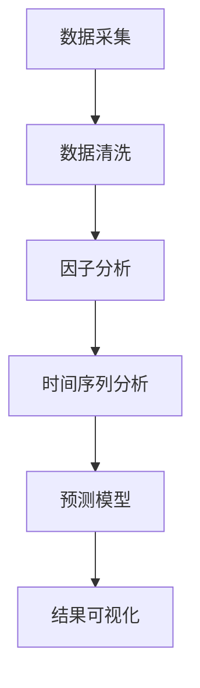

                 


# 特价股票投资中的全球产业链分析方法

## 关键词：特价股票、全球产业链、投资分析、算法模型、系统架构

## 摘要：本文详细探讨了特价股票投资中的全球产业链分析方法，从背景介绍到系统架构设计，结合实际案例，分析特价股票在不同产业链中的投资机会与风险，帮助投资者制定科学的投资策略。

---

# 第一部分：特价股票与全球产业链概述

## 第1章：特价股票的定义与特征

### 1.1 特价股票的定义与分类
特价股票是指价格低于某个基准的股票，通常以2元人民币为界限。这类股票在市场中具有高波动性和高风险，但也可能存在较高的投资回报。

### 1.2 特价股票的市场特征
- **低价格**：通常价格低于2元人民币。
- **高波动**：股价波动较大，容易受市场情绪影响。
- **高风险**：投资风险较高，适合风险承受能力强的投资者。

### 1.3 特价股票的投资价值分析
- **低估潜力**：部分特价股票可能被市场低估，具有增值潜力。
- **行业分布**：主要分布在制造业、科技业等领域。

## 第2章：全球产业链的基本概念

### 2.1 产业链的定义与分类
产业链是指不同行业之间通过生产、分配和消费形成的链条，分为上游、中游和下游。

### 2.2 全球产业链的构成要素
- **上游**：原材料供应。
- **中游**：制造与加工。
- **下游**：销售与消费。

### 2.3 全球产业链的运行机制
通过分工合作，实现资源优化配置，提高生产效率。

## 第3章：特价股票与全球产业链的关系

### 3.1 特价股票在全球产业链中的地位
- **上游原材料**：部分特价股票可能涉及原材料供应，如钢铁、化工行业。
- **中游制造**：制造业中的特价股票可能提供低估值的投资机会。
- **下游销售**：零售业的特价股票可能因市场波动而提供投资机会。

### 3.2 全球产业链对特价股票的影响
- **产业链波动**：上游原材料价格波动可能影响制造企业的股价。
- **政策影响**：政府政策调整可能影响产业链结构，进而影响股价。

---

# 第二部分：全球产业链分析方法

## 第4章：产业链分析的核心概念与原理

### 4.1 产业链分析的基本原理
通过分析产业链的结构和各环节的关系，识别影响股票价格的关键因素。

### 4.2 全球产业链的结构与特征
- **垂直分工**：不同环节由不同企业承担。
- **水平分工**：同一环节由不同企业协作完成。

## 第5章：产业链分析的关键指标与模型

### 5.1 关键指标
- **行业集中度**：衡量行业竞争程度。
- **利润率**：分析企业的盈利能力。

### 5.2 分析模型
- **价值链分析**：识别价值创造的关键环节。

---

# 第三部分：算法与系统架构

## 第6章：算法原理

### 6.1 因子分析
通过因子分析模型，识别影响股票价格的关键因素。

```python
import pandas as pd
from sklearn.decomposition import FactorAnalysis

# 示例数据
data = pd.DataFrame({
    'stock_price': [1.5, 2.0, 1.8, 2.5],
    'revenue': [100, 200, 150, 250],
    'profit': [10, 20, 15, 25]
})

# 因子分析
fa = FactorAnalysis(n_components=2)
features = fa.fit_transform(data[['revenue', 'profit']])

print(features)
```

### 6.2 时间序列分析
使用ARIMA模型预测股票价格趋势。

```python
from statsmodels.tsa.arima_model import ARIMA

# 示例数据
data = [1.5, 2.0, 1.8, 2.5, 2.2, 1.9, 2.3]

# 模型训练
model = ARIMA(data, order=(1, 1, 1))
model_fit = model.fit()

# 预测未来价格
forecast = model_fit.forecast(steps=3)
print(forecast)
```

## 第7章：系统架构设计

### 7.1 系统功能设计
- **数据采集**：收集全球产业链数据。
- **数据分析**：进行因子分析和时间序列分析。
- **模型构建**：建立股票价格预测模型。

### 7.2 系统架构图


---

# 第四部分：项目实战

## 第8章：项目实战

### 8.1 数据收集与预处理
- 收集全球产业链相关数据，清洗数据，处理缺失值。

### 8.2 模型实现
- 实现因子分析和ARIMA模型，预测股票价格。

### 8.3 案例分析
分析某制造业特价股票，预测其价格走势。

---

# 第五部分：总结与展望

## 第9章：总结

### 9.1 投资者注意事项
- 风险提示：特价股票波动大，投资需谨慎。
- 数据依赖：分析依赖高质量数据支持。

## 第10章：未来研究方向

- **复杂模型**：探索深度学习模型的应用。
- **多因素分析**：结合更多因素进行预测。

---

通过以上步骤，本文详细分析了特价股票投资中的全球产业链分析方法，结合算法和系统架构，为投资者提供了科学的投资决策支持。

