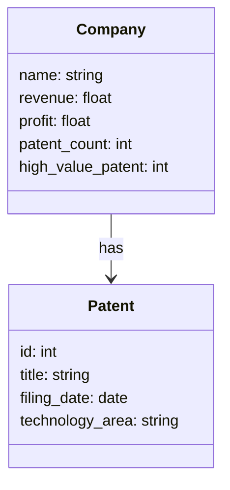

                 


# 特价股票投资中的全球创新指数与专利分析方法

## 关键词：全球创新指数、专利分析、股票投资、技术创新评估、数据可视化

## 摘要：本文探讨了如何利用全球创新指数和专利分析方法来指导特价股票投资。通过分析公司的创新能力，投资者可以更准确地评估其潜在价值和市场竞争力。文章详细介绍了全球创新指数的构建、专利分析的核心指标以及两者在投资决策中的应用，结合实际案例分析，帮助投资者制定更科学的投资策略。

---

## 第1章: 特价股票投资概述

### 1.1 特价股票的定义与特点

#### 1.1.1 特价股票的定义
特价股票通常指市净率（P/B）低于1的股票，这类股票往往被认为被市场低估，具有较高的投资潜力。其特点包括低估值、高分红率和较高的安全边际。

#### 1.1.2 特价股票的特点
- **低估值**：市净率低于1，资产价值高于市场价。
- **高分红率**：公司倾向于通过分红回报股东。
- **高安全边际**：股价远低于净资产，风险较低。

#### 1.1.3 特价股票的投资价值
- **潜在收益**：股价回归净资产的上涨空间。
- **稳定性**：低估值股票在市场波动中表现较为稳定。

---

### 1.2 全球创新指数的背景与意义

#### 1.2.1 全球创新指数的定义
全球创新指数是衡量国家或企业创新能力的综合性指标，涵盖研发投入、专利数量、创新产出等多个维度。

#### 1.2.2 全球创新指数的构成与指标
- **研发投入**：占GDP的比例。
- **专利数量**：年申请量和授权量。
- **创新产出**：新产品、新技术的市场表现。

#### 1.2.3 全球创新指数与股票投资的关系
创新能力强的公司通常具有更高的成长性和市场竞争力，能够为投资者带来超额收益。

---

### 1.3 专利分析方法的介绍

#### 1.3.1 专利分析的基本概念
专利分析是通过统计和解读专利数据，评估公司的技术创新能力。

#### 1.3.2 专利分析在投资中的应用
- **技术领先性**：评估公司在特定领域的技术优势。
- **市场竞争力**：分析专利布局与市场需求的匹配度。

#### 1.3.3 专利分析的优势与局限性
优势：提供客观的技术评估依据；局限性：专利数量与实际创新能力不一定成正比。

---

## 第2章: 全球创新指数的构建与评估

### 2.1 全球创新指数的核心概念

#### 2.1.1 创新能力的定义
创新能力是指公司在技术研发、产品创新和市场开拓方面的能力。

#### 2.1.2 全球创新指数的构成要素
- **研发投入强度**：研发支出占收入的比例。
- **专利产出**：专利申请量和授权量。
- **创新产出**：新产品收入占总收入的比例。

#### 2.1.3 创新能力的评估标准
- **研发投入强度**：越高代表公司越重视技术创新。
- **专利质量**：高价值专利数量越多，创新能力越强。

---

### 2.2 全球创新指数的计算方法

#### 2.2.1 数据收集与处理
- 数据来源：公司财报、专利数据库。
- 数据清洗：去除无效专利和重复数据。

#### 2.2.2 指数的加权与计算
- 加权方法：根据指标的重要性赋予不同权重。
- 计算公式：$$ 创新指数 = \sum (\text{权重}_i \times \text{指标值}_i) $$

#### 2.2.3 指数的验证与调整
- 验证方法：对比历史数据和行业基准。
- 调整策略：根据实际情况动态调整权重。

---

### 2.3 全球创新指数的可视化与分析

#### 2.3.1 数据可视化方法
- 使用柱状图和折线图展示指数变化趋势。

#### 2.3.2 指数的动态变化分析
- 分析指数的年增长率，判断创新能力的提升或下降。

#### 2.3.3 指数与股票市场的关联性分析
- 使用回归分析验证指数与股价的相关性。

---

## 第3章: 专利分析方法的详细讲解

### 3.1 专利数据的获取与处理

#### 3.1.1 专利数据的来源
- 专利数据库：如美国专利商标局（USPTO）和欧洲专利局（EPO）。
- 公司年报：披露专利数量和主要专利信息。

#### 3.1.2 专利数据的清洗与预处理
- 去重：识别同一专利在不同数据库中的重复记录。
- 标准化：统一专利分类号和申请日期格式。

#### 3.1.3 专利数据的存储与管理
- 数据库选择：使用MySQL或MongoDB存储专利数据。
- 数据建模：设计实体关系图（ER图）来管理专利信息。

---

### 3.2 专利分析的核心指标

#### 3.2.1 专利数量分析
- 总专利数：衡量公司的技术创新活跃度。
- 年申请量：反映公司近期的创新投入。

#### 3.2.2 专利质量评估
- 高价值专利数量：评估公司的技术领先性。
- 专利寿命：衡量技术的长期价值。

#### 3.2.3 专利技术领域的分布
- 主要技术领域：分析公司技术创新的焦点。
- 技术布局的广度与深度：评估公司的技术储备。

---

### 3.3 专利分析的高级方法

#### 3.3.1 专利网络分析
- 构建专利网络图：使用Gephi或NetworkX分析专利之间的关联性。

#### 3.3.2 专利引用分析
- 引用次数：评估专利的技术影响力。
- 被引用情况：判断专利的市场认可度。

#### 3.3.3 专利生命周期分析
- 专利申请到授权的时间：评估审批效率。
- 专利到期风险：分析技术更新的及时性。

---

## 第4章: 全球创新指数与专利分析的结合

### 4.1 全球创新指数与专利分析的关联

#### 4.1.1 创新能力与专利数量的关系
- 专利数量是创新能力的直观反映，但并非唯一指标。

#### 4.1.2 创新质量与专利技术深度的关系
- 高质量专利通常集中在核心技术领域。

#### 4.1.3 市场影响力与专利布局的关系
- 专利布局广泛且合理，能够提升市场影响力。

---

### 4.2 专利分析在股票筛选中的应用

#### 4.2.1 通过专利数量筛选潜在投资标的
- 选择专利数量增长快的公司，预示较高的技术创新能力。

#### 4.2.2 通过专利质量评估公司创新能力
- 重点分析高价值专利的数量和分布领域。

#### 4.2.3 通过专利布局预测市场趋势
- 分析专利申请趋势，预测公司未来的技术发展方向。

---

### 4.3 综合评估模型的构建

#### 4.3.1 模型的设计思路
- 结合全球创新指数和专利分析结果，构建多维度评估模型。

#### 4.3.2 模型的输入与输出
- 输入：公司财务数据、专利数据。
- 输出：创新能力评分、投资建议。

#### 4.3.3 模型的验证与优化
- 使用历史数据验证模型准确性。
- 根据市场反馈动态调整模型参数。

---

## 第5章: 项目实战与案例分析

### 5.1 项目环境的搭建

#### 5.1.1 工具安装
- 数据分析工具：Python、Pandas、Matplotlib。
- 专利数据库访问：使用USPTO API。
- 数据可视化工具：Tableau。

#### 5.1.2 数据获取与预处理
- 下载专利数据并清洗。
- 整合公司财务数据。

---

### 5.2 系统功能设计

#### 5.2.1 领域模型设计


#### 5.2.2 系统架构设计
```mermaid
rect
    title 系统架构
    分层架构：数据层、业务逻辑层、用户界面层。
```

#### 5.2.3 系统接口设计
- API接口：用于数据获取和模型调用。
- 接口文档：详细说明输入输出格式。

---

### 5.3 项目核心实现

#### 5.3.1 代码实现
```python
import pandas as pd
import numpy as np

# 数据加载
patent_data = pd.read_csv('patent.csv')
financial_data = pd.read_csv('financial.csv')

# 全球创新指数计算
def calculate_innovation_index(financial_data, patent_data):
    # 计算研发投入强度
    r_d_intensity = financial_data['研发支出'] / financial_data['收入']
    # 计算专利质量
    high_value_patent = patent_data.groupby('公司名称')['专利价值'].sum()
    # 综合指数
    innovation_index = r_d_intensity * high_value_patent
    return innovation_index

# 投资建议生成
def investment_recommendation(innovation_index):
    if innovation_index > industry_average:
        return "买入"
    elif innovation_index < industry_average:
        return "卖出"
    else:
        return "观望"

# 示例分析
company_name = "某公司"
index = calculate_innovation_index(financial_data, patent_data)
recommendation = investment_recommendation(index)
print(f"投资建议：{recommendation}")
```

#### 5.3.2 代码解读
- 数据加载：读取专利和财务数据。
- 创新指数计算：结合研发投入和专利价值。
- 投资建议生成：根据指数与行业平均水平对比。

---

### 5.4 案例分析与详细解读

#### 5.4.1 案例选择
- 选择某高科技公司，分析其专利数量、质量和分布。

#### 5.4.2 数据分析结果
- 专利数量增长快，技术布局广泛，创新能力强。

#### 5.4.3 投资建议
- 综合指数高于行业平均水平，建议买入。

---

## 第5章: 最佳实践与小结

### 5.1 最佳实践 tips
- 定期更新数据，保持模型准确性。
- 结合市场环境，动态调整投资策略。

### 5.2 小结
通过全球创新指数和专利分析方法，投资者可以更科学地评估公司的技术创新能力，从而做出更明智的投资决策。

### 5.3 注意事项
- 数据质量影响分析结果，需谨慎处理数据。
- 结合多维度信息，避免单一指标误导。

### 5.4 拓展阅读
- 《专利分析实战指南》
- 《全球创新指数年度报告》

---

通过以上内容，我们可以看到，利用全球创新指数和专利分析方法，投资者能够更准确地评估特价股票的投资价值，从而制定更科学的投资策略。这种方法不仅提高了投资决策的客观性，还为投资者提供了更全面的评估工具。

