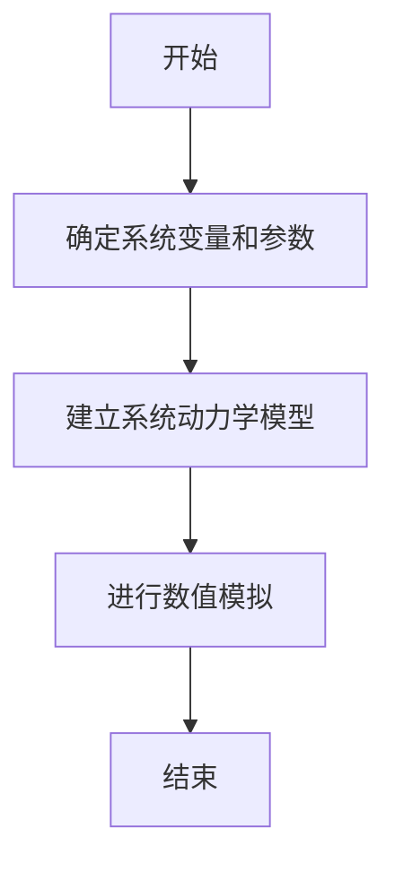
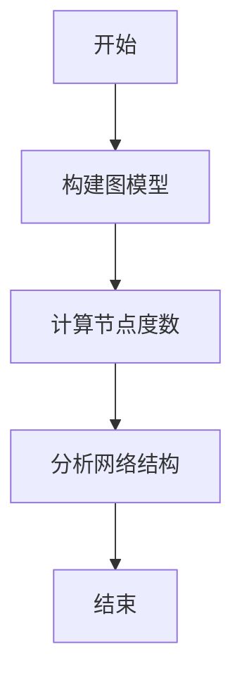
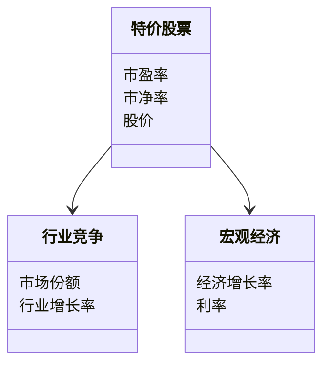
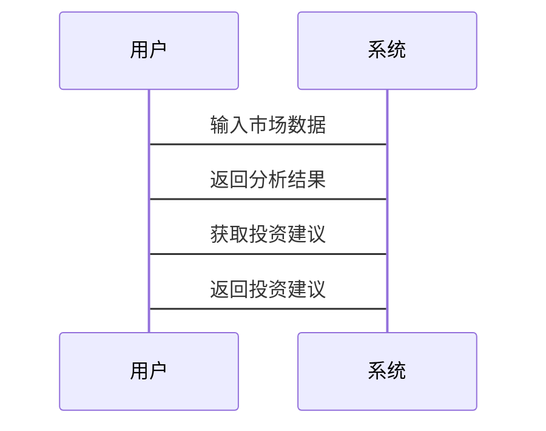

                 


# 特价股票投资中的动态产业生态系统模型应用

**关键词：** 特价股票投资，动态产业生态系统，系统动力学，网络理论，数学建模，股票分析

**摘要：**  
本文探讨了在特价股票投资中应用动态产业生态系统模型的方法。通过系统动力学和网络理论，构建了一个能够分析产业动态和企业竞争力的数学模型，为投资者提供了科学的决策支持。文章详细介绍了模型的数学基础、算法原理、系统架构设计以及项目实战，并通过案例分析展示了模型的应用效果。

---

# 第1章: 特价股票投资与动态产业生态系统概述

## 1.1 特价股票投资的背景与意义

### 1.1.1 特价股票的定义与特点

特价股票通常指市盈率、市净率等估值指标低于行业平均水平的股票。其特点包括低估值、高潜在收益和较高的投资风险。投资者通过挖掘被市场低估的股票，寻求超额收益。

### 1.1.2 特价股票投资的市场现状

当前市场中，特价股票主要分布在周期性行业和传统行业。投资者在选择特价股票时，需考虑行业周期、企业基本面和市场情绪等多方面因素。

### 1.1.3 动态产业生态系统在特价股票投资中的应用价值

动态产业生态系统模型通过分析产业内部的互动关系，帮助投资者识别行业趋势和企业竞争优势，从而优化投资决策。

## 1.2 动态产业生态系统模型的核心概念

### 1.2.1 产业生态系统的定义与构成

产业生态系统包括产业内的企业、供应商、客户、竞争对手以及政府政策等因素。动态性体现在产业内部关系和外部环境的变化。

### 1.2.2 动态产业生态系统的特征

动态产业生态系统具有复杂性、适应性和网络化特征。模型需考虑企业间的协同效应和竞争关系。

### 1.2.3 特价股票投资中的生态系统模型构建

构建模型需综合考虑企业财务状况、行业竞争格局和宏观经济环境等因素。

## 1.3 本章小结

本章介绍了特价股票投资的背景和动态产业生态系统模型的基本概念，为后续建模和分析奠定了基础。

---

# 第2章: 动态产业生态系统模型的数学基础

## 2.1 系统动力学模型

### 2.1.1 系统动力学的基本原理

系统动力学通过分析系统内部变量之间的关系，模拟系统的动态行为。其核心是理解变量间的反馈机制。

### 2.1.2 系统动力学在产业分析中的应用

系统动力学可用于分析行业增长、企业市场份额变化等动态行为。

### 2.1.3 示例：行业增长模型

$$\frac{dN}{dt} = rN - \frac{N^2}{K}$$

其中，\(N\) 表示行业规模，\(r\) 为增长率，\(K\) 为环境容量。

## 2.2 网络理论与复杂系统建模

### 2.2.1 网络理论的基本概念

网络理论将系统视为节点和边的集合，用于描述复杂系统的结构和功能。

### 2.2.2 复杂系统建模方法

复杂系统的建模需考虑节点之间的相互作用和网络的拓扑结构。

## 2.3 特价股票投资中的数学模型构建

### 2.3.1 产业生态系统模型的数学表达

利用系统动力学和网络理论，构建以下方程组：

$$\frac{dP}{dt} = a \cdot Q - b \cdot P$$

$$\frac{dQ}{dt} = c \cdot (K - Q)$$

其中，\(P\) 表示企业利润，\(Q\) 表示市场份额，\(a, b, c\) 为常数。

## 2.4 本章小结

本章介绍了系统动力学和网络理论的基本原理，并展示了其在动态产业生态系统模型中的应用。

---

# 第3章: 动态产业生态系统模型的算法原理

## 3.1 系统动力学模拟算法

### 3.1.1 系统动力学模拟的基本步骤

1. 确定系统变量和参数。
2. 建立系统动力学模型。
3. 进行数值模拟。

### 3.1.2 算法实现的流程图



### 3.1.3 示例代码实现

```python
import numpy as np
from scipy.integrate import odeint

def system_model(y, t, a, b, c, K):
    P, Q = y
    dPdt = a * Q - b * P
    dQdt = c * (K - Q)
    return [dPdt, dQdt]

t = np.linspace(0, 10, 100)
y0 = [1, 1]
params = (0.5, 0.1, 0.2, 10)
solution = odeint(system_model, y0, t, params)

P = solution[:, 0]
Q = solution[:, 1]
```

## 3.2 网络分析算法

### 3.2.1 网络分析的基本原理

网络分析通过构建图模型，研究节点之间的关系和网络的结构特性。

### 3.2.2 算法实现的流程图



## 3.3 特价股票投资中的算法实现

### 3.3.1 系统动力学模型的Python代码实现

```python
import numpy as np
import matplotlib.pyplot as plt

t = np.linspace(0, 20, 100)
a = 0.5
b = 0.1
K = 10

y0 = [1, 1]
solution = odeint(system_model, y0, t, (a, b, c, K))

plt.plot(t, solution[:, 0], label='P(t)')
plt.plot(t, solution[:, 1], label='Q(t)')
plt.xlabel('Time')
plt.ylabel('Values')
plt.legend()
plt.show()
```

### 3.3.2 网络分析模型的Python代码实现

```python
import networkx as nx

G = nx.DiGraph()
G.add_nodes_from(['A', 'B', 'C'])
G.add_edges_from([('A', 'B'), ('B', 'C')])
nx.draw(G, with_labels=True)
plt.show()
```

## 3.4 本章小结

本章详细讲解了系统动力学模拟和网络分析算法的实现方法，并通过代码示例展示了其在动态产业生态系统模型中的应用。

---

# 第4章: 动态产业生态系统模型的系统架构设计

## 4.1 系统分析与设计概述

### 4.1.1 投资场景分析

投资者需分析市场环境、企业基本面和行业竞争格局。

### 4.1.2 系统功能需求分析

系统需具备数据采集、模型构建、分析和结果展示功能。

## 4.2 系统架构设计

### 4.2.1 领域模型设计



### 4.2.2 系统架构设计

```mermaid
container 宏观经济环境 {
    经济指标
    政策环境
}
container 行业竞争 {
    企业市场份额
    行业增长率
}
container 企业基本面 {
    财务数据
    管理团队
}
```

## 4.3 系统接口设计

### 4.3.1 系统输入接口设计

系统需接收市场数据、行业数据和宏观经济指标。

### 4.3.2 系统输出接口设计

系统需输出分析结果、投资建议和风险评估。

## 4.4 系统交互设计

### 4.4.1 系统交互流程图



## 4.5 本章小结

本章详细设计了动态产业生态系统模型的系统架构，并展示了其在特价股票投资中的应用。

---

# 第5章: 动态产业生态系统模型的项目实战

## 5.1 环境安装与配置

### 5.1.1 Python 环境的安装与配置

建议使用Anaconda或Miniconda来管理Python环境。

### 5.1.2 相关库的安装

安装numpy、pandas、scipy、networkx、matplotlib等库。

## 5.2 系统核心实现

### 5.2.1 系统动力学模型的实现

参考第3章的代码示例，实现系统动力学模型。

### 5.2.2 网络分析模型的实现

参考第3章的代码示例，实现网络分析模型。

## 5.3 代码应用解读与分析

### 5.3.1 核心代码的功能分析

系统动力学模型用于模拟企业利润和市场份额的变化，网络分析模型用于分析行业竞争格局。

### 5.3.2 代码实现的优化建议

建议结合实际数据对模型参数进行调优。

## 5.4 实际案例分析

### 5.4.1 案例背景介绍

选择一个特定行业，分析其动态竞争格局。

### 5.4.2 模型应用与结果分析

通过模型模拟，识别具有竞争优势的企业。

## 5.5 项目小结

本章通过实际案例展示了动态产业生态系统模型的应用，并验证了其有效性。

---

# 第6章: 动态产业生态系统模型的

## 6.1 最佳实践

### 6.1.1 数据质量的重要性

确保数据的准确性和完整性。

### 6.1.2 模型的适用性

根据实际情况选择合适的模型。

## 6.2 小结

本文系统地介绍了动态产业生态系统模型在特价股票投资中的应用，并通过实例展示了其实际效果。

## 6.3 注意事项

投资者需注意市场风险，模型仅为辅助工具。

## 6.4 拓展阅读

建议进一步学习系统动力学和网络理论的相关知识。

---

**附录: 参考文献**

- 系统动力学相关文献
- 网络理论相关文献
- 特价股票投资相关文献

---

**致谢**

感谢读者的关注和支持。

