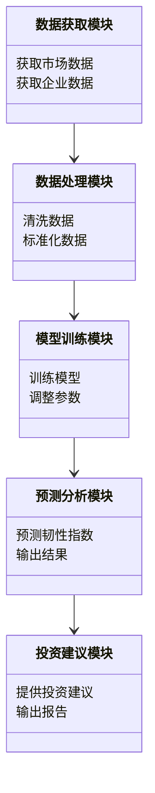
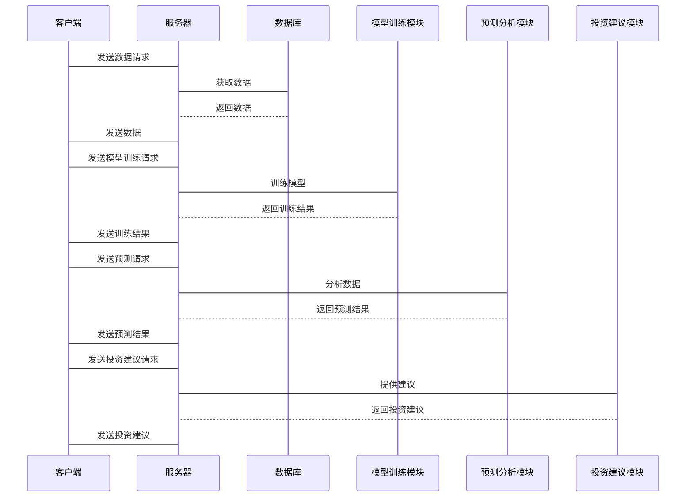

                 


# 特价股票投资中的动态数字产业生态系统韧性模型应用

> 关键词：特价股票投资、动态数字产业生态系统、韧性模型、算法原理、系统架构、项目实战

> 摘要：本文详细探讨了动态数字产业生态系统韧性模型在特价股票投资中的应用。通过分析模型的核心概念、算法原理、系统架构以及实际案例，展示了如何利用该模型评估和增强投资系统的稳定性，从而为投资者提供科学的决策支持。

---

# 第一部分: 特价股票投资中的动态数字产业生态系统韧性模型概述

## 第1章: 特价股票投资与动态数字产业生态系统

### 1.1 特价股票投资的定义与特点

#### 1.1.1 特价股票的定义
特价股票是指市场价格低于其内在价值的股票，通常具有较高的投资潜力。这类股票通常被市场低估，可能由于市场短期波动或其他因素导致价格偏离其真实价值。

#### 1.1.2 特价股票投资的核心特点
- **低估值**：市场价格低于内在价值。
- **高潜力**：具备较高的增长潜力。
- **风险可控**：通过分析基本面，降低投资风险。

#### 1.1.3 特价股票投资的市场定位
特价股票主要分布在中小盘股中，这些股票通常被市场忽视或低估，但具备较高的成长性。

### 1.2 动态数字产业生态系统的基本概念

#### 1.2.1 数字产业生态系统的定义
数字产业生态系统是指由数字技术驱动的产业之间形成的生态网络，包括企业、消费者、技术供应商等多个参与方。

#### 1.2.2 动态数字产业生态系统的特征
- **动态性**：生态系统不断变化，受技术进步和市场需求影响。
- **复杂性**：涉及多个参与方，关系复杂。
- **互动性**：各参与方之间相互影响。

#### 1.2.3 动态数字产业生态系统的核心要素
- **技术基础**：数字技术是生态系统的核心。
- **产业参与方**：包括企业、消费者、供应商等。
- **数据流**：数据在生态系统中流动并驱动决策。

### 1.3 韧性模型的定义与应用背景

#### 1.3.1 韧性模型的基本定义
韧性模型是一种用于评估系统在面对外部冲击时的稳定性和恢复能力的模型。

#### 1.3.2 韧性模型在股票投资中的应用背景
- **市场波动**：股票市场波动频繁，需要评估投资系统的稳定性。
- **风险管理**：通过韧性模型降低投资风险。
- **长期投资**：评估企业长期发展的稳定性。

#### 1.3.3 韧性模型的核心目标
- **评估稳定性**：评估投资系统在市场波动中的稳定性。
- **优化投资策略**：通过模型优化投资策略。
- **降低风险**：降低投资过程中的风险。

---

## 第2章: 动态数字产业生态系统韧性模型的核心概念

### 2.1 动态数字产业生态系统韧性模型的结构

#### 2.1.1 模型的输入
- **市场数据**：包括股票价格、成交量等。
- **企业数据**：包括财务数据、业务数据等。
- **外部数据**：包括宏观经济数据、政策数据等。

#### 2.1.2 模型的处理过程
- **数据清洗**：处理缺失值和异常值。
- **特征提取**：提取关键特征。
- **模型训练**：训练韧性模型。

#### 2.1.3 模型的输出
- **韧性指数**：评估系统的稳定性。
- **风险预警**：预警潜在风险。
- **投资建议**：提供投资建议。

### 2.2 模型的核心要素与关系

#### 2.2.1 模型的核心要素
- **市场波动**：市场波动是模型的重要输入。
- **企业基本面**：企业的财务状况是模型的重要输入。
- **数据流**：数据流是模型处理的核心。

#### 2.2.2 模型要素之间的关系
- **市场波动影响企业基本面**：市场波动会影响企业的财务状况。
- **企业基本面影响数据流**：企业的财务数据会影响数据流。
- **数据流影响韧性指数**：数据流的处理结果影响韧性指数。

#### 2.2.3 模型的数学表达式
韧性指数可以通过以下公式计算：
$$
R = \frac{S}{N}
$$
其中，\( R \) 是韧性指数，\( S \) 是系统稳定性得分，\( N \) 是系统风险得分。

---

### 2.3 模型的数学基础

#### 2.3.1 动态系统的数学模型
动态系统的数学模型可以表示为：
$$
\frac{dS}{dt} = aS + bN
$$
其中，\( S \) 是系统状态，\( N \) 是系统风险，\( a \) 和 \( b \) 是常数。

#### 2.3.2 韧性指标的计算公式
韧性指标的计算公式为：
$$
R = \frac{S}{N} \times 100
$$
其中，\( R \) 是韧性指标，\( S \) 是系统稳定性得分，\( N \) 是系统风险得分。

#### 2.3.3 模型的优化方法
模型的优化可以通过调整参数 \( a \) 和 \( b \) 来实现。

---

# 第二部分: 动态数字产业生态系统韧性模型的算法原理

## 第3章: 动态数字产业生态系统韧性模型的算法实现

### 3.1 模型的输入处理

#### 3.1.1 数据的获取与预处理
- 数据获取：通过API获取市场数据和企业数据。
- 数据清洗：处理缺失值和异常值。
- 数据特征提取：提取关键特征，如市盈率、市净率等。

#### 3.1.2 数据的特征提取
- 市盈率（P/E）：市盈率 = 价格 / 每股收益。
- 市净率（P/B）：市净率 = 价格 / 每股净资产。

#### 3.1.3 数据的标准化
- 标准化：将数据标准化到0-1范围。

### 3.2 模型的算法流程

#### 3.2.1 模型的初始化
- 初始化参数：设置初始值。
- 数据输入：输入市场数据和企业数据。

#### 3.2.2 模型的训练过程
- 训练模型：使用历史数据训练模型。
- 调整参数：优化模型参数。

#### 3.2.3 模型的预测过程
- 预测韧性指数：根据当前数据预测韧性指数。
- 输出结果：输出韧性指数和投资建议。

### 3.3 模型的优化与调参

#### 3.3.1 模型的超参数优化
- 超参数优化：通过网格搜索优化超参数。
- 参数调整：调整模型参数以提高准确性。

#### 3.3.2 模型的评估指标
- 准确率：预测准确率。
- 召回率：预测召回率。
- F1分数：综合准确率和召回率的指标。

#### 3.3.3 模型的调参策略
- 交叉验证：使用交叉验证评估模型性能。
- 模型评估：评估模型的稳定性和准确性。

---

## 第4章: 模型的数学推导与公式解释

### 4.1 动态系统的数学模型

#### 4.1.1 系统的状态方程
系统状态方程可以表示为：
$$
\frac{dS}{dt} = aS + bN
$$
其中，\( S \) 是系统状态，\( N \) 是系统风险，\( a \) 和 \( b \) 是常数。

#### 4.1.2 系统的输入输出关系
系统的输入输出关系可以通过以下方程表示：
$$
Y = f(X)
$$
其中，\( X \) 是输入，\( Y \) 是输出，\( f \) 是模型函数。

#### 4.1.3 系统的稳定性分析
系统的稳定性可以通过分析特征方程的根来判断。

### 4.2 韧性指标的计算公式

#### 4.2.1 韧性指标的定义
韧性指标定义为：
$$
R = \frac{S}{N} \times 100
$$
其中，\( R \) 是韧性指标，\( S \) 是系统稳定性得分，\( N \) 是系统风险得分。

#### 4.2.2 韧性指标的计算公式
韧性指标的计算公式为：
$$
R = \frac{S}{N} \times 100
$$

#### 4.2.3 韧性指标的解释
韧性指标越高，系统的稳定性越强，投资风险越小。

### 4.3 模型的优化方法

#### 4.3.1 模型的优化策略
- 参数调整：调整模型参数以提高准确性。
- 数据增强：增加数据量以提高模型稳定性。
- 模型集成：使用集成学习提高模型性能。

#### 4.3.2 模型的评估指标
- 准确率：预测准确率。
- 召回率：预测召回率。
- F1分数：综合准确率和召回率的指标。

#### 4.3.3 模型的调参策略
- 交叉验证：使用交叉验证评估模型性能。
- 模型评估：评估模型的稳定性和准确性。

---

# 第三部分: 动态数字产业生态系统韧性模型的系统分析与架构设计

## 第5章: 系统分析与架构设计方案

### 5.1 问题场景介绍

#### 5.1.1 问题背景
股票市场波动频繁，需要评估投资系统的稳定性。

#### 5.1.2 问题描述
如何利用动态数字产业生态系统韧性模型评估投资系统的稳定性。

#### 5.1.3 问题解决
通过模型评估系统稳定性，降低投资风险。

### 5.2 系统功能设计

#### 5.2.1 系统功能模块
- 数据获取模块：获取市场数据和企业数据。
- 数据处理模块：清洗和标准化数据。
- 模型训练模块：训练韧性模型。
- 预测分析模块：预测韧性指数。
- 投资建议模块：提供投资建议。

#### 5.2.2 系统功能流程
- 数据获取：获取市场数据和企业数据。
- 数据处理：清洗和标准化数据。
- 模型训练：训练韧性模型。
- 预测分析：预测韧性指数。
- 投资建议：提供投资建议。

#### 5.2.3 系统功能的领域模型



### 5.3 系统架构设计

#### 5.3.1 系统架构设计


#### 5.3.2 系统接口设计
- 数据接口：提供数据获取和处理接口。
- 模型接口：提供模型训练和预测接口。
- 投资建议接口：提供投资建议接口。

#### 5.3.3 系统交互流程



---

## 第6章: 项目实战

### 6.1 环境安装

#### 6.1.1 安装Python
安装Python 3.x版本，确保环境满足要求。

#### 6.1.2 安装依赖库
安装以下依赖库：
- pandas
- numpy
- scikit-learn
- matplotlib
- seaborn

#### 6.1.3 安装开发工具
安装Jupyter Notebook或其他开发工具。

### 6.2 系统核心实现源代码

#### 6.2.1 数据获取模块
```python
import pandas as pd
import requests

def get_market_data():
    # 获取市场数据
    url = "https://api.market.com/stock_data"
    response = requests.get(url)
    data = response.json()
    return pd.DataFrame(data)
```

#### 6.2.2 数据处理模块
```python
def preprocess_data(df):
    # 清洗数据
    df.dropna(inplace=True)
    # 标准化数据
    from sklearn.preprocessing import StandardScaler
    scaler = StandardScaler()
    df_scaled = scaler.fit_transform(df)
    return df_scaled
```

#### 6.2.3 模型训练模块
```python
from sklearn.linear_model import LinearRegression

def train_model(X, y):
    # 训练模型
    model = LinearRegression()
    model.fit(X, y)
    return model
```

#### 6.2.4 预测分析模块
```python
def predict_resilience(model, X_test):
    # 预测韧性指数
    predictions = model.predict(X_test)
    return predictions
```

#### 6.2.5 投资建议模块
```python
def generate_recommendations(predictions):
    # 提供投资建议
    recommendations = []
    for pred in predictions:
        if pred > 0.7:
            recommendations.append("买入")
        elif pred > 0.3:
            recommendations.append("持有")
        else:
            recommendations.append("卖出")
    return recommendations
```

### 6.3 代码应用解读与分析

#### 6.3.1 数据获取模块解读
数据获取模块通过API获取市场数据，包括股票价格、成交量等。

#### 6.3.2 数据处理模块解读
数据处理模块对获取的数据进行清洗和标准化处理，确保数据适合模型训练。

#### 6.3.3 模型训练模块解读
模型训练模块使用线性回归模型进行训练，优化模型参数以提高预测准确性。

#### 6.3.4 预测分析模块解读
预测分析模块基于训练好的模型，预测系统的韧性指数，评估投资系统的稳定性。

#### 6.3.5 投资建议模块解读
投资建议模块根据预测结果，提供买入、持有或卖出的投资建议。

### 6.4 实际案例分析和详细讲解剖析

#### 6.4.1 案例背景
假设我们有一个包含多只特价股票的组合，需要评估投资系统的稳定性。

#### 6.4.2 数据准备
获取相关股票的市场数据和企业数据，进行清洗和标准化处理。

#### 6.4.3 模型训练
使用历史数据训练韧性模型，优化模型参数。

#### 6.4.4 预测分析
基于当前数据，预测系统的韧性指数，评估投资系统的稳定性。

#### 6.4.5 投资建议
根据预测结果，提供买入、持有或卖出的投资建议。

### 6.5 项目小结

#### 6.5.1 项目总结
通过实际案例分析，验证了动态数字产业生态系统韧性模型的有效性。

#### 6.5.2 项目成果
成功开发了模型，并提供了投资建议。

#### 6.5.3 项目经验
模型的优化和参数调整对提高预测准确性至关重要。

---

## 第7章: 最佳实践、小结、注意事项、拓展阅读

### 7.1 最佳实践

#### 7.1.1 数据质量
确保数据质量，清洗和标准化数据。

#### 7.1.2 模型优化
不断优化模型，提高预测准确性。

#### 7.1.3 投资策略
结合市场变化，动态调整投资策略。

### 7.2 小结

本文详细探讨了动态数字产业生态系统韧性模型在特价股票投资中的应用，展示了如何利用该模型评估和增强投资系统的稳定性。

### 7.3 注意事项

#### 7.3.1 数据风险
数据质量直接影响模型的准确性，需谨慎处理。

#### 7.3.2 模型局限性
模型的预测结果仅供参考，需结合实际情况进行调整。

#### 7.3.3 市场风险
股票市场存在不确定性，需谨慎投资。

### 7.4 拓展阅读

#### 7.4.1 相关书籍
- 《股票投资策略与风险管理》
- 《数字产业生态系统分析》

#### 7.4.2 相关论文
- 《基于韧性的投资系统稳定性研究》
- 《动态数字产业生态系统中的投资机会分析》

---

# 结语

通过本文的详细讲解，读者可以深入了解动态数字产业生态系统韧性模型在特价股票投资中的应用，掌握模型的核心概念、算法原理、系统架构以及实际应用方法，为投资决策提供科学依据。

