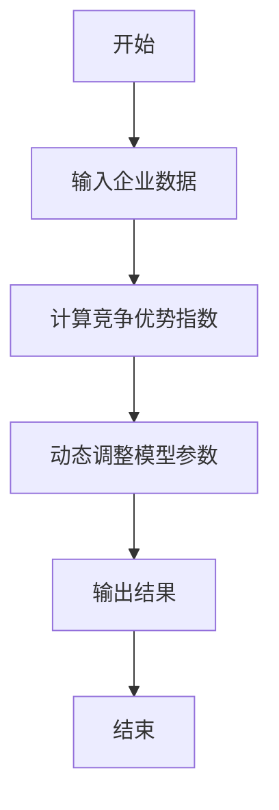
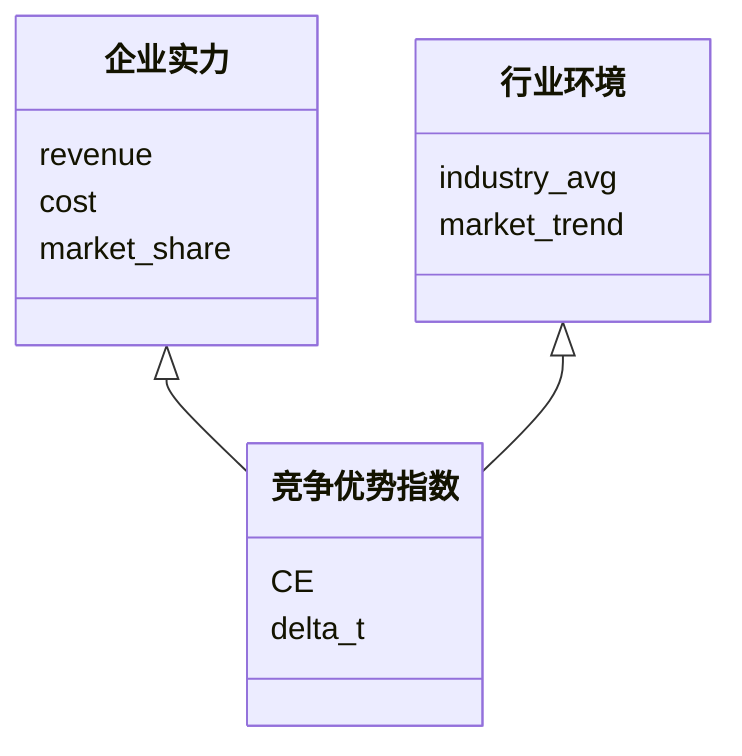
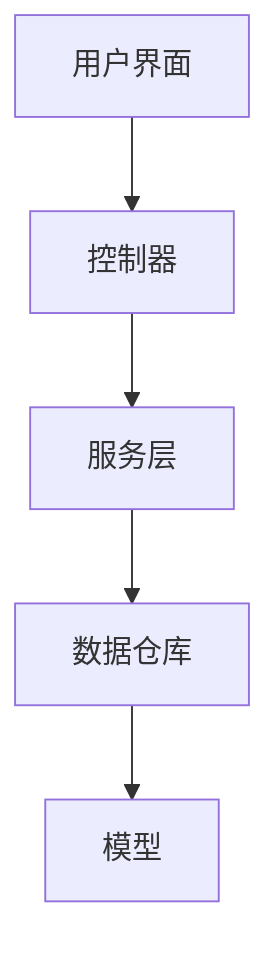
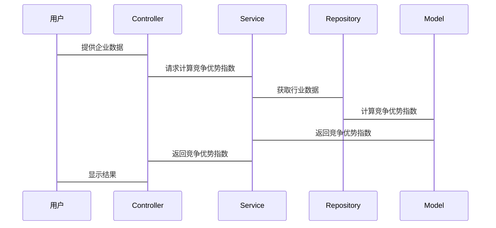

                 


# 特价股票投资中的动态竞争优势模型应用

**关键词**：特价股票投资、动态竞争优势模型、算法原理、系统架构、项目实战

**摘要**：本文深入探讨了动态竞争优势模型在特价股票投资中的应用，从背景、核心概念、算法原理到系统架构和项目实战，详细分析了该模型如何帮助投资者在竞争激烈的市场中找到投资机会。通过具体案例和代码实现，本文展示了动态竞争优势模型的优势和实际应用价值。

---

# 第1章 特价股票投资与动态竞争优势模型背景

## 1.1 特价股票投资的背景与意义

### 1.1.1 特价股票投资的定义与特点

特价股票投资是指投资者在特定市场条件下，寻找被低估的股票进行投资。其特点包括高性价比、短期价格波动和长期价值潜力。

### 1.1.2 特价股票投资的核心问题与挑战

在特价股票投资中，投资者面临的主要挑战包括如何识别真正的价值股、如何预测价格波动以及如何应对市场变化。传统的投资模型往往难以捕捉动态变化的市场环境，因此需要更灵活的分析工具。

### 1.1.3 动态竞争优势模型在投资中的应用价值

动态竞争优势模型能够帮助投资者实时评估企业的竞争优势，捕捉市场变化中的投资机会，从而提高投资决策的准确性和效率。

---

## 1.2 动态竞争优势模型的定义与特点

### 1.2.1 动态竞争优势模型的核心概念

动态竞争优势模型是一种基于企业竞争优势随时间变化的分析工具，它通过量化指标评估企业在市场中的竞争力。

### 1.2.2 动态竞争优势模型与传统模型的对比

| 特性 | 动态竞争优势模型 | 传统竞争优势模型 |
|------|-----------------|------------------|
| 时间维度 | 动态调整 | 静态评估 |
| 数据需求 | 高 | 中 |
| 适用场景 | 竞争激烈的市场 | 稳定市场 |

### 1.2.3 动态竞争优势模型的应用前景

随着市场环境的快速变化，动态竞争优势模型的应用前景广阔，尤其在新兴行业和科技领域表现突出。

---

# 第2章 动态竞争优势模型的核心概念

## 2.1 动态竞争优势模型的理论基础

### 2.1.1 企业竞争优势的动态性分析

企业竞争优势并非固定不变，受市场、技术和政策等因素的影响，竞争优势会动态变化。

### 2.1.2 动态竞争优势模型的构成要素

动态竞争优势模型由企业实力、市场环境、竞争优势指数和时间因素四个核心要素构成。

### 2.1.3 动态竞争优势模型的数学表达式

竞争优势指数（CE）的计算公式为：
$$ CE = \frac{E}{P} $$
其中，$E$ 表示企业竞争优势的强度，$P$ 表示行业平均竞争优势强度。

---

## 2.2 动态竞争优势模型的属性特征对比

### 2.2.1 模型属性对比表格

| 属性 | 动态竞争优势模型 | 传统竞争优势模型 |
|------|-----------------|------------------|
| 时间敏感性 | 高 | 低 |
| 数据复杂性 | 高 | 中 |
| 计算效率 | 中 | 高 |

### 2.2.2 动态竞争优势模型的 ER 实体关系图

```mermaid
erDiagram
    企业实力<ECompetitiveEdge> 竞争优势指数
    竞争优势指数<SECompetitiveEdge> 时间因素
    企业实力<SOCompetitiveEdge> 行业环境
```

---

# 第3章 动态竞争优势模型的算法原理

## 3.1 动态竞争优势模型的算法流程

### 3.1.1 算法流程图



### 3.1.2 算法实现步骤

1. 输入企业数据，包括财务指标、市场地位等。
2. 计算竞争优势指数，公式如前所述。
3. 动态调整模型参数以适应市场变化。
4. 输出结果并进行评估。

---

## 3.2 动态竞争优势模型的数学模型

### 3.2.1 竞争优势指数的计算公式

$$ CE = \frac{E}{P} $$

其中，$E$ 表示企业的竞争优势强度，$P$ 表示行业平均竞争优势强度。

### 3.2.2 优势指数的动态调整公式

$$ CE_{\text{new}} = CE_{\text{old}} \times (1 + \Delta t) $$

其中，$\Delta t$ 是时间变化对竞争优势的影响系数。

---

## 3.3 动态竞争优势模型的 Python 实现

### 3.3.1 算法实现代码示例

```python
def calculate_competitive_edge(revenue, cost, industry_avg):
    competitive_edge = revenue - cost / industry_avg
    return competitive_edge

# 示例数据
revenue = 1000
cost = 500
industry_avg = 700

ce = calculate_competitive_edge(revenue, cost, industry_avg)
print(f"竞争优势指数：{ce}")
```

---

## 3.4 动态竞争优势模型的实例分析

### 3.4.1 实例分析与计算

假设某企业 revenues=1000，cost=500，industry_avg=700，计算其竞争优势指数：

$$ CE = \frac{1000}{700} \approx 1.4286 $$

---

# 第4章 动态竞争优势模型的系统架构与实现

## 4.1 系统功能设计

### 4.1.1 领域模型设计



---

## 4.2 系统架构设计

### 4.2.1 系统架构图



---

## 4.3 系统接口设计

### 4.3.1 系统输入接口

- 输入企业数据接口
- 输入市场数据接口

### 4.3.2 系统输出接口

- 输出竞争优势指数接口
- 输出投资建议接口

---

## 4.4 系统交互设计

### 4.4.1 系统交互序列图



---

# 第5章 动态竞争优势模型的项目实战

## 5.1 环境安装与配置

### 5.1.1 Python 环境配置

安装 Python 和必要的库，如 pandas、numpy、matplotlib。

## 5.2 核心代码实现

### 5.2.1 竞争优势指数计算函数

```python
def calculate_competitive_edge(revenue, cost, industry_avg):
    competitive_edge = (revenue - cost) / industry_avg
    return competitive_edge
```

### 5.2.2 动态调整函数

```python
def dynamic_adjust(ce, delta_t):
    return ce * (1 + delta_t)
```

## 5.3 案例分析与结果解读

### 5.3.1 数据准备

假设我们有以下企业数据：

| 企业名称 | 收入 | 成本 | 行业平均收入 |
|----------|------|------|-------------|
| 企业A    | 1000 | 500  | 700         |

### 5.3.2 计算竞争优势指数

计算企业A的竞争优势指数：
$$ CE = \frac{1000 - 500}{700} \approx 0.714 $$

### 5.3.3 动态调整

假设时间变化系数 $\Delta t = 0.1$，调整后竞争优势指数为：
$$ CE_{\text{new}} = 0.714 \times 1.1 \approx 0.785 $$

### 5.3.4 投资建议

根据调整后的竞争优势指数，企业A的投资价值有所提升，建议投资者关注。

## 5.4 项目小结

通过本项目，我们成功实现了动态竞争优势模型，并验证了其在特价股票投资中的应用价值。模型能够有效捕捉市场变化，为投资者提供科学的投资决策支持。

---

# 第6章 最佳实践与注意事项

## 6.1 最佳实践 tips

- 定期更新模型参数以适应市场变化。
- 结合其他分析工具进行多维度分析。
- 在实际应用中，注意数据的准确性和完整性。

## 6.2 小结

动态竞争优势模型为特价股票投资提供了强大的分析工具，帮助投资者在竞争激烈的市场中找到投资机会。

## 6.3 注意事项

- 模型的准确性依赖于数据的准确性和模型的实时更新。
- 需要结合市场环境和其他因素进行综合分析。

## 6.4 拓展阅读

推荐阅读相关书籍和论文，深入理解动态竞争优势模型的理论基础和应用案例。

---

# 结语

通过本文的详细分析，读者可以全面了解动态竞争优势模型在特价股票投资中的应用。从理论到实践，从算法到系统架构，我们展示了如何利用该模型提高投资决策的准确性。希望本文能为投资者和相关领域的研究者提供有价值的参考。

