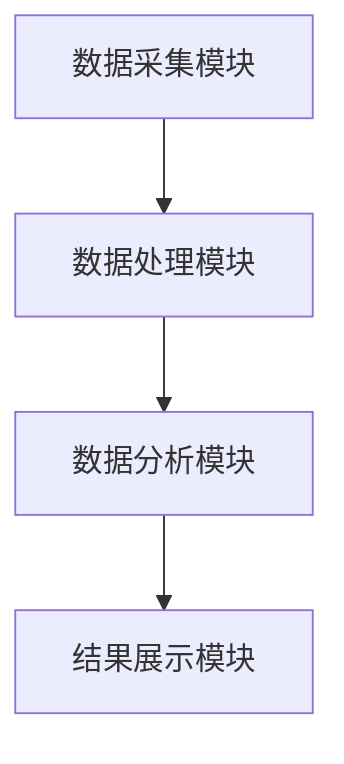

                 


# 特价股票投资中的卫星大数据分析与应用

> 关键词：卫星大数据，股票投资，时间序列分析，机器学习，系统架构

> 摘要：本文深入探讨了卫星大数据在特价股票投资中的应用，从数据采集、处理、分析到系统架构设计，结合时间序列分析和机器学习算法，详细介绍了如何利用卫星数据进行股票市场预测和投资决策优化。文章内容涵盖背景介绍、核心概念、算法原理、系统架构、项目实战以及最佳实践，旨在为投资者和数据科学家提供理论支持和实践指导。

---

## 第1章：卫星大数据与特价股票投资概述

### 1.1 卫星大数据的定义与特点

#### 1.1.1 卫星大数据的定义
卫星大数据是指通过卫星技术获取的海量数据，包括地理信息、气象数据、遥感数据等。这些数据具有高时空分辨率，能够提供地球表面的详细信息。

#### 1.1.2 卫星大数据的核心特点
- **高分辨率**：卫星数据可以捕捉到地面上的细小变化。
- **实时性**：卫星数据能够提供实时或接近实时的观测信息。
- **多样性**：卫星数据包括光学图像、雷达数据等多种类型。

#### 1.1.3 卫星大数据在金融领域的应用潜力
卫星数据可以用于分析经济活动、市场趋势和企业运营情况，为股票投资提供新的视角。

---

### 1.2 特价股票投资的背景与现状

#### 1.2.1 特价股票的定义与特点
- **低价股票**：指价格较低的股票，通常具有较高的波动性和潜在的高回报。
- **投资策略**：投资者通过分析低价股票的内在价值，寻找被市场低估的投资机会。

#### 1.2.2 卫星大数据在特价股票投资中的应用前景
- **地理数据分析**：通过卫星数据评估企业的生产状况和供应链稳定性。
- **市场情绪分析**：利用卫星数据捕捉市场情绪的变化，辅助投资决策。

---

## 第2章：卫星大数据在股票投资中的核心概念与联系

### 2.1 卫星大数据的核心概念

#### 2.1.1 卫星数据的来源与类型
- **来源**：卫星数据主要来自光学卫星、雷达卫星和其他传感器。
- **类型**：包括光学图像、雷达数据、温度数据等。

#### 2.1.2 卫星数据的特征提取与分析
- **特征提取**：通过图像处理技术提取卫星数据中的关键特征。
- **分析方法**：包括时间序列分析和机器学习模型的应用。

#### 2.1.3 卫星数据与股票市场的关联性
- **企业生产活动**：卫星数据可以用来评估企业的生产状况和供应链稳定性。
- **市场情绪**：通过卫星数据捕捉市场情绪的变化，辅助投资决策。

---

### 2.2 卫星大数据与股票投资的关系

#### 2.2.1 卫星大数据对股票市场预测的影响
- **价格预测**：卫星数据可以用于预测股票价格的变化趋势。
- **风险评估**：通过卫星数据评估企业的风险，辅助投资决策。

#### 2.2.2 卫星大数据在风险评估中的作用
- **企业运营风险**：卫星数据可以用来评估企业的生产状况和供应链稳定性。
- **市场风险**：通过卫星数据捕捉市场情绪的变化，辅助风险评估。

---

## 第3章：卫星大数据分析的算法原理

### 3.1 时间序列分析

#### 3.1.1 时间序列分析的基本概念
时间序列分析是一种统计分析方法，用于分析随时间变化的数据序列。

#### 3.1.2 常用的时间序列模型
- **ARIMA模型**：自回归积分滑动平均模型，适用于线性时间序列数据。
- **LSTM模型**：长短期记忆网络，适用于非线性时间序列数据。

#### 3.1.3 时间序列分析在股票价格预测中的应用
通过时间序列分析，可以预测股票价格的变化趋势。

---

### 3.2 机器学习算法

#### 3.2.1 机器学习在卫星大数据分析中的应用
- **特征提取**：通过机器学习算法提取卫星数据中的关键特征。
- **分类与回归**：机器学习算法可以用于股票价格的分类和回归预测。

#### 3.2.2 常用的机器学习算法
- **随机森林**：适用于特征重要性分析和分类任务。
- **支持向量机**：适用于分类和回归任务。

#### 3.2.3 机器学习模型的训练与优化
- **训练数据**：使用历史股票数据和卫星数据进行模型训练。
- **模型优化**：通过交叉验证和超参数调优优化模型性能。

---

## 第4章：卫星大数据分析的系统架构设计

### 4.1 系统功能设计

#### 4.1.1 数据采集模块
- **功能**：从卫星数据源获取数据，包括光学图像和雷达数据。
- **接口**：与卫星数据源进行数据交互。

#### 4.1.2 数据处理模块
- **功能**：对卫星数据进行清洗、特征提取和标准化处理。
- **接口**：与数据存储模块进行数据交互。

#### 4.1.3 数据分析模块
- **功能**：使用时间序列分析和机器学习算法对卫星数据进行分析。
- **接口**：与数据存储模块和结果展示模块进行数据交互。

#### 4.1.4 结果展示模块
- **功能**：将分析结果以可视化形式展示，辅助投资决策。
- **接口**：与数据分析模块进行数据交互。

---

### 4.2 系统架构图

#### 4.2.1 系统架构设计的Mermaid图


---

## 第5章：卫星大数据分析的项目实战

### 5.1 环境搭建与数据获取

#### 5.1.1 开发环境的安装与配置
- **工具**：Python、Jupyter Notebook、Scikit-learn、TensorFlow。
- **库的安装**：使用pip安装必要的库，如`numpy`、`pandas`、`scikit-learn`。

#### 5.1.2 卫星数据的获取与存储
- **数据源**：通过公开卫星数据平台获取卫星数据，如Google Earth Engine。
- **数据存储**：将数据存储在本地数据库或云存储中。

---

### 5.2 数据预处理与特征提取

#### 5.2.1 数据清洗与标准化
- **数据清洗**：去除噪声数据和缺失数据。
- **标准化**：对数据进行标准化处理，使其具有可比性。

#### 5.2.2 特征提取与选择
- **特征提取**：使用图像处理技术提取卫星数据中的关键特征。
- **特征选择**：通过特征重要性分析选择对模型影响最大的特征。

---

### 5.3 模型实现与优化

#### 5.3.1 模型的训练与调参
- **训练数据**：使用历史股票数据和卫星数据进行模型训练。
- **模型调参**：通过交叉验证和网格搜索优化模型参数。

#### 5.3.2 模型的评估与优化
- **评估指标**：使用均方误差（MSE）和准确率（Accuracy）评估模型性能。
- **模型优化**：通过超参数调优和模型集成优化模型性能。

---

## 第6章：卫星大数据分析的最佳实践与注意事项

### 6.1 最佳实践

#### 6.1.1 数据源的选择与优化
- **数据源多样性**：选择多个卫星数据源，提高数据的全面性。
- **数据质量**：确保数据的准确性和实时性。

#### 6.1.2 模型的可解释性与鲁棒性
- **可解释性**：选择具有可解释性的模型，便于分析结果。
- **鲁棒性**：通过交叉验证和模型集成提高模型的鲁棒性。

#### 6.1.3 结果的可视化与报告
- **可视化**：将分析结果以图表形式展示，便于理解和汇报。
- **报告**：撰写详细的分析报告，总结分析结果和投资建议。

---

### 6.2 注意事项

#### 6.2.1 数据的实时性与准确性
- **实时性**：确保卫星数据的实时性，及时获取最新数据。
- **准确性**：数据清洗和预处理是关键，避免噪声数据对模型的影响。

#### 6.2.2 模型的泛化能力与适用性
- **泛化能力**：通过交叉验证和数据增强提高模型的泛化能力。
- **适用性**：根据具体投资需求选择合适的模型和算法。

#### 6.2.3 风险管理与投资策略的结合
- **风险管理**：通过卫星数据分析评估投资风险，制定风险管理策略。
- **投资策略**：结合卫星数据分析结果，制定科学的投资策略。

---

## 第7章：卫星大数据分析的未来展望与拓展阅读

### 7.1 未来发展方向

#### 7.1.1 卫星大数据技术的创新
- **新技术应用**：探索新兴技术在卫星大数据分析中的应用，如人工智能和区块链。
- **数据融合**：通过多源数据融合提高分析精度和范围。

#### 7.1.2 特价股票投资的新趋势
- **智能化投资**：利用卫星大数据和人工智能技术实现智能化投资。
- **个性化投资策略**：根据投资者需求定制个性化投资策略。

#### 7.1.3 卫星大数据与其他技术的融合
- **云计算**：利用云计算技术实现大规模卫星数据的存储和计算。
- **边缘计算**：通过边缘计算技术实现实时数据分析和决策。

---

### 7.2 拓展阅读

#### 7.2.1 相关书籍推荐
- 《卫星大数据分析与应用》
- 《股票投资策略与技术分析》

#### 7.2.2 研究论文与技术报告
- 《卫星大数据在金融领域的应用研究》
- 《基于机器学习的股票价格预测模型》

---

## 附录：卫星大数据分析的数学模型与代码实现

### 附录A：时间序列分析的数学模型

#### ARIMA模型
时间序列分析中常用的ARIMA模型，其数学表达式为：
$$
ARIMA(p, d, q)
$$
其中，\( p \) 是自回归阶数，\( d \) 是差分阶数，\( q \) 是滑动平均阶数。

---

### 附录B：机器学习算法的Python实现

#### 随机森林模型
```python
from sklearn.ensemble import RandomForestRegressor
from sklearn.metrics import mean_squared_error

# 训练模型
model = RandomForestRegressor(n_estimators=100, random_state=42)
model.fit(X_train, y_train)

# 预测结果
y_pred = model.predict(X_test)
print("均方误差:", mean_squared_error(y_test, y_pred))
```

---

## 结语

通过本文的详细分析，我们探讨了卫星大数据在特价股票投资中的应用，从数据采集、处理、分析到系统架构设计，结合时间序列分析和机器学习算法，详细介绍了如何利用卫星数据进行股票市场预测和投资决策优化。希望本文能够为投资者和数据科学家提供理论支持和实践指导，推动卫星大数据在金融领域的广泛应用。

---

