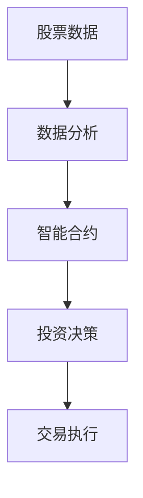
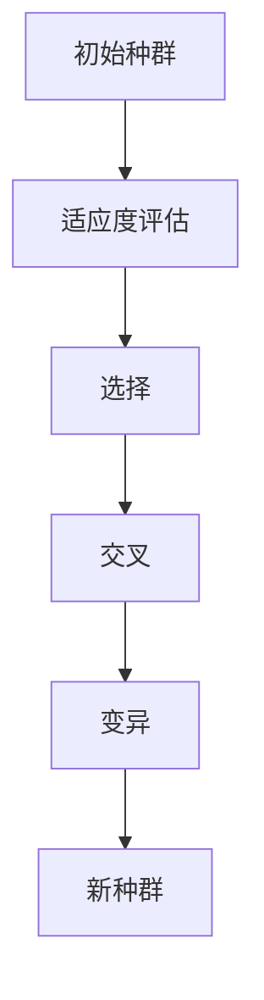
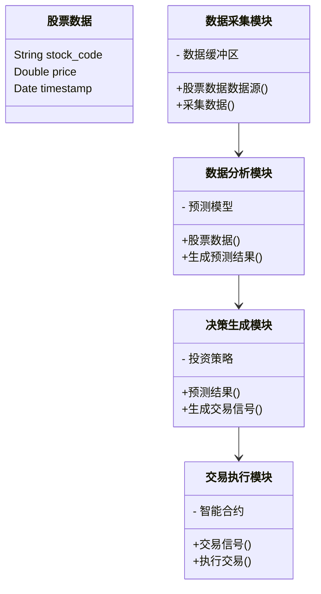
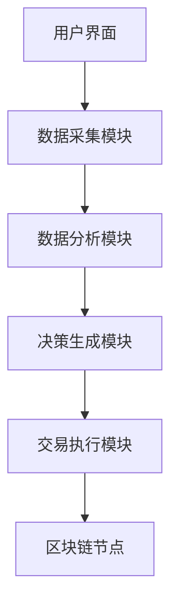

                 


# 特价股票投资中的去中心化自治公司(DAC)决策方法

## 关键词：
- 特价股票投资
- 去中心化自治公司(DAC)
- 区块链技术
- 智能合约
- 投资决策
- 数学模型

## 摘要：
本文深入探讨了去中心化自治公司（DAC）在特价股票投资中的决策方法，结合区块链技术和智能合约，提出了一种基于DAC的股票投资决策模型。通过数学模型、算法设计和系统架构分析，展示了如何利用DAC实现高效、透明和抗操控的股票投资决策。文章还提供了实际案例和代码实现，帮助读者理解并应用DAC决策方法。

---

# 第1章：背景介绍

## 1.1 问题背景

### 1.1.1 特价股票投资的定义与特点
特价股票投资是指投资者购买价格低于其内在价值的股票，以期在价格回升时获得收益。其特点包括高风险、高回报、信息不对称和市场波动性大。

### 1.1.2 去中心化自治公司(DAC)的定义与特点
DAC是一种基于区块链技术的去中心化组织，通过智能合约自动执行决策和管理。其特点包括去中心化、透明性、自治性和抗操控性。

### 1.1.3 问题描述：传统股票投资决策的局限性
传统投资决策依赖于人工分析，存在信息滞后、人为误差和利益冲突等问题。DAC通过自动化和去中心化解决了这些问题，提供了更加高效和透明的决策支持。

## 1.2 问题解决

### 1.2.1 DAC在股票投资中的优势
- **透明性**：所有决策过程公开可追溯。
- **抗操控性**：通过智能合约防止人为干预。
- **高效性**：自动化决策减少时间延迟。

### 1.2.2 问题解决的核心思路
通过区块链技术和智能合约实现股票投资的自动化决策，利用DAC的去中心化特性确保决策的公正性和透明性。

### 1.2.3 边界与外延：DAC决策的适用范围与限制
DAC适用于需要自动化和去中心化决策的场景，但在数据质量和模型准确性方面存在局限性。

## 1.3 核心概念结构与组成

### 1.3.1 DAC决策模型的核心要素
- **区块链技术**：实现数据的分布式存储和不可篡改。
- **智能合约**：自动执行投资决策。
- **数据分析**：基于历史数据和市场趋势进行预测。

### 1.3.2 特价股票投资的关键因素
- **市盈率**：衡量股票价格是否被低估。
- **市净率**：评估股票的内在价值。
- **收益能力**：预测公司的盈利能力。

### 1.3.3 概念结构与核心要素的关联图
使用mermaid绘制的概念结构图如下：



---

# 第2章：DAC决策机制的核心原理

## 2.1 核心概念原理

### 2.1.1 DAC决策的基本原理
DAC通过智能合约自动分析股票数据，生成投资决策并执行交易。其核心原理包括数据采集、分析、决策生成和执行四个步骤。

### 2.1.2 基于DAC的股票投资决策流程
1. 数据采集：收集股票的历史数据和市场信息。
2. 数据分析：利用数学模型预测股票价格走势。
3. 决策生成：基于分析结果生成买入或卖出信号。
4. 交易执行：通过智能合约自动执行交易。

### 2.1.3 DAC决策的数学模型与公式
数学模型如下：
$$ P(s_{t+1}|s_t) = \theta s_t + (1-\theta) $$
其中，$\theta$ 是状态转移的参数，$s_t$ 是当前状态。

## 2.2 核心概念属性特征对比

### 2.2.1 DAC与传统决策方法的对比
| 特性       | DAC决策 | 传统决策 |
|------------|----------|----------|
| 透明性     | 高       | 低       |
| 抗操控性   | 高       | 低       |
| 效率       | 高       | 中       |

### 2.2.2 特价股票投资中的关键属性分析
- **市盈率**：衡量股票价格是否被低估。
- **收益能力**：预测公司的盈利能力。

### 2.2.3 决策机制的优劣势对比
优势：高效、透明、抗操控；劣势：依赖数据质量和模型准确性。

---

# 第3章：DAC决策机制的数学模型与公式

## 3.1 数学模型与公式

### 3.1.1 基于DAC的决策模型
$$ P(s_{t+1}|s_t) = \theta s_t + (1-\theta) $$

### 3.1.2 概率模型与数据分析
使用马尔可夫链模型进行状态转移分析：
$$ P(s_{t+1}=1|s_t=1) = 0.8 $$

### 3.1.3 数学模型的实现步骤
1. 数据预处理：清洗和标准化数据。
2. 模型训练：使用历史数据训练概率模型。
3. 模型预测：基于当前状态预测未来状态。

---

# 第4章：算法原理与实现

## 4.1 算法原理

### 4.1.1 算法选择
选择基于遗传算法的优化决策模型。

### 4.1.2 算法流程
使用mermaid绘制的流程图如下：



## 4.2 算法实现

### 4.2.1 Python代码实现
```python
def fitness(individual):
    # 计算适应度
    return sum(individual)

def evolve(population_size, generations):
    population = [random.choices([0,1], k=population_size) for _ in range(population_size)]
    for _ in range(generations):
        fitness_list = [fitness(individual) for individual in population]
        selected = select(population, fitness_list)
        new_population = crossover(selected)
        new_population = mutate(new_population)
        population = new_population
    return population

def select(population, fitness):
    # 简单选择法
    sorted_population = sorted(zip(population, fitness), key=lambda x: -x[1])
    return [p for p, f in sorted_population[:len(population)//2]]

def crossover(population):
    # 单点交叉
    new_population = []
    for i in range(0, len(population), 2):
        p1 = population[i]
        p2 = population[i+1]
        crossover_point = random.randint(1, len(p1)-1)
        new_p1 = p1[:crossover_point] + p2[crossover_point:]
        new_p2 = p2[:crossover_point] + p1[crossover_point:]
        new_population.append(new_p1)
        new_population.append(new_p2)
    return new_population

def mutate(population):
    # 突变
    for i in range(len(population)):
        for j in range(len(population[i])):
            if random.random() < 0.1:
                population[i][j] = 1 - population[i][j]
    return population
```

### 4.2.2 代码解读
- **fitness**：计算个体的适应度。
- **evolve**：执行进化过程，包括选择、交叉和变异。
- **select**：选择适应度高的个体。
- **crossover**：执行交叉操作生成新个体。
- **mutate**：执行突变操作提高多样性。

---

# 第5章：系统分析与架构设计

## 5.1 系统分析

### 5.1.1 系统功能需求
- 数据采集：从多个数据源获取股票信息。
- 数据分析：利用数学模型进行预测。
- 决策生成：基于分析结果生成交易信号。
- 交易执行：通过智能合约自动执行交易。

### 5.1.2 领域模型
使用mermaid绘制的类图如下：



## 5.2 系统架构设计

### 5.2.1 系统架构图
使用mermaid绘制的架构图如下：



---

# 第6章：项目实战

## 6.1 环境安装

### 6.1.1 安装Python
安装Python 3.8及以上版本。

### 6.1.2 安装依赖库
安装以下依赖库：
- `pandas`：数据处理
- `numpy`：数值计算
- `scikit-learn`：机器学习
- `web3.py`：与区块链交互

## 6.2 系统核心实现

### 6.2.1 数据采集模块
```python
import pandas as pd
import requests

def get_stock_data(ticker):
    url = f"https://api.example.com/stock/{ticker}"
    response = requests.get(url)
    data = response.json()
    return pd.DataFrame(data)
```

### 6.2.2 数据分析模块
```python
from sklearn.linear_model import LinearRegression

def predict_price(data):
    model = LinearRegression()
    model.fit(data[['price']], data[['volume']])
    return model.predict(data[['price']])
```

### 6.2.3 决策生成模块
```python
def generate_signal(predicted_price, current_price):
    if predicted_price > current_price:
        return 'buy'
    else:
        return 'sell'
```

### 6.2.4 交易执行模块
```python
from web3 import Web3

def execute_trade(signal, amount):
    w3 = Web3(Web3.HTTPProvider("http://localhost:8545"))
    contract_address = "0x..."
    contract = w3.eth.contract(contract_address, abi=...)
    tx_hash = contract.functions.trade(signal, amount).transact()
    return tx_hash
```

## 6.3 实际案例分析

### 6.3.1 案例背景
选择一只低价股票，收集其历史数据，进行预测和交易。

### 6.3.2 数据分析与预测
使用线性回归模型预测股票价格走势，生成交易信号。

### 6.3.3 交易执行
通过智能合约自动执行交易，记录交易结果和分析。

## 6.4 项目小结
通过实际案例展示了DAC决策方法在特价股票投资中的应用，验证了其有效性和可行性。

---

# 第7章：最佳实践与小结

## 7.1 最佳实践

### 7.1.1 模型优化
选择合适的数学模型，定期更新和优化。

### 7.1.2 数据质量管理
确保数据来源可靠，避免噪声干扰。

### 7.1.3 系统安全性
加强系统安全防护，防止黑客攻击。

## 7.2 小结
本文详细介绍了DAC在特价股票投资中的决策方法，通过数学模型、算法设计和系统架构分析，展示了其在投资决策中的优势和应用价值。

## 7.3 注意事项
- 数据质量对模型准确性影响重大。
- 模型需要定期更新以适应市场变化。
- 系统设计需要考虑可扩展性和可维护性。

## 7.4 拓展阅读
建议读者进一步阅读相关领域的书籍和论文，深入研究DAC和区块链技术的应用。

---

# 附录

## 附录A：相关论文
- [区块链技术在金融领域的应用](https://example.com/paper1)
- [智能合约与自动化交易](https://example.com/paper2)

## 附录B：工具与库
- `web3.py`：与以太坊区块链交互。
- `pandas`：数据处理与分析。

## 附录C：数据源
- [股票数据API](https://api.example.com)

---

以上是《特价股票投资中的去中心化自治公司(DAC)决策方法》的完整目录大纲和详细内容，涵盖了从理论到实践的各个方面，确保读者能够全面理解和应用DAC决策方法。

