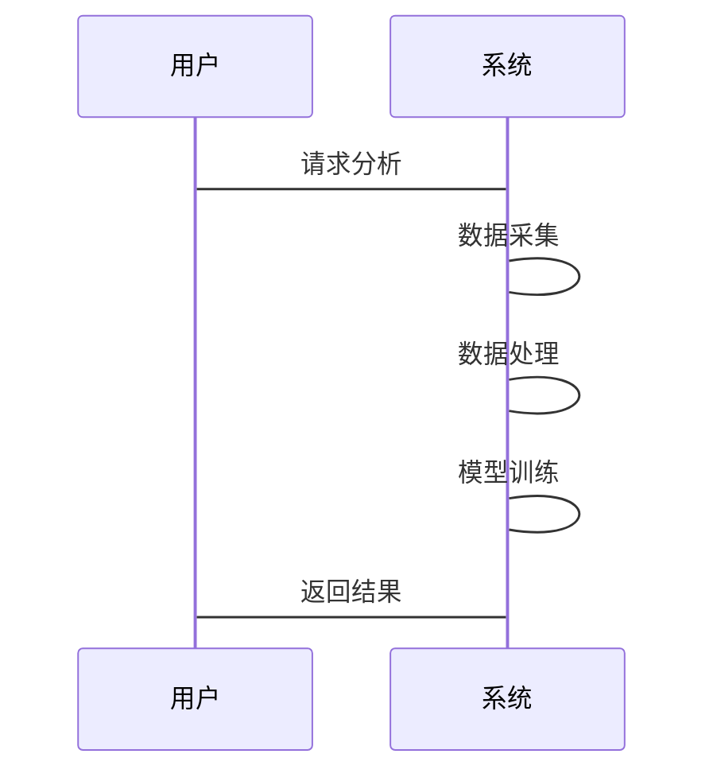

                 


# 特价股票投资中的另类数据应用

## 关键词：另类数据，股票投资，大数据分析，算法，数学模型

## 摘要：  
特价股票投资中的另类数据应用是一种利用非传统数据源和先进技术进行股票分析和投资决策的方法。本文将详细探讨特价股票市场的特点、另类数据的定义与分类，以及如何通过大数据分析、机器学习算法和数学模型来优化投资策略。通过系统架构设计和实际案例分析，本文将展示如何利用另类数据在特价股票投资中获得竞争优势。

---

## 第一部分：背景介绍

### 第1章：特价股票投资概述

#### 1.1 特价股票的基本概念

**1.1.1 特价股票的定义与分类**  
特价股票通常指价格相对较低的股票，可能包括小盘股、低价股或具有特殊投资机会的股票。它们通常具有较高的波动性和潜在的高回报，但也伴随着较高的风险。特价股票可以分为以下几类：
- **小盘股**：市值较小的公司股票。
- **低价股**：股价低于某个阈值的股票。
- **周期性股票**：受经济周期影响较大的股票，如能源、材料等行业。

**1.1.2 特价股票的投资价值**  
特价股票的投资价值主要体现在以下几个方面：
- **高增长潜力**：许多小盘股具有较高的增长潜力。
- **低估定价**：部分特价股票可能因为市场忽视或低估而具有投资机会。
- **分散投资**：特价股票可以作为投资组合中的分散工具。

**1.1.3 特价股票市场的特点**  
特价股票市场具有以下特点：
- 市场流动性较低。
- 价格波动较大。
- 投资者情绪影响较大。

#### 1.2 特价股票投资的背景与现状

**1.2.1 特价股票市场的兴起**  
随着市场的不断发展，越来越多的小公司成长为行业龙头，特价股票市场逐渐受到投资者的关注。

**1.2.2 当前特价股票投资的挑战**  
尽管特价股票具有潜在的高回报，但也面临以下挑战：
- 信息不对称。
- 数据获取难度大。
- 市场波动剧烈。

**1.2.3 特价股票投资的未来趋势**  
随着大数据和人工智能技术的发展，特价股票投资将更加依赖于数据驱动的决策。

---

### 第2章：另类数据应用概述

#### 2.1 另类数据的定义与特征

**2.1.1 另类数据的定义**  
另类数据是指传统金融数据之外的其他数据，包括社交媒体数据、新闻数据、卫星数据、交易数据等。

**2.1.2 另类数据的分类**  
另类数据可以分为以下几类：
- **文本数据**：社交媒体、新闻、公司财报等。
- **结构化数据**：交易数据、市场数据。
- **非结构化数据**：图像、视频等。

**2.1.3 另类数据的独特优势**  
另类数据的独特优势包括：
- 提供额外的信息维度。
- 帮助识别市场情绪。
- 提高预测的准确性。

#### 2.2 另类数据在股票投资中的应用

**2.2.1 另类数据的应用场景**  
另类数据在股票投资中的应用场景包括：
- 市场情绪分析。
- 财务数据预测。
- 竞争对手分析。

**2.2.2 另类数据对投资决策的影响**  
通过分析另类数据，投资者可以更好地理解市场趋势、公司基本面和潜在风险。

**2.2.3 另类数据的局限性**  
另类数据的局限性包括：
- 数据质量参差不齐。
- 数据处理复杂。
- 数据获取成本高。

---

## 第二部分：另类数据的核心概念与联系

### 第3章：另类数据的特征与分类

#### 3.1 另类数据的特征分析

**3.1.1 数据的实时性**  
另类数据的实时性是指数据能够及时反映市场动态。

**3.1.2 数据的多样性**  
另类数据涵盖多种类型，如文本、图像、交易数据等。

**3.1.3 数据的可用性**  
另类数据的可用性是指数据能够被有效利用进行分析。

#### 3.2 另类数据的分类

**3.2.1 结构化数据**  
结构化数据是指可以以表格形式组织的数据，如交易数据、市场数据。

**3.2.2 非结构化数据**  
非结构化数据是指没有固定结构的数据，如文本、图像。

**3.2.3 半结构化数据**  
半结构化数据是指部分结构化的数据，如JSON格式的数据。

### 第4章：另类数据与股票投资的关系

#### 4.1 另类数据在股票分析中的作用

**4.1.1 提供额外的市场信息**  
另类数据可以提供传统金融数据之外的市场信息。

**4.1.2 帮助识别市场趋势**  
通过分析另类数据，投资者可以识别市场的趋势和潜在机会。

**4.1.3 用于风险评估**  
另类数据可以帮助评估投资风险。

#### 4.2 另类数据对投资决策的影响

**4.2.1 增强投资策略的有效性**  
通过整合另类数据，投资策略可以更加精准和有效。

---

## 第三部分：算法原理与数学模型

### 第5章：算法原理

#### 5.1 数据预处理

**5.1.1 数据清洗**  
数据清洗包括去除噪声数据、填补缺失值等。

**5.1.2 数据转换**  
数据转换包括将非结构化数据转换为结构化数据。

#### 5.2 特征提取

**5.2.1 文本特征提取**  
使用自然语言处理技术提取文本特征。

**5.2.2 图像特征提取**  
使用计算机视觉技术提取图像特征。

#### 5.3 模型训练

**5.3.1 机器学习模型**  
常用的机器学习模型包括线性回归、支持向量机、随机森林等。

**5.3.2 深度学习模型**  
深度学习模型如LSTM用于时间序列数据的预测。

#### 5.4 模型预测

**5.4.1 预测股票价格**  
使用训练好的模型预测股票价格。

**5.4.2 风险评估**  
模型可以评估投资的风险并提供相应的建议。

### 第6章：数学模型

#### 6.1 回归模型

**6.1.1 线性回归**  
线性回归用于预测股票价格与相关因素之间的线性关系。

$$ y = \beta_0 + \beta_1 x + \epsilon $$

**6.1.2 逻辑回归**  
逻辑回归用于分类问题，如预测股票涨跌。

$$ P(y=1|x) = \frac{e^{\beta_0 + \beta_1 x}}{1 + e^{\beta_0 + \beta_1 x}} $$

#### 6.2 分类模型

**6.2.1 支持向量机 (SVM)**  
SVM用于分类问题，如区分股票的涨跌。

**6.2.2 随机森林**  
随机森林用于分类和回归问题。

#### 6.3 时间序列模型

**6.3.1 ARIMA模型**  
ARIMA模型用于时间序列预测。

**6.3.2 LSTM网络**  
LSTM网络用于长期依赖的建模。

---

## 第四部分：系统分析与架构设计

### 第7章：系统功能设计

#### 7.1 系统功能模块

**7.1.1 数据采集模块**  
负责采集另类数据，如社交媒体数据、新闻数据等。

**7.1.2 数据处理模块**  
对数据进行清洗、转换和特征提取。

**7.1.3 模型训练模块**  
训练机器学习模型并进行预测。

**7.1.4 结果展示模块**  
展示分析结果和投资建议。

### 第7.2 系统架构设计

#### 7.2.1 系统架构图


#### 7.2.2 接口设计

**7.2.2.1 数据接口**  
定义数据接口，如API，用于数据的交互。

**7.2.2.2 模型接口**  
定义模型接口，如REST API，用于模型的调用。

#### 7.2.3 交互流程图



---

## 第五部分：项目实战

### 第8章：环境安装与核心代码实现

#### 8.1 环境安装

**8.1.1 安装Python**  
安装Python 3.8或更高版本。

**8.1.2 安装依赖库**  
安装Pandas、Scikit-learn、TensorFlow等库。

#### 8.2 核心代码实现

**8.2.1 数据采集代码**

```python
import pandas as pd

def fetch_data(source):
    # 从指定数据源获取数据
    pass

# 示例代码
data = fetch_data('社交媒体')
print(data.head())
```

**8.2.2 数据处理代码**

```python
def preprocess_data(data):
    # 数据清洗和转换
    pass

processed_data = preprocess_data(data)
```

**8.2.3 模型训练代码**

```python
from sklearn.model_selection import train_test_split
from sklearn.ensemble import RandomForestClassifier

X_train, X_test, y_train, y_test = train_test_split(processed_data, target, test_size=0.2)
model = RandomForestClassifier().fit(X_train, y_train)
```

#### 8.3 案例分析与代码解读

**8.3.1 数据分析**

**8.3.2 模型预测**

**8.3.3 结果展示**

---

## 第六部分：最佳实践与总结

### 第9章：最佳实践

#### 9.1 投资策略建议

**9.1.1 风险管理**  
合理分配投资比例，设置止损点。

**9.1.2 数据源选择**  
选择可靠的数据源，确保数据质量。

#### 9.2 小结

通过利用另类数据，投资者可以在特价股票市场中获得竞争优势。然而，数据质量和模型选择是关键。

#### 9.3 注意事项

- 数据隐私和合规性。
- 模型的可解释性。
- 技术和市场的结合。

#### 9.4 拓展阅读

- 大数据分析与股票投资。
- 机器学习在金融中的应用。
- 另类数据的获取与处理。

---

## 结语

通过本文的探讨，我们可以看到，另类数据在特价股票投资中的应用潜力巨大。结合大数据分析和人工智能技术，投资者可以更好地把握市场动态，制定科学的投资策略。未来，随着技术的进步，另类数据的应用将更加广泛和深入。

