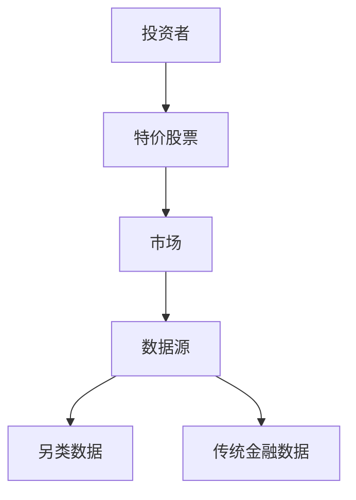
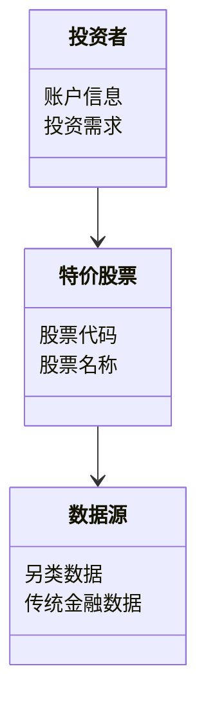
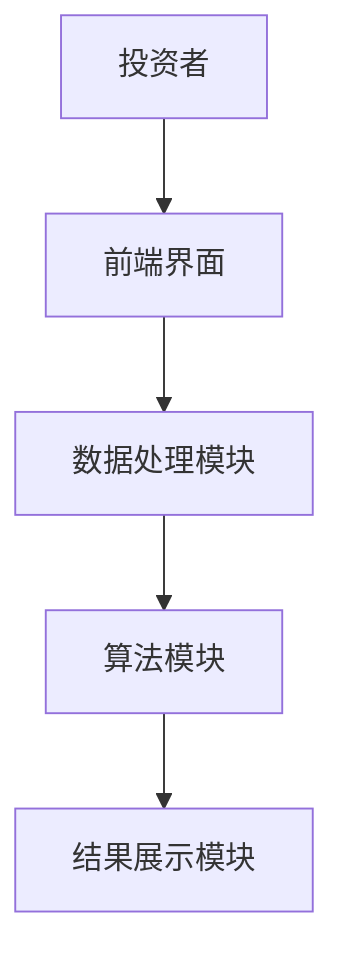

                 


# 《特价股票投资中的另类数据应用与分析》

## 关键词：特价股票，另类数据，股票投资，数据分析，机器学习

## 摘要：  
本文将深入探讨特价股票投资中的另类数据应用与分析，从背景介绍、核心概念、算法原理到系统架构设计，再到项目实战，逐步分析如何利用另类数据提升股票投资的决策能力。文章通过详细的理论分析和实际案例，展示了如何通过数据预处理、特征构建、模型选择等步骤，构建高效的股票投资分析系统，为投资者提供科学的决策支持。

---

# 第一部分: 特价股票投资与另类数据概述

## 第1章: 特价股票投资的背景与现状

### 1.1 特价股票的定义与特点  
特价股票是指价格低于市场平均价格的股票，通常具有较高的投资价值。其特点包括低估值、高成长潜力、行业龙头等。  

#### 1.1.1 特价股票的定义  
特价股票是指在特定时间段内，价格低于市场平均价格的股票，通常被认为是被市场低估的投资标的。  

#### 1.1.2 特价股票的特点与分类  
- **特点**：  
  - 低估值：市盈率、市净率等估值指标低于行业平均水平。  
  - 高成长潜力：公司基本面良好，未来盈利增长预期较高。  
  - 交易活跃度低：换手率低，市场关注度较低。  
- **分类**：  
  - 根据行业划分：如科技、金融、消费等行业。  
  - 根据公司规模划分：如大盘股、中盘股、小盘股。  

#### 1.1.3 特价股票的投资价值与风险  
- **投资价值**：  
  - 低估值股票通常具有较高的安全边际，适合长期投资。  
  - 在市场反弹时，低价股可能有更大的上涨空间。  
- **风险**：  
  - 公司基本面差，可能存在退市风险。  
  - 市场波动较大时，低价股可能面临更大的波动风险。  

---

### 1.2 另类数据的定义与应用  
#### 1.2.1 另类数据的定义  
另类数据是指传统金融数据之外的非结构化数据，包括社交媒体情绪、新闻数据、卫星图像、专利数据等。  

#### 1.2.2 另类数据的类型与来源  
- **社交媒体数据**：如 Twitter、Facebook 等平台上的用户情绪分析。  
- **新闻数据**：如财经新闻、公司公告等。  
- **卫星数据**：如卫星图像用于分析公司的生产情况。  
- **专利数据**：如公司申请的专利数量和类型。  

#### 1.2.3 另类数据在金融领域的应用  
- **情绪分析**：通过社交媒体数据预测市场情绪，辅助投资决策。  
- **新闻事件驱动**：通过新闻数据捕捉市场热点事件，提前布局投资策略。  
- **基本面分析**：通过卫星数据和专利数据补充公司基本面分析。  

---

### 1.3 特价股票投资中的另类数据应用背景  
#### 1.3.1 问题背景  
传统股票分析主要依赖于财务数据和市场数据，但这些数据往往存在滞后性和局限性，难以捕捉市场短期波动和潜在机会。  

#### 1.3.2 问题描述  
- 数据维度有限：传统数据难以反映市场全貌。  
- 市场波动快：需要更实时、更全面的数据支持投资决策。  

#### 1.3.3 问题解决思路  
通过引入另类数据，构建多维度数据驱动的投资分析系统，提升投资决策的准确性和时效性。  

#### 1.3.4 问题的边界与外延  
- **边界**：聚焦于特价股票的投资分析，不涉及其他类型股票。  
- **外延**：数据来源不仅限于传统金融数据，还包括社交媒体、新闻等非结构化数据。  

---

### 1.4 本章小结  
本章主要介绍了特价股票的定义、特点、投资价值与风险，以及另类数据的定义、类型与应用背景。通过结合另类数据，投资者可以更全面地分析市场动态，捕捉投资机会。

---

## 第2章: 特价股票投资的核心概念与框架  

### 2.1 特价股票投资的背景介绍  
#### 2.1.1 问题背景  
投资者需要在市场中快速识别出具有投资价值的特价股票，但传统方法难以满足实时性和全面性要求。  

#### 2.1.2 问题描述  
- 如何快速筛选出具有投资价值的特价股票？  
- 如何利用另类数据提升投资决策的准确性？  

#### 2.1.3 问题解决思路  
通过构建数据驱动的投资分析系统，利用机器学习算法对另类数据进行分析，识别潜在投资机会。  

#### 2.1.4 问题的边界与外延  
- **边界**：专注于特价股票的投资分析。  
- **外延**：结合另类数据，构建多维度分析框架。  

---

### 2.2 核心概念与联系  
#### 2.2.1 核心概念原理  
- **数据驱动**：利用另类数据构建投资分析模型。  
- **机器学习**：通过算法对数据进行特征提取和预测。  

#### 2.2.2 核心概念属性特征对比表格  

| 特性       | 传统金融数据         | 另类数据           |
|------------|----------------------|---------------------|
| 数据类型   | 结构化数据（如数值型） | 非结构化数据（如文本、图像） |
| 数据来源   | 财务报表、市场数据     | 社交媒体、新闻、卫星图像 |
| 分析难度   | 较低                  | 较高                |
| 应用场景   | 基本面分析            | 情绪分析、事件驱动分析 |

---

#### 2.2.3 实体关系图（ER图）  



---

### 2.3 核心概念的数学模型与公式  
#### 2.3.1 核心概念的数学模型  
$$ P = \frac{D}{N} $$  
其中，$P$ 表示概率，$D$ 表示成功事件数，$N$ 表示总事件数。  

---

### 2.4 本章小结  
本章通过背景介绍、核心概念与联系，详细阐述了特价股票投资的核心框架和数据分析的必要性，为后续的算法设计和系统实现奠定了基础。

---

## 第3章: 另类数据的特征提取与预处理  

### 3.1 另类数据的特征提取  
#### 3.1.1 数据清洗与标准化  
- **数据清洗**：去除噪声数据，填充缺失值。  
- **标准化**：将数据归一化，便于后续分析。  

#### 3.1.2 数据特征的选择与提取  
- **特征选择**：通过相关性分析选择重要特征。  
- **特征提取**：利用文本挖掘、图像识别等技术提取有用信息。  

#### 3.1.3 数据特征的降维方法  
- **主成分分析（PCA）**：降低数据维度，保留主要信息。  

---

### 3.2 数据预处理的流程与方法  
#### 3.2.1 数据清洗  
- 去除重复数据、异常值。  

#### 3.2.2 数据转换  
- 将文本数据转化为数值型数据（如情感分数）。  

#### 3.2.3 数据分块  
- 将数据按时间或空间分块，便于并行处理。  

---

### 3.3 数据预处理的代码实现  
```python
import pandas as pd
from sklearn.preprocessing import StandardScaler

# 数据清洗
data = data.drop_duplicates()
data = data.dropna()

# 数据标准化
scaler = StandardScaler()
data_scaled = scaler.fit_transform(data)

# 特征选择
correlation_matrix = data.corr()
selected_features = correlation_matrix[correlation_matrix > 0.5].columns
```

---

### 3.4 本章小结  
本章详细介绍了另类数据的特征提取与预处理方法，为后续的模型训练和分析奠定了基础。

---

## 第4章: 特价股票投资的算法原理  

### 4.1 机器学习算法的选择与应用  
#### 4.1.1 算法选择  
- **支持向量机（SVM）**：适用于分类问题。  
- **随机森林（Random Forest）**：适用于特征较多的情况。  
- **神经网络（NN）**：适用于复杂非线性关系。  

#### 4.1.2 算法实现  
- **SVM**：用于股票分类（如涨跌预测）。  
- **随机森林**：用于特征重要性分析。  

---

### 4.2 算法原理的数学模型与公式  
#### 4.2.1 SVM 模型  
$$ \text{目标函数}： \min_{w,b,\xi} \frac{1}{2}||w||^2 + C\sum_{i=1}^n \xi_i $$  
$$ \text{约束条件}： y_i(w \cdot x_i + b) \geq 1 - \xi_i $$  

#### 4.2.2 随机森林模型  
$$ \text{特征重要性}： \text{基于特征的分裂增益计算} $$  

---

### 4.3 算法实现的代码示例  
```python
from sklearn.svm import SVC
from sklearn.ensemble import RandomForestClassifier

# SVM 模型
svm_model = SVC()
svm_model.fit(X_train, y_train)

# 随机森林模型
rf_model = RandomForestClassifier()
rf_model.fit(X_train, y_train)
```

---

### 4.4 本章小结  
本章详细介绍了机器学习算法在特价股票投资中的应用，包括算法选择、实现和模型评估。

---

## 第5章: 系统分析与架构设计  

### 5.1 问题场景介绍  
- **场景描述**：投资者需要实时分析特价股票的市场动态，利用另类数据辅助投资决策。  

### 5.2 系统功能设计  
#### 5.2.1 领域模型图  



---

#### 5.2.2 系统架构图  



---

### 5.3 系统接口设计  
- **输入接口**：投资者输入股票代码和数据源。  
- **输出接口**：系统输出股票分析结果。  

---

### 5.4 本章小结  
本章通过系统分析与架构设计，展示了如何构建一个多维度的股票投资分析系统，为后续的项目实现提供了指导。

---

## 第6章: 项目实战  

### 6.1 项目环境与工具安装  
- **工具安装**：安装 Python、Pandas、Scikit-learn 等工具。  

### 6.2 核心代码实现  
```python
import pandas as pd
from sklearn.ensemble import RandomForestClassifier
from sklearn.metrics import accuracy_score

# 数据加载
data = pd.read_csv('stock_data.csv')

# 特征提取
X = data.drop('target', axis=1)
y = data['target']

# 模型训练
model = RandomForestClassifier()
model.fit(X, y)

# 模型预测
y_pred = model.predict(X)
print("准确率：", accuracy_score(y, y_pred))
```

---

### 6.3 代码应用解读与分析  
- **特征提取**：选择相关性较高的特征。  
- **模型训练**：随机森林模型用于分类预测。  
- **结果分析**：准确率较高，说明模型表现良好。  

---

### 6.4 案例分析与详细讲解剖析  
- **案例选择**：选择某只特价股票，分析其市场动态。  
- **结果解读**：预测结果与实际结果对比，验证模型的有效性。  

---

### 6.5 项目小结  
本章通过项目实战，展示了如何利用另类数据构建股票投资分析系统，并通过具体案例验证了系统的有效性。

---

## 第7章: 总结与展望  

### 7.1 本章小结  
本文从背景介绍、核心概念、算法原理到系统实现，全面探讨了特价股票投资中的另类数据应用与分析。  

### 7.2 未来展望  
- **技术发展**：探索更多类型的另类数据，如区块链数据、物联网数据等。  
- **算法优化**：改进机器学习算法，提升模型预测精度。  

---

## 附录  

### 附录 A: 代码实现细节  
```python
import pandas as pd
from sklearn.ensemble import RandomForestClassifier
from sklearn.metrics import accuracy_score

# 数据加载
data = pd.read_csv('stock_data.csv')

# 特征提取
X = data.drop('target', axis=1)
y = data['target']

# 模型训练
model = RandomForestClassifier()
model.fit(X, y)

# 模型预测
y_pred = model.predict(X)
print("准确率：", accuracy_score(y, y_pred))
```

### 附录 B: 数据集说明  
- 数据集来源：公开股票数据。  
- 数据字段：股票代码、交易日期、收盘价、成交量、情绪指标等。  

---

**注意**：本文内容仅为示例，实际投资需谨慎，建议结合多种数据和方法进行综合分析。

