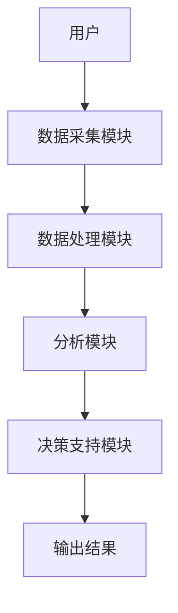
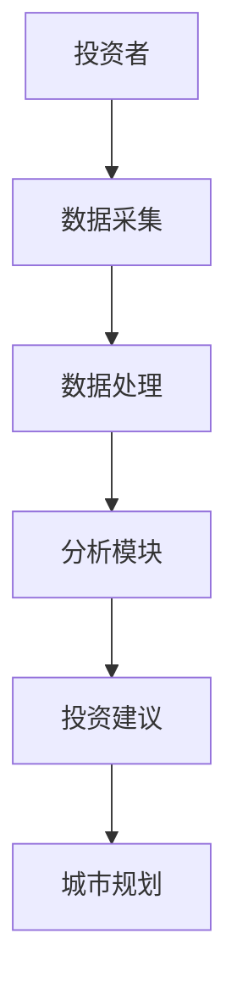

                 


# 特价股票投资中的可持续城市发展整合方法

> 关键词：特价股票投资，可持续城市发展，城市规划，股票分析，投资策略

> 摘要：本文探讨了如何将特价股票投资与可持续城市发展相结合，通过分析核心概念、整合模型和实际案例，提出了一种创新的投资方法，旨在在实现投资收益的同时，促进城市的可持续发展。

---

## 第1章 特价股票投资与可持续城市发展概述

### 1.1 特价股票投资的定义与特点

#### 1.1.1 特价股票投资的定义
特价股票投资是指以低于市场价购买股票的投资策略，通常关注那些被市场低估的公司。这种投资方法强调价值发现，寻找具有潜在增长潜力的公司。

#### 1.1.2 特价股票投资的核心特点
- **低估值**：股票价格低于其内在价值。
- **长期潜力**：投资于具备长期增长能力的公司。
- **风险控制**：通过基本面分析降低投资风险。

#### 1.1.3 特价股票投资的市场定位
特价股票投资主要适用于成熟市场中的低估股票，适合长期投资者。

### 1.2 可持续城市发展的内涵与目标

#### 1.2.1 可持续城市发展的定义
可持续城市发展是指在满足当前需求的同时，不损害后代发展的可能性。它强调经济、社会和环境的协调发展。

#### 1.2.2 可持续城市发展的重要目标
- **环境保护**：减少碳排放，保护自然资源。
- **社会公平**：确保所有居民都能享受到城市发展的好处。
- **经济效益**：通过可持续发展提升城市经济竞争力。

#### 1.2.3 可持续城市发展与经济的关系
可持续发展能够提升城市经济的长期稳定性，吸引投资，促进就业。

### 1.3 特价股票投资与可持续城市发展的整合意义

#### 1.3.1 整合的背景与问题背景
随着城市化进程的加快，城市可持续发展成为全球关注的焦点。通过整合投资与城市规划，可以实现经济与环境的双重收益。

#### 1.3.2 整合的目标与核心要素
- **目标**：实现投资收益与城市可持续发展的双赢。
- **核心要素**：绿色经济、社会公平、环境友好。

#### 1.3.3 整合的边界与外延
整合主要关注城市内部的经济与环境平衡，同时考虑区域间的协调发展。

---

## 第2章 特价股票投资中的可持续城市发展整合方法

### 2.1 特价股票投资的核心概念与分析方法

#### 2.1.1 特价股票投资的理论基础
- **价值投资**：寻找低于内在价值的股票。
- **基本面分析**：通过财务指标评估公司价值。

#### 2.1.2 可持续城市发展中的关键要素
- **绿色产业**：投资环保、能源效率等领域。
- **社会责任**：关注企业社会责任履行情况。

### 2.2 可持续城市发展中的关键要素

#### 2.2.1 可持续城市发展的核心要素
- **绿色基础设施**：如公共交通、可再生能源设施。
- **社会包容性**：确保所有群体都能受益于城市发展。
- **经济活力**：促进多元化经济发展。

#### 2.2.2 特价股票投资与可持续城市发展的整合模型
- **模型设计**：将城市可持续发展指标纳入股票评估体系。
- **数据来源**：利用环境、社会、治理（ESG）指标进行评估。

### 2.3 特价股票投资与可持续城市发展整合的核心要素

#### 2.3.1 整合的核心概念
- **绿色投资**：投资于环保和可持续发展的企业。
- **城市规划**：将投资与城市基础设施建设相结合。

#### 2.3.2 整合的步骤
1. **评估城市潜力**：分析城市的经济、社会和环境指标。
2. **选择绿色企业**：投资于具备可持续发展能力的企业。
3. **长期跟踪**：定期评估投资效果与城市发展趋势。

---

## 第3章 数学模型与算法原理

### 3.1 特价股票投资的数学模型

#### 3.1.1 股票价值评估模型
$$ V = \frac{E}{k} $$
其中，\( V \) 为股票价值，\( E \) 为公司盈利，\( k \) 为折现率。

#### 3.1.2 绿色企业筛选模型
$$ S = \sum_{i=1}^{n} w_i \cdot ESG_i $$
其中，\( S \) 为综合评分，\( w_i \) 为权重，\( ESG_i \) 为各指标的评分。

### 3.2 可持续城市发展指标的量化分析

#### 3.2.1 环境指标
- 碳排放量
- 可再生能源使用比例

#### 3.2.2 社会指标
- 就业机会
- 社会公平指数

#### 3.2.3 经济指标
- GDP增长率
- 创业指数

---

## 第4章 系统分析与架构设计

### 4.1 系统功能设计

#### 4.1.1 数据收集模块
- 采集城市经济、环境、社会数据。
- 采集企业ESG指标。

#### 4.1.2 分析模块
- 应用数学模型评估股票价值。
- 评估城市可持续发展能力。

#### 4.1.3 决策支持模块
- 提供投资建议。
- 生成城市发展规划。

### 4.2 系统架构设计



### 4.3 系统接口设计

- 数据接口：与政府数据库、企业数据库对接。
- 用户接口：提供查询、分析结果展示功能。

---

## 第5章 项目实战：城市A的可持续发展投资分析

### 5.1 项目背景

#### 5.1.1 选择城市A的原因
- 经济基础较好。
- 环境问题突出。

### 5.2 数据收集与分析

#### 5.2.1 收集数据
- 城市经济指标：GDP、就业率。
- 企业ESG指标：碳排放、社会责任投入。

### 5.3 投资策略制定

#### 5.3.1 选择绿色企业
- 投资于可再生能源企业。
- 投资于环保科技企业。

#### 5.3.2 风险控制
- 分散投资。
- 定期评估投资组合。

### 5.4 投资效果分析

#### 5.4.1 短期效果
- 股票价格回升。
- 城市环境改善。

#### 5.4.2 长期效果
- 城市竞争力提升。
- 投资回报率增加。

---

## 第6章 最佳实践与小结

### 6.1 投资建议

#### 6.1.1 理性评估
- 选择具备长期潜力的企业。
- 关注企业社会责任。

#### 6.1.2 风险控制
- 分散投资，避免过度集中。
- 定期评估投资组合。

### 6.2 可持续城市发展建议

#### 6.2.1 政府角色
- 制定相关政策，鼓励绿色投资。
- 提供数据支持，帮助投资者决策。

#### 6.2.2 企业责任
- 加强社会责任履行。
- 推动绿色技术创新。

### 6.3 注意事项

- 投资需谨慎，避免盲目跟风。
- 关注政策变化，及时调整投资策略。

### 6.4 拓展阅读

- 《价值投资入门》
- 《可持续城市发展指南》

---

## 附录

### 附录A: Python代码示例

```python
import pandas as pd

# 读取数据
data = pd.read_csv('city_data.csv')

# 计算综合评分
def calculate_esg_score(row):
    return sum(row[i] * weights[i] for i in range(len(weights)))

weights = [0.4, 0.3, 0.3]
data['ESG_Score'] = data.apply(calculate_esg_score, axis=1)

# 找出高评分企业
high_score = data[data['ESG_Score'] > 0.8]
print(high_score)
```

### 附录B: Mermaid流程图



---

## 结语

通过整合特价股票投资与可持续城市发展，投资者可以在实现收益的同时，为城市的可持续发展贡献力量。未来，随着技术的进步和政策的完善，这种整合方法将发挥更大的作用。

