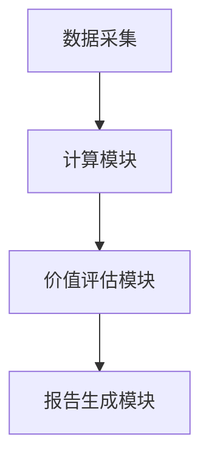
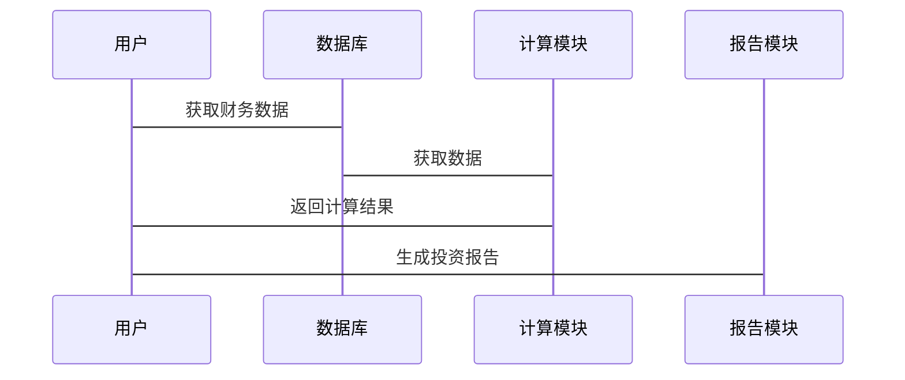

                 


# 特价股票投资中的可持续增长模型应用

> 关键词：特价股票，可持续增长模型，股票投资，ROE分析，数学建模，投资策略，风险管理

> 摘要：本文系统介绍可持续增长模型在特价股票投资中的应用，涵盖背景、数学模型、系统架构、项目实战和最佳实践等方面。通过详细分析，帮助投资者理解并应用可持续增长模型，优化投资决策。

---

# 第1章: 特价股票投资的背景与可持续增长模型

## 1.1 特价股票投资的背景

### 1.1.1 特价股票的定义与特点

特价股票通常指市盈率、市净率等估值指标低于行业平均水平的股票。其特点包括：

- **低估值**：市场价格低于内在价值。
- **高潜力**：具备较高的增长潜力。
- **风险较低**：通常在市场低迷时被低估。

### 1.1.2 特价股票投资的动机与目标

投资者选择特价股票的动机包括：

- **追求超额收益**：通过低位买入高位卖出获利。
- **分散投资风险**：通过多元化投资降低风险。
- **长期增值**：投资于具有长期增长潜力的公司。

### 1.1.3 特价股票投资的市场环境

市场环境对特价股票投资的影响因素包括：

- **宏观经济因素**：如GDP增长率、利率水平等。
- **行业周期**：行业处于衰退期时，股票可能被低估。
- **市场情绪**：投资者情绪波动可能导致股票价格偏离实际价值。

## 1.2 可持续增长模型的核心概念

### 1.2.1 可持续增长模型的定义

可持续增长模型是用于评估公司可持续增长能力的模型。它假设公司通过内部留存收益进行再投资，且投资回报率（ROE）保持不变。

### 1.2.2 可持续增长模型的核心要素

- **ROE（净资产收益率）**：衡量公司投资回报能力的关键指标。
- **再投资率**：公司用于再投资的留存收益比例。
- **可持续增长率（g）**：公司在不依赖外部融资的情况下，可以实现的最大增长率。

### 1.2.3 可持续增长模型与股票价值的关系

股票价值取决于公司的可持续增长能力。通过模型计算出的内在价值与市场价格的差异，为投资者提供了买入或卖出的决策依据。

## 1.3 特价股票投资中的可持续增长模型应用

### 1.3.1 特价股票投资中应用可持续增长模型的必要性

- **筛选低估股票**：通过模型识别被市场低估的股票。
- **评估增长潜力**：判断公司的可持续增长能力。
- **优化投资组合**：结合模型结果进行资产配置。

### 1.3.2 可持续增长模型在特价股票投资中的优势

- **量化评估**：通过数学模型量化公司价值。
- **风险控制**：帮助投资者识别潜在风险。
- **决策支持**：为投资决策提供科学依据。

### 1.3.3 特价股票投资中可持续增长模型的实现路径

1. **数据收集**：收集公司的财务数据。
2. **计算ROE**：计算公司净资产收益率。
3. **确定再投资率**：估算公司的再投资率。
4. **计算可持续增长率**：使用公式计算可持续增长率。
5. **评估股票价值**：比较股票的内在价值与市场价格。

---

# 第2章: 可持续增长模型的数学原理与公式

## 2.1 可持续增长模型的数学公式

### 2.1.1 可持续增长率的定义与公式

可持续增长率（g）的计算公式为：

$$ g = \frac{ROE \cdot (1 - \frac{d}{p})}{1 - ROE \cdot (1 - \frac{d}{p})} $$

其中：
- \( ROE \)：净资产收益率。
- \( d \)：公司分红比例。
- \( p \)：公司再投资率（留存收益比例）。

### 2.1.2 股票价值的计算公式

股票的内在价值（V）可以通过以下公式计算：

$$ V = \frac{E}{g} $$

其中：
- \( E \)：公司当前的净利润。
- \( g \)：可持续增长率。

## 2.2 可持续增长模型的数学推导

### 2.2.1 假设条件与基本假设

- 公司的ROE保持不变。
- 公司通过留存收益进行再投资。
- 公司不进行外部融资。

### 2.2.2 模型的推导过程

1. 计算净利润增长率：
$$ g = \frac{ROE \cdot (1 - d)}{1 - ROE \cdot (1 - d)} $$

2. 计算股票价值：
$$ V = \frac{E}{g} $$

### 2.2.3 模型的适用条件与限制

- 适用于ROE稳定的公司。
- 适用于不进行外部融资的公司。
- 忽略了宏观经济因素的影响。

## 2.3 可持续增长模型的实例分析

### 2.3.1 某公司案例分析

假设某公司ROE=15%，d=20%。计算其可持续增长率：

$$ g = \frac{0.15 \cdot (1 - 0.2)}{1 - 0.15 \cdot (1 - 0.2)} = \frac{0.12}{1 - 0.12} = 0.1364 \text{或}13.64\% $$

### 2.3.2 计算过程与结果解读

公司当前净利润为1000万元，计算其内在价值：

$$ V = \frac{1000}{0.1364} \approx 7320 \text{万元} $$

### 2.3.3 模型结果的经济意义

如果市场价格低于7320万元，说明股票被低估，值得买入。

---

# 第3章: 可持续增长模型的系统架构与实现

## 3.1 系统架构设计

### 3.1.1 问题场景介绍

投资者需要一个系统来自动计算股票的可持续增长率和内在价值。

### 3.1.2 系统功能设计

- 数据采集模块：收集公司财务数据。
- 计算模块：计算ROE、再投资率和可持续增长率。
- 价值评估模块：评估股票内在价值。
- 报告生成模块：生成投资报告。

### 3.1.3 系统架构图



### 3.1.4 接口设计

- 数据接口：从数据库获取财务数据。
- 计算接口：提供ROE和再投资率的计算方法。
- 报告接口：生成投资报告。

### 3.1.5 系统交互流程图



## 3.2 系统实现

### 3.2.1 环境安装

- 安装Python和相关库（如pandas、numpy）。

### 3.2.2 核心实现代码

```python
def calculate_sustainable_growth(roe, dividend):
    return (roe * (1 - dividend)) / (1 - roe * (1 - dividend))

def calculate_intrinsic_value(eps, sustainable_growth):
    return eps / sustainable_growth
```

### 3.2.3 代码应用解读

- `calculate_sustainable_growth`函数计算可持续增长率。
- `calculate_intrinsic_value`函数计算股票内在价值。

---

# 第4章: 项目实战

## 4.1 环境安装

- 安装Python和必要的库。

## 4.2 核心代码实现

```python
import pandas as pd

def main():
    # 读取数据
    data = pd.read_csv('financial_data.csv')
    # 计算ROE
    data['ROE'] = data['净利润'] / data['净资产']
    # 计算可持续增长率
    data['g'] = data['ROE'] * (1 - data['分红率']) / (1 - data['ROE'] * (1 - data['分红率']))
    # 计算内在价值
    data['内在价值'] = data['净利润'] / data['g']
    # 输出结果
    print(data[['股票代码', '内在价值', '市场价格']])

if __name__ == "__main__":
    main()
```

### 4.2.1 代码解读

- 读取数据：从CSV文件中读取财务数据。
- 计算ROE：使用净利润除以净资产。
- 计算可持续增长率：使用公式计算g。
- 计算内在价值：使用公式计算股票价值。

## 4.3 案例分析

### 4.3.1 数据来源与预处理

假设我们有一个包含以下字段的CSV文件：股票代码、净利润、净资产、分红率。

### 4.3.2 代码运行与结果解读

运行代码后，输出结果包括股票代码、内在价值和市场价格。如果市场价格低于内在价值，说明股票被低估。

## 4.4 小结

通过项目实战，我们学会了如何将可持续增长模型应用于实际投资决策中。

---

# 第5章: 最佳实践与注意事项

## 5.1 投资策略建议

### 5.1.1 分散投资

不要将所有资金投入到一只股票中。

### 5.1.2 风险管理

设定止损点，控制投资风险。

## 5.2 模型优化建议

### 5.2.1 考虑宏观经济因素

在模型中加入宏观经济指标。

### 5.2.2 动态调整模型参数

根据市场变化调整ROE和再投资率的假设。

## 5.3 需要注意的事项

- 数据质量：确保输入数据的准确性。
- 模型假设：模型假设可能与实际情况不符。
- 市场风险：市场波动可能影响股票价格。

## 5.4 进一步阅读与学习

推荐书籍和文章，深入学习股票投资和可持续增长模型。

---

# 小结

通过本文的系统介绍，读者可以全面了解可持续增长模型在特价股票投资中的应用。从理论到实践，从模型到系统，我们提供了详细的指导和实例分析，帮助投资者优化投资决策。

---

# 结语

可持续增长模型是一种有效的工具，但投资决策需要结合多方面因素。希望本文能为您的投资之旅提供有价值的参考。

---

# 参考文献

- 《投资学基础》
- 《股票投资实战技巧》
- 相关学术论文和研究报告

