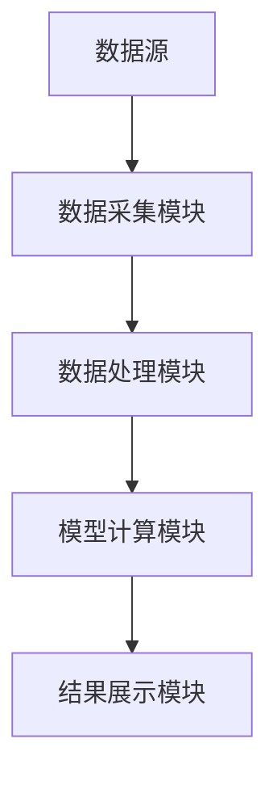

                 


# 特价股票投资中的可持续竞争优势模型应用

## 关键词：
特价股票投资、可持续竞争优势模型、股票估值、投资策略、数据分析、企业竞争力

## 摘要：
本文详细探讨了在特价股票投资中应用可持续竞争优势模型的方法与实践。通过分析企业竞争优势的构成要素，结合数学模型和数据分析，提出了一个基于可持续竞争优势的股票估值方法。本文从背景介绍、模型原理、系统设计到项目实战，全面阐述了如何在投资决策中应用该模型，帮助投资者识别具备长期竞争优势的企业，实现稳健的投资回报。

---

# 第1章: 特价股票投资的背景与意义

## 1.1 特价股票投资的定义与特点

### 1.1.1 什么是特价股票投资
特价股票投资是指以低于市场合理估值的价格买入优质股票，通过长期持有实现资本增值的投资策略。其核心在于寻找被市场低估的优质企业，利用价格波动带来的投资机会。

### 1.1.2 特价股票投资的核心特点
- **低估值**：重点关注市盈率（P/E）、市净率（P/B）等估值指标，寻找低于行业平均水平的股票。
- **长期视角**：注重企业基本面，关注企业的持续盈利能力和发展潜力。
- **风险控制**：通过分散投资和严格选股，降低投资风险。

### 1.1.3 特价股票投资的市场定位
在市场波动加剧的背景下，特价股票投资为投资者提供了规避短期风险、捕捉长期价值的机会，尤其适合对市场波动不敏感的长期投资者。

## 1.2 可持续竞争优势模型的背景

### 1.2.1 可持续竞争优势的定义
可持续竞争优势是指企业在行业中长期保持高于竞争对手的盈利能力和发展潜力的能力。这种优势来源于企业的核心竞争力，包括品牌、技术、管理、资源等多个方面。

### 1.2.2 可持续竞争优势的核心要素
- **核心竞争力**：企业的独特优势，如技术创新、成本优势、品牌影响力等。
- **行业地位**：企业在行业中的市场份额和影响力。
- **财务健康**：盈利能力、资产负债率、现金流等财务指标。
- **管理团队**：领导层的愿景和执行力。

### 1.2.3 可持续竞争优势与企业价值的关系
企业具备可持续竞争优势，通常意味着其能够维持较高的利润率和市场份额，从而为股东创造长期价值。这种竞争优势是股票估值的重要依据。

---

# 第2章: 可持续竞争优势模型的核心概念

## 2.1 模型的基本原理

### 2.1.1 模型的输入与输出
- **输入**：企业的财务数据、行业数据、市场数据。
- **输出**：企业的竞争优势指数（CAI）和投资评级。

### 2.1.2 模型的适用范围
适用于分析具备持续盈利能力和竞争优势的企业的投资价值。

## 2.2 企业竞争优势的评估指标

### 2.2.1 核心竞争力评估
| 评估维度 | 评估指标 | 权重 |
|----------|----------|------|
| 技术创新 | R&D投入占比 | 30% |
| 成本优势 | 每单位产品成本 | 20% |
| 品牌影响力 | 市场占有率 | 25% |
| 管理效率 | 净资产收益率（ROE） | 25% |

### 2.2.2 可持续竞争优势指数计算公式
$$ CAI = \sum (\text{各维度评分} \times \text{权重}) $$

---

# 第3章: 可持续竞争优势模型的算法原理

## 3.1 算法流程

### 3.1.1 数据输入与预处理
- 数据来源：企业财务报表、行业报告、市场数据。
- 数据清洗：剔除异常值和缺失数据。

### 3.1.2 竞争优势评估
- 计算各维度的评分，加权求和得到竞争优势指数。

### 3.1.3 模型输出与结果分析
- 根据CAI指数，生成投资评级（如A+、A、B+等）。

## 3.2 算法实现的数学模型

### 3.2.1 竞争优势指数的计算公式
$$ CAI = w_1 \times \text{技术创新评分} + w_2 \times \text{成本优势评分} + w_3 \times \text{品牌影响力评分} + w_4 \times \text{管理效率评分} $$

其中，$w_1 + w_2 + w_3 + w_4 = 1$。

---

# 第4章: 可持续竞争优势模型的系统架构设计

## 4.1 系统功能模块设计

### 4.1.1 数据采集模块
- 从公开数据源获取企业财务数据和行业报告。

### 4.1.2 数据处理模块
- 对数据进行清洗和预处理。

### 4.1.3 模型计算模块
- 计算CAI指数并生成投资评级。

### 4.1.4 结果展示模块
- 可视化展示投资评级和分析报告。

## 4.2 系统架构图


## 4.3 系统接口设计

### 4.3.1 数据接口
- 输入接口：企业财务数据。
- 输出接口：CAI指数和投资评级。

### 4.3.2 计算接口
- 输入接口：预处理后的数据。
- 输出接口：模型计算结果。

### 4.3.3 展示接口
- 输入接口：模型计算结果。
- 输出接口：可视化报告。

---

# 第5章: 可持续竞争优势模型的项目实战

## 5.1 环境安装与配置

### 5.1.1 系统环境要求
- 操作系统：Windows/Mac/Linux。
- Python版本：3.6以上。
- 开发工具：Jupyter Notebook或VS Code。

### 5.1.2 软件安装与配置
- 安装Python依赖库：Pandas、NumPy、Matplotlib、Scikit-learn。

### 5.1.3 数据源获取与准备
- 数据来源：公开企业财报、行业报告。

## 5.2 核心代码实现

### 5.2.1 数据处理代码
```python
import pandas as pd
import numpy as np

# 读取数据
df = pd.read_csv('企业数据.csv')

# 数据清洗
df.dropna(inplace=True)
df = df[ df['市盈率'] < 20 ]  # 示例条件
```

### 5.2.2 竞争优势指数计算
```python
def calculate_cai(scores, weights):
    return np.dot(scores, weights)

weights = [0.3, 0.2, 0.25, 0.25]
scores = [85, 70, 90, 60]
cai = calculate_cai(scores, weights)
print(f"竞争优势指数：{cai}")
```

### 5.2.3 投资评级生成
```python
def get_investment_rating(cai):
    if cai > 85:
        return "A+"
    elif cai > 75:
        return "A"
    else:
        return "B+"

rating = get_investment_rating(cai)
print(f"投资评级：{rating}")
```

## 5.3 实际案例分析

### 5.3.1 案例背景
某制造业企业，财务数据如下：
- 市盈率：15
- 市净率：1.5
- 净资产收益率（ROE）：20%
- 市场占有率：30%

### 5.3.2 模型计算
- 竞争优势指数：78
- 投资评级：A

---

# 第6章: 总结与展望

## 6.1 总结
本文通过详细分析可持续竞争优势模型的原理和应用，展示了如何在特价股票投资中识别具备长期竞争优势的企业。模型的实践证明了其在投资决策中的价值。

## 6.2 最佳实践
- **数据质量**：确保数据来源可靠，清洗充分。
- **模型优化**：根据市场变化动态调整权重。
- **风险管理**：结合多种指标进行综合评估。

## 6.3 小结
可持续竞争优势模型为投资者提供了一个科学的选股工具，帮助他们在市场波动中找到具备长期价值的企业。

## 6.4 注意事项
- 模型结果仅供参考，需结合市场实际情况进行判断。
- 投资者需具备一定的财务分析能力。

## 6.5 拓展阅读
- 《投资学原理》
- 《数据分析实战》

---

# 结语

通过本文的详细讲解，读者可以掌握可持续竞争优势模型的理论基础和实践方法。在未来的投资实践中，可以结合市场变化和企业实际情况，不断优化模型，提升投资决策的科学性和准确性。

