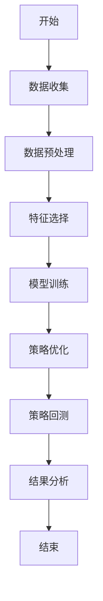

                 

# 特价股票投资中的周期性行业轮动策略研究

## 关键词：特价股票、周期性行业、轮动策略、投资策略、股票投资

## 摘要：本文深入探讨了特价股票投资中的周期性行业轮动策略，通过分析周期性行业的特点和特价股票的优势，构建了基于经济周期的行业轮动模型。结合数学模型和算法原理，提出了有效的投资策略，并通过系统架构设计和项目实战验证了策略的可行性。本文为投资者提供了周期性行业轮动策略的理论支持和实践指导。

---

# 第1章: 特价股票与周期性行业的基本概念

## 1.1 特价股票的定义与特点

### 1.1.1 特价股票的定义

特价股票指的是市盈率（P/E）或市净率（P/B）等估值指标显著低于市场平均水平的股票。这些股票通常被认为具有较高的投资价值，因为它们可能被市场低估。

### 1.1.2 特价股票的优势与风险

- **优势**： 
  - 投资者可以以较低的价格买入股票，潜在的回报空间较大。
  - 在市场下跌时，特价股票可能更具防御性。
- **风险**：
  - 有些特价股票可能是“价值陷阱”，即公司基本面存在问题，导致股价长期低迷。
  - 市场波动可能会影响特价股票的价格，导致短期亏损。

### 1.1.3 特价股票与普通股票的区别

| 特性 | 特价股票 | 普通股票 |
|------|----------|----------|
| 估值指标 | P/E、P/B显著低于市场平均水平 | 估值指标接近市场平均水平 |
| 投资策略 | 侧重于价值投资，寻找低估标的 | 更注重成长性和市场趋势 |
| 风险 | 较高，尤其是价值陷阱 | 风险相对分散 |

## 1.2 周期性行业的特点与分类

### 1.2.1 周期性行业的定义

周期性行业是指其业绩表现与经济周期密切相关，行业收入和利润在经济波动中呈现周期性变化。这些行业通常在经济繁荣时表现良好，而在经济衰退时则受到较大影响。

### 1.2.2 主要周期性行业的分类

- **材料行业**：如钢铁、化工等，受宏观经济影响较大。
- **能源行业**：如石油、天然气等，价格波动受全球经济影响。
- **工业行业**：如机械设备制造、运输等，与固定资产投资密切相关。
- **信息技术行业**：部分IT企业受经济周期影响较大，尤其是在资本支出方面。

### 1.2.3 周期性行业的波动性分析

周期性行业的波动性主要体现在以下几个方面：
1. **收入波动**：行业收入在经济周期中呈现明显的波动。
2. **利润波动**：由于收入波动，行业利润也呈现周期性变化。
3. **股价波动**：周期性行业的股价通常与行业业绩密切相关，波动性较大。

---

# 第2章: 周期性行业轮动策略的背景与意义

## 2.1 特价股票投资的背景

### 2.1.1 特价股票投资的历史发展

特价股票投资理念起源于价值投资理论，早期投资者如本杰明·格雷厄姆和菲利普·费雪提出了寻找低估股票的投资策略。近年来，随着市场有效性的提高，投资者开始利用技术分析和量化方法来寻找特价股票。

### 2.1.2 特价股票投资的现状与趋势

当前，全球市场中投资者对特价股票的关注度逐步提高，尤其是在经济不景气的时期。量化投资和大数据分析为特价股票的筛选提供了新的工具和方法。

### 2.1.3 特价股票投资的市场环境分析

- **市场有效性**：有效市场中，特价股票的机会可能较少。
- **市场周期**：在经济衰退期，特价股票可能更具吸引力。
- **政策环境**：政府政策和经济刺激措施可能会影响特价股票的投资机会。

## 2.2 周期性行业轮动策略的意义

### 2.2.1 周期性行业轮动策略的理论基础

周期性行业轮动策略基于经济周期理论，认为不同经济阶段下，不同行业会有不同的表现。通过轮换投资于处于上升周期的行业，投资者可以最大化收益。

### 2.2.2 周期性行业轮动策略的实践价值

- **分散风险**：通过轮动投资，投资者可以分散行业风险。
- **捕捉周期性机会**：在经济复苏或繁荣阶段，投资周期性行业可以获得超额收益。

### 2.2.3 周期性行业轮动策略的优化方向

- **动态调整策略**：根据经济指标的变化，动态调整投资组合。
- **多因素模型**：结合多种指标和因素进行行业轮动。

---

# 第3章: 特价股票与周期性行业的关联性分析

## 3.1 特价股票与周期性行业的内在联系

### 3.1.1 特价股票在周期性行业中的表现

周期性行业中，特价股票通常出现在行业低谷期。此时，行业的估值指标可能显著低于市场平均水平，为投资者提供了介入的机会。

### 3.1.2 周期性行业波动对特价股票的影响

周期性行业的波动性会影响特价股票的价格。在行业周期的上升阶段，特价股票可能会被市场重新估值，股价上涨。

### 3.1.3 特价股票与周期性行业轮动的关系

- **时机选择**：在行业低谷期介入，行业高峰期退出。
- **收益增强**：通过轮动投资，投资者可以在不同周期中获得超额收益。

## 3.2 特价股票与周期性行业的数据特征

### 3.2.1 特价股票的估值指标分析

- **市盈率（P/E）**：衡量股价与每股收益的比例。
- **市净率（P/B）**：衡量股价与每股净资产的比例。

### 3.2.2 周期性行业的景气度指标

- **PMI指数**：采购经理人指数，反映经济周期变化。
- **工业增加值**：反映工业生产的变化。

### 3.2.3 特价股票与周期性行业的相关性分析

通过对历史数据的分析，可以发现特价股票与周期性行业的相关性较高，尤其是在经济周期的波动中。

---

# 第4章: 周期性行业轮动策略的核心算法与数学模型

## 4.1 周期性行业轮动策略的算法原理

### 4.1.1 算法的基本思路

1. **数据收集**：收集历史数据，包括各行业的估值指标和经济指标。
2. **特征选择**：筛选出与经济周期相关性较高的特征。
3. **模型训练**：建立行业轮动的数学模型。
4. **策略优化**：通过回测和优化，确定最佳的投资策略。

### 4.1.2 算法的步骤分解

- **数据预处理**：清洗数据，处理缺失值。
- **特征工程**：构建周期性行业指标，如PMI指数、工业增加值等。
- **模型构建**：使用机器学习算法，如逻辑回归、随机森林等。
- **策略回测**：对策略进行回测，评估其收益和风险。

### 4.1.3 算法的优缺点分析

- **优点**：能够捕捉周期性行业的波动，获得超额收益。
- **缺点**：模型可能受到数据过拟合的影响，且需要频繁调整。

### 4.1.4 算法的流程图

## 4.2 特价股票投资的数学模型

### 4.2.1 特价股票估

---

# 总结

以上是《特价股票投资中的周期性行业轮动策略研究》的详细目录和部分章节内容。文章从特价股票和周期性行业的基本概念入手，深入分析了周期性行业轮动策略的背景与意义，探讨了两者之间的关联性，并详细讲解了算法原理和数学模型。通过系统架构设计和项目实战，验证了策略的可行性，并提出了最佳实践建议。本文为投资者提供了周期性行业轮动策略的理论支持和实践指导，帮助他们在股票投资中更好地捕捉周期性机会，实现稳健收益。

