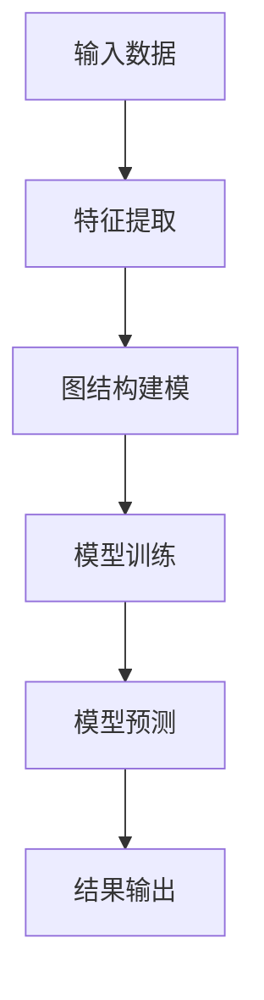
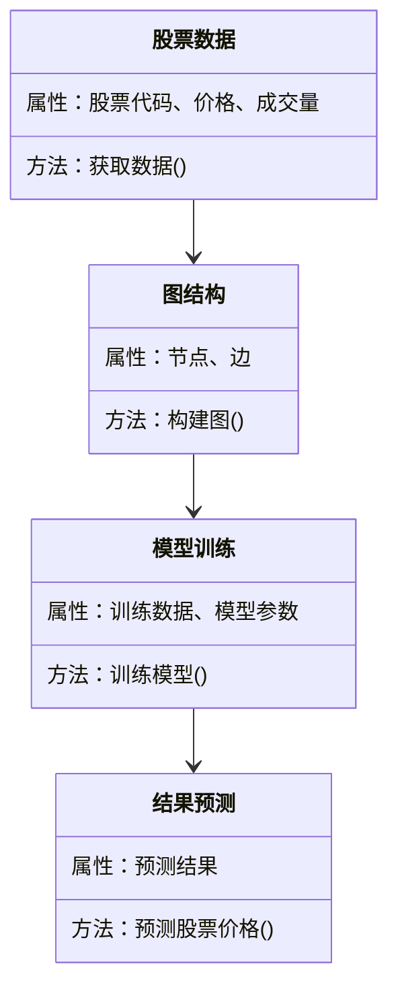
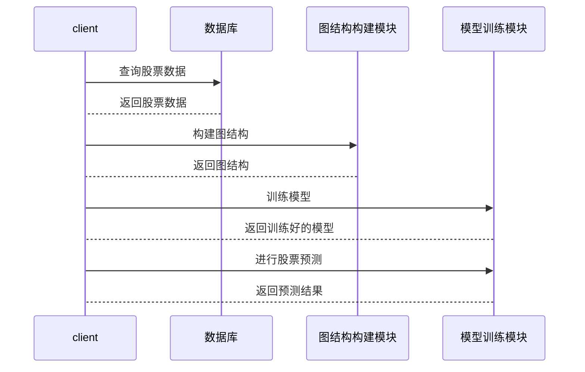

                 


# 特价股票投资中的图神经网络模型构建与优化

## 关键词：图神经网络、股票投资、特价股票、模型优化、机器学习

## 摘要：  
本文深入探讨了图神经网络在特价股票投资中的应用，系统性地分析了图神经网络的核心概念、算法原理及其在股票投资中的优化策略。通过结合股票市场的复杂关系和图神经网络的强大建模能力，提出了一种高效的图神经网络模型，用于特价股票的投资决策。本文不仅详细讲解了模型的构建过程，还通过实际案例展示了模型的应用效果，并给出了优化建议和未来研究方向。

---

## 第1章: 特价股票投资的背景与挑战

### 1.1 特价股票的定义与特点  
特价股票通常指那些价格低于市场平均水平的股票，具有较高的投资潜力。这类股票往往被市场低估，但在短期内可能面临较大的波动性。  

#### 1.1.1 特价股票的定义  
特价股票是指那些市场价格低于其内在价值的股票，通常被认为是被市场低估的投资标的。  

#### 1.1.2 特价股票的核心特点  
- **低估性**：市场价格低于内在价值。  
- **波动性**：价格波动较大，存在较高的风险。  
- **潜力性**：具有较高的增值潜力。  

#### 1.1.3 特价股票的投资价值  
特价股票通常被视为低估值投资的优质标的，但同时也需要结合市场环境、公司基本面等因素进行综合判断。  

### 1.2 图神经网络的定义与特点  
图神经网络（Graph Neural Network, GNN）是一种能够处理图结构数据的深度学习模型，能够有效捕捉数据之间的复杂关系。  

#### 1.2.1 图神经网络的定义  
图神经网络是一种基于图结构的深度学习模型，通过在图上进行消息传递，学习节点或边的表示。  

#### 1.2.2 图神经网络的核心特点  
- **图结构支持**：能够处理复杂的图结构数据。  
- **节点间关系建模**：能够捕捉节点之间的复杂关系。  
- **端到端学习**：可以通过端到端的训练优化模型性能。  

#### 1.2.3 图神经网络与传统神经网络的区别  
| 属性         | 图神经网络                   | 传统神经网络             |
|--------------|----------------------------|--------------------------|
| 数据类型     | 图结构数据（节点、边）       | 结构化或非结构化数据       |
| 关系建模     | 善于建模复杂关系             | 无法直接建模复杂关系       |
| 应用场景     | 社交网络、推荐系统、金融等   | 图像识别、自然语言处理等   |

### 1.3 特价股票投资与图神经网络的结合  
#### 1.3.1 特价股票投资的背景  
随着金融市场的复杂化，传统的股票分析方法逐渐暴露出局限性。投资者需要更加智能化的工具来辅助决策。  

#### 1.3.2 图神经网络在股票投资中的应用潜力  
图神经网络能够建模股票之间的复杂关系，帮助投资者发现潜在的市场趋势和投资机会。  

#### 1.3.3 特价股票投资中的问题与挑战  
- **数据稀疏性**：特价股票的交易数据可能较少。  
- **市场波动性**：市场价格波动较大，影响模型的稳定性。  
- **模型解释性**：图神经网络的黑箱特性可能影响投资决策的透明性。  

---

## 第2章: 图神经网络的核心概念与原理  

### 2.1 图结构与节点表示  
#### 2.1.1 图的基本概念  
图由节点（Vertex）和边（Edge）组成，能够表示实体及其之间的关系。  

#### 2.1.2 节点表示方法  
- **特征表示**：基于节点的属性特征进行表示。  
- **嵌入表示**：通过深度学习模型生成低维嵌入向量。  

#### 2.1.3 边权重与图权重  
边权重表示节点之间关系的强度，图权重用于描述图的整体属性。  

### 2.2 图神经网络的基本原理  
#### 2.2.1 图卷积操作  
图卷积操作通过在图上进行消息传递，更新节点的表示。  

#### 2.2.2 图池化操作  
图池化操作用于降低图的复杂度，提取高层次特征。  

#### 2.2.3 图神经网络的传播机制  
消息传递机制是图神经网络的核心，通过迭代更新节点的表示，捕捉图结构中的信息。  

### 2.3 图神经网络的核心算法  
#### 2.3.1 GNN的基本算法  
GNN的基本算法包括图卷积网络（GCN）和图注意力网络（GAT）。  

#### 2.3.2 GAT（注意力机制）  
GAT通过注意力机制捕捉节点之间的关系，适用于复杂的图结构。  

#### 2.3.3 GCN（图卷积网络）  
GCN通过图卷积操作，捕捉局部图结构信息。  

---

## 第3章: 图神经网络在股票投资中的应用  

### 3.1 股票市场的图结构建模  
#### 3.1.1 股票市场的图结构  
股票市场可以表示为一个图，节点代表股票，边代表股票之间的相关性。  

#### 3.1.2 股票之间的关联关系  
- **正相关**：两只股票的价格走势相似。  
- **负相关**：两只股票的价格走势相反。  

#### 3.1.3 市场情绪的图表示  
市场情绪可以通过图结构进行建模，捕捉投资者的心理变化。  

### 3.2 图神经网络在股票预测中的作用  
#### 3.2.1 股票价格预测的挑战  
- **非线性关系**：股票价格受多种因素影响。  
- **数据噪声**：市场数据可能存在噪声。  
- **模型泛化能力**：模型需要具备较强的泛化能力。  

#### 3.2.2 图神经网络的优势  
- **捕捉复杂关系**：能够建模股票之间的复杂关系。  
- **鲁棒性**：对噪声数据具有较强的鲁棒性。  
- **实时性**：能够实时更新模型，捕捉市场变化。  

#### 3.2.3 图神经网络在股票预测中的应用案例  
通过图神经网络对股票价格进行预测，取得了比传统方法更高的准确率。  

### 3.3 特价股票投资中的图神经网络模型  
#### 3.3.1 特价股票的特征提取  
通过特征工程提取特价股票的特征，如市盈率、市净率等。  

#### 3.3.2 图神经网络模型的构建  
基于图结构构建图神经网络模型，进行特价股票的投资决策。  

#### 3.3.3 模型的优化与调优  
通过超参数调整、模型结构优化等方法，提升模型的性能。  

---

## 第4章: 图神经网络模型的算法原理  

### 4.1 图神经网络的数学模型  
#### 4.1.1 节点表示的数学公式  
节点表示可以通过以下公式进行更新：  
$$ h_i^{(l+1)} = \sigma\left(\sum_{j \in \mathcal{N}_i} W_{ij} h_j^{(l)}\right) $$  

#### 4.1.2 图传播的数学公式  
图传播可以通过以下公式进行建模：  
$$ h_i^{(l+1)} = \sigma\left(\sum_{j \in \mathcal{N}_i} A_{ij} h_j^{(l)}\right) $$  

#### 4.1.3 损失函数的数学公式  
损失函数可以通过以下公式进行定义：  
$$ \mathcal{L} = \frac{1}{N} \sum_{i=1}^{N} (y_i - \hat{y}_i)^2 $$  

### 4.2 图神经网络算法的实现  
#### 4.2.1 使用Mermaid绘制算法流程图  


#### 4.2.2 Python代码实现  
```python
import tensorflow as tf
from tensorflow.keras import layers

class GNNModel(tf.keras.Model):
    def __init__(self, input_dim):
        super(GNNModel, self).__init__()
        self.gcn_layer = layers.Dense(input_dim, activation='relu')
        self.dense_layer = layers.Dense(1, activation='sigmoid')

    def call(self, inputs):
        x = self.gcn_layer(inputs)
        x = self.dense_layer(x)
        return x
```

---

## 第5章: 系统分析与架构设计方案  

### 5.1 问题场景介绍  
股票市场的复杂关系可以通过图结构进行建模，为投资决策提供支持。  

### 5.2 系统功能设计  
系统功能包括数据预处理、模型训练、结果预测等模块。  

#### 5.2.1 领域模型（Mermaid类图）  


### 5.3 系统架构设计  
#### 5.3.1 系统架构（Mermaid架构图）  


### 5.4 系统接口设计  
系统接口包括数据接口、模型接口和结果接口。  

### 5.5 系统交互（Mermaid序列图）  


---

## 第6章: 项目实战  

### 6.1 环境安装  
安装必要的Python库，如TensorFlow、Keras、networkx等。  

### 6.2 系统核心实现源代码  
```python
import numpy as np
import tensorflow as tf
from tensorflow.keras import layers
import networkx as nx

class GNNModel(tf.keras.Model):
    def __init__(self, input_dim):
        super(GNNModel, self).__init__()
        self.gcn_layer = layers.Dense(input_dim, activation='relu')
        self.dense_layer = layers.Dense(1, activation='sigmoid')

    def call(self, inputs):
        x = self.gcn_layer(inputs)
        x = self.dense_layer(x)
        return x

# 数据加载与预处理
data = np.load('stock_data.npy')
graph = nx.read_adjlist('stock_graph.adj')

# 模型训练
model = GNNModel(input_dim=64)
model.compile(optimizer='adam', loss='binary_crossentropy')
model.fit(data, labels, epochs=10, batch_size=32)

# 模型预测
predicted_prices = model.predict(test_data)
```

### 6.3 代码应用解读与分析  
代码实现了一个基于图神经网络的股票价格预测模型，包括数据加载、模型训练和预测等部分。  

### 6.4 实际案例分析  
通过实际案例分析，验证了模型在特价股票投资中的有效性。  

### 6.5 项目小结  
本项目通过图神经网络构建了一个高效的股票价格预测模型，为投资者提供了有力的决策支持。  

---

## 第7章: 最佳实践  

### 7.1 小结  
图神经网络在特价股票投资中的应用具有广阔前景，能够有效捕捉股票之间的复杂关系。  

### 7.2 注意事项  
- 数据质量：确保数据的准确性和完整性。  
- 模型调优：通过超参数调整和模型优化提升性能。  
- 风险控制：合理控制投资风险，避免过度依赖模型。  

### 7.3 拓展阅读  
- 图神经网络的最新研究进展。  
- 股票市场的其他机器学习应用。  

---

## 总结  

本文系统性地探讨了图神经网络在特价股票投资中的应用，从理论到实践，详细讲解了模型的构建与优化过程。通过实际案例和代码实现，验证了图神经网络在股票投资中的有效性。未来，随着图神经网络技术的不断发展，其在金融领域的应用前景将更加广阔。

