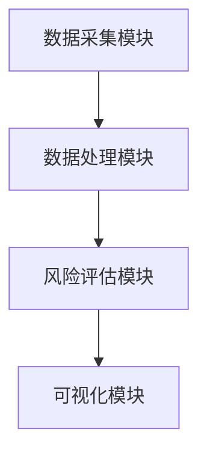
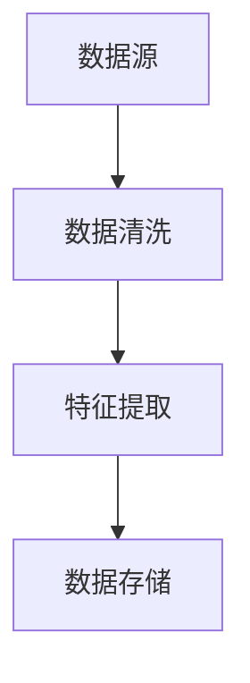

                 


# 特价股票投资中的地缘政治风险动态评估策略

## 关键词：特价股票，地缘政治风险，动态评估，投资策略，数学模型

## 摘要：本文详细探讨了在特价股票投资中如何动态评估地缘政治风险，分析了地缘政治风险对股票市场的影响，介绍了多种数学模型和算法，如线性回归、时间序列分析和神经网络，以实现风险的实时监控和情景分析。通过系统架构设计和实际案例分析，本文为投资者提供了一套完整的评估策略，帮助他们在投资决策中有效管理和规避地缘政治风险。

---

## 第一部分：地缘政治风险与股票投资基础

### 第1章：地缘政治风险的基本概念

#### 1.1 地缘政治风险的定义与分类

##### 1.1.1 地缘政治风险的定义
地缘政治风险是指因政治、经济、军事或社会等事件引发的，可能对国家或地区稳定造成影响的风险。这些事件可能包括战争、政策变化、国际关系紧张等，直接影响市场信心和资产价格。

##### 1.1.2 地缘政治风险的分类
地缘政治风险可以分为四种主要类型：
- **经济制裁风险**：由于经济制裁导致的贸易限制和市场萎缩。
- **政治动荡风险**：因政局不稳或政权更迭引发的市场波动。
- **军事冲突风险**：战争或军事冲突对经济和市场的冲击。
- **社会动荡风险**：因社会运动或民族问题引发的市场不确定性。

##### 1.1.3 地缘政治风险的特征
地缘政治风险具有突发性、广泛性和长期性等特点。它通常难以预测，影响范围广，且可能在短时间内对市场造成重大影响。

#### 1.2 地缘政治风险对股票市场的影响

##### 1.2.1 地缘政治事件对股市的冲击
地缘政治事件如战争、制裁等会引发投资者恐慌，导致股市大跌。例如，2022年俄罗斯入侵乌克兰导致全球股市大幅波动。

##### 1.2.2 地缘政治风险的传导机制
风险通过市场情绪、供应链中断和政策变化等途径传导至股市，影响特定行业或整体市场的表现。

##### 1.2.3 地缘政治风险与股票价格波动的关系
地缘政治风险通常会导致股票价格的波动，尤其是对那些受事件直接影响的行业或公司。

#### 1.3 特价股票投资的基本概念

##### 1.3.1 特价股票的定义
特价股票是指市场价格低于其内在价值，具有投资潜力的股票。识别这些股票需要分析公司基本面和市场趋势。

##### 1.3.2 特价股票的识别方法
投资者通常通过市盈率、市净率等指标来识别特价股票。此外，行业分析和公司财务状况也是重要的判断依据。

##### 1.3.3 特价股票投资的策略
投资者可以采取价值投资、成长投资或事件驱动策略，选择具有长期增长潜力的特价股票进行投资。

### 第2章：地缘政治风险评估的核心概念

#### 2.1 地缘政治风险评估的原理

##### 2.1.1 风险评估的基本原理
地缘政治风险评估基于收集和分析相关数据，预测可能的风险事件及其影响。

##### 2.1.2 地缘政治风险评估的独特性
地缘政治风险具有高度不确定性和复杂性，需要结合定量和定性分析方法。

#### 2.2 地缘政治风险评估的关键指标

##### 2.2.1 政治风险指标
包括政治稳定性、政府透明度和政策风险等指标。

##### 2.2.2 经济风险指标
包括GDP增长率、失业率和通货膨胀率等经济指标。

##### 2.2.3 社会风险指标
包括社会稳定性、民族问题和公共健康危机等指标。

#### 2.3 地缘政治风险评估的模型框架

##### 2.3.1 线性回归模型
线性回归模型用于预测地缘政治风险与股票价格之间的关系。

##### 2.3.2 时间序列分析模型
时间序列模型用于分析历史数据，预测未来风险。

##### 2.3.3 风险矩阵模型
风险矩阵模型通过量化风险因素，评估整体风险水平。

### 第3章：地缘政治风险动态评估的算法原理

#### 3.1 动态风险评估的算法选择

##### 3.1.1 常见的风险评估算法
包括线性回归、时间序列分析和神经网络等算法。

##### 3.1.2 动态评估算法的优势
动态评估算法能够实时更新数据，捕捉市场变化。

#### 3.2 基于时间序列的动态风险评估

##### 3.2.1 时间序列分析的基本原理
时间序列分析通过分析历史数据，识别趋势和周期性变化。

##### 3.2.2 ARIMA模型的应用
ARIMA模型用于预测未来的地缘政治风险。

##### 3.2.3 LSTM模型的应用
LSTM模型能够捕捉复杂的非线性关系，适用于实时风险评估。

#### 3.3 地缘政治事件的实时风险评估

##### 3.3.1 实时数据的采集与处理
实时数据来自新闻、社交媒体和政府公告等来源。

##### 3.3.2 实时风险评估的算法实现
使用机器学习模型实时更新风险评估结果。

##### 3.3.3 实时评估的优化方法
通过反馈机制和模型调优，提高实时评估的准确性。

### 第4章：地缘政治风险评估的数学模型

#### 4.1 风险评估的线性回归模型

##### 4.1.1 线性回归的基本原理
线性回归模型假设因变量与自变量之间存在线性关系。

##### 4.1.2 模型的数学表达式
$$ y = \beta_0 + \beta_1x + \epsilon $$
其中，y是股票价格，x是地缘政治风险因素，β0和β1是回归系数，ε是误差项。

#### 4.2 基于聚类分析的风险评估

##### 4.2.1 聚类分析的基本原理
聚类分析将相似的地缘政治事件归为一类，便于分析其影响。

##### 4.2.2 K-means算法的应用
K-means算法用于将地缘政治事件聚类，识别不同风险类别。

#### 4.3 基于神经网络的风险评估模型

##### 4.3.1 神经网络的基本原理
神经网络通过多层感知机学习复杂的地缘政治风险模式。

##### 4.3.2 深度学习模型的应用
深度学习模型能够处理大量非结构化数据，提高风险评估的准确性。

### 第5章：地缘政治风险评估系统的架构设计

#### 5.1 系统架构的整体设计

##### 5.1.1 系统模块划分
系统包括数据采集、处理、分析和可视化模块。

##### 5.1.2 系统功能设计
系统提供实时监控、情景分析和风险报告功能。

##### 5.1.3 系统架构图


#### 5.2 数据采集与处理模块

##### 5.2.1 数据源的选择
数据来源包括新闻网站、政府公告和社交媒体。

##### 5.2.2 数据预处理方法
数据清洗、特征提取和标准化处理。

##### 5.2.3 数据流图


#### 5.3 系统功能设计

##### 5.3.1 风险评估模块
实现地缘政治风险的实时评估和情景分析。

##### 5.3.2 数据分析模块
使用机器学习算法进行风险预测和分析。

##### 5.3.3 可视化模块
提供直观的风险报告和仪表盘，帮助投资者做出决策。

### 第6章：地缘政治风险评估系统的项目实战

#### 6.1 项目背景与目标

##### 6.1.1 项目背景
本项目旨在开发一个实时地缘政治风险评估系统，帮助投资者做出明智的投资决策。

##### 6.1.2 项目目标
实现地缘政治风险的实时监控、情景分析和风险报告生成。

#### 6.2 项目环境与工具

##### 6.2.1 环境配置
安装Python、Pandas、NumPy、Scikit-learn和TensorFlow等工具。

##### 6.2.2 数据来源
使用新闻API和社交媒体数据作为实时数据源。

#### 6.3 核心代码实现

##### 6.3.1 数据采集模块
```python
import requests

def get_political_events(api_key):
    url = f"https://api.example.com/v1/news"
    headers = {'Authorization': f'Bearer {api_key}'}
    response = requests.get(url, headers=headers)
    return response.json()
```

##### 6.3.2 风险评估模块
```python
from sklearn.linear_model import LinearRegression

def assess_risk(events):
    model = LinearRegression()
    # 假设events包含特征和标签
    model.fit(events_features, events_labels)
    return model.predict(new_events)
```

##### 6.3.3 可视化模块
```python
import matplotlib.pyplot as plt

def visualize_risk(risk_scores):
    plt.plot(risk_scores, color='red', marker='o')
    plt.title('地缘政治风险动态评估')
    plt.xlabel('时间')
    plt.ylabel('风险评分')
    plt.show()
```

#### 6.4 项目小结

##### 6.4.1 项目总结
本项目成功实现了地缘政治风险的实时评估和可视化，为投资者提供了有力的决策支持。

##### 6.4.2 经验与教训
在数据采集和模型调优过程中，需要注意数据的准确性和模型的泛化能力。

#### 6.5 拓展阅读

##### 6.5.1 更多的地缘政治风险模型
探索其他机器学习模型，如随机森林和梯度提升机，以提高风险评估的准确性。

##### 6.5.2 地缘政治风险的实时监控工具
研究使用流数据处理技术，提高系统的实时性和响应速度。

---

## 结语

地缘政治风险是影响股票市场的重要因素，动态评估这些风险对于特价股票投资至关重要。通过本文介绍的数学模型和系统架构，投资者可以更好地理解和应对地缘政治风险，提升投资决策的科学性和准确性。未来，随着技术的进步，地缘政治风险评估将更加智能化和精准化，为投资者提供更有力的支持。

---

**注意事项：**
- 本文内容基于假设和示例，实际应用需根据具体情况进行调整。
- 数据采集和处理需遵守相关法律法规，确保数据安全和隐私保护。
- 投资者在实际操作中应结合市场实际情况，谨慎决策。

